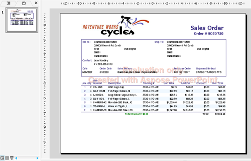

## **Hỗ trợ Giấy phép**

Phiên bản dùng thử của Aspose.Slides for Reporting Services là cùng một gói với phiên bản đã mua, từ [trang tải xuống của nó](https://releases.aspose.com/slides/reportingservices/), và cung cấp cùng các chức năng. Nếu không có giấy phép, nó hoạt động ở chế độ đánh giá và chèn một dấu watermark đánh giá vào các bản trình chiếu đã xuất.

Phiên bản dùng thử sẽ trở thành có giấy phép khi bạn sao chép tệp giấy phép vào máy chủ báo cáo. Không cần bất kỳ mã nào.

Khi bạn hài lòng với bản dùng thử, bạn có thể [mua giấy phép](https://purchase.aspose.com/pricing/slides/reporting-services/). Chúng tôi khuyên bạn nên xem qua các loại đăng ký khác nhau. Nếu có câu hỏi, hãy liên hệ với đội bán hàng của Aspose.

## **Cách cấp giấy phép trong Aspose.Slides for Reporting Services**

* Giấy phép là một tệp XML dạng văn bản thuần chứa các chi tiết như tên sản phẩm, số lượng nhà phát triển được cấp phép, ngày hết hạn đăng ký, v.v.
* Tệp giấy phép được ký số, vì vậy bạn không được phép sửa đổi nó. Ngay cả việc vô tình thêm một dấu xuống dòng vào nội dung của tệp cũng sẽ làm cho nó không còn hiệu lực.

Để áp dụng giấy phép:

1. Sao chép tệp giấy phép vào thư mục *ReportServer\bin* của mỗi phiên bản máy chủ báo cáo, nơi *Aspose.Slides.ReportingServices.dll* được cài đặt — ví dụ, *C:\Program Files\Microsoft SQL Server Reporting Services\SSRS\ReportServer\bin*. [Cài đặt thủ công](/slides/vi/reportingservices/install-manually/#find-the-report-server-folder) liệt kê các thư mục mặc định.
2. Đảm bảo tệp có một trong các tên mà tiện ích mở rộng tìm kiếm: *Aspose.Slides.ReportingServices.lic*, *Aspose.Slides.Reporting.Services.lic*, *Aspose.Slides.Product.Family.lic*, *Aspose.Total.ReportingServices.lic*, *Aspose.Total.Reporting.Services.lic*, *Aspose.Total.Product.Family.lic* hoặc *Aspose.Total.lic*.
3. Xuất bất kỳ báo cáo nào dưới dạng bản trình chiếu. Nếu không có watermark, giấy phép đang có hiệu lực.

Tiện ích mở rộng cũng tìm tệp giấy phép trong *%ProgramData%\Aspose\Slides* (thường là *C:\ProgramData\Aspose\Slides*), vì vậy một bản sao ở đó sẽ phục vụ cho mọi phiên bản trên máy.

**Chế độ có giấy phép**

Khi tìm thấy tệp giấy phép hợp lệ, các bản trình chiếu đã xuất sẽ không có watermark đánh giá.

**Chế độ đánh giá**

Nếu không có giấy phép, Aspose.Slides for Reporting Services sẽ chèn một watermark đánh giá vào các bản trình chiếu đã xuất.

{}
Để kiểm tra Aspose.Slides for Reporting Services mà không bị giới hạn, bạn có thể yêu cầu một **Giấy phép tạm thời 30 ngày**. Xem trang [Cách nhận Giấy phép tạm thời](https://purchase.aspose.com/temporary-license) để biết thêm thông tin.
{}