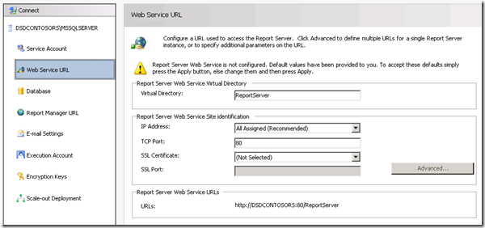

{} 
Điểm dừng đầu tiên của chúng tôi trên máy chủ RS là Trình quản lý cấu hình Reporting Services. 
{} 
## **Service Account**
Hãy chắc chắn hiểu tài khoản dịch vụ mà bạn đang sử dụng cho Reporting Services. Nếu gặp sự cố, có thể liên quan đến tài khoản dịch vụ bạn đang dùng. Mặc định là Network Service. Mỗi khi tôi triển khai bản dựng mới, tôi luôn sử dụng tài khoản miền, vì đó là nơi tôi có khả năng gặp lỗi. Đối với cấu hình này trên máy chủ của tôi, tôi đã dùng tài khoản miền tên **RSService**. 
## **Web Service URL**
Chúng ta sẽ cần cấu hình URL Dịch vụ Web. Đây là thư mục ảo **ReportServer** (vdir) lưu trữ các Web Services mà Reporting Services sử dụng, và là nơi SharePoint sẽ giao tiếp. Trừ khi bạn muốn tùy chỉnh các thuộc tính của vdir (ví dụ SSL, cổng, tiêu đề máy chủ, v.v…), bạn chỉ cần nhấn Apply ở đây và sẽ sẵn sàng. 

**Hình 3**: Cài đặt URL Dịch vụ Web 

Khi hoàn tất, bạn sẽ thấy hình dưới đây. 

**Hình 4**: Thiết lập thành công URL Dịch vụ Web 
## **Database**
Chúng ta cần tạo Cơ sở dữ liệu Catalog cho Reporting Services. Cơ sở dữ liệu này có thể đặt trên bất kỳ SQL 2008 hoặc SQL 2008 R2 Database Engine nào. SQL11 cũng hoạt động tốt, nhưng vẫn ở giai đoạn BETA. Hành động này sẽ tạo hai cơ sở dữ liệu, **ReportServer** và **ReportServerTempDB**, theo mặc định. 
Bước quan trọng khác là đảm bảo bạn chọn SharePoint Integrated cho loại cơ sở dữ liệu. Khi đã chọn, không thể thay đổi lại. Vui lòng xem các Hình 5, 6 và 7 để tham khảo. 

**Hình 5**: Tạo Cơ sở dữ liệu Report Server 

**Hình 6**: Cấu hình Máy chủ Cơ sở dữ liệu và Kiểu Xác thực 

**Hình 7**: Đặt Tên và Chế độ Cơ sở dữ liệu 

Đối với thông tin đăng nhập, đây là cách Report Server sẽ giao tiếp với SQL Server. Tài khoản nào bạn chọn, sẽ được cấp một số quyền trong cơ sở dữ liệu Catalog cũng như một vài cơ sở dữ liệu hệ thống thông qua RSExecRole. MSDB là một trong những cơ sở dữ liệu này dùng cho Subscription vì chúng tôi sử dụng SQL Agent. 

**Hình 8**: Cấu hình Thông tin đăng nhập Cơ sở dữ liệu Report Server 

Sau khi hoàn tất, nó sẽ trông như hình dưới đây. 

**Hình 9**: Tiến trình hoàn tất cấu hình Cơ sở dữ liệu Report Server 
## **Report Manager URL**
Chúng ta có thể bỏ qua URL Report Manager, vì nó không được sử dụng khi ở chế độ SharePoint Integrated. SharePoint là giao diện phía trước của chúng ta. Report Manager không hoạt động. 
## **Encryption Keys**
Sao lưu Các Khóa Mã Hóa và chắc chắn bạn biết nơi lưu trữ chúng. Nếu bạn gặp tình huống cần di chuyển hoặc khôi phục Cơ sở dữ liệu, bạn sẽ cần các khóa này. 

Đó là mọi thứ cho Trình quản lý cấu hình Reporting Services. Nếu bạn duyệt đến URL trên tab Web Service URL, nó sẽ hiển thị một hình tương tự như hình dưới đây. 

**Hình 12**: Truy cập Report Server sau khi cài đặt 

Chuyện gì đã xảy ra? SharePoint được cài đặt trên WFE của tôi và tôi đã hoàn tất việc thiết lập Reporting Services. Trong ví dụ này, Reporting Services và SharePoint nằm trên các máy khác nhau. Nếu chúng cùng trên một máy, bạn sẽ không thấy lỗi này. Về mặt kỹ thuật, chúng ta cần cài đặt SharePoint trên máy RS. Điều đó có nghĩa IIS cũng sẽ được bật.