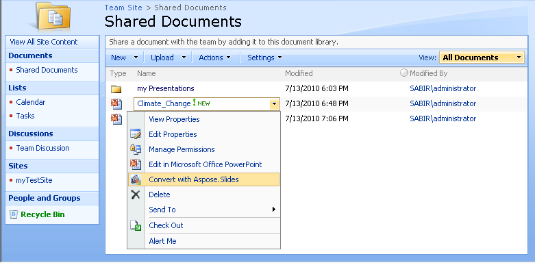

## **Chào mừng đến với Aspose.Slides for SharePoint!**

Aspose.Slides for SharePoint là một giải pháp linh hoạt cho phép chuyển đổi tài liệu PowerPoint® trong các trang Microsoft SharePoint.

## **Tổng quan sản phẩm**

Aspose.Slides for SharePoint hỗ trợ một số định dạng tài liệu PowerPoint:

- PPT – bản trình chiếu Microsoft PowerPoint 97 - 2003
- PPS – trình chiếu Microsoft PowerPoint 97 - 2003
- POT – mẫu Microsoft PowerPoint 97 - 2003
- PPTX – bản trình chiếu Office Open XML
- PPSX – trình chiếu Office Open XML
- POTX – mẫu Office Open XML

Aspose.Slides for SharePoint được thiết kế để làm việc với các sản phẩm sau:

- Windows SharePoint Services 3.0 (WSS)
- Microsoft Office SharePoint Server 2007 (MOSS) Standard
- Microsoft Office SharePoint Server 2007 (MOSS) Enterprise
- Microsoft Office SharePoint Server 2013
- Microsoft Office SharePoint Server 2019

Không có yêu cầu hệ thống nào khác ngoài những yêu cầu đã tồn tại cho các sản phẩm trên.

**Sử dụng Aspose.Slides for SharePoint để chuyển đổi tài liệu từ thư viện tài liệu của SharePoint**

