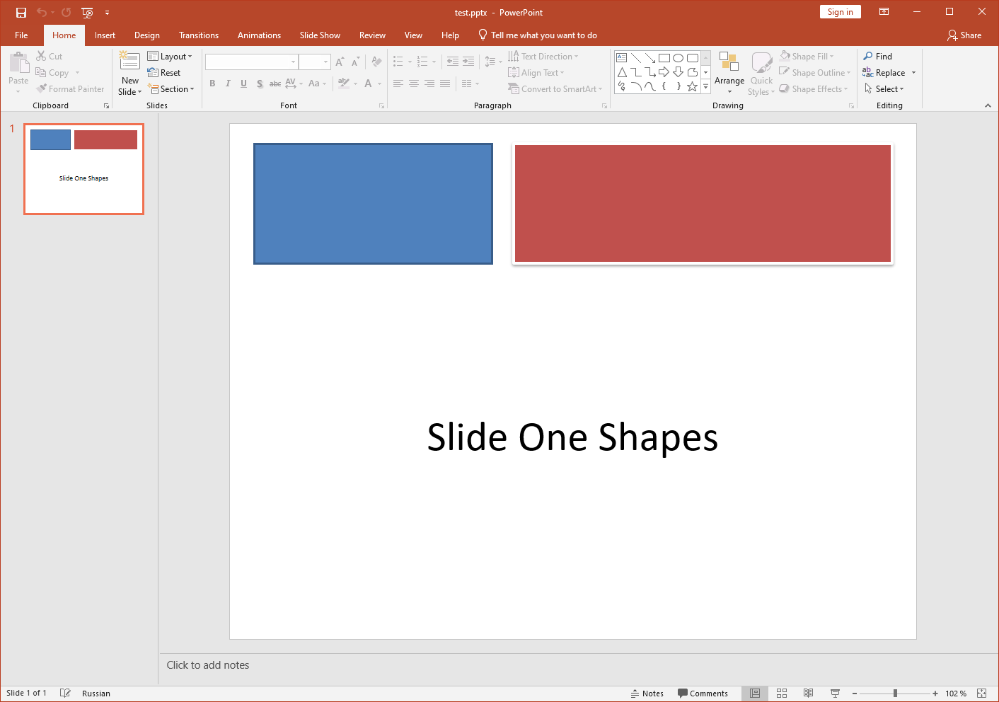

## **概述**

Aspose.Slides 允許您透過將 PPT 或 PPTX 檔案另存為 XPS 格式來將 PowerPoint 簡報轉換為 XPS。本文件說明 XPS 格式何時有用，並展示如何使用 Aspose.Slides 透過預設設定或自訂 [XpsOptions](https://reference.aspose.com/slides/zh-hant/androidjava/com.aspose.slides/xpsoptions/) 設定執行轉換。

## **關於 XPS**
Microsoft 開發了 [XPS](https://docs.fileformat.com/page-description-language/xps/) 作為 [PDF](https://docs.fileformat.com/pdf/) 的替代方案。它允許您透過輸出與 PDF 十分相似的檔案來列印內容。XPS 格式基於 XML。XPS 檔案的版面或結構在所有作業系統和印表機上皆保持相同。

## **何時使用 Microsoft XPS 格式**

{} 

要了解 Aspose.Slides 如何將 PPT 或 PPTX 簡報轉換為 XPS 格式，您可以查看 [this free online converter app](https://products.aspose.app/slides/zh-hant/conversion)。 

{} 

如果您想降低儲存成本，可以將 Microsoft PowerPoint 簡報轉換為 XPS 格式。這樣您會發現儲存、分享與列印文件更為方便。

Microsoft 持續在 Windows（甚至在 Windows 10）中實作對 XPS 的強力支援，因此您可能會考慮將檔案儲存為此格式。如果您使用 Windows 8.1、Windows 8、Windows 7 或 Windows Vista，XPS 甚至可能是某些操作的最佳選擇。

- **Windows 8** 使用 OXPS（Open XPS）格式作為 XPS 檔案的標準化版本。Windows 8 提供比 PDF 更好的 XPS 檔案支援。
  - **XPS**：內建 XPS 檢視器/閱讀器及列印至 XPS 功能可用。
  - **PDF**：提供 PDF 閱讀器，但無列印至 PDF 功能。

- **Windows 7 與 Windows Vista** 使用原始 XPS 格式。這些作業系統也提供比 PDF 更好的 XPS 檔案支援。
  - **XPS**：內建 XPS 檢視器及列印至 XPS 功能可用。
  - **PDF**：沒有 PDF 閱讀器，亦無列印至 PDF 功能。

|<p>**輸入 PPT(X):**</p><p>****</p>|<p>**輸出 XPS:**</p><p>****</p>|
| :- | :- |

Microsoft 最終在 Windows 10 中透過「列印至 PDF」功能實作了 PDF 的列印支援。過去使用者需要透過 XPS 格式列印文件。

## **使用 Aspose.Slides 進行 XPS 轉換**

在 [**Aspose.Slides**](https://products.aspose.com/slides/zh-hant/androidjava/) for Java 中，您可以使用由 [Presentation](https://reference.aspose.com/slides/zh-hant/androidjava/com.aspose.slides/Presentation) 類別所提供的 [**Save**](https://reference.aspose.com/slides/zh-hant/androidjava/com.aspose.slides/Presentation#save-java.lang.String-int-com.aspose.slides.ISaveOptions-) 方法，將整個簡報轉換為 XPS 文件。

轉換簡報為 XPS 時，必須以以下其中一種設定儲存簡報：

- 預設設定（未使用 [**XPSOptions**](https://reference.aspose.com/slides/zh-hant/androidjava/com.aspose.slides/xpsoptions)）
- 自訂設定（使用 [**XPSOptions**](https://reference.aspose.com/slides/zh-hant/androidjava/com.aspose.slides/xpsoptions)）

### **使用預設設定將簡報轉換為 XPS**

以下 Java 範例程式碼說明如何使用標準設定將簡報轉換為 XPS 文件：

```java
import com.aspose.slides.*;

// 建立一個代表簡報檔案的 Presentation 物件
Presentation pres = new Presentation("Convert_XPS.pptx");
try {
    // 將簡報儲存為 XPS 文件
    pres.save("XPS_Output_Without_XPSOption.xps", SaveFormat.Xps);
} finally {
    if (pres != null) pres.dispose();
}
```

### **使用自訂設定將簡報轉換為 XPS**

以下範例程式碼說明如何在 Java 中使用自訂設定將簡報轉換為 XPS 文件：

```java
import com.aspose.slides.*;

// 建立一個代表簡報檔案的 Presentation 物件
Presentation pres = new Presentation("Convert_XPS_Options.pptx");
try {
    // 建立 XpsOptions 類別實例
    XpsOptions options = new XpsOptions();

    // 將 MetaFiles 儲存為 PNG
    options.setSaveMetafilesAsPng(true);

    // 將簡報儲存為 XPS 文件
    pres.save("XPS_Output_With_Options.xps", SaveFormat.Xps, options);
} finally {
    if (pres != null) pres.dispose();
}
```

## **常見問題**

### 我可以將 XPS 儲存至串流而不是檔案嗎？

是的——Aspose.Slides 允許您直接匯出至串流，這對於 Web API、伺服器端管線，或任何需要在不觸及檔案系統的情況下傳送 XPS 的情境都相當理想。

### 隱藏投影片會被帶入 XPS 嗎？我可以排除它們嗎？

預設情況下，只會呈現一般（可見）投影片。您可以透過在儲存為 XPS 前的 [export settings](https://reference.aspose.com/slides/zh-hant/androidjava/com.aspose.slides/xpsoptions/) 中設定 [include or exclude hidden slides](https://reference.aspose.com/slides/zh-hant/androidjava/com.aspose.slides/xpsoptions/#setShowHiddenSlides-boolean-)，以確保輸出僅包含您想要的頁面。