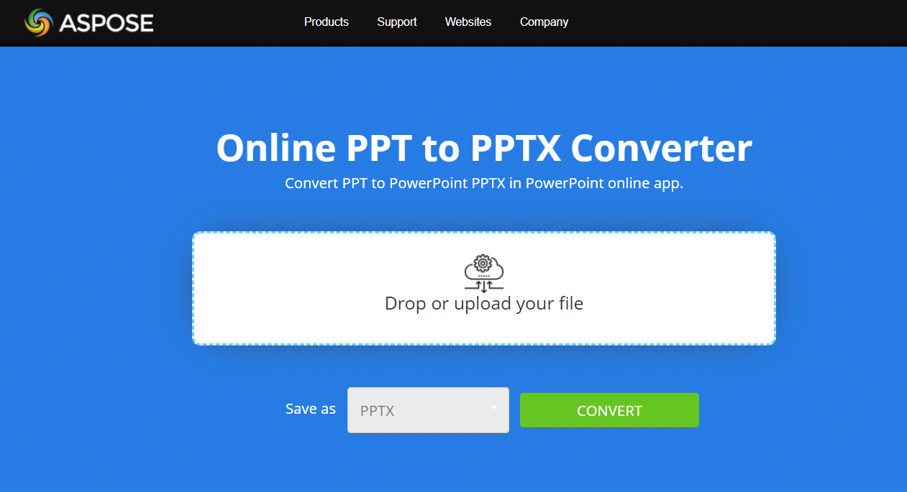

## **概述**

本文說明如何使用 Java 以及線上 PPT 轉 PPTX 轉換應用程式，將 PowerPoint 簡報的 PPT 格式轉換為 PPTX 格式。以下主題將涵蓋此內容。

- 在 Java 中將 PPT 轉換為 PPTX

## **在 Android 上將 PPT 轉換為 PPTX**

有關在 Java 中將 PPT 轉換為 PPTX 的範例程式碼，請參閱以下區段，即[Convert PPT to PPTX](#convert-ppt-to-pptx)。它僅載入 PPT 檔案並以 PPTX 格式儲存。透過指定不同的儲存格式，您也可以將 PPT 檔案儲存為 PDF、XPS、ODP、HTML 等多種格式，相關說明請參考以下文章。

- [在 Android 上將 PPT 轉換為 PDF](/slides/zh-hant/androidjava/convert-powerpoint-to-pdf/)
- [在 Android 上將 PPT 轉換為 XPS](/slides/zh-hant/androidjava/convert-powerpoint-to-xps/)
- [在 Android 上將 PPT 轉換為 HTML](/slides/zh-hant/androidjava/convert-powerpoint-to-html/)
- [在 Android 上將 PPT 轉換為 ODP](/slides/zh-hant/androidjava/save-presentation/)
- [在 Android 上將 PPT 轉換為 PNG](/slides/zh-hant/androidjava/convert-powerpoint-to-png/)

## **關於 PPT 轉換為 PPTX**

Convert old PPT format to PPTX with Aspose.Slides API. If you need to convert thousands of PPT presentations to PPTX format, the best solution is to do it programmatically. With Aspose.Slides API its possible to do it just in few lines of code. The API supports full compatibility to convert PPT presentation to PPTX and its possible to:

- 轉換包含多層母片、版面配置與投影片的複雜結構。
- 轉換包含圖表的簡報。
- 轉換包含群組圖形、自動圖形（如矩形與橢圓）以及自訂幾何形狀的簡報。
- 轉換自動圖形具有紋理與圖片填充樣式的簡報。
- 轉換包含占位符、文字框與文字持有者的簡報。

{} 

請查看[**Aspose.Slides PPT to PPTX 轉換**](https://products.aspose.app/slides/zh-hant/conversion/ppt-to-pptx) app:

[](https://products.aspose.app/slides/zh-hant/conversion/ppt-to-pptx)

[](https://products.aspose.app/slides/zh-hant/conversion/ppt-to-pptx)

此應用程式基於[**Aspose.Slides API**](https://products.aspose.com/slides/zh-hant/androidjava/) 建置，您可以看到基本 PPT 轉換為 PPTX 功能的即時範例。Aspose.Slides Conversion 是一個網頁應用程式，可讓您拖放 PPT 格式的簡報檔，並下載已轉換為 PPTX 的檔案。

尋找其他即時的[**Aspose.Slides 轉換**](https://products.aspose.app/slides/zh-hant/conversion/)範例。

{} 

## **將 PPT 轉換為 PPTX**
Aspose.Slides for Android via Java 現在讓開發人員能使用 [Presentation](https://reference.aspose.com/slides/zh-hant/androidjava/com.aspose.slides/presentation) 類別實例存取 PPT，並將其轉換為相應的 [PPTX](https://docs.fileformat.com/presentation/pptx/) 格式。目前，它支援將 [PPT](https://docs.fileformat.com/presentation/ppt/) 部分轉換為 PPTX。

Aspose.Slides for Android via Java 提供代表 **PPTX** 簡報檔案的 [Presentation](https://reference.aspose.com/slides/zh-hant/androidjava/com.aspose.slides/presentation) 類別。當物件實例化時，Presentation 類別同時也能存取 **PPT**。以下範例說明如何將 PPT 簡報轉換為 PPTX 簡報。

```java
// 實例化一個代表 PPTX 檔案的 Presentation 物件
Presentation pres = new Presentation("Aspose.ppt");
try {
// 將 PPTX 簡報儲存為 PPTX 格式
    pres.save("ConvertedAspose.pptx", SaveFormat.Pptx);
} finally {
    if (pres != null) pres.dispose();
}
```

||
| :- |
|**圖示：來源 PPT 簡報**|

||
| :- |
|**圖示：轉換後產生的 PPTX 簡報**|

## **常見問題**

**PPT 與 PPTX 格式有何差異？**

PPT 是 Microsoft PowerPoint 使用的舊式二進位檔案格式，而 PPTX 是自 Microsoft Office 2007 起引入的基於 XML 的新格式。PPTX 檔案具備更好的效能、更小的檔案大小以及更佳的資料復原能力。

**Aspose.Slides 是否支援將多個 PPT 檔案批次轉換為 PPTX？**

是的，您可以在迴圈中使用 Aspose.Slides 以程式方式將多個 PPT 檔案轉換為 PPTX，適用於批次轉換情境。

**轉換後內容和格式會被保留嗎？**

Aspose.Slides 在簡報轉換時保持高度保真。投影片版面配置、動畫、圖形、圖表以及其他設計元素在 PPT 轉換為 PPTX 的過程中均會被保留。

**我可以將 PPT 檔案轉換為其他格式如 PDF 或 HTML 嗎？**

是的，Aspose.Slides 支援將 PPT 檔案轉換為[多種格式](https://reference.aspose.com/slides/zh-hant/androidjava/com.aspose.slides/saveformat/)，包括 PDF、XPS、HTML、ODP，以及 PNG 與 JPEG 等影像格式。

**是否可以在未安裝 Microsoft PowerPoint 的情況下將 PPT 轉換為 PPTX？**

是的，Aspose.Slides 為獨立的 API，執行轉換時不需要安裝 Microsoft PowerPoint 或任何第三方軟體。

**是否有線上工具可用於 PPT 轉換為 PPTX？**

是的，您可以使用免費的[ Aspose.Slides PPT to PPTX 轉換器](https://products.aspose.app/slides/zh-hant/conversion/ppt-to-pptx) 網頁應用程式，直接在瀏覽器中執行轉換，無需撰寫任何程式碼。