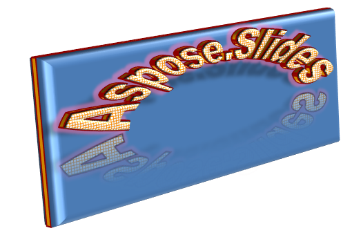

## **概觀**

WordArt 效果允許您在 PowerPoint 簡報中加入視覺上吸引且具風格的文字。使用 Aspose.Slides，開發人員可以以程式方式建立、客製化與管理 WordArt，就像在 Microsoft PowerPoint 中操作一樣——無需安裝 Office。本篇文章概述了 WordArt 的使用方式，包含如何套用文字變形、填滿樣式、輪廓、陰影以及其他格式設定，讓簡報內容更具表現力與吸引力。WordArt 允許您將文字視為圖形物件。它由套用於文字的效果或特殊變更組成，使文字更具吸引力或顯眼。

## **建立簡單的 WordArt 範本並套用至文字**

**使用 Aspose.Slides** 

首先，我們使用以下 Java 程式碼建立簡單的文字：

``` java
Presentation pres = new Presentation();
try {
    ISlide slide = pres.getSlides().get_Item(0);
    IAutoShape autoShape = slide.getShapes().addAutoShape(ShapeType.Rectangle, 200, 200, 400, 200);
    ITextFrame textFrame = autoShape.getTextFrame();

    Portion portion = (Portion)textFrame.getParagraphs().get_Item(0).getPortions().get_Item(0);
    portion.setText("Aspose.Slides");
} finally {
    if (pres != null) pres.dispose();
}
```
現在，我們透過此程式碼將文字的字型高度設定為較大值，以使效果更明顯：

``` java 
FontData fontData = new FontData("Arial Black");
portion.getPortionFormat().setLatinFont(fontData);
portion.getPortionFormat().setFontHeight(36);
```

**使用 Microsoft PowerPoint**

請前往 Microsoft PowerPoint 中的 WordArt 效果功能表：


在右側功能表中，您可以選擇預先定義的 WordArt 效果。 在左側功能表中，您可以為新 WordArt 指定設定。

這些是可用的一些參數或選項：


**使用 Aspose.Slides**

在此，我們使用此程式碼將 [SmallGrid](https://reference.aspose.com/slides/zh-hant/androidjava/com.aspose.slides/PatternStyle#SmallGrid) 圖案色彩套用至文字，並新增寬度為 1 的黑色文字框線：

``` java 
portion.getPortionFormat().getFillFormat().setFillType(FillType.Pattern);
portion.getPortionFormat().getFillFormat().getPatternFormat().getForeColor().setColor(Color.ORANGE);
portion.getPortionFormat().getFillFormat().getPatternFormat().getBackColor().setColor(Color.WHITE);
portion.getPortionFormat().getFillFormat().getPatternFormat().setPatternStyle(PatternStyle.SmallGrid);

portion.getPortionFormat().getLineFormat().getFillFormat().setFillType(FillType.Solid);
portion.getPortionFormat().getLineFormat().getFillFormat().getSolidFillColor().setColor(Color.BLACK);
```

產生的文字如下：


## **套用其他 WordArt 效果**

**使用 Microsoft PowerPoint**

在程式介面中，您可以將這些效果套用至文字、文字區塊、圖形或類似的元素：


例如，陰影、反射與發光效果可套用於文字；3D 格式與 3D 旋轉效果可套用於文字區塊；柔化邊緣屬性可套用於圖形物件（即使未設定 3D 格式屬性仍會產生效果）。

### **套用陰影效果**

此處我們僅針對文字設定相關屬性，使用以下 Java 程式碼將陰影效果套用於文字：

``` java
portion.getPortionFormat().getEffectFormat().enableOuterShadowEffect();
portion.getPortionFormat().getEffectFormat().getOuterShadowEffect().getShadowColor().setColor(Color.BLACK);
portion.getPortionFormat().getEffectFormat().getOuterShadowEffect().setScaleHorizontal(100);
portion.getPortionFormat().getEffectFormat().getOuterShadowEffect().setScaleVertical(65);
portion.getPortionFormat().getEffectFormat().getOuterShadowEffect().setBlurRadius(4.73);
portion.getPortionFormat().getEffectFormat().getOuterShadowEffect().setDirection(230);
portion.getPortionFormat().getEffectFormat().getOuterShadowEffect().setDistance(2);
portion.getPortionFormat().getEffectFormat().getOuterShadowEffect().setSkewHorizontal(30);
portion.getPortionFormat().getEffectFormat().getOuterShadowEffect().setSkewVertical(0);
portion.getPortionFormat().getEffectFormat().getOuterShadowEffect().getShadowColor().getColorTransform().add(ColorTransformOperation.SetAlpha, 0.32f);
```

Aspose.Slides API 支援三種陰影類型：OuterShadow、InnerShadow 與 PresetShadow。

使用 PresetShadow，您可以 (使用預設值) 為文字套用陰影。

**使用 Microsoft PowerPoint**

在 PowerPoint 中，您只能使用一種陰影類型。以下為範例：


**使用 Aspose.Slides**

Aspose.Slides 實際上允許同時套用兩種陰影：InnerShadow 與 PresetShadow。

**注意：**

- 當同時使用 OuterShadow 與 PresetShadow 時，僅套用 OuterShadow 效果。
- 若同時使用 OuterShadow 與 InnerShadow，最終套用的效果取決於 PowerPoint 版本。例如在 PowerPoint 2013 中，效果會加倍；但在 PowerPoint 2007 中，僅套用 OuterShadow 效果。

### **套用反射效果至文字**

我們使用以下 Java 程式碼為文字加入反射效果：

``` java
portion.getPortionFormat().getEffectFormat().enableReflectionEffect();
portion.getPortionFormat().getEffectFormat().getReflectionEffect().setBlurRadius(0.5);
portion.getPortionFormat().getEffectFormat().getReflectionEffect().setDistance(4.72);
portion.getPortionFormat().getEffectFormat().getReflectionEffect().setStartPosAlpha(0f);
portion.getPortionFormat().getEffectFormat().getReflectionEffect().setEndPosAlpha(60f);
portion.getPortionFormat().getEffectFormat().getReflectionEffect().setDirection(90);
portion.getPortionFormat().getEffectFormat().getReflectionEffect().setScaleHorizontal(100);
portion.getPortionFormat().getEffectFormat().getReflectionEffect().setScaleVertical(-100);
portion.getPortionFormat().getEffectFormat().getReflectionEffect().setStartReflectionOpacity(60f);
portion.getPortionFormat().getEffectFormat().getReflectionEffect().setEndReflectionOpacity(0.9f);
portion.getPortionFormat().getEffectFormat().getReflectionEffect().setRectangleAlign(RectangleAlignment.BottomLeft);   
```

### **套用發光效果至文字**

我們使用以下程式碼將發光效果套用於文字，使其發光或突顯：

``` java
portion.getPortionFormat().getEffectFormat().enableGlowEffect();
portion.getPortionFormat().getEffectFormat().getGlowEffect().getColor().setR((byte)255);
portion.getPortionFormat().getEffectFormat().getGlowEffect().getColor().getColorTransform().add(ColorTransformOperation.SetAlpha, 0.54f);
portion.getPortionFormat().getEffectFormat().getGlowEffect().setRadius(7);
```

操作結果：


{} 
您可以變更陰影、反射與發光的參數。這些效果的屬性會分別套用於文字的各個部分。 
{} 

### **在 WordArt 中使用變形**

我們使用以下程式碼套用 Transform 屬性（適用於整個文字區塊）：

``` java 
textFrame.getTextFrameFormat().setTransform(TextShapeType.ArchUpPour);
```

結果：


{} 
兩者皆提供多種預先定義的變形類型。 
{} 

**使用 PowerPoint**

若要存取預先定義的變形類型，請依序點選：**Format** -> **TextEffect** -> **Transform**

**使用 Aspose.Slides**

若要選取變形類型，請使用 TextShapeType 列舉。

### **套用 3D 效果至文字與圖形**

我們使用以下範例程式碼為文字圖形設定 3D 效果：

``` java
autoShape.getThreeDFormat().getBevelBottom().setBevelType(BevelPresetType.Circle);
autoShape.getThreeDFormat().getBevelBottom().setHeight(10.5);
autoShape.getThreeDFormat().getBevelBottom().setWidth(10.5);

autoShape.getThreeDFormat().getBevelTop().setBevelType(BevelPresetType.Circle);
autoShape.getThreeDFormat().getBevelTop().setHeight(12.5);
autoShape.getThreeDFormat().getBevelTop().setWidth(11);

autoShape.getThreeDFormat().getExtrusionColor().setColor(Color.ORANGE);
autoShape.getThreeDFormat().setExtrusionHeight(6);

autoShape.getThreeDFormat().getContourColor().setColor(Color.RED);
autoShape.getThreeDFormat().setContourWidth(1.5);

autoShape.getThreeDFormat().setDepth(3);

autoShape.getThreeDFormat().setMaterial(MaterialPresetType.Plastic);

autoShape.getThreeDFormat().getLightRig().setDirection(LightingDirection.Top);
autoShape.getThreeDFormat().getLightRig().setLightType(LightRigPresetType.Balanced);
autoShape.getThreeDFormat().getLightRig().setRotation(0, 0, 40);

autoShape.getThreeDFormat().getCamera().setCameraType(CameraPresetType.PerspectiveContrastingRightFacing);
```

產生的文字及其圖形如下：


我們使用此 Java 程式碼為文字套用 3D 效果：

``` java
textFrame.getTextFrameFormat().getThreeDFormat().getBevelBottom().setBevelType(BevelPresetType.Circle);
textFrame.getTextFrameFormat().getThreeDFormat().getBevelBottom().setHeight(3.5);
textFrame.getTextFrameFormat().getThreeDFormat().getBevelBottom().setWidth(3.5);

textFrame.getTextFrameFormat().getThreeDFormat().getBevelTop().setBevelType(BevelPresetType.Circle);
textFrame.getTextFrameFormat().getThreeDFormat().getBevelTop().setHeight(4);
textFrame.getTextFrameFormat().getThreeDFormat().getBevelTop().setWidth(4);

textFrame.getTextFrameFormat().getThreeDFormat().getExtrusionColor().setColor(Color.ORANGE);
textFrame.getTextFrameFormat().getThreeDFormat().setExtrusionHeight(6);

textFrame.getTextFrameFormat().getThreeDFormat().getContourColor().setColor(Color.RED);
textFrame.getTextFrameFormat().getThreeDFormat().setContourWidth(1.5);

textFrame.getTextFrameFormat().getThreeDFormat().setDepth(3);

textFrame.getTextFrameFormat().getThreeDFormat().setMaterial(MaterialPresetType.Plastic);

textFrame.getTextFrameFormat().getThreeDFormat().getLightRig().setDirection(LightingDirection.Top);
textFrame.getTextFrameFormat().getThreeDFormat().getLightRig().setLightType(LightRigPresetType.Balanced);
textFrame.getTextFrameFormat().getThreeDFormat().getLightRig().setRotation(0, 0, 40);

textFrame.getTextFrameFormat().getThreeDFormat().getCamera().setCameraType(CameraPresetType.PerspectiveContrastingRightFacing);
```

操作結果：



{} 
套用於文字或其圖形的 3D 效果以及效果之間的交互遵循特定規則。

考慮文字與包含該文字之圖形的場景。3D 效果包含 3D 物件的表示以及放置該物件的場景。

- 當圖形與文字皆設定場景時，圖形的場景具有較高優先權—文字的場景會被忽略。
- 當圖形本身沒有場景但具有 3D 表示時，會使用文字的場景。
- 否則——當圖形原本沒有 3D 效果時，圖形保持平面，3D 效果僅套用於文字。

這些描述與 ThreeDFormat.getLightRig() 以及 ThreeDFormat.getCamera() 方法相關。 
{} 

## **套用外部陰影效果至文字**
Aspose.Slides for Android via Java 提供 [**IOuterShadow**](https://reference.aspose.com/slides/zh-hant/androidjava/com.aspose.slides/ioutershadow/) 和 [**IInnerShadow**](https://reference.aspose.com/slides/zh-hant/androidjava/com.aspose.slides/iinnershadow/) 類別，讓您能對由 [TextFrame](https://reference.aspose.com/slides/zh-hant/androidjava/com.aspose.slides/textframe/) 所承載的文字套用陰影效果。請依照以下步驟執行：

1. 建立 [Presentation] 類別的實例。
2. 使用索引取得投影片參考。
3. 向投影片新增矩形類型的 AutoShape。
4. 取得與 AutoShape 相關聯的 TextFrame。
5. 設定 AutoShape 的 FillType 為 NoFill。
6. 實例化 OuterShadow 類別
7. 設定陰影的 BlurRadius。
8. 設定陰影的 Direction
9. 設定陰影的 Distance。
10. 設定 RectanglelAlign 為 TopLeft。
11. 設定陰影的 PresetColor 為 Black。
12. 將簡報寫入為 [PPTX](https://docs.fileformat.com/presentation/pptx/) 檔案。

```java
Presentation pres = new Presentation();
try {
    // 取得投影片的參考
    ISlide sld = pres.getSlides().get_Item(0);

    // 新增矩形類型的 AutoShape
    IAutoShape ashp = sld.getShapes().addAutoShape(ShapeType.Rectangle, 150, 75, 150, 50);

    // 為矩形新增 TextFrame
    ashp.addTextFrame("Aspose TextBox");

    // 停用形狀填充，以免影響文字陰影
    ashp.getFillFormat().setFillType(FillType.NoFill);

    // 新增外部陰影並設定所有必要參數
    ashp.getEffectFormat().enableOuterShadowEffect();
    IOuterShadow shadow = ashp.getEffectFormat().getOuterShadowEffect();
    shadow.setBlurRadius(4.0);
    shadow.setDirection(45);
    shadow.setDistance(3);
    shadow.setRectangleAlign(RectangleAlignment.TopLeft);
    shadow.getShadowColor().setPresetColor(PresetColor.Black);

    // 將簡報寫入磁碟
    pres.save("pres_out.pptx", SaveFormat.Pptx);
} finally {
    if (pres != null) pres.dispose();
}
```

## **套用內部陰影效果至圖形**
請依照以下步驟執行：

1. 建立 [Presentation] 類別的實例。
2. 取得投影片的參考。
3. 新增矩形類型的 AutoShape。
4. 啟用 InnerShadowEffect。
5. 設定所有必要的參數。
6. 將 ColorType 設定為 Scheme。
7. 設定 Scheme Color。
8. 將簡報寫入為 [PPTX] 檔案。

這段（根據上述步驟）的範例程式碼示範如何在 Java 中於兩個圖形之間加入連接線：

```java
Presentation pres = new Presentation();
try {
    // 取得投影片的參考
    ISlide slide = pres.getSlides().get_Item(0);

    // 新增矩形類型的 AutoShape
    IAutoShape ashp = slide.getShapes().addAutoShape(ShapeType.Rectangle, 150, 75, 400, 300);
    ashp.getFillFormat().setFillType(FillType.NoFill);

    // 為矩形新增 TextFrame
    ashp.addTextFrame("Aspose TextBox");
    IPortion port = ashp.getTextFrame().getParagraphs().get_Item(0).getPortions().get_Item(0);
    IPortionFormat pf = port.getPortionFormat();
    pf.setFontHeight(50);

    // 啟用 InnerShadowEffect
    IEffectFormat ef = pf.getEffectFormat();
    ef.enableInnerShadowEffect();

    // 設定所有必要參數
    ef.getInnerShadowEffect().setBlurRadius(8.0);
    ef.getInnerShadowEffect().setDirection(90.0F);
    ef.getInnerShadowEffect().setDistance(6.0);
    ef.getInnerShadowEffect().getShadowColor().setB((byte)189);

    // 將 ColorType 設定為 Scheme
    ef.getInnerShadowEffect().getShadowColor().setColorType(ColorType.Scheme);

    // 設定 Scheme 色彩
    ef.getInnerShadowEffect().getShadowColor().setSchemeColor(SchemeColor.Accent1);

    // 儲存簡報
    pres.save("WordArt_out.pptx", SaveFormat.Pptx);
} finally {
    if (pres != null) pres.dispose();
}
```

## **常見問題**

**我可以在不同字型或文字系統（例如阿拉伯文、中文）中使用 WordArt 效果嗎？**

是的，Aspose.Slides 支援 Unicode，並可使用所有主要字型與文字系統。WordArt 效果（如陰影、填滿與輪廓）可套用於任何語言的文字，儘管字型可用性與呈現可能取決於系統字型。

**我可以將 WordArt 效果套用至投影片母片元素嗎？**

可以，您可以將 WordArt 效果套用於母片投影片上的圖形，包括標題佔位符、頁腳或背景文字。對母版佈局所做的變更會反映在所有相關投影片上。

**WordArt 效果會影響簡報檔案大小嗎？**

會略有影響。陰影、發光與漸層填滿等 WordArt 效果會因加入格式化中繼資料而稍微增加檔案大小，但差異通常可以忽略不計。

**我可以在未儲存簡報的情況下預覽 WordArt 效果的結果嗎？**

可以，您可以使用 [IShape](https://reference.aspose.com/slides/zh-hant/androidjava/com.aspose.slides/ishape/) 或 [ISlide](https://reference.aspose.com/slides/zh-hant/androidjava/com.aspose.slides/islide/) 介面的 `getImage` 方法將含有 WordArt 的投影片轉換為圖像（如 PNG、JPEG），從而在記憶體或螢幕上預覽結果，無需先儲存或匯出完整簡報。