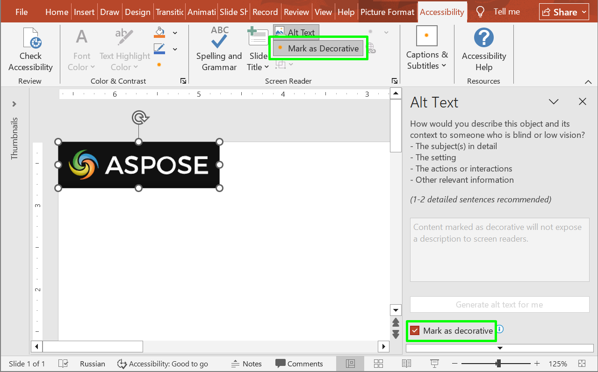

## **簡介**

替代文字協助使用輔助技術的人士了解圖片、圖表及其他資訊圖形的含意。本篇說明如何使用 Aspose.Slides for Android via Java 讀取與更新替代文字的標題與描述、將可存取性說明與程式碼中使用的形狀名稱區分開來，以及檢查形狀是否已標記為裝飾性。

這些功能可以提升簡報的可存取性，但並不保證完整符合可存取性標準。仍須檢視閱讀順序、色彩對比、文字可讀性等其他可存取性需求。

## **管理替代文字標題與描述**

使用替代文字說明圖片、圖表及其他資訊圖形的含義，讓看不見它們的人也能理解。以下方法與內容各自有不同用途：

| 方法或內容 | 目的 |
| --- | --- |
| [getAlternativeTextTitle](https://reference.aspose.com/slides/zh-hant/androidjava/com.aspose.slides/ishape/#getAlternativeTextTitle--) | 替代說明的簡短標題。 |
| [getAlternativeText](https://reference.aspose.com/slides/zh-hant/androidjava/com.aspose.slides/ishape/#getAlternativeText--) | 在投影片情境中，對形狀內容或目的的有意義描述。 |
| [getName](https://reference.aspose.com/slides/zh-hant/androidjava/com.aspose.slides/ishape/#getName--) | 形狀的名稱，程式碼可使用它在簡報中找到特定形狀。 |
| 可見文字 | 投影片上顯示的內容，例如形狀的文字或圖表的標題與標籤。更新替代文字不會變更此內容。 |

當簡報被重複作為範本使用時，程式碼可能會先使用 [getName](https://reference.aspose.com/slides/zh-hant/androidjava/com.aspose.slides/ishape/#getName--) 返回的名稱找到形狀，然後再更新它。此名稱的用途與替代文字不同，後者說明視覺資訊對讀者傳遞的意義。透過名稱搜尋允許作者在不改變程式碼尋找形狀方式的前提下，改進或翻譯描述。名稱可編輯且不保證唯一，因此請確認名稱與目標形狀相符；參閱[Identify and Find Shapes](/slides/zh-hant/androidjava/shape-manipulations/#identify-and-find-shapes)。

以下範例需要 `input.pptx`，其中第一張投影片的第一個形狀是一張辦公室入口的圖片，且該圖片不應被標記為裝飾性。範例會讀取並列印其目前的替代文字標題與描述，更新兩者，並將簡報儲存為 `output.pptx`。請依實際圖片與其傳遞的資訊自行調整文字內容。

```java
import com.aspose.slides.*;

Presentation presentation = new Presentation("input.pptx");
try {
    IShape shape = presentation.getSlides().get_Item(0).getShapes().get_Item(0);

    System.out.println("Alternative text title: " + shape.getAlternativeTextTitle());
    System.out.println("Alternative text description: " + shape.getAlternativeText());

    shape.setAlternativeTextTitle("Office entrance");
    shape.setAlternativeText("The office entrance has a wheelchair ramp to the right of the steps.");

    presentation.save("output.pptx", SaveFormat.Pptx);
} finally {
    presentation.dispose();
}
```

僅加入替代文字並不保證簡報的可存取性或符合可存取性標準。請檢查描述的正確性與相關性，同時審視閱讀順序、色彩對比、可讀文字等其他可存取性需求。資訊性視覺不應被標記為裝飾性；下一節說明如何檢查 [isDecorative](https://reference.aspose.com/slides/zh-hant/androidjava/com.aspose.slides/ishape/#isDecorative--)。

## **將其標記為裝飾性**

將裝飾性旗標套用於純粹美觀的視覺元素，讓螢幕閱讀器略過它們，減少雜訊並將焦點保留在有意義的內容上。此旗標適用於背景、花飾與間隔物件，絕不適用於傳遞資訊的圖表、圖示或圖片。Aspose.Slides 會公開此旗標以供偵測與驗證，協助自動化可存取性檢查與清理。



以下程式碼範例示範如何判斷形狀是否已標記為裝飾性。

```java
import com.aspose.slides.*;

Presentation presentation = new Presentation("sample.pptx");
try {
    IShape shape = presentation.getSlides().get_Item(0).getShapes().get_Item(0);
    System.out.println("Is shape decorative: " + shape.isDecorative());
} finally {
    presentation.dispose();
}
```

## **常見問題**

**應該在替代文字標題與描述中寫什麼？**

使用簡短的標題來識別主題，並以描述說明視覺在投影片情境中傳遞的資訊。對於圖表，說明相關的趨勢或比較，而不是僅寫「圖表」。

**我可以用替代文字在範本中定位形狀嗎？**

建議使用 [getName](https://reference.aspose.com/slides/zh-hant/androidjava/com.aspose.slides/ishape/#getName--) 返回的名稱來尋找形狀，並確認取得的是預期的形狀。替代文字可能會被編輯或翻譯，會導致依照精確描述搜尋的程式碼失效；請參閱[Identify and Find Shapes](/slides/zh-hant/androidjava/shape-manipulations/)。

**什麼時候應該將形狀標記為裝飾性？**

對於不提供資訊、純粹裝飾性的視覺元素才使用裝飾性旗標。例如花飾。需要傳遞意義的圖片與圖表則必須提供適當的描述。

**加入替代文字就能讓簡報完全符合可存取性嗎？**

不能。替代文字只解決可存取性的一部分。還須檢查閱讀順序、色彩對比、文字可讀性以及其他相關需求；僅設定這些屬性並不等同於符合標準。