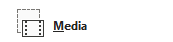

## **概述**

投影片版面定義了標題、文字、圖片、圖表與表格等佔位元的定位與格式。套用版面可為投影片提供一致的結構，同時允許每張投影片保有自己的內容。

最常見的版面包括：

- **Title Slide**：包含標題與副標題佔位元。
- **Title and Content**：包含標題佔位元與通用內容佔位元。
- **Blank**：不含任何內容佔位元，適用於所有圖形需要手動定位的情況。

## **了解版面繼承**

簡報具有三個相關層級：

1. [master slide](https://reference.aspose.com/slides/zh-hant/androidjava/com.aspose.slides/imasterslide/) 定義主題、共享格式、背景與共用物件。
2. [layout slide](https://reference.aspose.com/slides/zh-hant/androidjava/com.aspose.slides/ilayoutslide/) 隸屬於 master，並定義特定的佔位元排列。
3. [normal slide](https://reference.aspose.com/slides/zh-hant/androidjava/com.aspose.slides/islide/) 使用單一版面，並儲存該投影片輸入的內容。

normal slide 會從其版面繼承主題與格式，而版面則從 master 繼承。直接設定於 normal slide 的值會覆寫該層級繼承的值。建立 normal slide 時，其佔位元形狀會根據所選版面產生，而填入佔位元的內容則屬於 normal slide。

在使用版面建立投影片之前，請先於版面加入必要的佔位元。之後再向版面新增佔位元，並不會自動為已存在的 normal slide 加入相應的佔位元形狀。

此關係帶來兩個重要的結果：

- 變更版面上繼承的格式或既有佔位元的幾何形狀，會更新所有依賴該版面的投影片。編輯已在使用的版面前，請先檢查其依賴的投影片並審視最終簡報。
- 仍被投影片使用的版面無法移除。必須先將依賴的投影片重新指派至其他版面，或僅刪除未使用的版面。

如需瞭解此層級階層的頂層資訊，請參閱 [Slide Master](/slides/zh-hant/androidjava/slide-master/)。

## **選取與套用投影片版面**

當簡報遵循標準 PowerPoint 版面定義時，請使用版面類型。版面名稱可由使用者編輯且能本地化，因此以名稱進行選取的可靠度較低，除非您掌控來源模板。

以下範例在第一個 master 上尋找 **Title and Content**。若找不到該版面，則刻意退回使用 **Blank**。第二個 null 檢查是必要的，因為簡報可能僅包含自訂版面。接著透過 [ISlide.setLayoutSlide](https://reference.aspose.com/slides/zh-hant/androidjava/com.aspose.slides/islide/#setLayoutSlide-com.aspose.slides.ILayoutSlide-) 方法，將選取的版面套用至第一張 normal slide。

```java
import com.aspose.slides.*;

Presentation presentation = new Presentation("input.pptx");
try {
    IMasterLayoutSlideCollection layoutSlides = presentation.getMasters().get_Item(0).getLayoutSlides();
    ILayoutSlide targetLayout = layoutSlides.getByType(SlideLayoutType.TitleAndObject);

    if (targetLayout == null) {
        targetLayout = layoutSlides.getByType(SlideLayoutType.Blank);
    }

    if (targetLayout == null) {
        throw new IllegalStateException("The first master does not contain a suitable layout slide.");
    }

    presentation.getSlides().get_Item(0).setLayoutSlide(targetLayout);
    presentation.save("output-with-new-layout.pptx", SaveFormat.Pptx);
} finally {
    presentation.dispose();
}
```

變更投影片的版面不會移除直接加於投影片的普通圖形。但佔位元位置、繼承的格式以及既有佔位元與新版面的對應關係可能會改變，因此在切換差異較大的版面時請檢查輸出結果。

## **新增版面投影片**

選取與建立是分開的動作。前一個範例僅選取既有版面，並未建立。若要建立版面，請在目標 master 的版面集合上呼叫 [IMasterLayoutSlideCollection.add](https://reference.aspose.com/slides/zh-hant/androidjava/com.aspose.slides/imasterlayoutslidecollection/#add-byte-java.lang.String-) 方法。

以下範例會始終新增一個名為 `Report Title and Content` 的 **Title and Content** 版面，接著加入一張以該版面為基礎的 normal slide。版面名稱在集合內必須唯一。

```java
import com.aspose.slides.*;

Presentation presentation = new Presentation("input.pptx");
try {
    IMasterSlide masterSlide = presentation.getMasters().get_Item(0);
    ILayoutSlide reportLayout = masterSlide.getLayoutSlides().add(SlideLayoutType.TitleAndObject, "Report Title and Content");
    presentation.getSlides().addEmptySlide(reportLayout);

    presentation.save("output-with-report-layout.pptx", SaveFormat.Pptx);
} finally {
    presentation.dispose();
}
```

僅在模板真的需要另一個可重複使用的結構時才新增版面。若已有合適的版面，請選取並重複使用，而非建立重複的版面。

## **在版面投影片中新增佔位元**

[ILayoutSlide.getPlaceholderManager](https://reference.aspose.com/slides/zh-hant/androidjava/com.aspose.slides/ilayoutslide/#getPlaceholderManager--) 方法會回傳一個 [ILayoutPlaceholderManager](https://reference.aspose.com/slides/zh-hant/androidjava/com.aspose.slides/ilayoutplaceholdermanager/)，用於在版面中新增佔位元形狀。

| PowerPoint 佔位元                | `ILayoutPlaceholderManager` 方法 |
| -------------------------------- | -------------------------------- |
|              | [`addContentPlaceholder(float x, float y, float width, float height)`](https://reference.aspose.com/slides/zh-hant/androidjava/com.aspose.slides/ilayoutplaceholdermanager/#addContentPlaceholder-float-float-float-float-) |
|      | [`addVerticalContentPlaceholder(float x, float y, float width, float height)`](https://reference.aspose.com/slides/zh-hant/androidjava/com.aspose.slides/ilayoutplaceholdermanager/#addVerticalContentPlaceholder-float-float-float-float-) |
|                 | [`addTextPlaceholder(float x, float y, float width, float height)`](https://reference.aspose.com/slides/zh-hant/androidjava/com.aspose.slides/ilayoutplaceholdermanager/#addTextPlaceholder-float-float-float-float-) |
|         | [`addVerticalTextPlaceholder(float x, float y, float width, float height)`](https://reference.aspose.com/slides/zh-hant/androidjava/com.aspose.slides/ilayoutplaceholdermanager/#addVerticalTextPlaceholder-float-float-float-float-) |
|              | [`addPicturePlaceholder(float x, float y, float width, float height)`](https://reference.aspose.com/slides/zh-hant/androidjava/com.aspose.slides/ilayoutplaceholdermanager/#addPicturePlaceholder-float-float-float-float-) |
|                | [`addChartPlaceholder(float x, float y, float width, float height)`](https://reference.aspose.com/slides/zh-hant/androidjava/com.aspose.slides/ilayoutplaceholdermanager/#addChartPlaceholder-float-float-float-float-) |
|                | [`addTablePlaceholder(float x, float y, float width, float height)`](https://reference.aspose.com/slides/zh-hant/androidjava/com.aspose.slides/ilayoutplaceholdermanager/#addTablePlaceholder-float-float-float-float-) |
|         | [`addSmartArtPlaceholder(float x, float y, float width, float height)`](https://reference.aspose.com/slides/zh-hant/androidjava/com.aspose.slides/ilayoutplaceholdermanager/#addSmartArtPlaceholder-float-float-float-float-) |
|                | [`addMediaPlaceholder(float x, float y, float width, float height)`](https://reference.aspose.com/slides/zh-hant/androidjava/com.aspose.slides/ilayoutplaceholdermanager/#addMediaPlaceholder-float-float-float-float-) |
|      | [`addOnlineImagePlaceholder(float x, float y, float width, float height)`](https://reference.aspose.com/slides/zh-hant/androidjava/com.aspose.slides/ilayoutplaceholdermanager/#addOnlineImagePlaceholder-float-float-float-float-) |

以下範例驗證 **Blank** 版面是否存在，向其新增四個佔位元，然後建立使用該修改後版面的 normal slide。此順序刻意為之：先加入佔位元再建立 normal slide，讓 Aspose.Slides 能於該投影片產生相對應的佔位元形狀。

```java
import com.aspose.slides.*;

Presentation presentation = new Presentation();
try {
    ILayoutSlide blankLayout = presentation.getLayoutSlides().getByType(SlideLayoutType.Blank);

    if (blankLayout == null) {
        throw new IllegalStateException("The presentation does not contain a Blank layout slide.");
    }

    ILayoutPlaceholderManager placeholderManager = blankLayout.getPlaceholderManager();
    placeholderManager.addContentPlaceholder(20, 20, 310, 270);
    placeholderManager.addVerticalTextPlaceholder(350, 20, 350, 270);
    placeholderManager.addChartPlaceholder(20, 310, 310, 180);
    placeholderManager.addTablePlaceholder(350, 310, 350, 180);

    presentation.getSlides().addEmptySlide(blankLayout);
    presentation.save("output-with-placeholders.pptx", SaveFormat.Pptx);
} finally {
    presentation.dispose();
}
```

結果：


{}
變更繼承的格式或既有版面佔位元的幾何形狀可能會影響依賴的投影片。新加入的版面佔位元不會自動填入既有的 normal slide。請在簡報的副本上測試版面變更，並檢查所有依賴的投影片。
{}

## **移除未使用的版面投影片**

使用 [Compress.removeUnusedLayoutSlides](https://reference.aspose.com/slides/zh-hant/androidjava/com.aspose.slides/compress/#removeUnusedLayoutSlides-com.aspose.slides.Presentation-) 方法移除沒有任何 normal slide 參考的版面。此方法會保留仍在使用中的版面不變。

```java
import com.aspose.slides.*;

Presentation presentation = new Presentation("input.pptx");
try {
    Compress.removeUnusedLayoutSlides(presentation);
    presentation.save("output-without-unused-layouts.pptx", SaveFormat.Pptx);
} finally {
    presentation.dispose();
}
```

若要移除特定的版面，請先使用其 [hasDependingSlides](https://reference.aspose.com/slides/zh-hant/androidjava/com.aspose.slides/ilayoutslide/#hasDependingSlides--) 或 [getDependingSlides](https://reference.aspose.com/slides/zh-hant/androidjava/com.aspose.slides/ilayoutslide/#getDependingSlides--) 方法。於呼叫 [ILayoutSlide.remove](https://reference.aspose.com/slides/zh-hant/androidjava/com.aspose.slides/ilayoutslide/#remove--) 之前，先重新指派所有依賴的投影片。嘗試移除仍在使用中的版面會拋出 [PptxEditException](https://reference.aspose.com/slides/zh-hant/androidjava/com.aspose.slides/pptxeditexception/)。

## **控制版面投影片的頁腳可見性**

版面擁有自己的頁腳、投影片編號與日期時間佔位元。使用 [ILayoutSlide.getHeaderFooterManager](https://reference.aspose.com/slides/zh-hant/androidjava/com.aspose.slides/ilayoutslide/#getHeaderFooterManager--) 方法，可針對單一版面控制這些佔位元。此功能在例如內容版面需要顯示頁腳，而標題版面則不需要時，非常有用。

以下範例安全地選取一個版面，並將其頁腳元素設為可見：

```java
import com.aspose.slides.*;

Presentation presentation = new Presentation("input.pptx");
try {
    ILayoutSlide layoutSlide = presentation.getLayoutSlides().getByType(SlideLayoutType.TitleAndObject);

    if (layoutSlide == null) {
        layoutSlide = presentation.getLayoutSlides().getByType(SlideLayoutType.Blank);
    }

    if (layoutSlide == null) {
        throw new IllegalStateException("The presentation does not contain a suitable layout slide.");
    }

    ILayoutSlideHeaderFooterManager headerFooterManager = layoutSlide.getHeaderFooterManager();
    headerFooterManager.setFooterVisibility(true);
    headerFooterManager.setSlideNumberVisibility(true);
    headerFooterManager.setDateTimeVisibility(true);
    headerFooterManager.setFooterText("Footer text");
    headerFooterManager.setDateTimeText("Date and time text");

    presentation.save("output-with-layout-footers.pptx", SaveFormat.Pptx);
} finally {
    presentation.dispose();
}
```

## **控制 Master 及其子版面的頁腳可見性**

若要在 master 階層中套用一致的頁腳設定，請使用 [IMasterSlide.getHeaderFooterManager](https://reference.aspose.com/slides/zh-hant/androidjava/com.aspose.slides/imasterslide/#getHeaderFooterManager--) 方法。[IMasterSlideHeaderFooterManager](https://reference.aspose.com/slides/zh-hant/androidjava/com.aspose.slides/imasterslideheaderfootermanager/) 的傳播方法會作用於 master 及其依賴的版面投影片與 normal slide；不會僅針對單一 normal slide。

```java
import com.aspose.slides.*;

Presentation presentation = new Presentation("input.pptx");
try {
    IMasterSlideHeaderFooterManager headerFooterManager = presentation.getMasters().get_Item(0).getHeaderFooterManager();
    headerFooterManager.setFooterAndChildFootersVisibility(true);
    headerFooterManager.setSlideNumberAndChildSlideNumbersVisibility(true);
    headerFooterManager.setDateTimeAndChildDateTimesVisibility(true);
    headerFooterManager.setFooterAndChildFootersText("Footer text");
    headerFooterManager.setDateTimeAndChildDateTimesText("Date and time text");

    presentation.save("output-with-master-footers.pptx", SaveFormat.Pptx);
} finally {
    presentation.dispose();
}
```

## **常見問答**

**Master Slide 與 Layout Slide 有何差異？**

master slide 定義簡報的主題與共享格式。layout slide 隸屬於 master，定義一個可重複使用的佔位元排列。normal slide 會使用這些版面，並儲存投影片特定的內容。

**可以將 Layout Slide 從一個簡報複製到另一個簡報嗎？**

可以。使用 [addClone](https://reference.aspose.com/slides/zh-hant/androidjava/com.aspose.slides/igloballayoutslidecollection/#addClone-com.aspose.slides.ILayoutSlide-) 方法將副本加入目標集合。於簡報之間複製時，同時須確認來源版面使用的字型、主題、影像及其他資源。

**當我修改已在使用的版面時會發生什麼？**

依賴的投影片會繼承版面的變更，除非它們在本機覆寫了受影響的格式或物件。因而多張投影片的佔位元幾何形狀與繼承樣式可能同時改變。編輯版面前，請使用 [getDependingSlides](https://reference.aspose.com/slides/zh-hant/androidjava/com.aspose.slides/ilayoutslide/#getDependingSlides--) 以辨識受影響的投影片。

**如果移除仍在使用中的版面會發生什麼？**

Aspose.Slides 會拋出 [PptxEditException](https://reference.aspose.com/slides/zh-hant/androidjava/com.aspose.slides/pptxeditexception/)。請先重新指派依賴的投影片，或使用 [removeUnusedLayoutSlides](https://reference.aspose.com/slides/zh-hant/androidjava/com.aspose.slides/compress/#removeUnusedLayoutSlides-com.aspose.slides.Presentation-) 只移除未被參照的版面。