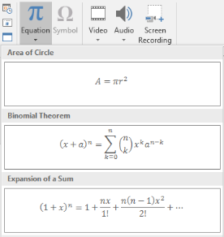
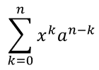

## **概述**

PowerPoint 將方程式儲存為 Office Math Markup Language (OMML)。使用 Aspose.Slides for C++，您可以以程式方式建立相同類型的數學內容：分數、根號、函數、極限、N 元運算子、矩陣、陣列以及格式化的數學區塊。

在 PowerPoint 中，使用者通常從 **Insert > Equation** 新增方程式：



結果會在投影片上呈現可編輯的數學文字：


Aspose.Slides 透過以下三個主要物件建立該數學文字：

- 數學圖形，使用 [AddMathShape](https://reference.aspose.com/slides/zh-hant/cpp/aspose.slides/shapecollection/) 建立，是包含方程式的圖形。
- [MathPortion](https://reference.aspose.com/slides/zh-hant/cpp/aspose.slides.mathtext/mathportion/) 在圖形文字框內儲存數學內容。
- [MathParagraph](https://reference.aspose.com/slides/zh-hant/cpp/aspose.slides.mathtext/mathparagraph/) 包含一個或多個 [MathBlock](https://reference.aspose.com/slides/zh-hant/cpp/aspose.slides.mathtext/mathblock/) 物件。

以下大多數範例使用 [MathematicalText](https://reference.aspose.com/slides/zh-hant/cpp/aspose.slides.mathtext/mathematicaltext/) 以及 [IMathElement](https://reference.aspose.com/slides/zh-hant/cpp/aspose.slides.mathtext/imathelement/) 的流暢方法，以保持程式碼簡潔且易讀。

若需 MathML 匯出情境，請參閱 [Export Math Equations from Presentations in C++](/slides/zh-hant/cpp/exporting-math-equations/)。

## **建立方程式**

此範例建立一個數學圖形，並加入畢氏定理：


```cpp
auto presentation = System::MakeObject<Presentation>();
auto slide = presentation->get_Slide(0);

auto mathShape = slide->get_Shapes()->AddMathShape(20.0f, 20.0f, 700.0f, 120.0f);
auto mathPortion = System::ExplicitCast<MathPortion>(mathShape->get_TextFrame()->get_Paragraph(0)->get_Portion(0));
auto mathParagraph = mathPortion->get_MathParagraph();

auto equation = System::MakeObject<MathematicalText>(u"c")
        - >SetSuperscript(u"2")
        - >Join(u"=")
        - >Join(System::MakeObject<MathematicalText>(u"a")->SetSuperscript(u"2"))
        - >Join(u"+")
        - >Join(System::MakeObject<MathematicalText>(u"b")->SetSuperscript(u"2"));

mathParagraph->Add(equation);

presentation->Save(u"pythagorean-theorem.pptx", SaveFormat::Pptx);
presentation->Dispose();
```

{}

`AddMathShape` 會建立一個已包含數學段落的圖形。存取第一個 `MathPortion`，取得其 `MathParagraph`，然後向其中加入數學區塊或數學元素。

{}

## **加入分數**

使用 `Divide` 建立分數。您可以透過 [MathFractionTypes](https://reference.aspose.com/slides/zh-hant/cpp/aspose.slides.mathtext/mathfractiontypes/) 選擇分數樣式。


```cpp
auto presentation = System::MakeObject<Presentation>();
auto slide = presentation->get_Slide(0);

auto mathShape = slide->get_Shapes()->AddMathShape(20.0f, 20.0f, 700.0f, 100.0f);
auto mathPortion = System::ExplicitCast<MathPortion>(mathShape->get_TextFrame()->get_Paragraph(0)->get_Portion(0));
auto mathParagraph = mathPortion->get_MathParagraph();

auto fraction = System::MakeObject<MathematicalText>(u"1")
        - >Divide(u"x", MathFractionTypes::Skewed);

mathParagraph->Add(System::MakeObject<MathBlock>(fraction));

presentation->Save(u"fraction.pptx", SaveFormat::Pptx);
presentation->Dispose();
```

若要堆疊式分數，請使用 `MathFractionTypes::Bar`：

```cpp
auto stackedFraction = System::MakeObject<MathematicalText>(u"x + 1")->Divide(u"y - 1", MathFractionTypes::Bar);
```

## **加入根號**

使用 `Radical` 建立平方根、立方根或其他根號。當前元素成為基底，參數則成為次方。


```cpp
auto presentation = System::MakeObject<Presentation>();
auto slide = presentation->get_Slide(0);

auto mathShape = slide->get_Shapes()->AddMathShape(20.0f, 20.0f, 700.0f, 100.0f);
auto mathPortion = System::ExplicitCast<MathPortion>(mathShape->get_TextFrame()->get_Paragraph(0)->get_Portion(0));
auto mathParagraph = mathPortion->get_MathParagraph();

auto radical = System::MakeObject<MathematicalText>(u"x")
        - >Radical(u"n");

mathParagraph->Add(System::MakeObject<MathBlock>(radical));

presentation->Save(u"radical.pptx", SaveFormat::Pptx);
presentation->Dispose();
```

## **加入函數與極限**

使用 `AsArgumentOfFunction` 或 `Function` 來建立如 `sin(x)`、`log(x)` 或自訂函數名稱的函數。對於極限，請將 `lim` 放入 [MathLimit](https://reference.aspose.com/slides/zh-hant/cpp/aspose.slides.mathtext/mathlimit/) ，或使用 `SetLowerLimit`。


```cpp
auto presentation = System::MakeObject<Presentation>();
auto slide = presentation->get_Slide(0);

auto mathShape = slide->get_Shapes()->AddMathShape(20.0f, 20.0f, 700.0f, 100.0f);
auto mathPortion = System::ExplicitCast<MathPortion>(mathShape->get_TextFrame()->get_Paragraph(0)->get_Portion(0));
auto mathParagraph = mathPortion->get_MathParagraph();

auto limit = System::MakeObject<MathematicalText>(u"lim")
        - >SetLowerLimit(u"x→∞")
        - >Function(u"x");

mathParagraph->Add(System::MakeObject<MathBlock>(limit));

presentation->Save(u"functions-and-limits.pptx", SaveFormat::Pptx);
presentation->Dispose();
```

若使用自訂函數名稱，請將函數名稱設為當前元素：

```cpp
auto customFunction = System::MakeObject<MathematicalText>(u"f")->Function(u"x + 1");
```

## **加入 N 元運算子與積分**

使用 `Nary` 來處理求和、聯集、交集以及其他大型運算子。使用 `Integral` 來處理積分。兩種方法皆可設定上下限。



```cpp
auto presentation = System::MakeObject<Presentation>();
auto slide = presentation->get_Slide(0);

auto mathShape = slide->get_Shapes()->AddMathShape(20.0f, 20.0f, 700.0f, 120.0f);
auto mathPortion = System::ExplicitCast<MathPortion>(mathShape->get_TextFrame()->get_Paragraph(0)->get_Portion(0));
auto mathParagraph = mathPortion->get_MathParagraph();

auto summationBase = System::MakeObject<MathematicalText>(u"x")
        - >SetSuperscript(u"k")
        - >Join(System::MakeObject<MathematicalText>(u"a")->SetSuperscript(u"n-k"));

auto summation = summationBase->Nary(MathNaryOperatorTypes::Summation, u"k=0", u"n");

mathParagraph->Add(System::MakeObject<MathBlock>(summation));

presentation->Save(u"nary-operators.pptx", SaveFormat::Pptx);
presentation->Dispose();
```

N 元運算子適用於帶有可選上下限的大型運算子。像 `+`、`-`、`=` 這類簡單運算子通常以 `MathematicalText` 加入並串接於表達式中。

若要建立積分，使用 `Integral`：

```cpp
auto integralBase = System::MakeObject<MathematicalText>(u"x")->Join(System::MakeObject<MathematicalText>(u"dx")->ToBox());
auto integral = integralBase->Integral(MathIntegralTypes::Simple, u"0", u"1");
```

## **加入矩陣**

使用 [MathMatrix](https://reference.aspose.com/slides/zh-hant/cpp/aspose.slides.mathtext/mathmatrix/) 來設定列與欄。預設情況下矩陣不會包含括號，若需要圓括號、方括號或大括號，請自行將矩陣包起來。


```cpp
auto presentation = System::MakeObject<Presentation>();
auto slide = presentation->get_Slide(0);

auto mathShape = slide->get_Shapes()->AddMathShape(20.0f, 20.0f, 700.0f, 120.0f);
auto mathPortion = System::ExplicitCast<MathPortion>(mathShape->get_TextFrame()->get_Paragraph(0)->get_Portion(0));
auto mathParagraph = mathPortion->get_MathParagraph();

auto matrix = System::MakeObject<MathMatrix>(2, 3);
matrix->idx_set(0, 0, System::MakeObject<MathematicalText>(u"1"));
matrix->idx_set(0, 1, System::MakeObject<MathematicalText>(u"x"));
matrix->idx_set(1, 0, System::MakeObject<MathematicalText>(u"x"));
matrix->idx_set(1, 1, System::MakeObject<MathematicalText>(u"2"));
matrix->idx_set(1, 2, System::MakeObject<MathematicalText>(u"y"));

mathParagraph->Add(System::MakeObject<MathBlock>(matrix));

presentation->Save(u"matrix.pptx", SaveFormat::Pptx);
presentation->Dispose();
```

## **加入方程式陣列**

當需要對齊的方程式或垂直堆疊的表達式時，使用 `ToMathArray`。


```cpp
auto presentation = System::MakeObject<Presentation>();
auto slide = presentation->get_Slide(0);

auto mathShape = slide->get_Shapes()->AddMathShape(20.0f, 20.0f, 700.0f, 140.0f);
auto mathPortion = System::ExplicitCast<MathPortion>(mathShape->get_TextFrame()->get_Paragraph(0)->get_Portion(0));
auto mathParagraph = mathPortion->get_MathParagraph();

auto equationArray = System::MakeObject<MathematicalText>(u"x")
        - >Join(u"y")
        - >ToMathArray();

mathParagraph->Add(System::MakeObject<MathBlock>(equationArray));

presentation->Save(u"equation-array.pptx", SaveFormat::Pptx);
presentation->Dispose();
```

## **加入三角函數**

當參數是當前元素且函數名稱已知時，使用 `AsArgumentOfFunction`。


```cpp
auto presentation = System::MakeObject<Presentation>();
auto slide = presentation->get_Slide(0);

auto mathShape = slide->get_Shapes()->AddMathShape(20.0f, 20.0f, 700.0f, 100.0f);
auto mathPortion = System::ExplicitCast<MathPortion>(mathShape->get_TextFrame()->get_Paragraph(0)->get_Portion(0));
auto mathParagraph = mathPortion->get_MathParagraph();

auto cosine = System::MakeObject<MathematicalText>(u"2x")
        - >AsArgumentOfFunction(MathFunctionsOfOneArgument::Cos);

mathParagraph->Add(System::MakeObject<MathBlock>(cosine));

presentation->Save(u"trigonometric-function.pptx", SaveFormat::Pptx);
presentation->Dispose();
```

## **加入下標與上標**

使用下標與上標輔助方法處理索引與次方。若索引需顯示在基底的左側，請使用 `SetSubSuperscriptOnTheLeft`。


```cpp
auto presentation = System::MakeObject<Presentation>();
auto slide = presentation->get_Slide(0);

auto mathShape = slide->get_Shapes()->AddMathShape(20.0f, 20.0f, 700.0f, 100.0f);
auto mathPortion = System::ExplicitCast<MathPortion>(mathShape->get_TextFrame()->get_Paragraph(0)->get_Portion(0));
auto mathParagraph = mathPortion->get_MathParagraph();

auto scripts = System::MakeObject<MathematicalText>(u"Y")
        - >SetSubSuperscriptOnTheLeft(u"1", u"n");

mathParagraph->Add(System::MakeObject<MathBlock>(scripts));

presentation->Save(u"subscript-superscript.pptx", SaveFormat::Pptx);
presentation->Dispose();
```

## **加入分界符**

使用 `Enclose` 將表達式置於分界符內。對於包含多個元素的分界符表達式，亦可設定分隔字元。


```cpp
auto presentation = System::MakeObject<Presentation>();
auto slide = presentation->get_Slide(0);

auto mathShape = slide->get_Shapes()->AddMathShape(20.0f, 20.0f, 700.0f, 100.0f);
auto mathPortion = System::ExplicitCast<MathPortion>(mathShape->get_TextFrame()->get_Paragraph(0)->get_Portion(0));
auto mathParagraph = mathPortion->get_MathParagraph();

auto delimiter = System::MakeObject<MathematicalText>(u"x")
        - >Join(u"y")
        - >Join(u"z")
        - >Enclose(u'<', u'>', u'|');

mathParagraph->Add(System::MakeObject<MathBlock>(delimiter));

presentation->Save(u"delimiters.pptx", SaveFormat::Pptx);
presentation->Dispose();
```

## **加入框線盒子**

當方程式本身需要被框住時，使用 `ToBorderBox`。


```cpp
auto presentation = System::MakeObject<Presentation>();
auto slide = presentation->get_Slide(0);

auto mathShape = slide->get_Shapes()->AddMathShape(20.0f, 20.0f, 700.0f, 100.0f);
auto mathPortion = System::ExplicitCast<MathPortion>(mathShape->get_TextFrame()->get_Paragraph(0)->get_Portion(0));
auto mathParagraph = mathPortion->get_MathParagraph();

auto boxedEquation = System::MakeObject<MathematicalText>(u"a")
        - >SetSuperscript(u"2")
        - >Join(u"=")
        - >Join(System::MakeObject<MathematicalText>(u"b")->SetSuperscript(u"2"))
        - >Join(u"+")
        - >Join(System::MakeObject<MathematicalText>(u"c")->SetSuperscript(u"2"))
        - >ToBorderBox();

mathParagraph->Add(System::MakeObject<MathBlock>(boxedEquation));

presentation->Save(u"border-box.pptx", SaveFormat::Pptx);
presentation->Dispose();
```

## **分組項目**

使用 `Group` 在表達式之上或之下放置分組符號。加入上下限以為分組項目加上標籤。


```cpp
auto presentation = System::MakeObject<Presentation>();
auto slide = presentation->get_Slide(0);

auto mathShape = slide->get_Shapes()->AddMathShape(20.0f, 20.0f, 700.0f, 120.0f);
auto mathPortion = System::ExplicitCast<MathPortion>(mathShape->get_TextFrame()->get_Paragraph(0)->get_Portion(0));
auto mathParagraph = mathPortion->get_MathParagraph();

auto grouped = System::MakeObject<MathematicalText>(u"x + y")
        - >Group(u'\u23DF', MathTopBotPositions::Bottom, MathTopBotPositions::Top)
        - >SetLowerLimit(u"any text");

mathParagraph->Add(System::MakeObject<MathBlock>(grouped));

presentation->Save(u"grouped-terms.pptx", SaveFormat::Pptx);
presentation->Dispose();
```

## **格式化數學元素**

僅在有助於說明公式時才使用格式化輔助方法。例如，`Overbar` 會在數學元素上方加上一條橫線。


```cpp
auto presentation = System::MakeObject<Presentation>();
auto slide = presentation->get_Slide(0);

auto mathShape = slide->get_Shapes()->AddMathShape(20.0f, 20.0f, 700.0f, 100.0f);
auto mathPortion = System::ExplicitCast<MathPortion>(mathShape->get_TextFrame()->get_Paragraph(0)->get_Portion(0));
auto mathParagraph = mathPortion->get_MathParagraph();

auto overbar = System::MakeObject<MathematicalText>(u"ABC")->Overbar();

mathParagraph->Add(System::MakeObject<MathBlock>(overbar));

presentation->Save(u"overbar.pptx", SaveFormat::Pptx);
presentation->Dispose();
```

## **快速參考**

| 任務 | 主要 API |
| --- | --- |
| 建立數學文字 | [MathematicalText](https://reference.aspose.com/slides/zh-hant/cpp/aspose.slides.mathtext/mathematicaltext/) |
| 組合元素 | [IMathElement.Join](https://reference.aspose.com/slides/zh-hant/cpp/aspose.slides.mathtext/imathelement/join/) |
| 建立分數 | [IMathElement.Divide](https://reference.aspose.com/slides/zh-hant/cpp/aspose.slides.mathtext/imathelement/divide/) |
| 加入上標或下標 | [SetSuperscript](https://reference.aspose.com/slides/zh-hant/cpp/aspose.slides.mathtext/imathelement/setsuperscript/), [SetSubscript](https://reference.aspose.com/slides/zh-hant/cpp/aspose.slides.mathtext/imathelement/setsubscript/) |
| 加入函數 | [Function](https://reference.aspose.com/slides/zh-hant/cpp/aspose.slides.mathtext/imathelement/function/), [AsArgumentOfFunction](https://reference.aspose.com/slides/zh-hant/cpp/aspose.slides.mathtext/imathelement/asargumentoffunction/) |
| 加入根號 | [IMathElement.Radical](https://reference.aspose.com/slides/zh-hant/cpp/aspose.slides.mathtext/imathelement/radical/) |
| 加入極限 | [SetLowerLimit](https://reference.aspose.com/slides/zh-hant/cpp/aspose.slides.mathtext/imathelement/setlowerlimit/), [SetUpperLimit](https://reference.aspose.com/slides/zh-hant/cpp/aspose.slides.mathtext/imathelement/setupperlimit/) |
| 加入左側上/下標 | [SetSubSuperscriptOnTheLeft](https://reference.aspose.com/slides/zh-hant/cpp/aspose.slides.mathtext/imathelement/setsubsuperscriptontheleft/) |
| 加入求和與積分 | [Nary](https://reference.aspose.com/slides/zh-hant/cpp/aspose.slides.mathtext/imathelement/nary/), [Integral](https://reference.aspose.com/slides/zh-hant/cpp/aspose.slides.mathtext/imathelement/integral/) |
| 加入矩陣 | [MathMatrix](https://reference.aspose.com/slides/zh-hant/cpp/aspose.slides.mathtext/mathmatrix/) |
| 加入方程式陣列 | [ToMathArray](https://reference.aspose.com/slides/zh-hant/cpp/aspose.slides.mathtext/imathelement/tomatharray/) |
| 加入分界符 | [Enclose](https://reference.aspose.com/slides/zh-hant/cpp/aspose.slides.mathtext/imathelement/enclose/) |
| 加入橫線與框線 | [Overbar](https://reference.aspose.com/slides/zh-hant/cpp/aspose.slides.mathtext/imathelement/overbar/), [ToBorderBox](https://reference.aspose.com/slides/zh-hant/cpp/aspose.slides.mathtext/imathelement/toborderbox/) |
| 分組項目 | [Group](https://reference.aspose.com/slides/zh-hant/cpp/aspose.slides.mathtext/imathelement/group/) |

## **常見問題**

**我可以編輯已存在的 PowerPoint 方程式嗎？**

可以。開啟投影片，尋找包含 `MathPortion` 的圖形，取得其 `MathParagraph`，然後更新該段落中的數學區塊。

**方程式是否儲存為可編輯的 PowerPoint 數學內容？**

是的。當儲存為 PPTX 時，Aspose.Slides 會將方程式寫入為可編輯的 Office 數學內容。

**我可以將方程式匯出為 LaTeX 嗎？**

Aspose.Slides 會將數學方程式匯出為 MathML。如果您需要 LaTeX，請先匯出為 MathML，然後使用支援目標 LaTeX 方言的工具將 MathML 轉換為 LaTeX。