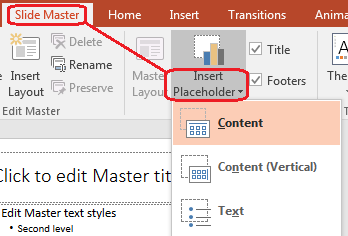

## **概述**

**投影片母版** 定義一組投影片的共用設計設定。它可以包含共用圖形、標誌、背景、文字樣式、佈景主題設定與頁尾設定。在 PowerPoint 中，編輯投影片母版是保持簡報一致性的常用方法，避免在每張投影片上重複相同的格式設定。

Aspose.Slides for C++ 支援相同的模型。簡報可以包含一個或多個母版投影片，而每個母版投影片可以包含多個版面配置投影片。普通投影片通常不會直接參照母版投影片。相反，普通投影片使用版面配置投影片，而該版面配置投影片屬於某個母版投影片。

階層結構如下：

1. **投影片母版** - 定義共用的設計與佈景主題。
1. **版面配置投影片** - 定義佔位元件的具體排列與版面層級的格式設定。
1. **普通投影片** - 含有實際的簡報內容，並使用一個版面配置投影片。


在 Aspose.Slides 中，投影片母版由 [IMasterSlide](https://reference.aspose.com/slides/zh-hant/cpp/aspose.slides/imasterslide/) 介面表示。簡報中的所有母版投影片可透過 [Presentation::get_Masters](https://reference.aspose.com/slides/zh-hant/cpp/aspose.slides/presentation/get_masters/) 集合取得，該集合實作 [IMasterSlideCollection](https://reference.aspose.com/slides/zh-hant/cpp/aspose.slides/imasterslidecollection/)。

{}
當同一屬性在多個層級中被定義時，較具體的層級會取代較高層級。例如，若母版投影片與版面配置投影片同時定義背景，則基於該版面配置的投影片會使用版面的背景。欲取得有關版面配置投影片的更多資訊，請參閱 [套用或變更投影片版面配置](/slides/zh-hant/cpp/slide-layout/)。
{}

## **存取投影片母版**

在 PowerPoint 中，您可以從 **檢視** > **投影片母版** 開啟母版檢視。


在 Aspose.Slides 中，使用 `get_Masters()` 集合來存取母版投影片：

```cpp
auto presentation = System::MakeObject<Presentation>(u"presentation.pptx");

auto firstMasterSlide = presentation->get_Master(0);
auto masterSlideCount = presentation->get_Masters()->get_Count();
auto firstMasterLayoutSlideCount = firstMasterSlide->get_LayoutSlides()->get_Count();

System::Console::WriteLine(System::String(u"Master slides: ") + masterSlideCount);
System::Console::WriteLine(System::String(u"Layouts in the first master: ") + firstMasterLayoutSlideCount);

presentation->Dispose();
```

您也可以透過普通投影片的版面配置取得其所使用的母版投影片：

```cpp
auto presentation = System::MakeObject<Presentation>(u"presentation.pptx");

auto slide = presentation->get_Slide(0);
auto layoutSlide = slide->get_LayoutSlide();
auto masterSlide = layoutSlide->get_MasterSlide();
auto masterSlideName = masterSlide->get_Name();

System::Console::WriteLine(masterSlideName);

presentation->Dispose();
```

## **投影片母版的內容**

母版投影片是一種類似投影片的物件。它實作 [IBaseSlide](https://reference.aspose.com/slides/zh-hant/cpp/aspose.slides/ibaseslide/)，因此提供許多與普通投影片與版面配置投影片相同的投影片屬性。母版專屬的成員列於 [IMasterSlide](https://reference.aspose.com/slides/zh-hant/cpp/aspose.slides/imasterslide/) API 頁面。

常用的母版投影片成員包括：

| 成員 | 用途 |
| --- | --- |
| `get_Background()` | 設定母版層級的投影片背景。 |
| `get_Shapes()` | 儲存放置於母版上的圖形，例如標誌、圖片框與共用文字。 |
| `get_LayoutSlides()` | 儲存屬於該母版的版面配置投影片。 |
| `get_ThemeManager()` | 提供存取母版佈景主題 API 的功能。 |
| `get_HeaderFooterManager()` | 控制母版及其子版面的頁首、頁腳、日期與投影片編號。 |
| `GetDependingSlides()` | 取得透過版面配置依賴該母版的普通投影片。 |

## **在投影片母版中加入影像**

當您將影像加入母版投影片時，使用該母版之版面配置的投影片皆會顯示此影像。這對於加入標誌、浮水印、裝飾條帶及其他重複的視覺元素非常有用。

以下範例將標誌加入第一個母版投影片：

```cpp
auto presentation = System::MakeObject<Presentation>(u"presentation.pptx");

auto masterSlide = presentation->get_Master(0);
auto logoBytes = System::IO::File::ReadAllBytes(u"logo.png");
auto logoImage = presentation->get_Images()->AddImage(logoBytes);

masterSlide->get_Shapes()->AddPictureFrame(
    ShapeType::Rectangle,
    20.0f,
    20.0f,
    80.0f,
    80.0f,
    logoImage);

presentation->Save(u"presentation-with-logo.pptx", SaveFormat::Pptx);
presentation->Dispose();
```

如需有關圖片框的更多資訊，請參閱 [圖片框](/slides/zh-hant/cpp/picture-frame/)。

## **使用佔位元件**

佔位元件通常在版面配置投影片上定義。母版投影片提供共用的樣式與佈景主題，讓各版面配置繼承；而每個版面配置決定可使用的佔位元件以及其放置位置。

在 PowerPoint 中，佔位元件指令可在投影片母版檢視中使用。



若要使用 Aspose.Slides 新增佔位元件，請操作屬於該母版的版面配置投影片：

```cpp
auto presentation = System::MakeObject<Presentation>(u"presentation.pptx");

auto masterSlide = presentation->get_Master(0);
auto blankLayoutSlide = masterSlide->get_LayoutSlides()->GetByType(SlideLayoutType::Blank);

if (blankLayoutSlide == nullptr)
{
    blankLayoutSlide = masterSlide->get_LayoutSlides()->Add(SlideLayoutType::Blank, u"Blank");
}

blankLayoutSlide->get_PlaceholderManager()->AddTextPlaceholder(
    60.0f,
    120.0f,
    600.0f,
    80.0f);

presentation->get_Slides()->AddEmptySlide(blankLayoutSlide);
presentation->Save(u"presentation-with-placeholder.pptx", SaveFormat::Pptx);
presentation->Dispose();
```

您也可以格式化已存在於母版投影片上的佔位元件形狀。以下範例尋找標題佔位元件並套用線性漸層填充：

```cpp
auto presentation = System::MakeObject<Presentation>(u"presentation.pptx");

auto masterSlide = presentation->get_Master(0);
System::SharedPtr<IAutoShape> titlePlaceholder;

for (auto&& shape : masterSlide->get_Shapes())
{
    auto autoShape = System::AsCast<IAutoShape>(shape);

    if (autoShape != nullptr &&
        autoShape->get_Placeholder() != nullptr &&
        autoShape->get_Placeholder()->get_Type() == PlaceholderType::Title)
    {
        titlePlaceholder = autoShape;
        break;
    }
}

if (titlePlaceholder != nullptr)
{
    auto fillFormat = titlePlaceholder->get_FillFormat();
    fillFormat->set_FillType(FillType::Gradient);

    auto gradientFormat = fillFormat->get_GradientFormat();
    gradientFormat->set_GradientShape(GradientShape::Linear);

    auto gradientStops = gradientFormat->get_GradientStops();
    auto redGradientColor = System::Drawing::Color::FromArgb(255, 0, 0);
    auto purpleGradientColor = System::Drawing::Color::FromArgb(128, 0, 128);

    gradientStops->Add(0.0f, redGradientColor);
    gradientStops->Add(255.0f, purpleGradientColor);
}

presentation->Save(u"presentation-title-style.pptx", SaveFormat::Pptx);
presentation->Dispose();
```


如需更多佔位元件與文字格式化選項，請參閱 [在佔位元件中設定提示文字](/slides/zh-hant/cpp/manage-placeholder/) 與 [文字格式化](/slides/zh-hant/cpp/text-formatting/)。

## **變更投影片母版背景**

母版背景會被未覆寫的版面配置與投影片繼承。以下範例為第一個母版投影片設定純色背景：

```cpp
auto presentation = System::MakeObject<Presentation>(u"presentation.pptx");

auto masterSlide = presentation->get_Master(0);
auto masterBackgroundColor = System::Drawing::Color::get_ForestGreen();

masterSlide->get_Background()->set_Type(BackgroundType::OwnBackground);
masterSlide->get_Background()->get_FillFormat()->set_FillType(FillType::Solid);
masterSlide->get_Background()->get_FillFormat()->get_SolidFillColor()->set_Color(masterBackgroundColor);

presentation->Save(u"presentation-master-background.pptx", SaveFormat::Pptx);
presentation->Dispose();
```

相關主題請參閱 [簡報背景](/slides/zh-hant/cpp/presentation-background/) 與 [簡報佈景主題](/slides/zh-hant/cpp/presentation-theme/)。

## **將投影片母版複製到其他簡報**

使用 [IMasterSlideCollection::AddClone](https://reference.aspose.com/slides/zh-hant/cpp/aspose.slides/imasterslidecollection/addclone/) 可將母版投影片複製至另一個簡報。複製的母版即可被目標簡報中的版面配置與投影片使用：

```cpp
auto sourcePresentation = System::MakeObject<Presentation>(u"source.pptx");
auto destinationPresentation = System::MakeObject<Presentation>(u"destination.pptx");

auto sourceMasterSlide = sourcePresentation->get_Master(0);
auto clonedMasterSlide = destinationPresentation->get_Masters()->AddClone(sourceMasterSlide);

destinationPresentation->Save(u"destination-with-master.pptx", SaveFormat::Pptx);
destinationPresentation->Dispose();
sourcePresentation->Dispose();
```

若需同時複製普通投影片及其母版，請參閱 [複製投影片](/slides/zh-hant/cpp/clone-slides/)。

## **新增多個投影片母版**

一個簡報可包含多個母版投影片。當不同章節需要不同的品牌識別、頁面結構或佈景設定時，這相當有用。


以下範例會複製預設母版、為其複本設定不同的背景、在該複本母版下建立版面配置，並新增一張使用該版面配置的投影片：

```cpp
auto presentation = System::MakeObject<Presentation>(u"presentation.pptx");

auto defaultMasterSlide = presentation->get_Master(0);
auto sectionMasterSlide = presentation->get_Masters()->AddClone(defaultMasterSlide);
auto sectionMasterBackgroundColor = System::Drawing::Color::get_LightSteelBlue();

sectionMasterSlide->get_Background()->set_Type(BackgroundType::OwnBackground);
sectionMasterSlide->get_Background()->get_FillFormat()->set_FillType(FillType::Solid);
sectionMasterSlide->get_Background()->get_FillFormat()->get_SolidFillColor()->set_Color(sectionMasterBackgroundColor);

auto sourceBlankLayout = defaultMasterSlide->get_LayoutSlides()->GetByType(SlideLayoutType::Blank);

if (sourceBlankLayout == nullptr)
{
    sourceBlankLayout = defaultMasterSlide->get_LayoutSlide(0);
}

auto sectionBlankLayout = sectionMasterSlide->get_LayoutSlides()->AddClone(sourceBlankLayout);

presentation->get_Slides()->AddEmptySlide(sectionBlankLayout);
presentation->Save(u"presentation-with-multiple-masters.pptx", SaveFormat::Pptx);
presentation->Dispose();
```

## **比較投影片母版**

母版投影片可使用從 [IBaseSlide](https://reference.aspose.com/slides/zh-hant/cpp/aspose.slides/ibaseslide/) 繼承的 `Equals` 方法進行比較。比較會檢查結構與靜態內容，如圖形、文字、格式、動畫與其他投影片設定。它不會比較唯一識別碼（如投影片 ID）或動態佔位元件值（如目前日期）。

```cpp
auto firstPresentation = System::MakeObject<Presentation>(u"first.pptx");
auto secondPresentation = System::MakeObject<Presentation>(u"second.pptx");
auto firstPresentationMasterCount = firstPresentation->get_Masters()->get_Count();
auto secondPresentationMasterCount = secondPresentation->get_Masters()->get_Count();

for (int32_t firstMasterIndex = 0;
     firstMasterIndex < firstPresentationMasterCount;
     firstMasterIndex++)
{
    for (int32_t secondMasterIndex = 0;
         secondMasterIndex < secondPresentationMasterCount;
         secondMasterIndex++)
    {
        auto firstMasterSlide = firstPresentation->get_Master(firstMasterIndex);
        auto secondMasterSlide = secondPresentation->get_Master(secondMasterIndex);
        auto areMasterSlidesEqual = firstMasterSlide->Equals(secondMasterSlide);

        if (areMasterSlidesEqual)
        {
            System::Console::WriteLine(
                System::String::Format(
                    u"first.pptx master #{0} equals second.pptx master #{1}",
                    firstMasterIndex,
                    secondMasterIndex));
        }
    }
}

secondPresentation->Dispose();
firstPresentation->Dispose();
```

如需更多資訊，請參閱 [比較簡報投影片](/slides/zh-hant/cpp/compare-slides/)。

## **將投影片母版檢視設定為預設檢視**

使用 [ViewProperties](https://reference.aspose.com/slides/zh-hant/cpp/aspose.slides/viewproperties/) 上的 `set_LastView` 方法，可控制 PowerPoint 首次開啟的檢視。以下範例在投影片母版檢視中開啟簡報：

```cpp
auto presentation = System::MakeObject<Presentation>(u"presentation.pptx");

presentation->get_ViewProperties()->set_LastView(ViewType::SlideMasterView);
presentation->Save(u"presentation-master-view.pptx", SaveFormat::Pptx);
presentation->Dispose();
```

如需更多檢視設定，請參閱 [儲存簡報](/slides/zh-hant/cpp/save-presentation/)。

## **移除未使用的母版投影片**

簡報有時會包含已不再被任何普通投影片使用的母版投影片。移除未使用的母版可減少檔案大小並簡化樣板維護。

使用 [MasterSlideCollection::RemoveUnused](https://reference.aspose.com/slides/zh-hant/cpp/aspose.slides/masterslidecollection/removeunused/) 可從 `get_Masters()` 集合中移除未使用的母版：

```cpp
auto presentation = System::MakeObject<Presentation>(u"presentation.pptx");

presentation->get_Masters()->RemoveUnused(true);
presentation->Save(u"presentation-clean.pptx", SaveFormat::Pptx);
presentation->Dispose();
```

您也可以使用低程式碼的 [Compress::RemoveUnusedMasterSlides](https://reference.aspose.com/slides/zh-hant/cpp/aspose.slides.lowcode/compress/removeunusedmasterslides/) 方法：

```cpp
auto presentation = System::MakeObject<Presentation>(u"presentation.pptx");

LowCode::Compress::RemoveUnusedMasterSlides(presentation);
presentation->Save(u"presentation-clean.pptx", SaveFormat::Pptx);
presentation->Dispose();
```

## **常見問題**

**投影片母版與版面配置投影片有何不同？**

投影片母版定義共用的設計設定，例如佈景主題、背景、共用圖形與文字樣式。版面配置投影片屬於母版投影片，並定義佔位元件的具體排列。普通投影片使用版面配置投影片，因此同時繼承版面配置與母版的設定。

**一個簡報可以包含多個投影片母版嗎？**

可以。簡報可以包含多個投影片母版。當不同章節需要不同的視覺系統或品牌識別時，請使用多個母版。

**應該在母版投影片還是版面配置投影片上加入佔位元件？**

大多數情況下，應在版面配置投影片上加入佔位元件。將共用的視覺元素與格式放在母版投影片上，然後在普通投影片將使用的版面配置上加入內容佔位元件。

**我可以刪除仍在使用中的母版投影片嗎？**

不行。具有相依投影片的母版投影片無法直接安全地刪除。必須先將這些投影片移至其他母版的版面配置，或使用僅移除未使用母版的清理方法。