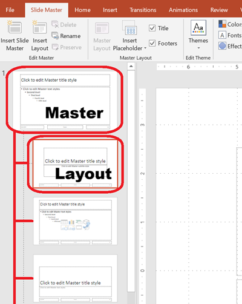

本文提供了一系列範例，說明如何使用 **Aspose.Slides for C++** 來操作投影片。您將學習如何使用 `Presentation` 類別新增、存取、複製、重新排序與移除投影片。

以下每個範例皆包含簡要說明，接著是 C++ 程式碼片段。

## **新增投影片**

若要新增投影片，必須先選擇版面配置。本範例使用 `Blank` 版面，並在簡報中加入一張空白投影片。

```cpp
static void AddSlide()
{
    auto presentation = MakeObject<Presentation>();
    auto blankLayout = presentation->get_LayoutSlides()->GetByType(SlideLayoutType::Blank);

    presentation->get_Slides()->AddEmptySlide(blankLayout);

    presentation->Dispose();
}
```

> 💡 **注意:** 每個投影片版面皆源自母片，母片定義整體設計與占位結構。下圖說明了 PowerPoint 中母片與其相關版面的組織方式。



## **依索引存取投影片**

您可以透過索引存取投影片，或根據參考取得投影片的索引。這在遍歷或修改特定投影片時相當有用。

```cpp
static void AccessSlide()
{
    auto presentation = MakeObject<Presentation>();

    // 新增另一張空白投影片。
    auto blankLayout = presentation->get_LayoutSlides()->GetByType(SlideLayoutType::Blank);
    presentation->get_Slides()->AddEmptySlide(blankLayout);

    // 依索引存取投影片。
    auto firstSlide = presentation->get_Slide(0);
    auto secondSlide = presentation->get_Slide(1);

    // 從參考取得投影片索引，然後依索引存取。
    auto secondSlideIndex = presentation->get_Slides()->IndexOf(secondSlide);
    auto secondSlideByIndex = presentation->get_Slide(secondSlideIndex);

    presentation->Dispose();
}
```

## **複製投影片**

本範例示範如何複製現有的投影片。複製的投影片會自動加入投影片集合的最後。

```cpp
static void CloneSlide()
{
    auto presentation = MakeObject<Presentation>();
    auto firstSlide = presentation->get_Slide(0);

    auto clonedSlide = presentation->get_Slides()->AddClone(firstSlide);

    auto clonedSlideIndex = presentation->get_Slides()->IndexOf(clonedSlide);

    presentation->Dispose();
}
```

## **重新排序投影片**

您可以透過將投影片移動到新索引來變更順序。在此範例中，我們將複製的投影片移至第一個位置。

```cpp
static void ReorderSlide()
{
    auto presentation = MakeObject<Presentation>();
    auto firstSlide = presentation->get_Slide(0);

    auto clonedSlide = presentation->get_Slides()->AddClone(firstSlide);

    presentation->get_Slides()->Reorder(0, clonedSlide);

    presentation->Dispose();
}
```

## **移除投影片**

若要移除投影片，只需參考該投影片並呼叫 `Remove`。本範例先新增第二張投影片，然後移除原始投影片，只保留新的投影片。

```cpp
static void RemoveSlide()
{
    auto presentation = MakeObject<Presentation>();

    auto blankLayout = presentation->get_LayoutSlides()->GetByType(SlideLayoutType::Blank);
    auto secondSlide = presentation->get_Slides()->AddEmptySlide(blankLayout);

    auto firstSlide = presentation->get_Slide(0);
    presentation->get_Slides()->Remove(firstSlide);

    presentation->Dispose();
}
```