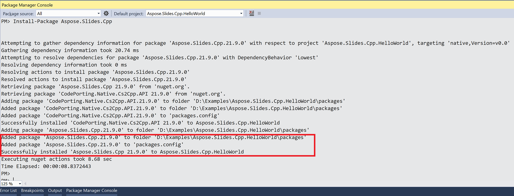

## **概述**

Aspose.Slides for C++ 有兩種發行形式：

| 形式 | 使用情境 | 取得位置 |
|---|---|---|
| NuGet 套件: [Aspose.Slides.Cpp](https://www.nuget.org/packages/Aspose.Slides.Cpp/)（64 位元）和 [Aspose.Slides.Cpp.x86](https://www.nuget.org/packages/Aspose.Slides.Cpp.x86/)（32 位元） | Windows 上的 Visual Studio C++ 專案 | NuGet |
| 適用於 Windows、Linux 與 macOS 的 ZIP 套件 | 不使用 NuGet 的建置，如 CMake 專案 | [下載頁面](https://releases.aspose.com/slides/cpp/) |

本文說明如何在 Windows 上的 Visual Studio 中安裝 NuGet 套件，以及如何在 Linux 上使用 CMake 安裝 ZIP 套件。兩條路徑的最終步驟相同：建置並執行 [Create Presentations](/slides/zh-hant/cpp/create-presentation/) 中的第一個範例。

## **Windows**

在 Windows 上，將 NuGet 套件加入 Visual Studio C++ 專案。此套件同時會安裝其相依性 CodePorting.Translator.Cs2Cpp.Framework，並將程式所需的 DLL 複製到建置輸出資料夾。

依據建置平台選擇套件：x64 使用 **Aspose.Slides.Cpp**，Win32 (x86) 使用 **Aspose.Slides.Cpp.x86**。Aspose.Slides.Cpp 套件不適用於 Win32 建置，導致編譯器找不到其標頭檔。

Windows 的 ZIP 套件也可於[下載頁面](https://releases.aspose.com/slides/cpp/)取得。

### **方法 1：從 NuGet 套件管理員安裝或更新 Aspose.Slides**

1. 開啟 Microsoft Visual Studio。
2. 建立 C++ **Console App** 專案，或開啟現有的專案。
3. 在 **Solution Explorer** 中，右鍵點擊專案並選取 **Manage NuGet Packages**（或前往 **Project** > **Manage NuGet Packages**）。
4. 在 **Browse** 下，搜尋 *Aspose.Slides.Cpp*。

5. 點選 **Aspose.Slides.Cpp**（或對於 32 位元建置點選 **Aspose.Slides.Cpp.x86**），然後點選 **Install**。  
   * 如果您已安裝 Aspose.Slides 且想要更新，請點選 **Update**。

套件會被下載並在您的專案中引用。

### **方法 2：透過套件管理員主控台安裝或更新 Aspose.Slides**

1. 開啟 Microsoft Visual Studio。
2. 建立 C++ **Console App** 專案，或開啟現有的專案。
3. 前往 **Tools** > **NuGet Package Manager** > **Package Manager Console**。

4. 執行以下指令：

   ```powershell
   Install-Package Aspose.Slides.Cpp
   ```

   若為 32 位元 (Win32) 建置，請改為安裝 x86 套件：

   ```powershell
   Install-Package Aspose.Slides.Cpp.x86
   ```


安裝完成後，會顯示確認訊息。此套件依據 [Aspose EULA](https://about.aspose.com/legal/eula) 發布。


若要更新套件，請於套件管理員主控台執行 `Update-Package Aspose.Slides.Cpp`（或 `Update-Package Aspose.Slides.Cpp.x86`）。

### **檢查安裝**

1. 將專案的主 *.cpp* 檔案（包含 `main` 的檔案）內容取代為 [Create Presentations](/slides/zh-hant/cpp/create-presentation/) 中的第一個範例。
2. 在工具列中，選擇 **x64** 平台；若已安裝 Aspose.Slides.Cpp.x86，則選擇 **x86**。
3. 按下 **Ctrl+F5** 以建置並執行程式。

程式會在專案資料夾中儲存 *hello.pptx*，該資料夾為 Visual Studio 執行程式時的預設工作目錄。

## **Linux**

在 Linux 上，使用搭配 CMake 的 Linux ZIP 套件。此套件內含 Aspose.Slides 函式庫、其相依性 CodePorting.Translator.Cs2Cpp.Framework，以及各自的 CMake 設定檔。函式庫是針對 x86_64 Linux，搭配 glibc 2.23 或更新版本編譯。

1. 安裝 C++ 編譯器、make、CMake、unzip，以及 Aspose.Slides 函式庫所依賴的 fontconfig 套件。於 Debian 與 Ubuntu 上執行以下指令：

   ```bash
   sudo apt-get update && sudo apt-get install -y g++ make cmake unzip libfontconfig1
   ```

2. 建立專案資料夾並切換至該目錄：

   ```bash
   mkdir hello-slides
   cd hello-slides
   ```

3. 從[下載頁面](https://releases.aspose.com/slides/cpp/) 下載 Linux ZIP（**Aspose.Slides for C++ Linux**）至專案資料夾，並解壓縮至 *aspose-slides-cpp* 子資料夾：

   ```bash
   unzip aspose-slides-cpp-linux-*.zip -d aspose-slides-cpp
   ```

4. 在專案資料夾中新建名為 *CMakeLists.txt* 的檔案，內容如下：

   ```cmake
   cmake_minimum_required(VERSION 3.13)
   project(HelloSlides CXX)

   set(CMAKE_CXX_STANDARD 14)
   set(CMAKE_CXX_STANDARD_REQUIRED ON)

   set(ASPOSE_SLIDES_DIR "${CMAKE_CURRENT_SOURCE_DIR}/aspose-slides-cpp")
   find_package(CodePorting.Translator.Cs2Cpp.Framework REQUIRED CONFIG PATHS "${ASPOSE_SLIDES_DIR}" NO_DEFAULT_PATH)
   find_package(Aspose.Slides.Cpp REQUIRED CONFIG PATHS "${ASPOSE_SLIDES_DIR}" NO_DEFAULT_PATH)

   add_executable(hello main.cpp)
   target_link_libraries(hello PRIVATE Aspose.Slides.Cpp)
   ```

兩個 `find_package` 呼叫會從解壓縮的套件載入 CMake 設定檔。因為 Aspose.Slides 依賴此框架，系統會先找到框架。連結 `Aspose.Slides.Cpp` 目標會將包含目錄及兩個函式庫加入建置。

5. 將 [Create Presentations](/slides/zh-hant/cpp/create-presentation/) 中的第一個範例存為 *main.cpp*，放入專案資料夾中。
6. 建置並執行程式：

   ```bash
   cmake -S . -B build -DCMAKE_BUILD_TYPE=Release
   cmake --build build
   ./build/hello
   ```

程式會在目前資料夾中儲存 *hello.pptx*。CMake 會將函式庫位置寫入程式，因此只要 *aspose-slides-cpp* 資料夾保留於原位，即不必設定 `LD_LIBRARY_PATH`。

必須在系統上安裝簡報所使用的字型，或相容的替代字型，才能在將投影片轉換為 PDF 或影像時正確呈現文字。

## **FAQ**

**有免費版或試用限制嗎？**

是的。未授權時，Aspose.Slides 會以評估模式運行：在每張儲存的投影片上加上評估水印，並截斷從簡報讀取的文字。若要移除這些限制，請套用有效的 [license](/slides/zh-hant/cpp/licensing/)。

**為何編譯器報告無法開啟 *DOM/Presentation.h*？**

已安裝的套件與您建置的平台不相符。Aspose.Slides.Cpp 僅適用於 x64 建置，Aspose.Slides.Cpp.x86 則僅適用於 Win32 建置。請在 Visual Studio 中選擇相符的平台，或安裝另一套件。