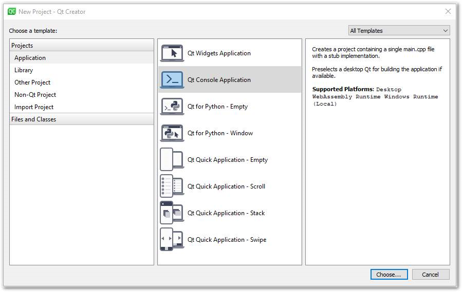
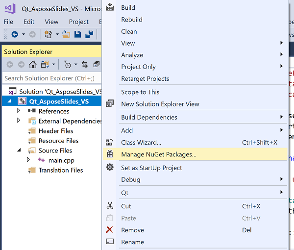

## **簡介**

Qt 是一個基於 C++ 的跨平台應用程式開發框架，廣泛用於開發各種桌面、行動裝置與嵌入式系統的應用程式。Aspose.Slides for C++ 可以整合到 Qt 中，以在您的 Qt 應用程式中建立和操作 PowerPoint 文件。

## **在 Qt Creator 中使用 Aspose.Slides for C++**

若要在 Qt 應用程式中使用 Aspose.Slides for C++，請從 [downloads](https://downloads.aspose.com/slides/zh-hant/cpp) 章節下載最新版本的 API。下載完畢後，您可以在 Qt Creator 或 Visual Studio 中整合此 C++ 函式庫。

若要在 Qt Creator 開發的 Qt 主控台應用程式中整合並使用 Aspose.Slides for C++ 函式庫，請依照下列步驟操作：

- 開啟 Qt Creator 並建立一個新的 *Qt Console Application*。

- 從 *Build System* 下拉選單中選取 QMake 選項。

- 選取適當的套件並完成精靈。

- 將 Aspose.Slides for C++ 解壓縮套件中的 aspose‑slides‑cpp‑21.02 資料夾複製到專案根目錄。

- 為了加入 lib 和 include 資料夾的路徑，於左側面板的專案上點右鍵，選取 *Add Library*。

- 選取 External Library 選項，並逐一瀏覽以加入 lib 資料夾的路徑。

- 完成後，您的 .pro 專案檔將包含以下條目：

- 建置應用程式，即完成整合。  

{}

注意：請參考 [full demo project](https://github.com/aspose-slides/Aspose.Slides-for-C/tree/master/QtDemos/QtCreator/Qt_AsposeSlides_QMake) 以取得更多資訊。

{}

## **在 Visual Studio 中的 Qt 應用程式中使用 Aspose.Slides for C++**

若要使用 Visual Studio 開發 Qt 應用程式，您需要安裝 [Qt Visual Studio Tools](https://marketplace.visualstudio.com/items?itemName=TheQtCompany.QtVisualStudioTools-19123)。安裝完成後，從 [downloads](https://downloads.aspose.com/slides/zh-hant/cpp) 章節下載最新版本的 API，並依照下列步驟操作：

- 開啟 Microsoft Visual Studio 並建立一個新的 *Qt Console Application*。

- 選取適當的套件並完成精靈。

- 為了整合並使用 Aspose.Slides for C++ 函式庫，於專案上點右鍵，選取 *Manage NuGet Packages...*。

- 尋找並安裝所需的 *Aspose.Slides.Cpp* 套件。

- 建置專案，即完成整合。  

{}

注意：請參考 [full demo project](https://github.com/aspose-slides/Aspose.Slides-for-C/tree/master/QtDemos/Visual%20Studio/Qt_AsposeSlides_VS) 以取得更多資訊。

{}