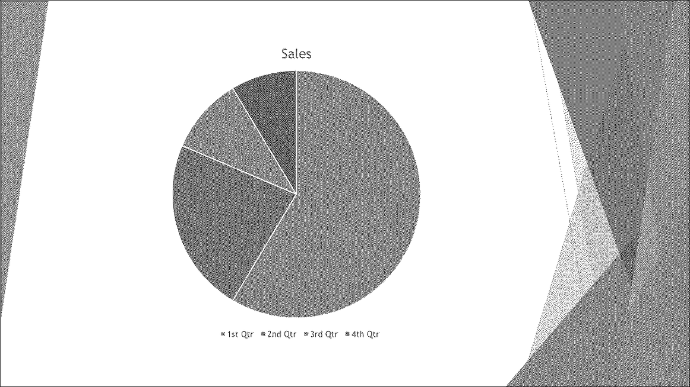

## **簡介**

TIFF（**Tagged Image File Format**）是一種廣泛使用的無損點陣圖像格式，以其卓越的品質和圖形的細緻保存而聞名。設計師、攝影師以及桌面出版人員通常選擇 TIFF，以保留圖像中的圖層、色彩準確度和原始設定。

使用 Aspose.Slides，您可以輕鬆地將 PowerPoint 投影片（PPT、PPTX）和 OpenDocument 投影片（ODP）直接轉換為高品質的 TIFF 圖像，確保您的簡報保留最高的視覺真實度。 

## **將簡報轉換為 TIFF**

使用由 [Presentation](https://reference.aspose.com/slides/zh-hant/java/com.aspose.slides/presentation/) 類別提供的 [save](https://reference.aspose.com/slides/zh-hant/java/com.aspose.slides/presentation/#save-java.lang.String-int-) 方法，您可以迅速將整個 PowerPoint 簡報轉換為 TIFF。產生的 TIFF 圖像對應於預設的投影片大小。

以下程式碼示範如何將 PowerPoint 簡報轉換為 TIFF：

```java
// 實例化代表簡報檔案（PPT、PPTX、ODP 等）的 Presentation 類別。
Presentation presentation = new Presentation("presentation.pptx");
try {
    // 將簡報儲存為 TIFF。
    presentation.save("output.tiff", SaveFormat.Tiff);
} finally {
    presentation.dispose();
}
```

## **將簡報轉換為黑白 TIFF**

在 [TiffOptions](https://reference.aspose.com/slides/zh-hant/java/com.aspose.slides/tiffoptions/) 類別中的 [setBwConversionMode](https://reference.aspose.com/slides/zh-hant/java/com.aspose.slides/tiffoptions/#setBwConversionMode-int-) 方法允許您指定在將彩色投影片或圖像轉換為黑白 TIFF 時所使用的演算法。請注意，僅當 [setCompressionType](https://reference.aspose.com/slides/zh-hant/java/com.aspose.slides/tiffoptions/#setCompressionType-int-) 方法設為 `CCITT4` 或 `CCITT3` 時，此設定才會生效。

假設我們有一個名為「sample.pptx」的檔案，其包含以下投影片：


以下程式碼示範如何將彩色投影片轉換為黑白 TIFF：

```java
TiffOptions tiffOptions = new TiffOptions();
tiffOptions.setCompressionType(TiffCompressionTypes.CCITT4);
tiffOptions.setBwConversionMode(BlackWhiteConversionMode.Dithering);

Presentation presentation = new Presentation("sample.pptx");
try {
    presentation.save("output.tiff", SaveFormat.Tiff, tiffOptions);
} finally {
    presentation.dispose();
}
```

結果：



## **將簡報轉換為自訂尺寸的 TIFF**

如果您需要特定尺寸的 TIFF 圖像，您可以使用 [TiffOptions](https://reference.aspose.com/slides/zh-hant/java/com.aspose.slides/tiffoptions/) 中提供的方法設定所需的值。例如， [setImageSize](https://reference.aspose.com/slides/zh-hant/java/com.aspose.slides/tiffoptions/#setImageSize-java.awt.Dimension-) 方法允許您定義產生圖像的大小。

以下程式碼示範如何將 PowerPoint 簡報轉換為具有自訂尺寸的 TIFF 圖像：

```java
// 實例化代表簡報檔案（PPT、PPTX、ODP 等）的 Presentation 類別。
Presentation presentation = new Presentation("presentation.pptx");
try {
    TiffOptions tiffOptions = new TiffOptions();

    // 設定壓縮類型。
    tiffOptions.setCompressionType(TiffCompressionTypes.Default);
    /*
    壓縮類型：
        Default - 指定預設的壓縮方案（LZW）。
        None - 指定無壓縮。
        CCITT3
        CCITT4
        LZW
        RLE
    */

    // 深度取決於壓縮類型，且無法手動設定。

    // 設定影像 DPI。
    tiffOptions.setDpiX(200);
    tiffOptions.setDpiY(200);

    // 設定影像尺寸。
    tiffOptions.setImageSize(new Dimension(1728, 1078));

    INotesCommentsLayoutingOptions notesOptions = new NotesCommentsLayoutingOptions();
    notesOptions.setNotesPosition(NotesPositions.BottomFull);
    tiffOptions.setSlidesLayoutOptions(notesOptions);

    // 以指定尺寸將簡報儲存為 TIFF。
    presentation.save("tiff-ImageSize.tiff", SaveFormat.Tiff, tiffOptions);
} finally {
    presentation.dispose();
}
```

## **將簡報轉換為具自訂像素格式的 TIFF**

使用 [TiffOptions](https://reference.aspose.com/slides/zh-hant/java/com.aspose.slides/tiffoptions/) 類別的 [setPixelFormat](https://reference.aspose.com/slides/zh-hant/java/com.aspose.slides/tiffoptions/#setPixelFormat-int-) 方法，您可以為產生的 TIFF 圖像指定首選的像素格式。

以下程式碼示範如何將 PowerPoint 簡報轉換為具自訂像素格式的 TIFF 圖像：

```java
// 實例化代表簡報檔案（PPT、PPTX、ODP 等）的 Presentation 類別。
Presentation presentation = new Presentation("presentation.pptx");
try {
    TiffOptions tiffOptions = new TiffOptions();

    tiffOptions.setPixelFormat(ImagePixelFormat.Format8bppIndexed);
    /*
    ImagePixelFormat 具有以下值（如文件所述）：
        Format1bppIndexed - 每像素 1 位，索引色。
        Format4bppIndexed - 每像素 4 位，索引色。
        Format8bppIndexed - 每像素 8 位，索引色。
        Format24bppRgb    - 每像素 24 位，RGB。
        Format32bppArgb   - 每像素 32 位，ARGB。
    */
    
    // 以指定的影像尺寸將簡報儲存為 TIFF。
    presentation.save("Tiff-PixelFormat.tiff", SaveFormat.Tiff, tiffOptions);
} finally {
    presentation.dispose();
}
```

{}
查看 Aspose 的 [FREE PowerPoint to Poster converter](https://products.aspose.app/slides/zh-hant/conversion/convert-ppt-to-poster-online)。
{}

## **常見問題**

**我可以將單一投影片而非整個 PowerPoint 簡報轉換為 TIFF 嗎？**

可以。Aspose.Slides 允許您將 PowerPoint 與 OpenDocument 簡報中的單一投影片分別轉換為 TIFF 圖像。

**在將簡報轉換為 TIFF 時，投影片的數量有任何限制嗎？**

沒有，Aspose.Slides 不會對投影片數量設置任何限制。您可以將任何大小的簡報轉換為 TIFF 格式。

**在將投影片轉換為 TIFF 時，PowerPoint 的動畫和過渡效果會被保留嗎？**

不會，TIFF 是一種靜態影像格式。因此，動畫和過渡效果不會被保留；僅會匯出投影片的靜態快照。