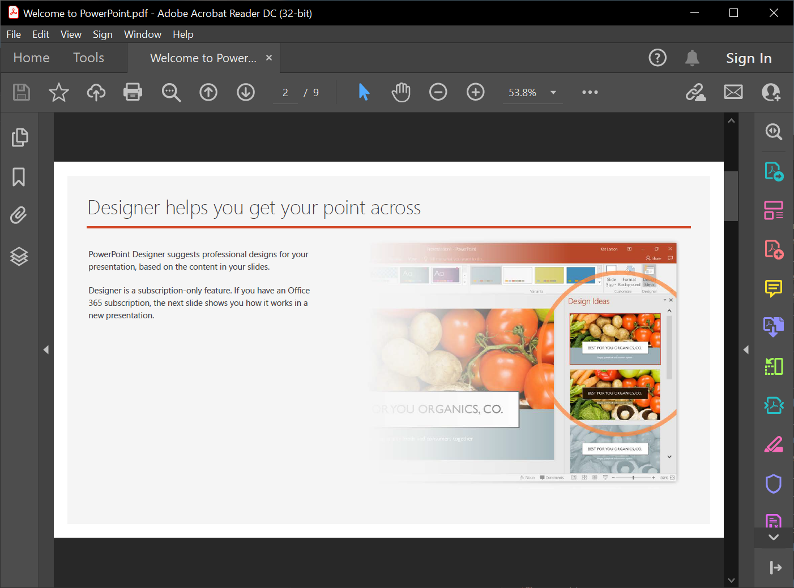

## **簡介**

使用 Aspose.Slides，您可以從其他格式的檔案匯入簡報。Aspose.Slides 提供 [SlideCollection](https://reference.aspose.com/slides/zh-hant/java/com.aspose.slides/slidecollection/) 類別，允許您從 PDF 和 HTML 文件匯入簡報。

## **從 PDF 匯入 PowerPoint**

在此情況下，您可以將 PDF 轉換為 PowerPoint 簡報。



1. 建立 [Presentation](https://reference.aspose.com/slides/zh-hant/java/com.aspose.slides/) 類別的實例。 
2. 呼叫 [addFromPdf()](https://reference.aspose.com/slides/zh-hant/java/com.aspose.slides/SlideCollection#addFromPdf-java.lang.String-) 方法並傳入 PDF 檔案。 
3. 使用 [save()](https://reference.aspose.com/slides/zh-hant/java/com.aspose.slides/Presentation#save-java.lang.String-int-) 方法將檔案儲存為 PowerPoint 格式。

此 Java 程式碼示範了 PDF 轉 PowerPoint 的操作：

```java
import com.aspose.slides.*;

Presentation pres = new Presentation();
try {
    pres.getSlides().addFromPdf("InputPDF.pdf");
    pres.save("OutputPresentation.pptx", SaveFormat.Pptx);
} finally {
    if (pres != null) pres.dispose();
}
```

{} 

您可以試用 **Aspose free** [PDF to PowerPoint](https://products.aspose.app/slides/zh-hant/import/pdf-to-powerpoint) 網路應用程式，因為它是此處描述流程的即時實作。 

{} 

## **從 HTML 匯入 PowerPoint**

在此情況下，您可以將 HTML 文件轉換為 PowerPoint 簡報。

1. 建立 [Presentation](https://reference.aspose.com/slides/zh-hant/java/com.aspose.slides/) 類別的實例。 
2. 呼叫 [addFromHtml()](https://reference.aspose.com/slides/zh-hant/java/com.aspose.slides/slidecollection/#addFromHtml-java.io.InputStream-) 方法並傳入含有 HTML 文件的串流。 
3. 使用 [save()](https://reference.aspose.com/slides/zh-hant/java/com.aspose.slides/Presentation#save-java.lang.String-int-) 方法將檔案儲存為 PowerPoint 格式。

此 Java 程式碼示範了 HTML 轉 PowerPoint 的操作： 

```java
import com.aspose.slides.*;
import java.io.FileInputStream;
import java.io.IOException;

Presentation presentation = new Presentation();
try {
    FileInputStream htmlStream = new FileInputStream("page.html");
    try {
        presentation.getSlides().addFromHtml(htmlStream);
    } finally {
        if (htmlStream != null) htmlStream.close();
    }

    presentation.save("MyPresentation.pptx", SaveFormat.Pptx);
} catch(IOException e) {
} finally {
    if (presentation != null) presentation.dispose();
}
```

## **常見問題**

### 匯入 PDF 時表格是否會被保留，且能否改善其偵測？

匯入過程中可以偵測表格；[PdfImportOptions](https://reference.aspose.com/slides/zh-hant/java/com.aspose.slides/pdfimportoptions/) 包含 [setDetectTables](https://reference.aspose.com/slides/zh-hant/java/com.aspose.slides/pdfimportoptions/#setDetectTables-boolean-) 方法，可啟用表格辨識。其效果取決於 PDF 的結構。

{} 

您亦可使用 Aspose.Slides 將 HTML 轉換為其他常見檔案格式：

* [HTML to image](https://products.aspose.com/slides/zh-hant/java/conversion/html-to-image/)
* [HTML to JPG](https://products.aspose.com/slides/zh-hant/java/conversion/html-to-jpg/)
* [HTML to XML](https://products.aspose.com/slides/zh-hant/java/conversion/html-to-xml/)
* [HTML to TIFF](https://products.aspose.com/slides/zh-hant/java/conversion/html-to-tiff/)

{}