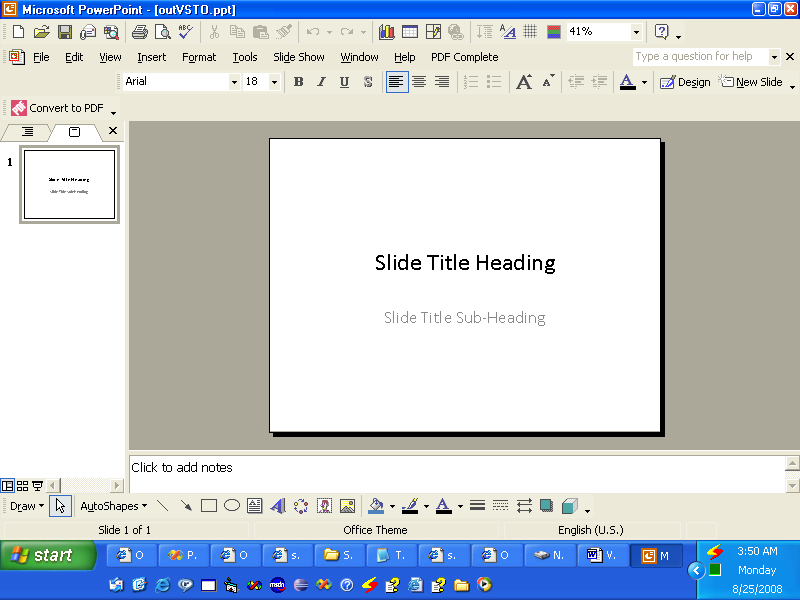

{} 

VSTO 是為了讓開發人員建立可在 Microsoft Office 中執行的應用程式而開發的。VSTO 基於 COM，但它被封裝在 .NET 物件中，以便在 .NET 應用程式中使用。VSTO 需要 .NET Framework 的支援以及 Microsoft Office 基於 CLR 的執行環境。雖然它可用於製作 Microsoft Office 外掛程式，但幾乎不可能作為伺服器端元件使用。它也存在嚴重的部署問題。

Aspose.Slides for Java 是一個可用於操作 Microsoft PowerPoint 簡報的元件，功能類似於 VSTO，但具有多項優勢：

- Aspose.Slides 僅包含受管理的程式碼，且不需要安裝 Microsoft Office 執行環境。
- 它可作為客戶端元件或伺服器端元件使用。
- 部署簡單，因為 Aspose.Slides 只在單一的 jar 檔案中。

{} 
## **建立簡報**
以下是兩個程式碼範例，說明如何使用 VSTO 與 Aspose.Slides for Java 來達成相同的目標。第一個範例是[VSTO](/slides/zh-hant/java/create-a-new-presentation/);[第二個範例](/slides/zh-hant/java/create-a-new-presentation/) 使用 Aspose.Slides。
### **VSTO 範例**
**VSTO 的輸出** 


### **Aspose.Slides for Java 範例**
**Aspose.Slides 的輸出** 

