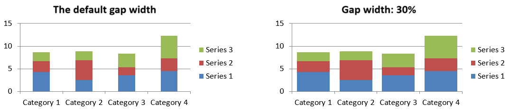

## **概觀**

圖表將其繪製的資料儲存在圖表資料工作簿中。 [IChartSeries](https://reference.aspose.com/slides/zh-hant/java/com.aspose.slides/ichartseries/) 代表一組相關的值，系列中的每個 [IChartDataPoint](https://reference.aspose.com/slides/zh-hant/java/com.aspose.slides/ichartdatapoint/) 會參照一個或多個工作簿儲存格。 [IChartCategory](https://reference.aspose.com/slides/zh-hant/java/com.aspose.slides/ichartcategory/) 物件提供系列共用的標籤或分組值。系列名稱、類別以及資料點值因此會連結到 [IChartDataCell](https://reference.aspose.com/slides/zh-hant/java/com.aspose.slides/ichartdatacell/) 物件，而不僅僅是以顯示文字的形式儲存。

對於一般的類別圖表，預設工作簿使用第 0 列儲存系列名稱，第 0 欄儲存類別名稱，其餘儲存格則存放系列值。傳遞給 [IChartDataWorkbook.getCell](https://reference.aspose.com/slides/zh-hant/java/com.aspose.slides/ichartdataworkbook/#getCell-int-int-int-) 的工作表、列與欄索引皆為零基。此佈局在您使用預設資料建立圖表時很有用，但請勿假設每個既有圖表皆採用此布局。對於已載入的簡報，請在變更工作簿值之前先檢查系列、類別與資料點所參照的儲存格。

圖表設定有三種不同的範圍：

- 系列層級設定，例如 [IChartSeries.getFormat](https://reference.aspose.com/slides/zh-hant/java/com.aspose.slides/ichartseries/#getFormat--)，提供整個系列所有資料點的預設外觀。
- 資料點層級設定，例如 [IChartDataPoint.getFormat](https://reference.aspose.com/slides/zh-hant/java/com.aspose.slides/ichartdatapoint/#getFormat--)，會覆寫該點的系列外觀。
- 群組設定套用於屬於同一個 [IChartSeriesGroup](https://reference.aspose.com/slides/zh-hant/java/com.aspose.slides/ichartseriesgroup/) 的相容系列。當需要設定重疊或間隙寬度等選項時，請透過 [IChartSeries.getParentSeriesGroup](https://reference.aspose.com/slides/zh-hant/java/com.aspose.slides/ichartseries/#getParentSeriesGroup--) 取得群組。

當未明確設定資料點或系列的填色時，圖表樣式與佈景主題會決定自動外觀。當同時存在系列與資料點的格式設定時，資料點的格式優先套用於該點。


## **設定圖表系列重疊**

[IChartSeries.getOverlap](https://reference.aspose.com/slides/zh-hant/java/com.aspose.slides/ichartseries/#getOverlap--) 會回報 2D 圖表中長條或柱狀的重疊程度，範圍為 -100% 到 100%。它是父系列群組設定的唯讀投影。使用 [IChartSeriesGroup.setOverlap](https://reference.aspose.com/slides/zh-hant/java/com.aspose.slides/ichartseriesgroup/#setOverlap-byte-) 來更新該群組中所有相容的系列。此選項僅適用於顯示分組長條或柱狀的圖表類型；不會影響組合圖表中與之無關的系列群組。

以下範例設定包含第一個系列的群組的重疊：

```java
import com.aspose.slides.*;

final int firstSlideIndex = 0;
final int firstSeriesIndex = 0;
final byte overlapPercent = 30;

Presentation presentation = new Presentation();
try {
    ISlide slide = presentation.getSlides().get_Item(firstSlideIndex);

    // 新圖表包含範例系列、類別和數值。
    IChart chart = slide.getShapes().addChart(ChartType.ClusteredColumn, 20, 20, 500, 200);

    IChartSeries series = chart.getChartData().getSeries().get_Item(firstSeriesIndex);
    series.getParentSeriesGroup().setOverlap(overlapPercent);

    presentation.save("series_overlap.pptx", SaveFormat.Pptx);
} finally {
    presentation.dispose();
}
```

結果：


## **變更系列填色**

使用 [IChartSeries.getFormat](https://reference.aspose.com/slides/zh-hant/java/com.aspose.slides/ichartseries/#getFormat--) 來設定整個系列的預設填色。如果資料點已具明確的填色，其 [IChartDataPoint.getFormat](https://reference.aspose.com/slides/zh-hant/java/com.aspose.slides/ichartdatapoint/#getFormat--) 設定會覆寫該點的系列填色。

以下範例將第一個系列套用實心藍色填色：

```java
import com.aspose.slides.*;
import java.awt.Color;

final int firstSlideIndex = 0;
final int firstSeriesIndex = 0;

Presentation presentation = new Presentation();
try {
    ISlide slide = presentation.getSlides().get_Item(firstSlideIndex);

    IChart chart = slide.getShapes().addChart(ChartType.ClusteredColumn, 20, 20, 500, 200);

    IChartSeries series = chart.getChartData().getSeries().get_Item(firstSeriesIndex);
    series.getFormat().getFill().setFillType(FillType.Solid);
    series.getFormat().getFill().getSolidFillColor().setColor(Color.BLUE);

    presentation.save("series_color.pptx", SaveFormat.Pptx);
} finally {
    presentation.dispose();
}
```

結果：


## **變更系列名稱**

系列名稱儲存在圖表資料工作簿中，通常顯示於圖例。預設建立的叢集柱狀圖工作簿中，儲存格 B1 位於第 0 列第 1 欄，內含第一個系列的名稱。下列範例中的具名常數將此結構明確化：

```java
import com.aspose.slides.*;

final int firstSlideIndex = 0;
final int worksheetIndex = 0;
final int seriesNameRowIndex = 0;
final int firstSeriesColumnIndex = 1;

Presentation presentation = new Presentation();
try {
    ISlide slide = presentation.getSlides().get_Item(firstSlideIndex);

    IChart chart = slide.getShapes().addChart(ChartType.ClusteredColumn, 20, 20, 500, 200);

    IChartDataWorkbook workbook = chart.getChartData().getChartDataWorkbook();
    IChartDataCell seriesNameCell = workbook.getCell(worksheetIndex, seriesNameRowIndex, firstSeriesColumnIndex);
    seriesNameCell.setValue("Revenue");

    presentation.save("series_name.pptx", SaveFormat.Pptx);
} finally {
    presentation.dispose();
}
```

您亦可直接更新由 [IChartSeries.getName](https://reference.aspose.com/slides/zh-hant/java/com.aspose.slides/ichartseries/#getName--) 參照的儲存格。此作法避免對既有圖表假設特定的列與欄：

```java
import com.aspose.slides.*;

final int firstSlideIndex = 0;
final int firstSeriesIndex = 0;
final int firstNameCellIndex = 0;

Presentation presentation = new Presentation();
try {
    ISlide slide = presentation.getSlides().get_Item(firstSlideIndex);

    IChart chart = slide.getShapes().addChart(ChartType.ClusteredColumn, 20, 20, 500, 200);

    IChartSeries series = chart.getChartData().getSeries().get_Item(firstSeriesIndex);
    IChartDataCell seriesNameCell = series.getName().getAsCells().get_Item(firstNameCellIndex);
    seriesNameCell.setValue("Revenue");

    presentation.save("series_name.pptx", SaveFormat.Pptx);
} finally {
    presentation.dispose();
}
```

結果：


## **取得自動系列填色**

[IChartSeries.getAutomaticSeriesColor](https://reference.aspose.com/slides/zh-hant/java/com.aspose.slides/ichartseries/#getAutomaticSeriesColor--) 會回傳依系列索引與圖表樣式計算出的顏色。此為未明確定義系列填色時所使用的顏色。呼叫此方法只會讀取計算出的顏色；不會指派新的填色。

以下範例列印每個預設系列的自動顏色：

```java
import com.aspose.slides.*;
import java.awt.Color;

final int firstSlideIndex = 0;

Presentation presentation = new Presentation();
try {
    ISlide slide = presentation.getSlides().get_Item(firstSlideIndex);

    IChart chart = slide.getShapes().addChart(ChartType.ClusteredColumn, 20, 20, 500, 200);

    int seriesCount = chart.getChartData().getSeries().size();
    for (int seriesIndex = 0; seriesIndex < seriesCount; seriesIndex++) {
        IChartSeries series = chart.getChartData().getSeries().get_Item(seriesIndex);
        Color automaticColor = series.getAutomaticSeriesColor();
        System.out.println("Series " + seriesIndex + ": " + automaticColor);
    }
} finally {
    presentation.dispose();
}
```

預設圖表樣式的範例輸出：

```text
Series 0: java.awt.Color[r=79,g=129,b=189]
Series 1: java.awt.Color[r=192,g=80,b=77]
Series 2: java.awt.Color[r=155,g=187,b=89]
```

實際顏色取決於圖表樣式與佈景主題。

## **為圖表系列設定反轉填色**

對於長條、柱狀與泡泡系列，[IChartSeries.setInvertIfNegative](https://reference.aspose.com/slides/zh-hant/java/com.aspose.slides/ichartseries/#setInvertIfNegative-boolean-) 可在負值時使用不同的填色。先將系列填色設定為實心，啟用反轉，並透過 [IChartSeries.getInvertedSolidFillColor](https://reference.aspose.com/slides/zh-hant/java/com.aspose.slides/ichartseries/#getInvertedSolidFillColor--) 指定負值的顏色。負數在工作簿中仍保持不變，僅變更其顯示顏色。

以下範例將預設圖表資料取代為單一系列。工作表第 0 列儲存系列名稱，第 0 欄儲存類別名稱，第 1 欄儲存數值：

```java
import com.aspose.slides.*;
import java.awt.Color;

final int firstSlideIndex = 0;
final int worksheetIndex = 0;
final int headerRowIndex = 0;
final int categoryColumnIndex = 0;
final int firstSeriesColumnIndex = 1;
final int firstDataRowIndex = 1;

String[] categoryNames = { "Category 1", "Category 2", "Category 3" };
int[] seriesValues = { -20, 50, -30 };

Presentation presentation = new Presentation();
try {
    ISlide slide = presentation.getSlides().get_Item(firstSlideIndex);

    IChart chart = slide.getShapes().addChart(ChartType.ClusteredColumn, 20, 20, 500, 200);
    IChartData chartData = chart.getChartData();
    IChartDataWorkbook workbook = chartData.getChartDataWorkbook();

    chartData.getSeries().clear();
    chartData.getCategories().clear();

    IChartDataCell seriesNameCell = workbook.getCell(worksheetIndex, headerRowIndex, firstSeriesColumnIndex, "Series 1");
    int chartType = chart.getType();
    IChartSeries series = chartData.getSeries().add(seriesNameCell, chartType);

    for (int categoryIndex = 0; categoryIndex < categoryNames.length; categoryIndex++) {
        int dataRowIndex = firstDataRowIndex + categoryIndex;
        String categoryName = categoryNames[categoryIndex];
        int seriesValue = seriesValues[categoryIndex];

        IChartDataCell categoryCell = workbook.getCell(worksheetIndex, dataRowIndex, categoryColumnIndex, categoryName);
        chartData.getCategories().add(categoryCell);

        IChartDataCell valueCell = workbook.getCell(worksheetIndex, dataRowIndex, firstSeriesColumnIndex, seriesValue);
        series.getDataPoints().addDataPointForBarSeries(valueCell);
    }

    Color automaticSeriesColor = series.getAutomaticSeriesColor();
    series.getFormat().getFill().setFillType(FillType.Solid);
    series.getFormat().getFill().getSolidFillColor().setColor(automaticSeriesColor);
    series.setInvertIfNegative(true);
    series.getInvertedSolidFillColor().setColor(Color.RED);

    presentation.save("inverted_solid_fill_color.pptx", SaveFormat.Pptx);
} finally {
    presentation.dispose();
}
```

結果：


您也可以透過 [IChartDataPoint.setInvertIfNegative](https://reference.aspose.com/slides/zh-hant/java/com.aspose.slides/ichartdatapoint/#setInvertIfNegative-boolean-) 為單一資料點啟用反轉。下列範例中，系列的反轉功能被停用，僅在選取的資料點上啟用，且該點同時被指派負值以便看見效果：

```java
import com.aspose.slides.*;
import java.awt.Color;

final int firstSlideIndex = 0;
final int firstSeriesIndex = 0;
final int targetDataPointIndex = 2;
final int negativeValue = -30;

Presentation presentation = new Presentation();
try {
    ISlide slide = presentation.getSlides().get_Item(firstSlideIndex);

    IChart chart = slide.getShapes().addChart(ChartType.ClusteredColumn, 20, 20, 500, 200);

    IChartSeries series = chart.getChartData().getSeries().get_Item(firstSeriesIndex);
    Color automaticSeriesColor = series.getAutomaticSeriesColor();
    series.getFormat().getFill().setFillType(FillType.Solid);
    series.getFormat().getFill().getSolidFillColor().setColor(automaticSeriesColor);
    series.getInvertedSolidFillColor().setColor(Color.RED);
    series.setInvertIfNegative(false);

    IChartDataPoint dataPoint = series.getDataPoints().get_Item(targetDataPointIndex);
    dataPoint.getValue().getAsCell().setValue(negativeValue);
    dataPoint.setInvertIfNegative(true);

    presentation.save("data_point_invert_color_if_negative.pptx", SaveFormat.Pptx);
} finally {
    presentation.dispose();
}
```

## **清除特定資料點的值**

若要使單一資料點變為空白而不移除其他點，將其對應的工作簿儲存格設為 `null`。對於柱狀圖，可透過 [IChartDataPoint.getValue](https://reference.aspose.com/slides/zh-hant/java/com.aspose.slides/ichartdatapoint/#getValue--) 取得繪製的數值。資料點仍保留於相同的類別位置，但圖表會依據空白值設定將其視為空白。

以下範例僅清除第一個系列的第二個資料點：

```java
import com.aspose.slides.*;

final int firstSlideIndex = 0;
final int firstSeriesIndex = 0;
final int targetDataPointIndex = 1;

Presentation presentation = new Presentation();
try {
    ISlide slide = presentation.getSlides().get_Item(firstSlideIndex);

    IChart chart = slide.getShapes().addChart(ChartType.ClusteredColumn, 20, 20, 500, 200);

    IChartSeries series = chart.getChartData().getSeries().get_Item(firstSeriesIndex);
    IChartDataPoint dataPoint = series.getDataPoints().get_Item(targetDataPointIndex);
    dataPoint.getValue().getAsCell().setValue(null);

    presentation.save("clear_data_point_value.pptx", SaveFormat.Pptx);
} finally {
    presentation.dispose();
}
```

散佈圖使用分別的 X 與 Y 儲存格，泡泡圖亦使用大小儲存格。僅清除代表欲移除之數值的儲存格。若要保留其他資料點，請勿呼叫 [IChartDataPointCollection.clear](https://reference.aspose.com/slides/zh-hant/java/com.aspose.slides/ichartdatapointcollection/#clear--)；該方法會移除集合中的所有資料點。

## **設定系列間隙寬度**

間隙寬度是相鄰長條或柱狀叢集之間的空間，表示為長條或柱狀寬度的百分比。與重疊相同，它屬於父系列群組而非單一系列。對該群組呼叫一次 [IChartSeriesGroup.setGapWidth](https://reference.aspose.com/slides/zh-hant/java/com.aspose.slides/ichartseriesgroup/#setGapWidth-int-) 即可。較大的數值會在叢集之間產生更多空間，較小的數值則使叢集更緊密。

以下範例變更間隙寬度，並僅儲存最終的簡報：

```java
import com.aspose.slides.*;

final int firstSlideIndex = 0;
final int firstSeriesIndex = 0;
final int gapWidthPercent = 30;

Presentation presentation = new Presentation();
try {
    ISlide slide = presentation.getSlides().get_Item(firstSlideIndex);

    IChart chart = slide.getShapes().addChart(ChartType.StackedColumn, 20, 20, 500, 200);

    IChartSeries series = chart.getChartData().getSeries().get_Item(firstSeriesIndex);
    series.getParentSeriesGroup().setGapWidth(gapWidthPercent);

    presentation.save("gap_width_30.pptx", SaveFormat.Pptx);
} finally {
    presentation.dispose();
}
```

結果：



## **常見問題集**

**哪些圖表類型支援資料系列？**

所有由 [ChartType](https://reference.aspose.com/slides/zh-hant/java/com.aspose.slides/charttype/) 列舉表示的圖表類型皆使用圖表資料，但其系列並未全部具有相同的值結構或設定。例如，類別圖表使用類別與數值，散佈圖使用 X 與 Y 值，泡泡圖則額外加入泡泡大小。請使用與系列類型相符的資料點建立方法。重疊與間隙寬度等選項僅適用於相容的長條或柱狀群組。

**什麼是圖表系列群組？**

[IChartSeriesGroup](https://reference.aspose.com/slides/zh-hant/java/com.aspose.slides/ichartseriesgroup/) 包含共享群組層級繪圖設定的相容系列。組合圖表可以包含多個群組，因此透過單一系列取得的群組變更不一定會影響圖表中的所有系列。

**新建立的圖表會包含預設資料嗎？**

會。預設情況下，[IShapeCollection.addChart](https://reference.aspose.com/slides/zh-hant/java/com.aspose.slides/ishapecollection/#addChart-int-float-float-float-float-) 會建立示範系列、類別與數值。您可以編輯這些儲存格，或在加入完全自訂的資料集之前先清除系列與類別集合。也有其他重載可建立不含預設資料的圖表。

**圖表物件如何與工作簿儲存格連結？**

系列名稱、類別標籤與資料點值皆參照 [IChartDataWorkbook](https://reference.aspose.com/slides/zh-hant/java/com.aspose.slides/ichartdataworkbook/) 中的儲存格。變更參照的儲存格會更新對應的圖表元素。建立自訂資料時，請保持類別列與系列數值列對齊，以確保每個資料點繪製在正確的類別下。

**如何只清除單一資料點而非整個系列？**

將相關的數值儲存格設為 `null`，即可保留該點的類別位置作為空白點。僅在確實要移除該系列所有資料點時才使用 [IChartDataPointCollection.clear](https://reference.aspose.com/slides/zh-hant/java/com.aspose.slides/ichartdatapointcollection/#clear--)。若同時移除類別，請更新所有系列，使其數值仍與類別集合保持對齊。

**空白點會如何顯示？**

顯示結果取決於圖表類型以及透過 [IChart.setDisplayBlanksAs](https://reference.aspose.com/slides/zh-hant/java/com.aspose.slides/ichart/#setDisplayBlanksAs-int-) 所設定的行為。支援的圖表可將空白顯示為間隙、零值，或以連接相鄰點的方式呈現。請選擇與簡報中遺失資料意涵相符的設定。

**負值會如何格式化？**

對於支援的長條、柱狀與泡泡系列，請呼叫 [IChartSeries.setInvertIfNegative](https://reference.aspose.com/slides/zh-hant/java/com.aspose.slides/ichartseries/#setInvertIfNegative-boolean-)，並設定透過 [IChartSeries.getInvertedSolidFillColor](https://reference.aspose.com/slides/zh-hant/java/com.aspose.slides/ichartseries/#getInvertedSolidFillColor--) 取得的顏色。您也可以使用 [IChartDataPoint.setInvertIfNegative](https://reference.aspose.com/slides/zh-hant/java/com.aspose.slides/ichartdatapoint/#setInvertIfNegative-boolean-) 為個別資料點覆寫此行為。這些方法僅影響格式，並不改變儲存的數值。

**當系列與資料點同時設定格式時，哪個會生效？**

資料點的明確格式會優先套用於該點。其他資料點仍會使用系列的明確格式，若系列未定義格式，則使用自動圖表樣式與佈景主題。群組設定（如重疊與間隙寬度）控制版面配置，並不屬於資料點層級的格式覆寫。

**圖表可容納的系列數量有上限嗎？**

Aspose.Slides 本身未設定固定的系列數量上限。實務上，簡報檔案的限制、可用記憶體、繪製時間以及圖表可讀性會決定實際可接受的上限。

**當柱狀圖的間距過近或過遠時，應該怎麼調整？**

對適當的父系列群組呼叫 [IChartSeriesGroup.setGapWidth](https://reference.aspose.com/slides/zh-hant/java/com.aspose.slides/ichartseriesgroup/#setGapWidth-int-)。增加數值可擴大叢集之間的間距，減少數值則使叢集更靠近。