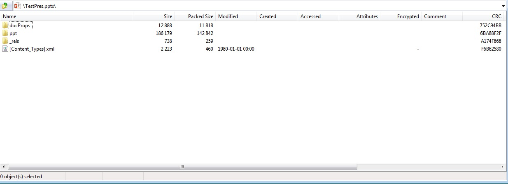

{}

這是一個歷史頁面，保留供現有連結使用。它並未描述 Aspose.Slides for Java 的目前版本。欲了解 Aspose.Slides for Java 載入、匯入、儲存與轉譯的格式，以及每種格式的 API，請參閱[支援的檔案格式](/slides/zh-hant/java/supported-file-formats/)。若要比較 PPTX 與 PPT，請參閱[了解差異：PPT 與 PPTX](/slides/zh-hant/java/ppt-vs-pptx/)。

{}

{}

PresentationML 是一組用於簡報文件的 XML 為基礎格式的名稱。Office OpenXML（OOXML）是 Microsoft Office 2007 應用程式所引入的 XML 為基礎格式。Office OpenXML 是多種專門的 XML 為基礎標記語言的容器格式。PresentationML 是 Microsoft Office PowerPoint 2007 用於儲存文件的標記語言。

{}

## **Aspose.Slides for Java 中的 PresentationML**
OOXML PresentationML 文件以 PPTX 檔案的形式存在，為遵循[OOXML ECMA-376](https://ecma-international.org/publications-and-standards/standards/ecma-376/)規範的壓縮 XML 套件。Aspose.Slides for Java 完全支援建立、讀取、操作與寫入 PresentationML 文件。此外，Aspose.Slides for Java 能將 PresentationML 文件匯出為廣泛使用的文件格式，例如 PDF。之所以能夠如此，乃因 Aspose.Slides for Java 的設計目標即是全面處理簡報文件，而 PresentationML 基本上以壓縮 XML 套件的形式保存文件的內部結構。

**由 Aspose.Slides for Java 產生且在 Microsoft PowerPoint 中開啟的 PPTX 文件**


**在 ZIP 中檢視由 Aspose.Slides for Java 產生的相同 PPTX 文件**




## **PresentationML 是開放的，為何使用 Aspose.Slides for Java？**
由於 PresentationML 基於 XML，完全可以使用 XML 類別建立處理與產生 PresentationML 文件的應用程式，而無需依賴如 Aspose.Slides for Java 之類的第三方類別庫。然而，在處理 PresentationML 文件時，使用 Aspose.Slides for Java 相較於直接使用 XML 類別具有多項優勢。

OOXML 規範長達數千頁，若要正確處理 PresentationML 文件，必須花費大量時間與精力來理解此格式。相較之下，使用 Aspose.Slides for Java，只需透過類別及其方法與屬性即可執行在 XML 類別下看似複雜的操作。

某些 Aspose.Slides 所提供的功能，即使使用 XML 類別處理 PresentationML 文件也無法取得：

- 將 PPT 文件匯出為 PDF 格式。
- 將投影片轉換為 Java 框架支援的任何影像格式。
- 使用克隆功能自動從來源簡報複製母版。
- 對圖形套用保護。

以下是一個包含單一投影片、內含文字方塊且文字為「Hello World」的 PresentationML 文件範例。若使用 XML 類別讀取文字，必須編寫程式以從以下片段解析此簡單文字。Aspose.Slides 為您處理此事。

**XML**

``` xml
<?xml version="1.0" encoding="UTF-8" standalone="yes"?>
<p:sld xmlns:a="http://schemas.openxmlformats.org/drawingml/2006/main" xmlns:r="http://schemas.openxmlformats.org/officeDocument/2006/relationships" xmlns:p="http://schemas.openxmlformats.org/presentationml/2006/main">
  <p:cSld>
    <p:spTree>
      <p:nvGrpSpPr>
        <p:cNvPr id="1" name=""/>
        <p:cNvGrpSpPr/>
        <p:nvPr/>
      </p:nvGrpSpPr>
      <p:grpSpPr>
        <a:xfrm>
          <a:off x="0" y="0"/>
          <a:ext cx="0" cy="0"/>
          <a:chOff x="0" y="0"/>
          <a:chExt cx="0" cy="0"/>
        </a:xfrm></p:grpSpPr><p:sp>
          <p:nvSpPr><p:cNvPr id="4" name="TextBox 3"/>
          <p:cNvSpPr txBox="1"/>
            <p:nvPr/>
          </p:nvSpPr>
          <p:spPr>
            <a:xfrm>
              <a:off x="2819400" y="2590800"/>
              <a:ext cx="1297086" cy="369332"/>
            </a:xfrm>
            <a:prstGeom prst="rect">
              <a:avLst/>
            </a:prstGeom>
            <a:noFill/>
          </p:spPr>
          <p:txBody>
            <a:bodyPr wrap="none" rtlCol="0">
              <a:spAutoFit/>
            </a:bodyPr>
            <a:lstStyle/>
            <a:p>
              <a:r>
                <a:rPr lang="en-US"/>
                <a:t>Hello World
                </a:t>
              </a:r>
              <a:endParaRPr lang="en-US"/>
            </a:p>
          </p:txBody>
        </p:sp>
    </p:spTree>
  </p:cSld>
  <p:clrMapOvr>
    <a:masterClrMapping/>
  </p:clrMapOvr>
</p:sld>
```