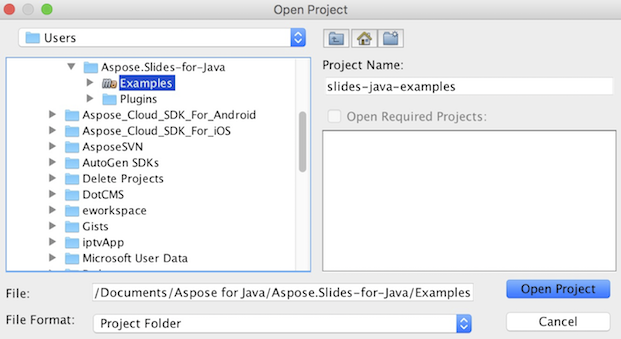

## **從 GitHub 下載 Aspose.Slides**
所有 Aspose.Slides for Java 的範例皆托管於 [GitHub](https://github.com/aspose-slides/Aspose.Slides-for-Java)。您可以使用喜愛的 GitHub 客戶端將儲存庫克隆，或從 [此處](https://codeload.github.com/aspose-slides/Aspose.Slides-for-Java/zip/master) 下載 ZIP 檔案。

將 ZIP 檔的內容解壓縮到電腦上任意資料夾。所有範例位於 **Examples** 資料夾中。


## **將範例匯入 IDE**
此專案使用 Maven 建置系統。任何現代化的 IDE 都能輕鬆開啟或匯入專案及其相依性。以下示範如何使用流行的 IDE 來建置與執行範例。

### **IntelliJ IDEA**
點擊 **File** 功能表，選取 **Open**。瀏覽至專案資料夾，並選擇 **pom.xml** 檔案。


它將開啟專案並自動下載相依性。從 Project 分頁中，瀏覽 **src/main/java** 資料夾內的範例。要執行範例，只需右鍵點擊該檔案並選取「Run ..」，範例將被執行，輸出會顯示於內建的主控台視窗。


### **Eclipse**
點擊 **File** 功能表，選取 **Import**。選擇 **Maven** - Existing Maven Projects。


瀏覽至您從 GitHub 克隆或下載的資料夾，並選擇 **pom.xml** 檔案。它將開啟專案並自動下載相依性。從 Package Explorer 分頁中，瀏覽 **src/main/java** 資料夾內的範例。要執行範例，只需右鍵點擊該檔案並選取 **Run As** - **Java Application**，範例將被執行，輸出會顯示於內建的主控台視窗。


### **NetBeans**
點擊 **File** 功能表，選取 **Open Project**。瀏覽至您從 GitHub 克隆或下載的資料夾。**Examples** 資料夾的圖示會顯示其為 Maven 專案。選取 Examples 並開啟。



它將開啟專案並自動下載相依性。從 Projects 分頁中，瀏覽 **source packages** 內的範例。要執行範例，只需右鍵點擊該檔案並選取 **Run File**，範例將被執行，輸出會顯示於內建的主控台視窗。


## **將 Aspose.Slides 函式庫加入 Maven 本機儲存庫**
當您將 **Aspose.Slides Examples** 專案匯入 IDE 時，Maven 會自動從 [Aspose Maven Repository](https://releases.aspose.com/java/repo/com/aspose/) 下載 aspose.slides JAR 檔。若無法連上網路，您可以手動將 JAR 加入本機儲存庫。

### **mvn install**
下載 [aspose.slides](https://releases.aspose.com/java/repo/com/aspose/aspose-slides/)，解壓縮後將 aspose.slides-version.jar 複製到其他位置，例如 C 槽。執行以下指令：

```
mvn install:install-file
    - Dfile=c:\aspose.slides-version.jar
    - DgroupId=com.aspose
    - DartifactId=aspose-slides
    - Dversion={version}
    - Dpackaging=jar
```

現在，**aspose.slides** JAR 已複製至您的 Maven 本機儲存庫。

### **pom.xml**
安裝完成後，只需在 pom.xml 中宣告 **aspose.slides** 的座標。於 repositories 標籤加入以下儲存庫，並在 dependencies 標籤加入相依性。

``` xml
<repository>
    <id>AsposeJavaAPI</id>
    <name>Aspose Java API</name>
    <url>https://releases.aspose.com/java/repo/</url>
</repository>

<dependency>
    <groupId>com.aspose</groupId>
    <artifactId>aspose-slides</artifactId>
    <version>25.12</version>
    <classifier>jdk16</classifier>
</dependency>
```

### **完成**
編譯專案後，**aspose.slides** JAR 即可從您的 Maven 本機儲存庫取得。

## **貢獻**
如果您想新增或改進範例，我們鼓勵您為專案貢獻。此儲存庫中的所有範例與示範專案皆為開源，可自由用於您的應用程式。

要貢獻，您可以 fork 此儲存庫、編輯原始碼，並提交 Pull Request。我們會審查變更，若有助於專案，將納入儲存庫。