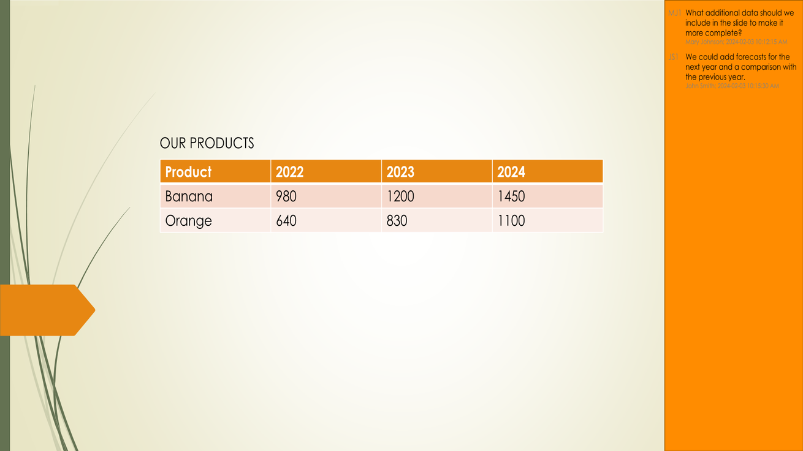

## **簡介**

將 PowerPoint 和 OpenDocument 簡報轉換為 JPG 圖像有助於分享投影片、優化效能，並將內容嵌入網站或應用程式。Aspose.Slides for .NET 允許您將 PPTX、PPT 和 ODP 檔案轉換為高品質的 JPEG 圖像。本指南說明了不同的轉換方法。

有了這些功能，您可以輕鬆實作自己的簡報檢視器，並為每張投影片建立縮圖。若您想防止投影片被複製或以唯讀模式展示簡報，這會非常有用。Aspose.Slides 允許您將整個簡報或特定投影片轉換成圖像格式。

## **將簡報投影片轉換為 JPG 圖像**

以下是將 PPT、PPTX 或 ODP 檔案轉換為 JPG 的步驟：

1. 建立 [Presentation](https://reference.aspose.com/slides/zh-hant/net/aspose.slides/presentation) 類別的實例。
2. 從 [Presentation.Slides](https://reference.aspose.com/slides/zh-hant/net/aspose.slides/presentation/properties/slides) 集合中取得 [ISlide](https://reference.aspose.com/slides/zh-hant/net/aspose.slides/islide) 類型的投影片物件。
3. 使用 [ISlide.GetImage(float, float)](https://reference.aspose.com/slides/zh-hant/net/aspose.slides/islide/getimage/#getimage_5) 方法建立投影片的圖像。
4. 對圖像物件呼叫 [IImage.Save(string, ImageFormat)](https://reference.aspose.com/slides/zh-hant/net/aspose.slides/iimage/save/#save_3) 方法，並傳入輸出檔名與圖像格式作為參數。

{} 
**注意：** 在 Aspose.Slides .NET API 中，PPT、PPTX 或 ODP 轉換為 JPG 與轉換為其他格式的方式不同。對於其他格式，通常使用 [IPresentation.Save(String, SaveFormat, ISaveOptions)](https://reference.aspose.com/slides/zh-hant/net/aspose.slides/ipresentation/save/#save_5) 方法。然而，對於 JPG 轉換，必須使用 [IImage.Save(string, ImageFormat)](https://reference.aspose.com/slides/zh-hant/net/aspose.slides/iimage/save/#save_3) 方法。
{} 

```c#
using Aspose.Slides;

int scaleX = 1;
int scaleY = scaleX;

using (Presentation presentation = new Presentation("PowerPoint_Presentation.ppt"))
{
    foreach (ISlide slide in presentation.Slides)
    {
        // 建立指定比例的投影片圖像。
        using (IImage thumbnail = slide.GetImage(scaleX, scaleY))
        {
            // 將圖像以 JPEG 格式儲存至磁碟。
            string imageFileName = $"Slide_{slide.SlideNumber}.jpg";
            thumbnail.Save(imageFileName, ImageFormat.Jpeg);
        }
    }
}
```

## **使用自訂尺寸將投影片轉換為 JPG**

若要變更產生的 JPG 圖像尺寸，可透過將尺寸傳入 [ISlide.GetImage(Size)](https://reference.aspose.com/slides/zh-hant/net/aspose.slides/islide/getimage/#getimage_6) 方法來設定圖像大小。如此即可產生具備特定寬度和高度的圖像，確保輸出符合您對解析度與長寬比的需求。此彈性在為 Web 應用程式、報告或文件產生圖像時特別有用，因為這些情況常需要精確的圖像尺寸。

```c#
using System.Drawing;
using Aspose.Slides;

Size imageSize = new Size(1200, 800);

using (Presentation presentation = new Presentation("PowerPoint_Presentation.pptx"))
{
    foreach (ISlide slide in presentation.Slides)
    {
        // 建立指定大小的投影片圖像。
        using (IImage thumbnail = slide.GetImage(imageSize))
        {
            // 將圖像以 JPEG 格式儲存至磁碟。
            string imageFileName = $"Slide_{slide.SlideNumber}.jpg";
            thumbnail.Save(imageFileName, ImageFormat.Jpeg);
        }
    }
}
```

## **在將投影片另存為圖像時呈現註解**

Aspose.Slides for .NET 提供一項功能，允許您在將簡報投影片轉換為 JPG 圖像時呈現註解。此功能對於保留協作者在 PowerPoint 簡報中加入的標註、回饋或討論特別有用。啟用此選項後，註解會顯示在產生的圖像中，讓您在不必開啟原始簡報檔的情況下即可檢視與分享回饋。

假設我們有一個簡報檔案「sample.pptx」，其中有投影片包含註解：


以下 C# 程式碼會在保留註解的同時將投影片轉換為 JPG 圖像：

```c#
using System.Drawing;
using Aspose.Slides;
using Aspose.Slides.Export;

int scaleX = 2;
int scaleY = scaleX;

using (Presentation presentation = new Presentation("sample.pptx"))
{
    IRenderingOptions options = new RenderingOptions
    {
        // 設定投影片註解的選項。
        SlidesLayoutOptions = new NotesCommentsLayoutingOptions
        {
            CommentsPosition = CommentsPositions.Right,
            CommentsAreaWidth = 200,
            CommentsAreaColor = Color.DarkOrange                  
        }
    };

    // 將第一張投影片轉換為圖像。
    using (IImage image = presentation.Slides[0].GetImage(options, scaleX, scaleY))
    {
        image.Save("Slide_1.jpg", ImageFormat.Jpeg);
    }
}
```

結果：



## **另請參閱**

請參考其他將 PPT、PPTX 或 ODP 轉換成圖像的選項，例如：

- [將 PowerPoint 轉換為 GIF](/slides/zh-hant/net/convert-powerpoint-to-animated-gif/)
- [將 PowerPoint 轉換為 PNG](/slides/zh-hant/net/convert-powerpoint-to-png/)
- [將 PowerPoint 轉換為 TIFF](/slides/zh-hant/net/convert-powerpoint-to-tiff/)
- [將 PowerPoint 轉換為 SVG](/slides/zh-hant/net/render-a-slide-as-an-svg-image/)

{} 
若要了解 Aspose.Slides 如何將 PowerPoint 轉換為 JPG 圖像，請試用以下免費線上轉換器：PowerPoint [PPTX to JPG](https://products.aspose.app/slides/zh-hant/conversion/pptx-to-jpg) 與 [PPT to JPG](https://products.aspose.app/slides/zh-hant/conversion/ppt-to-jpg)。 
{} 


{}

Aspose 提供一個 [免費 Collage 網頁應用程式](https://products.aspose.app/slides/zh-hant/collage)。使用此線上服務，您可以合併 [JPG to JPG](https://products.aspose.app/slides/zh-hant/collage/jpg) 或 PNG to PNG 圖像，建立 [photo grids](https://products.aspose.app/slides/zh-hant/collage/photo-grid)，等等。

使用本文所述的相同原理，您可以將圖像從一種格式轉換為另一種格式。欲了解更多資訊，請參閱以下頁面：轉換 [image to JPG](https://products.aspose.com/slides/zh-hant/net/conversion/image-to-jpg/)；轉換 [JPG to image](https://products.aspose.com/slides/zh-hant/net/conversion/jpg-to-image/)；轉換 [JPG to PNG](https://products.aspose.com/slides/zh-hant/net/conversion/jpg-to-png/)、轉換 [PNG to JPG](https://products.aspose.com/slides/zh-hant/net/conversion/png-to-jpg/)、轉換 [PNG to SVG](https://products.aspose.com/slides/zh-hant/net/conversion/png-to-svg/)、轉換 [SVG to PNG](https://products.aspose.com/slides/zh-hant/net/conversion/svg-to-png/)。
{}

## **常見問題**

### 此方法是否支援批次轉換？

是的，Aspose.Slides 允許在單一操作中將多張投影片批次轉換為 JPG。

### 轉換是否支援 SmartArt、圖表及其他複雜物件？

是的，Aspose.Slides 會呈現所有內容，包括 SmartArt、圖表、表格、圖形等。然而，與 PowerPoint 相比，渲染的精確度可能會略有差異，特別是在使用自訂或缺少的字型時。

### 處理的投影片數量是否有限制？

Aspose.Slides 本身不對您可處理的投影片數量設置嚴格限制。然而，處理大型簡報或高解析度圖像時，可能會遇到記憶體不足的錯誤。