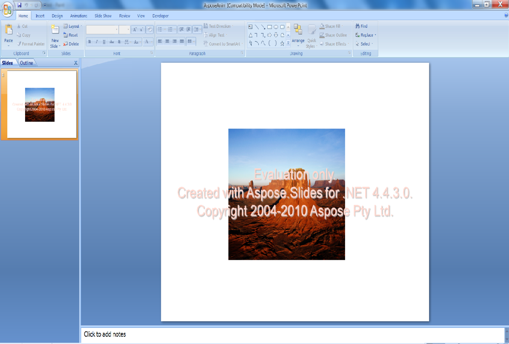

{} 

圖片框架可套用於 Microsoft PowerPoint 的形狀或影像，以在簡報中為影像加上框架。本文說明如何以程式方式建立圖片框架並套用動畫，首先使用 [VSTO 2008](/slides/zh-hant/net/adding-picture-frame-with-animation/) ，接著使用 [Aspose.Slides for .NET](/slides/zh-hant/net/adding-picture-frame-with-animation/)。首先，我們示範如何使用 VSTO 2008 套用框架與動畫。之後，我們示範如何使用 Aspose.Slides for .NET 執行相同步驟。

{} 
## **加入圖片框架與動畫**
以下程式碼範例會建立一份包含投影片的簡報、加入帶有圖片框架的影像，並對其套用動畫。
### **VSTO 2008 範例**
使用 VSTO 2008，請依照以下步驟：

1. 建立簡報。
1. 新增空白投影片。
1. 在投影片上加入圖片形狀。
1. 對圖片套用動畫。
1. 將簡報寫入磁碟。

**使用 VSTO 建立的輸出簡報** 


```c#
//建立空白簡報
PowerPoint.Presentation pres = Globals.ThisAddIn.Application.Presentations.Add(Microsoft.Office.Core.MsoTriState.msoFalse);

//新增空白投影片
PowerPoint.Slide sld = pres.Slides.Add(1, PowerPoint.PpSlideLayout.ppLayoutBlank);

//加入圖片框架
PowerPoint.Shape PicFrame = sld.Shapes.AddPicture(@"D:\Aspose Data\Desert.jpg",
Microsoft.Office.Core.MsoTriState.msoTriStateMixed,
Microsoft.Office.Core.MsoTriState.msoTriStateMixed, 150, 100, 400, 300);

//對圖片框架套用動畫
PicFrame.AnimationSettings.EntryEffect = Microsoft.Office.Interop.PowerPoint.PpEntryEffect.ppEffectBoxIn;

//儲存簡報
pres.SaveAs("d:\\ VSTOAnim.ppt", PowerPoint.PpSaveAsFileType.ppSaveAsPresentation,
Microsoft.Office.Core.MsoTriState.msoFalse);
```


### **Aspose.Slides for .NET 範例**
使用 Aspose.Slides for .NET，請執行以下步驟：

1. 建立簡報。
1. 存取第一張投影片。
1. 將影像加入圖片集合。
1. 在投影片上加入圖片形狀。
1. 對圖片套用動畫。
1. 將簡報寫入磁碟。

**使用 Aspose.Slides 建立的輸出簡報** 




```c#
using Aspose.Slides;
using Aspose.Slides.Animation;
using Aspose.Slides.Export;

// 建立空白簡報
using (Presentation pres = new Presentation())
{
    // 取得第一張投影片
    ISlide slide = pres.Slides[0];

    // 將影像新增至簡報的圖片集合
    IImage image = Images.FromFile("aspose.jpg");
    IPPImage ppImage = pres.Images.AddImage(image);
    image.Dispose();

    // 新增一個高度與寬度與影像相同的圖片框架
    IPictureFrame pictureFrame = slide.Shapes.AddPictureFrame(ShapeType.Rectangle, 50, 150, ppImage.Width, ppImage.Height, ppImage);

    // 取得投影片的主要動畫序列
    ISequence sequence = pres.Slides[0].Timeline.MainSequence;

    // 為圖片框架加入從左側飛入的動畫效果
    IEffect effect = sequence.AddEffect(pictureFrame, EffectType.Fly, EffectSubtype.Left, EffectTriggerType.OnClick);

    // 儲存簡報
    pres.Save("AsposeAnim.ppt", SaveFormat.Ppt);
}
```