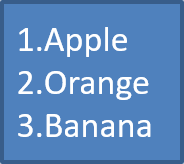

## **概覽**

Aspose.Slides for .NET 讓您能在 PowerPoint 和 OpenDocument 簡報中建立與格式化項目符號與編號清單。清單項目是一個段落，其項目符號設定透過段落格式控制。

使用 [IParagraph.ParagraphFormat](https://reference.aspose.com/slides/zh-hant/net/aspose.slides/iparagraph/paragraphformat/) 屬性來存取段落層級的清單設定。主要入口是 [IParagraphFormat.Bullet](https://reference.aspose.com/slides/zh-hant/net/aspose.slides/iparagraphformat/bullet/)，它會傳回一個 [IBulletFormat](https://reference.aspose.com/slides/zh-hant/net/aspose.slides/ibulletformat/) 物件。透過此物件，您可以設定項目符號類型、符號、圖片、顏色、大小、編號樣式與起始編號。

本文說明如何：

- 建立自訂符號的項目符號清單
- 建立圖片項目符號
- 透過設定段落深度建立多層次清單
- 建立編號清單
- 檢查及變更現有簡報中的清單格式

## **建立項目符號清單**

若要建立項目符號清單，將 [IParagraph](https://reference.aspose.com/slides/zh-hant/net/aspose.slides/iparagraph/) 物件新增至 [ITextFrame](https://reference.aspose.com/slides/zh-hant/net/aspose.slides/itextframe/)，並將 [IBulletFormat.Type](https://reference.aspose.com/slides/zh-hant/net/aspose.slides/ibulletformat/type/) 設為 [BulletType.Symbol](https://reference.aspose.com/slides/zh-hant/net/aspose.slides/bullettype/)。之後，您可以設定 [IBulletFormat.Char](https://reference.aspose.com/slides/zh-hant/net/aspose.slides/ibulletformat/char/)、[IBulletFormat.Color](https://reference.aspose.com/slides/zh-hant/net/aspose.slides/ibulletformat/color/)、以及 [IBulletFormat.Height](https://reference.aspose.com/slides/zh-hant/net/aspose.slides/ibulletformat/height/) 以控制項目符號的外觀。

以下 C# 程式碼示範如何在投影片中建立項目符號清單：

```csharp
using System.Drawing;
using Aspose.Slides;
using Aspose.Slides.Export;

static Paragraph CreateParagraph(string text)
{
    var paragraph = new Paragraph();
    paragraph.ParagraphFormat.Bullet.Type = BulletType.Symbol;
    paragraph.ParagraphFormat.Bullet.Char = '*';
    paragraph.ParagraphFormat.Indent = 15;
    paragraph.ParagraphFormat.Bullet.IsBulletHardColor = NullableBool.True;
    paragraph.ParagraphFormat.Bullet.Color.Color = Color.IndianRed;
    paragraph.ParagraphFormat.Bullet.Height = 100;
    paragraph.Text = text;
    return paragraph;
}

using var presentation = new Presentation();

var slide = presentation.Slides[0];
var autoShape = slide.Shapes.AddAutoShape(ShapeType.Rectangle, 20, 20, 200, 50);

var textFrame = autoShape.TextFrame;
textFrame.Paragraphs.Clear();

var paragraph1 = CreateParagraph("The first paragraph");
textFrame.Paragraphs.Add(paragraph1);

var paragraph2 = CreateParagraph("The second paragraph");
textFrame.Paragraphs.Add(paragraph2);

presentation.Save("symbol_bullets.pptx", SaveFormat.Pptx);
```

結果：


## **建立編號清單**

當項目順序很重要時，請使用編號清單。將 [IBulletFormat.Type](https://reference.aspose.com/slides/zh-hant/net/aspose.slides/ibulletformat/type/) 設為 [BulletType.Numbered](https://reference.aspose.com/slides/zh-hant/net/aspose.slides/bullettype/)。您也可以使用 [IBulletFormat.NumberedBulletStyle](https://reference.aspose.com/slides/zh-hant/net/aspose.slides/ibulletformat/numberedbulletstyle/) 來選擇編號格式，或在清單需從非 1 的值開始時設定 [IBulletFormat.NumberedBulletStartWith](https://reference.aspose.com/slides/zh-hant/net/aspose.slides/ibulletformat/numberedbulletstartwith/)。

以下 C# 程式碼示範如何在投影片中建立編號清單：

```csharp
using Aspose.Slides;
using Aspose.Slides.Export;

using var presentation = new Presentation();

var slide = presentation.Slides[0];
var autoShape = slide.Shapes.AddAutoShape(ShapeType.Rectangle, 20, 20, 90, 80);

var textFrame = autoShape.TextFrame;
textFrame.Paragraphs.Clear();

var paragraph1 = new Paragraph();
paragraph1.ParagraphFormat.Bullet.Type = BulletType.Numbered;
paragraph1.Text = "Apple";
textFrame.Paragraphs.Add(paragraph1);

var paragraph2 = new Paragraph();
paragraph2.ParagraphFormat.Bullet.Type = BulletType.Numbered;
paragraph2.Text = "Orange";
textFrame.Paragraphs.Add(paragraph2);

var paragraph3 = new Paragraph();
paragraph3.ParagraphFormat.Bullet.Type = BulletType.Numbered;
paragraph3.Text = "Banana";
textFrame.Paragraphs.Add(paragraph3);

presentation.Save("numbered_bullets.pptx", SaveFormat.Pptx);
```

結果：



## **建立圖片項目符號**

Aspose.Slides 允許您將一般的項目符號替換為圖像。圖片項目符號最適合使用簡單且在小尺寸下仍可辨識的圖像，例如圖示或小型透明 PNG 檔案。

{}
理想情況下，如果您打算將一般的項目符號替換為圖像，最好選擇具有透明背景的簡單圖形。此類圖像作為自訂項目符號效果良好。

請記住，圖像會縮小到非常小的尺寸。因此，我們強烈建議選擇在作為清單項目符號時仍保持清晰且具視覺效能的圖像。
{}

若要建立圖片項目符號，先將圖像加入 [Presentation.Images](https://reference.aspose.com/slides/zh-hant/net/aspose.slides/presentation/images/)，再將回傳的圖像物件指定給 [IBulletFormat.Picture](https://reference.aspose.com/slides/zh-hant/net/aspose.slides/ibulletformat/picture/)。在指派圖像之前，先將 [IBulletFormat.Type](https://reference.aspose.com/slides/zh-hant/net/aspose.slides/ibulletformat/type/) 設為 [BulletType.Picture](https://reference.aspose.com/slides/zh-hant/net/aspose.slides/bullettype/)。

假設我們有一個 "image.png"：


以下 C# 程式碼示範如何在投影片中建立圖片項目符號：

```csharp
using Aspose.Slides;
using Aspose.Slides.Export;

static Paragraph CreateParagraph(string text, IPPImage image)
{
    var paragraph = new Paragraph();
    paragraph.ParagraphFormat.Bullet.Type = BulletType.Picture;
    paragraph.ParagraphFormat.Bullet.Picture.Image = image;
    paragraph.ParagraphFormat.Indent = 15;
    paragraph.ParagraphFormat.Bullet.Height = 100;
    paragraph.Text = text;
    return paragraph;
}

using var presentation = new Presentation();

var slide = presentation.Slides[0];
var autoShape = slide.Shapes.AddAutoShape(ShapeType.Rectangle, 20, 20, 200, 50);

var textFrame = autoShape.TextFrame;
textFrame.Paragraphs.Clear();

var imageBytes = File.ReadAllBytes("image.png");
var bulletImage = presentation.Images.AddImage(imageBytes);

var paragraph1 = CreateParagraph("The first paragraph", bulletImage);
textFrame.Paragraphs.Add(paragraph1);

var paragraph2 = CreateParagraph("The second paragraph", bulletImage);
textFrame.Paragraphs.Add(paragraph2);

presentation.Save("picture_bullets.pptx", SaveFormat.Pptx);
```

結果：


## **建立多層次清單**

使用 [IParagraphFormat.Depth](https://reference.aspose.com/slides/zh-hant/net/aspose.slides/iparagraphformat/depth/) 來將清單項目放在不同層級。層級 0 為頂層，層級 1 為其下的子層，依此類推。

以下 C# 程式碼示範如何建立多層次項目符號清單：

```csharp
using Aspose.Slides;
using Aspose.Slides.Export;

using var presentation = new Presentation();

var slide = presentation.Slides[0];
var autoShape = slide.Shapes.AddAutoShape(ShapeType.Rectangle, 20, 20, 260, 110);

var textFrame = autoShape.TextFrame;
textFrame.Paragraphs.Clear();

var paragraph1 = new Paragraph();
paragraph1.ParagraphFormat.Depth = 0;
paragraph1.Text = "My text - Depth 0";
textFrame.Paragraphs.Add(paragraph1);

var paragraph2 = new Paragraph();
paragraph2.ParagraphFormat.Depth = 1;
paragraph2.Text = "My text - Depth 1";
textFrame.Paragraphs.Add(paragraph2);

var paragraph3 = new Paragraph();
paragraph3.ParagraphFormat.Depth = 2;
paragraph3.Text = "My text - Depth 2";
textFrame.Paragraphs.Add(paragraph3);

var paragraph4 = new Paragraph();
paragraph4.ParagraphFormat.Depth = 3;
paragraph4.Text = "My text - Depth 3";
textFrame.Paragraphs.Add(paragraph4);

presentation.Save("multilevel_bullets.pptx", SaveFormat.Pptx);
```

結果：


## **變更現有清單**

若要變更現有簡報中的清單格式，請存取目標段落並更新其 [IParagraphFormat.Bullet](https://reference.aspose.com/slides/zh-hant/net/aspose.slides/iparagraphformat/bullet/) 設定。建立清單時使用的相同屬性，也可用來檢查或修改從 PPT、PPTX 或 ODP 檔案載入的清單。

以下 C# 程式碼將文字框中的第一段落變更為使用編號清單樣式：

```csharp
using Aspose.Slides;
using Aspose.Slides.Export;

using var presentation = new Presentation("input.pptx");

var slide = presentation.Slides[0];
var autoShape = (IAutoShape)slide.Shapes[0];
var paragraph = autoShape.TextFrame.Paragraphs[0];

paragraph.ParagraphFormat.Bullet.Type = BulletType.Numbered;
paragraph.ParagraphFormat.Bullet.NumberedBulletStyle = NumberedBulletStyle.BulletRomanUCPeriod;
paragraph.ParagraphFormat.Bullet.NumberedBulletStartWith = 1;
paragraph.ParagraphFormat.MarginLeft = 30;
paragraph.ParagraphFormat.Indent = -20;

presentation.Save("updated_list.pptx", SaveFormat.Pptx);
```

## **常見問題**

### 項目符號與編號清單能匯出為 PDF 或圖像嗎？

可以。當目標格式支援相應的文字佈局與項目符號功能時，Aspose.Slides 會保留清單格式。

### 我可以在現有簡報中編輯清單嗎？

可以。載入簡報，存取目標段落，檢查或更新其 [IParagraphFormat.Bullet](https://reference.aspose.com/slides/zh-hant/net/aspose.slides/iparagraphformat/bullet/) 設定，然後儲存簡報。

### 清單可以包含非拉丁文字嗎？

可以。清單項目的文字可以包含 Unicode 字元，讓您能在多語言簡報中建立清單。請確保簡報中使用的字型支援您所需的字元。