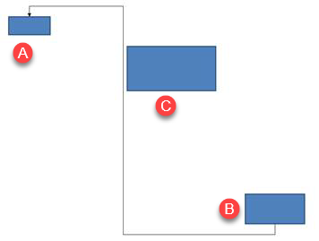

## **簡介**

PowerPoint 連接線是一種特殊的線條，用於將兩個圖形連接或鏈接在一起，即使在幻燈片上移動或重新定位圖形時也會保持附著於圖形。  

連接線通常連接到*連接點*（綠點），這些點預設存在於所有圖形上。當游標接近時，連接點會顯示。  

*調整點*（橙點）僅在某些連接線上存在，用於修改連接線的位置和形狀。

## **連接線類型**

在 PowerPoint，您可以使用直線、彎肘（有角度）和曲線連接線。

Aspose.Slides 提供以下連接線：

| 連接線 | 圖片 | 調整點數量 |
| ------------------------------ | ------------------------------------------------------------ | --------------------------- |
| `ShapeType.Line`               |       | 0                           |
| `ShapeType.StraightConnector1` |  | 0                           |
| `ShapeType.BentConnector2`     |   | 0                           |
| `ShapeType.BentConnector3`     |     | 1                           |
| `ShapeType.BentConnector4`     |     | 2                           |
| `ShapeType.BentConnector5`     |     | 3                           |
| `ShapeType.CurvedConnector2`   |  | 0                           |
| `ShapeType.CurvedConnector3`   |  | 1                           |
| `ShapeType.CurvedConnector4`   |  | 2                           |
| `ShapeType.CurvedConnector5`   |  | 3                           |

## **使用連接線連接圖形**

1. 建立[Presentation](https://reference.aspose.com/slides/zh-hant/net/aspose.slides/presentation/)類別的實例。
2. 透過索引取得投影片的參考。
3. 使用 `Shapes` 物件提供的 `AddAutoShape` 方法，將兩個[AutoShape](https://reference.aspose.com/slides/zh-hant/net/aspose.slides/autoshape/)新增至投影片。
4. 使用 `Shapes` 物件提供的 `AddConnector` 方法，依照連接線類型新增連接線。
5. 使用該連接線連接圖形。
6. 呼叫 `Reroute` 方法以套用最短的連接路徑。
7. 儲存簡報。

以下 C# 程式碼示範如何在兩個圖形（橢圓形與矩形）之間新增一條彎曲連接線：

```c#
// 實例化代表 PPTX 檔案的簡報類別
using (Presentation input = new Presentation())
{                
    // 取得特定投影片的圖形集合
    IShapeCollection shapes = input.Slides[0].Shapes;

    // 加入一個橢圓形自動圖形
    IAutoShape ellipse = shapes.AddAutoShape(ShapeType.Ellipse, 0, 100, 100, 100);

    // 加入一個矩形自動圖形
    IAutoShape rectangle = shapes.AddAutoShape(ShapeType.Rectangle, 100, 300, 100, 100);

    // 將連接線圖形加入投影片的圖形集合
    IConnector connector = shapes.AddConnector(ShapeType.BentConnector2, 0, 0, 10, 10);

    // 使用連接線將圖形相連
    connector.StartShapeConnectedTo = ellipse;
    connector.EndShapeConnectedTo = rectangle;

    // 呼叫 reroute，設定圖形之間的自動最短路徑
    connector.Reroute();

    // 儲存簡報
    input.Save("Shapes-connector.pptx", SaveFormat.Pptx);
}
```

{} 
`Connector.Reroute` 方法會重新導向連接線，強制其在圖形之間走最短路徑。為了達成此目的，該方法可能會變更 `StartShapeConnectionSiteIndex` 與 `EndShapeConnectionSiteIndex` 位置。 
{} 

## **指定連接點**

如果您想讓連接線透過圖形上特定的點來連結兩個圖形，必須按以下方式指定您偏好的連接點：

1. 建立[Presentation](https://reference.aspose.com/slides/zh-hant/net/aspose.slides/presentation/)類別的實例。
2. 透過索引取得投影片的參考。
3. 使用 `Shapes` 物件提供的 `AddAutoShape` 方法，將兩個[AutoShape](https://reference.aspose.com/slides/zh-hant/net/aspose.slides/autoshape/)新增至投影片。
4. 使用 `Shapes` 物件提供的 `AddConnector` 方法，依照連接線類型新增連接線。
5. 使用該連接線連接圖形。
6. 在圖形上設定您偏好的連接點。
7. 儲存簡報。

以下 C# 程式碼示範如何指定偏好的連接點：

```c#
// 實例化代表 PPTX 檔案的簡報類別
using (Presentation presentation = new Presentation())
{
    // 取得特定投影片的圖形集合
    IShapeCollection shapes = presentation.Slides[0].Shapes;

    // 將連接線圖形加入投影片的圖形集合
    IConnector connector = shapes.AddConnector(ShapeType.BentConnector3, 0, 0, 10, 10);

    // 加入一個橢圓形自動圖形
    IAutoShape ellipse = shapes.AddAutoShape(ShapeType.Ellipse, 0, 100, 100, 100);

    // 加入一個矩形自動圖形
    IAutoShape rectangle = shapes.AddAutoShape(ShapeType.Rectangle, 100, 200, 100, 100);

    // 使用連接線將圖形相連
    connector.StartShapeConnectedTo = ellipse;
    connector.EndShapeConnectedTo = rectangle;

    // 設定橢圓形圖形的首選連接點索引
    uint wantedIndex = 6;

    // 檢查首選索引是否小於最大連接點索引計數
    if (ellipse.ConnectionSiteCount > wantedIndex)
    {
        // 設定橢圓形自動圖形的首選連接點
        connector.StartShapeConnectionSiteIndex = wantedIndex;
    }

    // 儲存簡報
    presentation.Save("Connecting_Shape_on_desired_connection_site_out.pptx", SaveFormat.Pptx);
}
```

## **調整連接線點**

您可以透過調整點來調整既有連接線。只有具備調整點的連接線才能以此方式變更。請參閱 **[連接線類型](/slides/zh-hant/net/connector/#types-of-connectors)** 下的表格。

### **簡單案例**

考慮一個情況：兩個圖形 (A 與 B) 之間的連接線經過第三個圖形 (C)：


程式碼：

```c#
Presentation pres = new Presentation();
ISlide sld = pres.Slides[0];
IShape shape = sld.Shapes.AddAutoShape(ShapeType.Rectangle, 300, 150, 150, 75);
IShape shapeFrom = sld.Shapes.AddAutoShape(ShapeType.Rectangle, 500, 400, 100, 50);
IShape shapeTo = sld.Shapes.AddAutoShape(ShapeType.Rectangle, 100, 100, 70, 30);
 
IConnector connector = sld.Shapes.AddConnector(ShapeType.BentConnector5, 20, 20, 400, 300);
 
connector.LineFormat.EndArrowheadStyle = LineArrowheadStyle.Triangle;
connector.LineFormat.FillFormat.FillType = FillType.Solid;
connector.LineFormat.FillFormat.SolidFillColor.Color = Color.Black;
 
connector.StartShapeConnectedTo = shapeFrom;
connector.EndShapeConnectedTo = shapeTo;
connector.StartShapeConnectionSiteIndex = 2;
```

為了避免或繞過第三個圖形，我們可以將連接線的垂直線向左移動，調整方式如下：



```c#
IAdjustValue adj2 = connector.Adjustments[1];
adj2.RawValue += 10000;
```

### **複雜案例** 

要執行更複雜的調整，必須考慮以下因素：

* 連接線的可調整點與計算其位置的公式緊密相關。因此，修改點的位置可能會改變連接線的形狀。  
* 連接線的調整點在陣列中以嚴格順序定義，從連接線的起始點編號至結束點。  
* 調整點的數值代表連接線形狀寬度/高度的百分比。  
  * 形狀的界限為連接線起始與結束點乘以 1000。  
  * 第一点、第二点與第三点分別代表寬度百分比、高度百分比以及再次的寬度百分比。  
* 在計算連接線調整點座標時，必須同時考慮連接線的旋轉與鏡射。**注意**，在 **[連接線類型](/slides/zh-hant/net/connector/#types-of-connectors)** 中顯示的所有連接線的旋轉角度皆為 0。

#### **案例 1**

考慮兩個文字方塊物件透過連接線相互連結的情況：


程式碼：

```c#
// 實例化代表 PPTX 檔案的簡報類別
Presentation pres = new Presentation();
// 取得簡報中的第一張投影片
ISlide sld = pres.Slides[0];
// 新增將透過連接線結合的圖形
IAutoShape shapeFrom = sld.Shapes.AddAutoShape(ShapeType.Rectangle, 100, 100, 60, 25);
shapeFrom.TextFrame.Text = "From";
IAutoShape shapeTo = sld.Shapes.AddAutoShape(ShapeType.Rectangle, 500, 100, 60, 25);
shapeTo.TextFrame.Text = "To";
// 新增一條連接線
IConnector connector = sld.Shapes.AddConnector(ShapeType.BentConnector4, 20, 20, 400, 300);
// 指定連接線的方向
connector.LineFormat.EndArrowheadStyle = LineArrowheadStyle.Triangle;
// 指定連接線的顏色
connector.LineFormat.FillFormat.FillType = FillType.Solid;
connector.LineFormat.FillFormat.SolidFillColor.Color = Color.Crimson;
// 指定連接線線條的粗細
connector.LineFormat.Width = 3;

// 使用連接線將圖形相互連結
connector.StartShapeConnectedTo = shapeFrom;
connector.StartShapeConnectionSiteIndex = 3;
connector.EndShapeConnectedTo = shapeTo;
connector.EndShapeConnectionSiteIndex = 2;

// 取得連接線的調整點
IAdjustValue adjValue_0 = connector.Adjustments[0];
IAdjustValue adjValue_1 = connector.Adjustments[1];
```

**調整**

我們可以將連接線的調整點數值分別將對應的寬度與高度百分比提升 20% 與 200%：

```c#
// 更改調整點的數值
adjValue_0.RawValue += 20000;
adjValue_1.RawValue += 200000;
```

結果：


為了建立一個模型，以便確定連接線各部份的座標與形狀，我們在 `connector.Adjustments[0]` 點處建立一個對應水平分量的圖形：

```c#
// 繪製連接線的垂直元件

float x = connector.X + connector.Width * adjValue_0.RawValue / 100000;
float y = connector.Y;
float height = connector.Height * adjValue_1.RawValue / 100000;
sld.Shapes.AddAutoShape( ShapeType .Rectangle, x, y, 0, height);
```

結果：


#### **案例 2**

在 **案例 1** 中，我們示範了使用基本原則的簡單調整操作。於一般情況下，必須同時考慮連接線的旋轉與顯示方式（由 `connector.Rotation`、`connector.Frame.FlipH`、`connector.Frame.FlipV` 設定）。以下示範整個流程。

首先，將一個新的文字方塊物件（**To 1**）加入投影片（用於連接），並建立一條新的（綠色）連接線，將其與先前建立的物件連接：

```c#
// 建立新的繫結物件
IAutoShape shapeTo_1 = sld.Shapes.AddAutoShape(ShapeType.Rectangle, 100, 400, 60, 25);
shapeTo_1.TextFrame.Text = "To 1";
// 建立新的連接線
connector = sld.Shapes.AddConnector(ShapeType.BentConnector4, 20, 20, 400, 300);
connector.LineFormat.EndArrowheadStyle = LineArrowheadStyle.Triangle;
connector.LineFormat.FillFormat.FillType = FillType.Solid;
connector.LineFormat.FillFormat.SolidFillColor.Color = Color.MediumAquamarine;
connector.LineFormat.Width = 3;
// 使用新建立的連接線連接物件
connector.StartShapeConnectedTo = shapeFrom;
connector.StartShapeConnectionSiteIndex = 2;
connector.EndShapeConnectedTo = shapeTo_1;
connector.EndShapeConnectionSiteIndex = 3;
// 取得連接線的調整點
adjValue_0 = connector.Adjustments[0];
adjValue_1 = connector.Adjustments[1];
// 更改調整點的數值
adjValue_0.RawValue += 20000;
adjValue_1.RawValue += 200000;
```

結果：


接著，建立一個圖形以對應穿過新連接線調整點 `connector.Adjustments[0]` 的水平分量。我們會使用 `connector.Rotation`、`connector.Frame.FlipH`、`connector.Frame.FlipV` 的數值，並套用繞指定點 x0 旋轉的座標轉換公式：

X = (x — x0) * cos(alpha) — (y — y0) * sin(alpha) + x0;
Y = (x — x0) * sin(alpha) + (y — y0) * cos(alpha) + y0;

在本例中，物件的旋轉角度為 90 度，且連接線以垂直方式顯示，對應的程式碼如下：

```c#
// 儲存連接線座標
x = connector.X;
y = connector.Y;
// 在需要時修正連接線座標
if (connector.Frame.FlipH == NullableBool.True)
{
    x += connector.Width;
}
if (connector.Frame.FlipV == NullableBool.True)
{
    y += connector.Height;
}
// 將調整點的數值作為座標
x += connector.Width * adjValue_0.RawValue / 100000;
//  轉換座標，因為 Sin(90) = 1 且 Cos(90) = 0
float xx = connector.Frame.CenterX - y + connector.Frame.CenterY;
float yy = x - connector.Frame.CenterX + connector.Frame.CenterY;
// 使用第二個調整點的數值決定水平元件的寬度
float width = connector.Height * adjValue_1.RawValue / 100000;
IAutoShape shape = sld.Shapes.AddAutoShape(ShapeType.Rectangle, xx, yy, width, 0);
shape.LineFormat.FillFormat.FillType = FillType.Solid;
shape.LineFormat.FillFormat.SolidFillColor.Color = Color.Red;

```

結果：


我們已示範了涵蓋簡單調整與具旋轉角度的複雜調整點的計算。掌握這些知識後，您可以自行開發模型（或撰寫程式碼）以取得 `GraphicsPath` 物件，甚至依據特定投影片座標設定連接線的調整點數值。

## **找出連接線之角度**
1. 建立[Presentation](https://reference.aspose.com/slides/zh-hant/net/aspose.slides/presentation/)類別的實例。
2. 透過索引取得投影片的參考。
3. 取得連接線形狀物件。
4. 使用線的寬度、高度、形狀框架的寬度與高度來計算角度。

以下 C# 程式碼示範如何計算連接線形狀的角度：

```c#
public static void Run()
{
    Presentation pres = new Presentation("ConnectorLineAngle.pptx");
    Slide slide = (Slide)pres.Slides[0];
    Shape shape;
    for (int i = 0; i < slide.Shapes.Count; i++)
    {
        double dir = 0.0;
        shape = (Shape)slide.Shapes[i];
        if (shape is AutoShape)
        {
            AutoShape ashp = (AutoShape)shape;
            if (ashp.ShapeType == ShapeType.Line)
            {
                dir = getDirection(ashp.Width, ashp.Height, Convert.ToBoolean(ashp.Frame.FlipH), Convert.ToBoolean(ashp.Frame.FlipV));
            }
        }
        else if (shape is Connector)
        {
            Connector ashp = (Connector)shape;
            dir = getDirection(ashp.Width, ashp.Height, Convert.ToBoolean(ashp.Frame.FlipH), Convert.ToBoolean(ashp.Frame.FlipV));
        }

        Console.WriteLine(dir);
    }

}
public static double getDirection(float w, float h, bool flipH, bool flipV)
{
    float endLineX = w * (flipH ? -1 : 1);
    float endLineY = h * (flipV ? -1 : 1);
    float endYAxisX = 0;
    float endYAxisY = h;
    double angle = (Math.Atan2(endYAxisY, endYAxisX) - Math.Atan2(endLineY, endLineX));
    if (angle < 0) angle += 2 * Math.PI;
    return angle * 180.0 / Math.PI;
}
```

## **常見問題**

**如何判斷連接線是否能「黏貼」到特定圖形上？**  
請檢查圖形是否提供[connection sites](https://reference.aspose.com/slides/zh-hant/net/aspose.slides/shape/connectionsitecount/)。若沒有或數量為零，則無法黏貼；此時請使用自由端點並手動定位。建議在附加前先檢查 site 數量。

**如果刪除其中一個已連結的圖形，連接線會發生什麼情況？**  
其兩端會被解除連接，連接線會以普通線條的形式保留在投影片上，兩端為自由狀態。您可以自行刪除或重新指派連接，必要時可使用[reroute](https://reference.aspose.com/slides/zh-hant/net/aspose.slides/connector/reroute/)。

**在將投影片複製到另一個簡報時，連接線的綁定會被保留嗎？**  
一般而言會保留，前提是目標圖形也一併被複製。若投影片被插入另一檔案卻未包含已連結的圖形，端點會變成自由狀態，需重新連接。