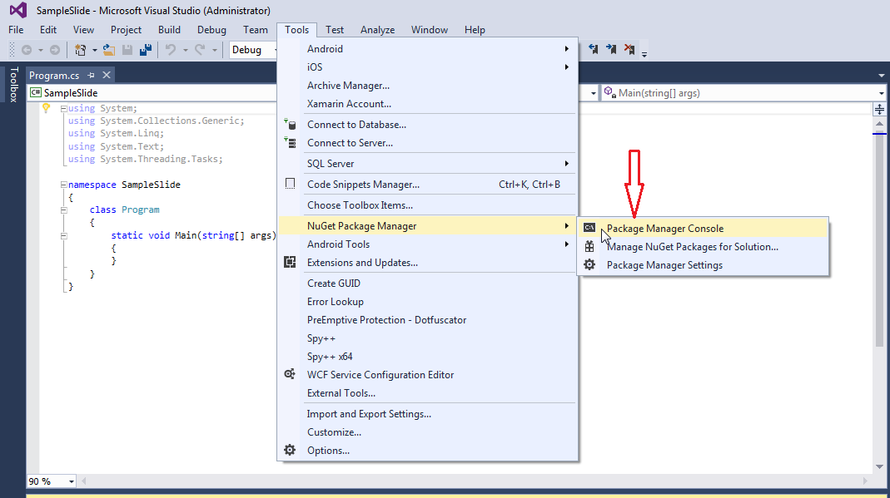
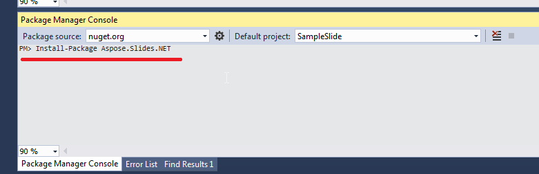

## **概觀**

本文說明如何在 Windows、Linux 與 macOS 上安裝 Aspose.Slides for .NET。重點在於基於 NuGet 的安裝，並示範如何在 Windows 上透過 NuGet 套件管理員或套件管理員主控台加入此函式庫、在 Linux 上加入 .NET 專案，以及在 macOS 上的 Visual Studio 專案。亦說明如何更新套件及在需要時安裝預先發行版本。

在安裝之前，請在[系統需求](/slides/zh-hant/net/system-requirements/) 中檢查受支援的作業系統、.NET 實作以及其他相依性。

## **Windows**
NuGet 提供在個人電腦上下載與安裝 Aspose .NET API 的最簡易路徑。

### **方法 1：從 NuGet 套件管理員安裝或更新 Aspose.Slides**
1. 開啟 Microsoft Visual Studio。 
2. 建立簡易的主控台應用程式或開啟現有專案。 
3. 在 **Tools** > **NuGet package manager** 中進行操作。 
4. 在 **Browse** 下，於文字欄位搜尋 *Aspose Slides*。 
{}
5. 點選 **Aspose.Slides.NET**，然後點選 **Install**。 
   * 如果您想要更新 Aspose.Slides（假設您已安裝），請改點 **Update**。 

選取的 API 會被下載並在您的專案中加入參考。

### **方法 2：透過套件管理員主控台安裝或更新 Aspose.Slides**
1. 開啟 Microsoft Visual Studio。 
2. 建立簡易的主控台應用程式或開啟現有專案。 
3. 在 **Tools** > **Library Package Manager** > **Package Manager Console** 中進行操作。 

4. 執行以下指令：`Install-Package Aspose.Slides.NET` 

最新的完整版本會安裝至您的應用程式中。 

* 或者，您可以在指令後加入 `-prerelease` 後綴，以指定同時安裝最新的發行版（包含修補程式）。

視窗底部會顯示 **Installing Aspose.Slides.NET** 提示。 

下載完成後，您應會看到一些確認訊息。 

如果您不熟悉 [Aspose 使用者授權協議](https://about.aspose.com/legal/eula)，建議閱讀 URL 中提及的授權說明。 

在您的應用程式中，您應該會看到 Aspose.Slides 已成功加入並被參考。 

在套件管理員主控台中，您可以執行 `Update-Package Aspose.Slides.NET` 指令，以檢查 Aspose.Slides 套件的更新。若有更新，會自動安裝。您也可以使用 `-prerelease` 後綴來更新最新的發行版。

#### **考量於共享伺服器環境執行時的注意事項**
我們強烈建議您以 **Full Trust** 權限執行所有 Aspose .NET 元件，因為 Aspose 元件有時需要存取登錄表設定與位於虛擬目錄以外的檔案，例如讀取字型時。 
此外，Aspose.NET 元件是基於核心 .NET 系統類別，而其中某些類別在特定情況下亦需 Full Trust 權限才能執行操作。 

托管多家公司應用程式的網際服務提供商通常會強制使用 Medium Trust 安全等級。在 .NET 2.0 情況下，這種安全等級可能會導致限制，影響 Aspose.Slides 的運作：

- **RegistryPermission** 不可用。這意味著您無法存取登錄表，而渲染文件時需要列舉已安裝的字型。 
- **FileIOPermission** 受限。這表示您只能存取應用程式虛擬目錄階層中的檔案，亦可能導致匯出作業時無法讀取字型。 

基於上述原因，我們強烈建議在 **Full Trust** 權限下執行 Aspose.Slides。若使用 **Medium trust**，可能會出現不一致情況——某些函式庫功能（例如渲染）在執行特定任務時可能無法運作。 

## **Linux**
NuGet 提供在 Linux 上下載與安裝 Aspose.Slides for .NET 的最簡易方式。將 [Aspose.Slides.NET](https://www.nuget.org/packages/Aspose.Slides.NET/) 套件加入您的 .NET 專案中。

## **macOS**
NuGet 提供在 Mac 電腦上下載與安裝 Aspose.Slides for .NET 的最簡易方式。

### **安裝 Aspose.Slides**
1. 開啟 Visual Studio。 
2. 建立簡易的主控台應用程式或開啟現有專案。 
3. 在 **Project** > **Manage NuGet Packages...** 中操作。 

4. 在文字欄位輸入 *Aspose.Slides*。 
5. 點選 **Aspose.Slides for .NET**，然後點選 **Add Package**。 
6. 加入簡單的程式碼片段。 
   * 您可以在[此頁面](/slides/zh-hant/net/create-presentation/) 上複製程式碼。 
7. 執行應用程式。 
8. 開啟您的專案 *folder/bin/Debug/presentation_file_name*。

## **FAQ**

**是否有免費版或試用限制？**

是的，預設情況下，Aspose.Slides 以評估模式執行，會加上浮水印且可能有其他限制。若要解除限制，需套用有效的[授權](/slides/zh-hant/net/licensing/)。