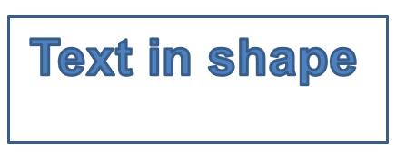

## **概述**

本文說明如何透過編輯點與幾何路徑來編輯形狀幾何，進而自訂 Aspose.Slides 中的簡報形狀。示範如何使用 `GeometryPath` 修改既有形狀、執行基本的路徑編輯操作、加入或移除點，並將更新後的幾何套用回形狀。

同時也展示如何建立自訂與複合形狀、建構帶曲線角的形狀、判斷形狀幾何是否為封閉，以及在 `GeometryPath` 與 `java.awt.Shape` 之間的相互轉換，以因應其他幾何自訂情境。

## **使用編輯點變更形狀**

以正方形為例。在 PowerPoint 中，使用 **編輯點**，您可以  

* 移動正方形的角向內或向外  
* 為角或點指定曲率  
* 為正方形新增點  
* 操作正方形上的點，等等  

實質上，您可以對任何形狀執行上述任務。透過編輯點，您可以變更形狀或從現有形狀建立新形狀。

## **形狀編輯提示**


在開始使用編輯點編輯 PowerPoint 形狀之前，您可能需要了解以下有關形狀的要點：

* 形狀（或其路徑）可以是封閉的，也可以是開放的。  
* 封閉的形狀沒有起點或終點；開放的形狀則有開始與結束。  
* 所有形狀至少由 2 個錨點透過線段相連。  
* 線段可以是直的或曲的。錨點決定線段的性質。  
* 錨點可分為角點、直點或平滑點：  
  * 角點是兩條直線在某個角度交會的點。  
  * 平滑點是兩個控制柄位於同一直線上，且線段以平滑曲線相接的點，此時兩個控制柄與錨點的距離相等。  
  * 直點是兩個控制柄位於同一直線上，線段以平滑曲線相接的點，但兩個控制柄與錨點的距離不必相等。  
* 透過移動或編輯錨點（會改變線段的角度），即可改變形狀的外觀。

為了透過編輯點編輯 PowerPoint 形狀，**Aspose.Slides** 提供了 [**GeometryPath**](https://reference.aspose.com/slides/zh-hant/nodejs-java/aspose.slides/GeometryPath) 類別與 [**GeometryPath**](https://reference.aspose.com/slides/zh-hant/nodejs-java/aspose.slides/GeometryPath) 類別。

* 一個 [GeometryPath](https://reference.aspose.com/slides/zh-hant/nodejs-java/aspose.slides/GeometryPath) 例項表示 [GeometryShape](https://reference.aspose.com/slides/zh-hant/nodejs-java/aspose.slides/GeometryShape) 物件的幾何路徑。  
* 若要從 `GeometryShape` 例項取得 `GeometryPath`，可使用 [GeometryShape.getGeometryPaths](https://reference.aspose.com/slides/zh-hant/nodejs-java/aspose.slides/GeometryShape#getGeometryPaths--) 方法。  
* 若要為形狀設定 `GeometryPath`，可使用以下方法：針對*實心形狀*使用 [GeometryShape.setGeometryPath](https://reference.aspose.com/slides/zh-hant/nodejs-java/aspose.slides/GeometryShape#setGeometryPath-aspose.slides.IGeometryPath-)；針對*複合形狀*使用 [GeometryShape.setGeometryPaths](https://reference.aspose.com/slides/zh-hant/nodejs-java/aspose.slides/GeometryShape#setGeometryPaths-aspose.slides.IGeometryPath:A-)。  
* 若要新增線段，可使用 [GeometryPath](https://reference.aspose.com/slides/zh-hant/nodejs-java/aspose.slides/GeometryPath) 下的相關方法。  
* 使用 [GeometryPath.setStroke](https://reference.aspose.com/slides/zh-hant/nodejs-java/aspose.slides/GeometryPath#setStroke-boolean-) 與 [GeometryPath.setFillMode](https://reference.aspose.com/slides/zh-hant/nodejs-java/aspose.slides/GeometryPath#setFillMode-byte-) 方法，可設定幾何路徑的外觀。  
* 使用 [GeometryPath.getPathData](https://reference.aspose.com/slides/zh-hant/nodejs-java/aspose.slides/GeometryPath#getPathData--) 方法，可將 `GeometryShape` 的幾何路徑以路徑段陣列形式取得。  
* 若要存取更多形狀幾何自訂選項，可將 [GeometryPath](https://reference.aspose.com/slides/zh-hant/nodejs-java/aspose.slides/GeometryPath) 轉換為 [java.awt.Shape](https://docs.oracle.com/javase/7/docs/api/java/awt/Shape.html)。  
* 使用 [geometryPathToGraphicsPath](https://reference.aspose.com/slides/zh-hant/nodejs-java/aspose.slides/ShapeUtil#geometryPathToGraphicsPath-aspose.slides.IGeometryPath-) 與 [graphicsPathToGeometryPath](https://reference.aspose.com/slides/zh-hant/nodejs-java/aspose.slides/ShapeUtil#graphicsPathToGeometryPath-java.awt.Shape-) 方法（來自 [ShapeUtil](https://reference.aspose.com/slides/zh-hant/nodejs-java/aspose.slides/ShapeUtil) 類別），可在 [GeometryPath](https://reference.aspose.com/slides/zh-hant/nodejs-java/aspose.slides/GeometryPath) 與 [java.awt.Shape](https://docs.oracle.com/javase/7/docs/api/java/awt/Shape.html) 之間進行相互轉換。

## **簡單編輯操作**

此 JavaScript 程式碼示範如何  

**在路徑末端加入直線**  
```javascript
lineTo(point);
lineTo(x, y);
```  
**在路徑指定位置加入直線**  
```javascript
lineTo(point, index);
lineTo(x, y, index);
```  
**在路徑末端加入三次貝茲曲線**  
```javascript
cubicBezierTo(point1, point2, point3);
cubicBezierTo(x1, y1, x2, y2, x3, y3);
```  
**在路徑指定位置加入三次貝茲曲線**  
```javascript
cubicBezierTo(point1, point2, point3);
cubicBezierTo(x1, y1, x2, y2, x3, y3);
```  
**在路徑末端加入二次貝茲曲線**  
```javascript
quadraticBezierTo(point1, point2);
quadraticBezierTo(x1, y1, x2, y2);
```  
**在路徑指定位置加入二次貝茲曲線**  
```javascript
quadraticBezierTo(point1, point2, index);
quadraticBezierTo(x1, y1, x2, y2, index);
```  
**將給定弧線附加至路徑**  
```javascript
arcTo(width, heigth, startAngle, sweepAngle);
```  
**關閉路徑目前的圖形**  
```javascript
closeFigure();
```  
**設定下一個點的位置**  
```javascript
moveTo(point);
moveTo(x, y);
```  
**移除指定索引的路徑段**  
```javascript
removeAt(index);
```

## **向形狀新增自訂點**

1. 建立一個 [GeometryShape] 類別的實例，並將其類型設定為 [ShapeType.Rectangle]。  
2. 從形狀取得 [GeometryPath] 類別的實例。  
3. 在路徑上方的兩個點之間加入新點。  
4. 在路徑下方的兩個點之間加入新點。  
5. 將路徑套用至形狀。  

以下 JavaScript 程式碼示範如何向形狀新增自訂點：  
```javascript
var pres = new aspose.slides.Presentation();
try {
    var shape = pres.getSlides().get_Item(0).getShapes().addAutoShape(aspose.slides.ShapeType.Rectangle, 100, 100, 200, 100);
    var geometryPath = shape.getGeometryPaths()[0];
    geometryPath.lineTo(100, 50, 1);
    geometryPath.lineTo(100, 50, 4);
    shape.setGeometryPath(geometryPath);
} finally {
    if (pres != null) {
        pres.dispose();
    }
}
```  


## **從形狀移除點**

1. 建立一個 [GeometryShape] 類別的實例，並將其類型設定為 [ShapeType.Heart]。  
2. 從形狀取得 [GeometryPath] 類別的實例。  
3. 移除該路徑的段。  
4. 將路徑套用至形狀。  

以下 JavaScript 程式碼示範如何從形狀移除點：  
```javascript
var pres = new aspose.slides.Presentation();
try {
    var shape = pres.getSlides().get_Item(0).getShapes().addAutoShape(aspose.slides.ShapeType.Heart, 100, 100, 300, 300);
    var path = shape.getGeometryPaths()[0];
    path.removeAt(2);
    shape.setGeometryPath(path);
} finally {
    if (pres != null) {
        pres.dispose();
    }
}
```  


## **建立自訂形狀**

1. 計算形狀的點座標。  
2. 建立 [GeometryPath] 類別的實例。  
3. 使用這些點填充路徑。  
4. 建立 [GeometryShape] 類別的實例。  
5. 將路徑套用至形狀。  

以下 JavaScript 程式碼示範如何建立自訂形狀：  
```javascript
var points = java.newInstanceSync("java.util.ArrayList");
var R = 100;
var r = 50;
var step = 72;
for (var angle = -90; angle < 270; angle += step) {
    var radians = angle * (java.getStaticFieldValue("java.lang.Math", "PI") / 180.0);
    var x = R * java.callStaticMethodSync("java.lang.Math", "cos", radians);
    var y = R * java.callStaticMethodSync("java.lang.Math", "sin", radians);
    points.add(java.newInstanceSync("com.aspose.slides.Point2DFloat", java.newFloat(x + R), java.newFloat(y + R)));
    radians = (java.getStaticFieldValue("java.lang.Math", "PI") * (angle + (step / 2))) / 180.0;
    x = r * java.callStaticMethodSync("java.lang.Math", "cos", radians);
    y = r * java.callStaticMethodSync("java.lang.Math", "sin", radians);
    points.add(java.newInstanceSync("com.aspose.slides.Point2DFloat", java.newFloat(x + R), java.newFloat(y + R)));
}
var starPath = new aspose.slides.GeometryPath();
starPath.moveTo(points.get(0));
for (var i = 1; i < points.size(); i++) {
    starPath.lineTo(points.get(i));
}
starPath.closeFigure();
var pres = new aspose.slides.Presentation();
try {
    var shape = pres.getSlides().get_Item(0).getShapes().addAutoShape(aspose.slides.ShapeType.Rectangle, 100, 100, R * 2, R * 2);
    shape.setGeometryPath(starPath);
} finally {
    if (pres != null) {
        pres.dispose();
    }
}
```  


## **建立複合自訂形狀**

1. 建立 [GeometryShape] 類別的實例。  
2. 建立第一個 [GeometryPath] 類別的實例。  
3. 建立第二個 [GeometryPath] 類別的實例。  
4. 將這些路徑套用至形狀。  

以下 JavaScript 程式碼示範如何建立複合自訂形狀：  
```javascript
var pres = new aspose.slides.Presentation();
try {
    var shape = pres.getSlides().get_Item(0).getShapes().addAutoShape(aspose.slides.ShapeType.Rectangle, 100, 100, 200, 100);
    var geometryPath0 = new aspose.slides.GeometryPath();
    geometryPath0.moveTo(0, 0);
    geometryPath0.lineTo(shape.getWidth(), 0);
    geometryPath0.lineTo(shape.getWidth(), shape.getHeight() / 3);
    geometryPath0.lineTo(0, shape.getHeight() / 3);
    geometryPath0.closeFigure();
    var geometryPath1 = new aspose.slides.GeometryPath();
    geometryPath1.moveTo(0, (shape.getHeight() / 3) * 2);
    geometryPath1.lineTo(shape.getWidth(), (shape.getHeight() / 3) * 2);
    geometryPath1.lineTo(shape.getWidth(), shape.getHeight());
    geometryPath1.lineTo(0, shape.getHeight());
    geometryPath1.closeFigure();
    shape.setGeometryPaths(java.newArray("com.aspose.slides.GeometryPath",[geometryPath0, geometryPath1]));
} finally {
    if (pres != null) {
        pres.dispose();
    }
}
```  


## **建立帶曲線角的自訂形狀**

以下 JavaScript 程式碼示範如何建立具有向內曲線角的自訂形狀；  
```javascript
var shapeX = 20.0;
var shapeY = 20.0;
var shapeWidth = 300.0;
var shapeHeight = 200.0;
var leftTopSize = 50.0;
var rightTopSize = 20.0;
var rightBottomSize = 40.0;
var leftBottomSize = 10.0;
var pres = new aspose.slides.Presentation();
try {
    var childShape = pres.getSlides().get_Item(0).getShapes().addAutoShape(aspose.slides.ShapeType.Custom, shapeX, shapeY, shapeWidth, shapeHeight);
    var geometryPath = new aspose.slides.GeometryPath();
    var point1 = java.newInstanceSync("com.aspose.slides.Point2DFloat", leftTopSize, 0);
    var point2 = java.newInstanceSync("com.aspose.slides.Point2DFloat", shapeWidth - rightTopSize, 0);
    var point3 = java.newInstanceSync("com.aspose.slides.Point2DFloat", shapeWidth, shapeHeight - rightBottomSize);
    var point4 = java.newInstanceSync("com.aspose.slides.Point2DFloat", leftBottomSize, shapeHeight);
    var point5 = java.newInstanceSync("com.aspose.slides.Point2DFloat", 0, leftTopSize);
    geometryPath.moveTo(point1);
    geometryPath.lineTo(point2);
    geometryPath.arcTo(rightTopSize, rightTopSize, 180, -90);
    geometryPath.lineTo(point3);
    geometryPath.arcTo(rightBottomSize, rightBottomSize, -90, -90);
    geometryPath.lineTo(point4);
    geometryPath.arcTo(leftBottomSize, leftBottomSize, 0, -90);
    geometryPath.lineTo(point5);
    geometryPath.arcTo(leftTopSize, leftTopSize, 90, -90);
    geometryPath.closeFigure();
    childShape.setGeometryPath(geometryPath);
    pres.save("output.pptx", aspose.slides.SaveFormat.Pptx);
} finally {
    if (pres != null) {
        pres.dispose();
    }
}
```

## **判斷形狀幾何是否為封閉**

封閉形狀指的是其所有邊皆相連，形成單一沒有間隙的邊界。此類形狀可以是簡單的幾何圖形，也可以是複雜的自訂輪廓。以下程式碼範例示範如何檢查形狀幾何是否為封閉：  
```java
function isGeometryClosed(geometryShape) 
{
    let isClosed = null;

    geometryShape.getGeometryPaths().forEach(geometryPath => {
        const pathData = geometryPath.getPathData();
        const dataLength = pathData.length;

        if (dataLength === 0) return;

        const lastSegment = pathData[dataLength - 1];
        isClosed = lastSegment.getPathCommand() === aspose.slides.PathCommandType.Close;

        if (!isClosed) return false;
    });

    return isClosed === true;
}
```

## **將 GeometryPath 轉換為 java.awt.Shape** 

1. 建立 [GeometryShape] 類別的實例。  
2. 建立 [java.awt.Shape] 類別的實例。  
3. 使用 [ShapeUtil] 將 [java.awt.Shape] 實例轉換為 [GeometryPath] 實例。  
4. 將路徑套用至形狀。  

以下 JavaScript 程式碼（對上述步驟的實作）示範 **GeometryPath** 轉換為 **GraphicsPath** 的過程：  
```javascript
var pres = new aspose.slides.Presentation();
try {
    // 建立新形狀
    var shape = pres.getSlides().get_Item(0).getShapes().addAutoShape(aspose.slides.ShapeType.Rectangle, 100, 100, 300, 100);
    // 取得形狀的幾何路徑
    var originalPath = shape.getGeometryPaths()[0];
    originalPath.setFillMode(aspose.slides.PathFillModeType.None);
    // 建立帶文字的圖形路徑
    var graphicsPath;
    var font = java.newInstanceSync("java.awt.Font", "Arial", java.getStaticFieldValue("java.awt.Font", "PLAIN"), 40);
    var text = "Text in shape";
    var img = java.newInstanceSync("BufferedImage", 100, 100, java.getStaticFieldValue("BufferedImage", "TYPE_INT_ARGB"));
    var g2 = img.createGraphics();
    try {
        var glyphVector = font.createGlyphVector(g2.getFontRenderContext(), text);
        graphicsPath = glyphVector.getOutline(20.0, -glyphVector.getVisualBounds().getY() + 10);
    } finally {
        g2.dispose();
    }
    // 將圖形路徑轉換為幾何路徑
    var textPath = aspose.slides.ShapeUtil.graphicsPathToGeometryPath(graphicsPath);
    textPath.setFillMode(aspose.slides.PathFillModeType.Normal);
    // 設定新幾何路徑與原始幾何路徑的組合到形狀
    shape.setGeometryPaths(java.newArray("com.aspose.slides.IGeometryPath", [originalPath, textPath]));
} finally {
    if (pres != null) {
        pres.dispose();
    }
}
```  


## **FAQ**

**在取代幾何之後，填色和輪廓會發生什麼變化？**  
樣式仍保留在形狀上，僅輪廓會改變。填色與輪廓會自動套用至新的幾何。

**如何正確地將自訂形狀連同其幾何一起旋轉？**  
使用形狀的 [setRotation](https://reference.aspose.com/slides/zh-hant/nodejs-java/aspose.slides/shape/setrotation/) 方法；由於幾何綁定於形狀自身的座標系統，旋轉時會同步旋轉。

**我可以將自訂形狀轉換成圖像以「鎖定」結果嗎？**  
可以。將所需的 [slide](/slides/zh-hant/nodejs-java/convert-powerpoint-to-png/) 區域或 [shape](/slides/zh-hant/nodejs-java/create-shape-thumbnails/) 本身匯出為點陣圖格式；這樣可簡化後續對複雜幾何的處理。