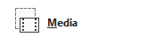

## **簡介**

投影片版面定義了投影片上佔位方塊的排列方式與內容的格式設定。它控制哪些佔位項可用以及它們出現的位置。投影片版面可協助您快速且一致地設計簡報，無論是建立簡單還是較複雜的內容。PowerPoint 中最常見的投影片版面包括：

**Title Slide layout** – 包含兩個文字佔位項：一個用於標題，另一個用於副標題。

**Title and Content layout** – 在頂部提供較小的標題佔位項，下面則有較大的主要內容佔位項（例如文字、項目符號、圖表、影像等）。

**Blank layout** – 不含任何佔位項，讓您可以從頭自行設計投影片。

投影片版面是投影片母片的一部分，投影片母片是定義簡報版面樣式的最高層投影片。您可以透過投影片母片存取並修改版面投影片——依類型、名稱或唯一 ID。或者，您也可以直接在簡報內編輯特定的版面投影片。

要在 Aspose.Slides for Node.js 中使用投影片版面，您可以使用：

- 在 [Presentation](https://reference.aspose.com/slides/zh-hant/nodejs-java/aspose.slides/presentation/) 類別下的 [getLayoutSlides](https://reference.aspose.com/slides/zh-hant/nodejs-java/aspose.slides/presentation/#getLayoutSlides) 與 [getMasters](https://reference.aspose.com/slides/zh-hant/nodejs-java/aspose.slides/presentation/#getMasters) 方法
- 如 [LayoutSlide](https://reference.aspose.com/slides/zh-hant/nodejs-java/aspose.slides/layoutslide/)、[MasterLayoutSlideCollection](https://reference.aspose.com/slides/zh-hant/nodejs-java/aspose.slides/masterlayoutslidecollection/)、[LayoutPlaceholderManager](https://reference.aspose.com/slides/zh-hant/nodejs-java/aspose.slides/layoutplaceholdermanager/) 與 [LayoutSlideHeaderFooterManager](https://reference.aspose.com/slides/zh-hant/nodejs-java/aspose.slides/layoutslideheaderfootermanager/) 等型別

{}
若要深入了解使用投影片母片，請參閱 [Slide Master](/slides/zh-hant/nodejs-java/slide-master/) 文章。
{}

## **將投影片版面加入簡報**

若要自訂投影片的外觀與結構，您可能需要在簡報中加入新的版面投影片。Aspose.Slides for Node.js 允許您檢查特定版面是否已存在，必要時新增，並使用該版面插入投影片。

1. 建立 [Presentation](https://reference.aspose.com/slides/zh-hant/nodejs-java/aspose.slides/presentation/) 類別的實例。
1. 取得 [MasterLayoutSlideCollection](https://reference.aspose.com/slides/zh-hant/nodejs-java/aspose.slides/masterlayoutslidecollection/)。
1. 檢查所需的版面投影片是否已存在於集合中。若不存在，則新增所需的版面投影片。
1. 新增一張基於新版面投影片的空白投影片。
1. 儲存簡報。

以下 JavaScript 程式碼示範如何將版面投影片加入 PowerPoint 簡報：

```js
// 實例化代表 PowerPoint 檔案的 Presentation 類別。
let presentation = new aspose.slides.Presentation("Sample.pptx");
try {
    // 遍歷版面投影片類型以選取版面投影片。
    let layoutSlides = presentation.getMasters().get_Item(0).getLayoutSlides();
    let layoutSlide = null;
    if (layoutSlides.getByType(java.newByte(aspose.slides.SlideLayoutType.TitleAndObject)) != null) {
        layoutSlide = layoutSlides.getByType(java.newByte(aspose.slides.SlideLayoutType.TitleAndObject));
    } else {
        layoutSlide = layoutSlides.getByType(java.newByte(aspose.slides.SlideLayoutType.Title));
    }

    if (layoutSlide == null) {
        // 簡報不包含所有版面類型的情況。
        // 簡報檔案僅包含 Blank 與 Custom 版面類型。
        // 然而，具有自訂類型的版面投影片可能有可辨識的名稱，
        // 例如 "Title", "Title and Content", 等，可用於版面投影片的選取。
        // 您也可以依賴一組佔位形狀類型。
        // 例如，Title 投影片應僅有 Title 佔位項類型，依此類推。
        for (let i = 0; i < layoutSlides.size(); i++) {
            let titleAndObjectLayoutSlide = layoutSlides.get_Item(i);
            if (titleAndObjectLayoutSlide.getName() === "Title and Object") {
                layoutSlide = titleAndObjectLayoutSlide;
                break;
            }
        }

        if (layoutSlide == null) {
            for (let i = 0; i < layoutSlides.size(); i++) {
                let titleLayoutSlide = layoutSlides.get_Item(i);
                if (titleLayoutSlide.getName() === "Title") {
                    layoutSlide = titleLayoutSlide;
                    break;
                }
            }

            if (layoutSlide == null) {
                layoutSlide = layoutSlides.getByType(java.newByte(aspose.slides.SlideLayoutType.Blank));
                if (layoutSlide == null) {
                    layoutSlide = layoutSlides.add(java.newByte(aspose.slides.SlideLayoutType.TitleAndObject), "Title and Object");
                }
            }
        }
    }

    // 使用新增的版面投影片加入一張空白投影片。
    presentation.getSlides().insertEmptySlide(0, layoutSlide);

    // 將簡報儲存至磁碟。
    presentation.save("output.pptx", aspose.slides.SaveFormat.Pptx);
} finally {
    presentation.dispose();
}
```

## **移除未使用的版面投影片**

Aspose.Slides 於 [Compress](https://reference.aspose.com/slides/zh-hant/nodejs-java/aspose.slides/compress/) 類別提供 [removeUnusedLayoutSlides](https://reference.aspose.com/slides/zh-hant/nodejs-java/aspose.slides/compress/#removeUnusedLayoutSlides) 方法，讓您刪除不需要且未使用的版面投影片。

以下 JavaScript 程式碼展示如何從 PowerPoint 簡報中移除版面投影片：

```js
let presentation = new aspose.slides.Presentation("Presentation.pptx");
try {
    aspose.slides.Compress.removeUnusedLayoutSlides(presentation);
    presentation.save("Output.pptx", aspose.slides.SaveFormat.Pptx);
} finally {
    presentation.dispose();
}
```

## **為投影片版面新增佔位項**

Aspose.Slides 提供 [LayoutSlide.getPlaceholderManager](https://reference.aspose.com/slides/zh-hant/nodejs-java/aspose.slides/layoutslide/#getPlaceholderManager) 方法，允許您向版面投影片新增佔位項。

此管理員包含以下佔位項類型的方法：

| PowerPoint 佔位項                 | [LayoutPlaceholderManager](https://reference.aspose.com/slides/zh-hant/nodejs-java/aspose.slides/layoutplaceholdermanager/) 方法 |
| --------------------------------- | ------------------------------------------------------------ |
|              | addContentPlaceholder(float x, float y, float width, float height) |
|      | addVerticalContentPlaceholder(float x, float y, float width, float height) |
|                 | addTextPlaceholder(float x, float y, float width, float height) |
|         | addVerticalTextPlaceholder(float x, float y, float width, float height) |
|              | addPicturePlaceholder(float x, float y, float width, float height) |
|                | addChartPlaceholder(float x, float y, float width, float height) |
|                | addTablePlaceholder(float x, float y, float width, float height) |
|         | addSmartArtPlaceholder(float x, float y, float width, float height) |
|                | addMediaPlaceholder(float x, float y, float width, float height) |
|      | addOnlineImagePlaceholder(float x, float y, float width, float height) |

以下 JavaScript 程式碼示範如何在 Blank 版面投影片上新增佔位圖形：

```js
let presentation = new aspose.slides.Presentation();
try {
    // 取得空白版面投影片。
    let layout = presentation.getLayoutSlides().getByType(java.newByte(aspose.slides.SlideLayoutType.Blank));

    // 取得版面投影片的佔位項管理員。
    let placeholderManager = layout.getPlaceholderManager();

    // 為空白版面投影片新增不同的佔位項。
    placeholderManager.addContentPlaceholder(20, 20, 310, 270);
    placeholderManager.addVerticalTextPlaceholder(350, 20, 350, 270);
    placeholderManager.addChartPlaceholder(20, 310, 310, 180);
    placeholderManager.addTablePlaceholder(350, 310, 350, 180);

    // 使用空白版面新增投影片。
    let newSlide = presentation.getSlides().addEmptySlide(layout);

    presentation.save("Placeholders.pptx", aspose.slides.SaveFormat.Pptx);
} finally {
    presentation.dispose();
}
```

結果：


## **設定版面投影片的頁腳可見性**

在 PowerPoint 簡報中，日期、投影片編號與自訂文字等頁腳元素可以依版面決定顯示或隱藏。Aspose.Slides for Node.js 允許您控制這些頁腳佔位項的可見性。當您希望特定版面顯示頁腳資訊，而其他版面保持簡潔時，這非常有用。

1. 建立 [Presentation](https://reference.aspose.com/slides/zh-hant/nodejs-java/aspose.slides/presentation/) 類別的實例。
1. 依索引取得版面投影片參考。
1. 設定投影片頁腳佔位項為可見。
1. 設定投影片編號佔位項為可見。
1. 設定日期時間佔位項為可見。
1. 儲存簡報。

以下 JavaScript 程式碼示範如何設定投影片頁腳的可見性並執行相關操作：

```js
let presentation = new aspose.slides.Presentation("Presentation.ppt");
try {
    let headerFooterManager = presentation.getLayoutSlides().get_Item(0).getHeaderFooterManager();

    if (!headerFooterManager.isFooterVisible()) {
        headerFooterManager.setFooterVisibility(true);
    }

    if (!headerFooterManager.isSlideNumberVisible()) {
        headerFooterManager.setSlideNumberVisibility(true);
    }

    if (!headerFooterManager.isDateTimeVisible()) {
        headerFooterManager.setDateTimeVisibility(true);
    }

    headerFooterManager.setFooterText("Footer text");
    headerFooterManager.setDateTimeText("Date and time text");

    presentation.save("Presentation.ppt", aspose.slides.SaveFormat.Ppt);
} finally {
    presentation.dispose();
}
```

## **設定子版面投影片的頁腳可見性**

在 PowerPoint 簡報中，日期、投影片編號與自訂文字等頁腳元素可在母片層級控制，以確保所有版面投影片的一致性。Aspose.Slides for Node.js 讓您能在母片上設定這些頁腳佔位項的可見性與內容，並將設定傳遞給所有子版面投影片，從而在整份簡報中保持統一的頁腳資訊。

1. 建立 [Presentation](https://reference.aspose.com/slides/zh-hant/nodejs-java/aspose.slides/presentation/) 類別的實例。
1. 依索引取得母片參考。
1. 設定母片以及所有子版面的頁腳佔位項為可見。
1. 設定母片以及所有子版面的投影片編號佔位項為可見。
1. 設定母片以及所有子版面的日期時間佔位項為可見。
1. 儲存簡報。

以下 JavaScript 程式碼示範此操作：

```js
let presentation = new aspose.slides.Presentation("Presentation.ppt");
try {
    let headerFooterManager = presentation.getMasters().get_Item(0).getHeaderFooterManager();

    headerFooterManager.setFooterAndChildFootersVisibility(true);
    headerFooterManager.setSlideNumberAndChildSlideNumbersVisibility(true);
    headerFooterManager.setDateTimeAndChildDateTimesVisibility(true);

    headerFooterManager.setFooterAndChildFootersText("Footer text");
    headerFooterManager.setDateTimeAndChildDateTimesText("Date and time text");

    presentation.save("Output.pptx", aspose.slides.SaveFormat.Pptx);
} finally {
    presentation.dispose();
}
```

## **FAQ**

**主母片與版面投影片有何不同？**

主母片定義整體主題與預設格式，而版面投影片則為不同類型內容定義特定的佔位項排列方式。

**我可以將版面投影片從一個簡報複製到另一個嗎？**

可以，您可以透過 [getLayoutSlides](https://reference.aspose.com/slides/zh-hant/nodejs-java/aspose.slides/presentation/#getLayoutSlides) 方法取得的版面投影片集合，使用 `addClone` 方法將其複製並插入到另一個簡報中。

**如果刪除仍被投影片使用的版面投影片會發生什麼事？**

若嘗試刪除仍被至少一張投影片參考的版面投影片，Aspose.Slides 會拋出 [PptxEditException](https://reference.aspose.com/slides/zh-hant/nodejs-java/aspose.slides/pptxeditexception/)。為避免此問題，請使用 [removeUnusedLayoutSlides](https://reference.aspose.com/slides/zh-hant/nodejs-java/aspose.slides/compress/#removeUnusedLayoutSlides) 只安全地移除未被使用的版面投影片。