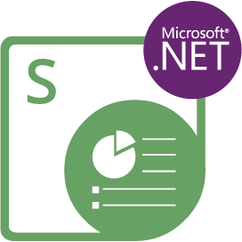

Aspose.Slides for Node.js via .NET 是一套用於在 Node.js 應用程式中建立、讀取、編輯與轉換 PowerPoint 與 OpenDocument 簡報的程式庫，無需 Microsoft PowerPoint 或 Office Automation。它透過 edge-js 橋接執行 Aspose.Slides for .NET，因此其 JavaScript API 直接對映 .NET API，使用 camelCase 成員名稱。

它可以載入與儲存 PPT、PPTX、PPS、POT 與 ODP，包含巨集啟用版與範本版，並可匯出為 PDF、XPS、HTML、TIFF、Markdown 與圖像。

<div style="clear:both"></div>

------

<div class="row">
<div class="col-md-4">
<p><b>開始使用</b></p>
<hr>
<p>GETTING STARTED</p>
<ul>
<li><a href="/slides/zh-hant/nodejs-net/installation/">安裝</a></li>
<li><a href="/slides/zh-hant/nodejs-net/create-presentation/">建立您的第一個簡報</a></li>
<li><a href="/slides/zh-hant/nodejs-net/developer-guide/">開發者指南</a></li>
</ul>
<p>EVALUATE</p>
<ul>
<li><a href="/slides/zh-hant/nodejs-net/evaluate-aspose-slides/">試用限制</a></li>
<li><a href="/slides/zh-hant/nodejs-net/licensing/">授權條款</a></li>
</ul>
</div>
<div class="col-md-4">
<p><b>使用 Slides 建置</b></p>
<hr>
<p>COMMON TASKS</p>
<ul>
<li><a href="/slides/zh-hant/nodejs-net/open-presentation/">開啟與儲存簡報</a></li>
<li><a href="/slides/zh-hant/nodejs-net/convert-powerpoint-to-pdf/">轉換為 PDF</a></li>
<li><a href="/slides/zh-hant/nodejs-net/convert-slide/">將投影片渲染為圖像</a></li>
<li><a href="/slides/zh-hant/nodejs-net/manage-text/">編輯文字</a></li>
</ul>
</div>
<div class="col-md-4">
<p><b>參考與支援</b></p>
<hr>
<p>REFERENCE</p>
<ul>
<li><a href="https://reference.aspose.com/slides/zh-hant/net/">.NET API 參考文件</a></li>
<li><a href="https://releases.aspose.com/slides/zh-hant/nodejs-net/release-notes/">發行說明</a></li>
<li><a href="https://releases.aspose.com/slides/zh-hant/nodejs-net/">下載</a></li>
</ul>
<p>SUPPORT</p>
<ul>
<li><a href="https://forum.aspose.com/c/slides/zh-hant/11">免費支援論壇</a></li>
<li><a href="https://helpdesk.aspose.com/">付費支援服務台</a></li>
</ul>
</div>
</div>

------

## **您的第一個簡報**

您需要 Node.js 22 或 24 以及 .NET SDK 8 或更新版本；Linux 還需要安裝幾個系統套件。[Installation](/slides/zh-hant/nodejs-net/installation/) 列出了這些需求與已測試的平台。建立專案，新增一個覆寫以告訴 npm 安裝哪個 edge-js 版本，然後安裝套件：

```sh
mkdir hello-slides
cd hello-slides
npm init -y
npm pkg set overrides.edge-js=26.1.0
npm install aspose.slides.via.net
```

每台機器執行一次，還原此函式庫所依賴的 .NET 套件。將 [Restore the .NET Dependencies](/slides/zh-hant/nodejs-net/installation/#restore-the-net-dependencies) 中的 `deps.csproj` 檔案儲存到專案資料夾內的 `deps` 資料夾，接著執行：

```sh
dotnet restore deps/deps.csproj
```

將以下程式碼儲存為專案資料夾內的 *hello.js*：

```javascript
const asposeSlides = require("aspose.slides.via.net");
const { Presentation, ShapeType, SaveFormat } = asposeSlides;

// 新的簡報包含一張空白投影片。
const presentation = new Presentation();
try {
    const slide = presentation.slides.get(0);

    // 位置與大小以點為單位 (1/72 吋)：x、y、寬度、高度。
    const rectangle = slide.shapes.addAutoShape(ShapeType.Rectangle, 50, 50, 400, 100);
    rectangle.addTextFrame("Hello, World!");

    presentation.save("hello.pptx", SaveFormat.Pptx);
    console.log("Saved hello.pptx");
} finally {
    // 釋放支援此簡報的 .NET 物件。
    presentation.dispose();
}
```

在專案資料夾中執行它：

```sh
node hello.js
```

此腳本會輸出 `Saved hello.pptx`，並在專案資料夾中產生一個包含矩形文字的單一投影片 *hello.pptx*。若未取得授權，儲存的檔案會帶有評估水印——請參閱 [Licensing](/slides/zh-hant/nodejs-net/licensing/)。欲了解更多建立與填充簡報的方式，請參閱 [Create a Presentation](/slides/zh-hant/nodejs-net/create-presentation/).