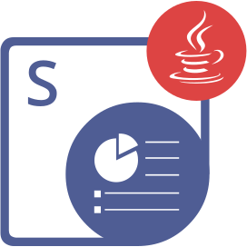

Aspose.Slides for PHP via Java 是一個類別庫，用於在 PHP 應用程式中建立、讀取、編輯和轉換 PowerPoint 與 OpenDocument 簡報，無需 Microsoft PowerPoint 或 Office Automation。

它能載入與儲存 PPT、PPTX、PPS、POT 與 ODP，包含含巨集與範本的變體，並可匯出為 PDF、XPS、HTML、SVG、TIFF、Markdown 與影像。

<div style="clear:both"></div>

------

<div class="row">
<div class="col-md-4">
<p><b>開始使用</b></p>
<hr>
<p>快速入門</p>
<ul>
<li><a href="/slides/zh-hant/php-java/installation/">安裝</a></li>
<li><a href="/slides/zh-hant/php-java/create-presentation/">建立您的第一個簡報</a></li>
<li><a href="/slides/zh-hant/php-java/getting-started/">快速入門指南</a></li>
</ul>
<p>評估</p>
<ul>
<li><a href="/slides/zh-hant/php-java/supported-file-formats/">支援的檔案格式</a></li>
<li><a href="/slides/zh-hant/php-java/evaluate-aspose-slides/">試用版限制</a></li>
<li><a href="/slides/zh-hant/php-java/licensing/">授權</a></li>
</ul>
</div>
<div class="col-md-4">
<p><b>使用 Slides 建置</b></p>
<hr>
<p>常見任務</p>
<ul>
<li><a href="/slides/zh-hant/php-java/open-presentation/">開啟簡報</a></li>
<li><a href="/slides/zh-hant/php-java/save-presentation/">儲存簡報</a></li>
<li><a href="/slides/zh-hant/php-java/convert-powerpoint-to-pdf/">轉換為 PDF</a></li>
<li><a href="/slides/zh-hant/php-java/convert-slide/">將投影片轉為影像</a></li>
<li><a href="/slides/zh-hant/php-java/manage-text/">編輯文字與圖形</a></li>
</ul>
<p>Slides 工作流程</p>
<ul>
<li><a href="/slides/zh-hant/php-java/powerpoint-charts/">圖表</a></li>
<li><a href="/slides/zh-hant/php-java/powerpoint-animation/">動畫</a></li>
<li><a href="/slides/zh-hant/php-java/manage-media-files/">音訊與影片</a></li>
<li><a href="/slides/zh-hant/php-java/presentation-design/">投影片設計</a></li>
<li><a href="/slides/zh-hant/php-java/merge-presentation/">合併簡報</a></li>
</ul>
<p>範例</p>
<ul>
<li><a href="/slides/zh-hant/php-java/examples/">依投影片元素的範例</a></li>
</ul>
</div>
<div class="col-md-4">
<p><b>參考 &amp; 支援</b></p>
<hr>
<p>參考</p>
<ul>
<li><a href="https://reference.aspose.com/slides/php-java/">API 參考</a></li>
<li><a href="https://releases.aspose.com/slides/php-java/release-notes/">版本說明</a></li>
<li><a href="/slides/zh-hant/php-java/known-issues/">已知問題</a></li>
<li><a href="https://releases.aspose.com/slides/php-java/">下載</a></li>
</ul>
<p>支援</p>
<ul>
<li><a href="https://forum.aspose.com/c/slides/11">免費技術論壇</a></li>
<li><a href="https://helpdesk.aspose.com/">付費支援服務台</a></li>
</ul>
</div>
</div>

------

## **您的第一個簡報**

Aspose.Slides for PHP via Java 於 Apache Tomcat 內的 Java 上執行，您的 PHP 程式透過 PHP/Java Bridge 存取它。[Installation](/slides/zh-hant/php-java/installation/) 會設定 PHP 8.3 或更早版本、Java、Tomcat 與橋接程式，然後在專案資料夾中從 Packagist 安裝套件：

```bash
composer require aspose/slides
```

接著將套件的 JAR 檔案複製到橋接程式中並重新啟動 Tomcat，步驟請參考 [Install on Linux](/slides/zh-hant/php-java/installation/#install-on-linux) 的第 4 步或 [Install on Windows](/slides/zh-hant/php-java/installation/#install-on-windows) 的第 6 步。Tomcat 執行中時，將此腳本儲存為 *hello.php* 於專案資料夾，並執行 `php hello.php`：

```php
<?php
require_once("http://localhost:8080/JavaBridge/java/Java.inc");
require_once(__DIR__ . "/vendor/aspose/slides/zh-hant/lib/aspose.slides.php");

use aspose\slides\Presentation;
use aspose\slides\SaveFormat;
use aspose\slides\ShapeType;

$presentation = new Presentation();
try {
    $slide = $presentation->getSlides()->get_Item(0);
    $shape = $slide->getShapes()->addAutoShape(ShapeType::Rectangle, 50, 50, 400, 100);
    $shape->getTextFrame()->setText("Hello, Aspose.Slides!");
    $presentation->save(__DIR__ . "/hello.pptx", SaveFormat::Pptx);
} finally {
    $presentation->dispose();
}
```

此腳本會在同一目錄下儲存 *hello.pptx*，其中包含一張帶有文字方塊的投影片。若未取得授權，儲存的檔案會帶有評估水印 —— 請參閱 [Licensing](/slides/zh-hant/php-java/licensing/)。欲了解更多建立與填寫簡報的方法，請參考 [Create Presentations](/slides/zh-hant/php-java/create-presentation/).