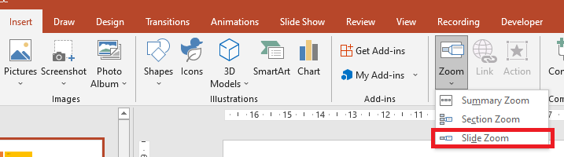

## **簡介**

PowerPoint 中的縮放功能可讓您在簡報的特定投影片、章節與區段之間快速跳轉。當您在演示時，這種快速導覽的能力可能會非常有用。


* 若要在單一投影片上概括整個簡報，請使用[摘要縮放](#Summary-Zoom)。
* 若只想顯示選取的投影片，請使用[投影片縮放](#Slide-Zoom)。
* 若只想顯示單一章節，請使用[章節縮放](#Section-Zoom)。

## **投影片縮放**
投影片縮放可使您的簡報更具動態性，讓您可依任意順序自由切換投影片，而不會中斷簡報的流程。投影片縮放非常適合沒有太多章節的短篇簡報，但在不同的簡報情境中也可加以運用。

投影片縮放協助您在感覺像是一張畫布的畫面上，深入探索多段資訊。



對於投影片縮放物件，Aspose.Slides 提供了 [ZoomImageType](https://reference.aspose.com/slides/zh-hant/php-java/aspose.slides/zoomimagetype/) 列舉、[ZoomFrame](https://reference.aspose.com/slides/zh-hant/php-java/aspose.slides/zoomframe/) 類別，以及 [ShapeCollection](https://reference.aspose.com/slides/zh-hant/php-java/aspose.slides/shapecollection/) 類別下的多個方法。

### **建立縮放框格**

您可以依以下步驟在投影片上加入縮放框格：

1. 建立 [Presentation](https://reference.aspose.com/slides/zh-hant/php-java/aspose.slides/presentation/) 類別的實例。
2. 建立您打算連結縮放框格的新的投影片。
3. 為建立的投影片加入識別文字與背景。
4. 將縮放框格（包含對已建立投影片的參照）加入第一張投影片。
5. 將修改後的簡報寫入為 PPTX 檔案。

此 PHP 程式碼示範如何在投影片上建立縮放框格：

```php
  $pres = new Presentation();
  try {
    # 新增投影片至簡報
    $slide2 = $pres->getSlides()->addEmptySlide($pres->getSlides()->get_Item(0)->getLayoutSlide());
    $slide3 = $pres->getSlides()->addEmptySlide($pres->getSlides()->get_Item(0)->getLayoutSlide());
    # 為第二張投影片建立背景
    $slide2->getBackground()->setType(BackgroundType::OwnBackground);
    $slide2->getBackground()->getFillFormat()->setFillType(FillType::Solid);
    $slide2->getBackground()->getFillFormat()->getSolidFillColor()->setColor(java("java.awt.Color")->cyan);
    # 為第二張投影片建立文字方塊
    $autoshape = $slide2->getShapes()->addAutoShape(ShapeType::Rectangle, 100, 200, 500, 200);
    $autoshape->getTextFrame()->setText("Second Slide");
    # 為第三張投影片建立背景
    $slide3->getBackground()->setType(BackgroundType::OwnBackground);
    $slide3->getBackground()->getFillFormat()->setFillType(FillType::Solid);
    $slide3->getBackground()->getFillFormat()->getSolidFillColor()->setColor(java("java.awt.Color")->darkGray);
    # 為第三張投影片建立文字方塊
    $autoshape = $slide3->getShapes()->addAutoShape(ShapeType::Rectangle, 100, 200, 500, 200);
    $autoshape->getTextFrame()->setText("Trird Slide");
    # 新增 ZoomFrame 物件
    $pres->getSlides()->get_Item(0)->getShapes()->addZoomFrame(20, 20, 250, 200, $slide2);
    $pres->getSlides()->get_Item(0)->getShapes()->addZoomFrame(200, 250, 250, 200, $slide3);
    # 儲存簡報
    $pres->save("presentation.pptx", SaveFormat::Pptx);
  } finally {
    if (!java_is_null($pres)) {
      $pres->dispose();
    }
  }
```
### **使用自訂影像建立縮放框格**
使用 Aspose.Slides for PHP via Java，您可以依以下方式使用不同的投影片預覽圖建立縮放框格：

1. 建立 [Presentation](https://reference.aspose.com/slides/zh-hant/php-java/aspose.slides/presentation/) 類別的實例。
2. 建立您打算連結縮放框格的新投影片。
3. 為該投影片加入識別文字與背景。
4. 透過將影像加入與 [Presentation](https://reference.aspose.com/slides/zh-hant/php-java/aspose.slides/presentation/) 物件相關的 Images 集合，建立一個 [PPImage](https://reference.aspose.com/slides/zh-hant/php-java/aspose.slides/ppimage/) 物件，以作為填滿框格的圖像。
5. 將縮放框格（包含對已建立投影片的參照）加入第一張投影片。
6. 將修改後的簡報寫入為 PPTX 檔案。

此 PHP 程式碼示範如何使用不同影像建立縮放框格：

```php
  $pres = new Presentation();
  try {
    # 新增投影片至簡報
    $slide = $pres->getSlides()->addEmptySlide($pres->getSlides()->get_Item(0)->getLayoutSlide());
    # 為第二張投影片建立背景
    $slide->getBackground()->setType(BackgroundType::OwnBackground);
    $slide->getBackground()->getFillFormat()->setFillType(FillType::Solid);
    $slide->getBackground()->getFillFormat()->getSolidFillColor()->setColor(java("java.awt.Color")->cyan);
    # 為第三張投影片建立文字方塊
    $autoshape = $slide->getShapes()->addAutoShape(ShapeType::Rectangle, 100, 200, 500, 200);
    $autoshape->getTextFrame()->setText("Second Slide");
    # 為縮放物件建立新影像
    $picture;
    $image = Images->fromFile("image.png");
    try {
      $picture = $pres->getImages()->addImage($image);
    } finally {
      if (!java_is_null($image)) {
        $image->dispose();
      }
    }
    # 新增 ZoomFrame 物件
    $pres->getSlides()->get_Item(0)->getShapes()->addZoomFrame(20, 20, 300, 200, $slide, $picture);
    # 儲存簡報
    $pres->save("presentation.pptx", SaveFormat::Pptx);
  } catch (JavaException $e) {
  } finally {
    if (!java_is_null($pres)) {
      $pres->dispose();
    }
  }
```
### **格式化縮放框格**
在前面的章節中，我們示範了如何建立簡單的縮放框格。若要建立更複雜的縮放框格，您必須變更簡單框格的格式。您可以對縮放框格套用多種格式設定。

您可依以下方式在投影片上控制縮放框格的格式：

1. 建立 [Presentation](https://reference.aspose.com/slides/zh-hant/php-java/aspose.slides/presentation/) 類別的實例。
2. 建立您打算連結縮放框格的新的投影片。
3. 為建立的投影片加入一些識別文字與背景。
4. 將縮放框格（包含對已建立投影片的參照）加入第一張投影片。
5. 透過將影像加入與 [Presentation](https://reference.aspose.com/slides/zh-hant/php-java/aspose.slides/presentation/) 物件相關的 Images 集合，建立一個 [PPImage](https://reference.aspose.com/slides/zh-hant/php-java/aspose.slides/ppimage/) 物件，以作為填滿框格的圖像。
6. 為第一個縮放框格物件設定自訂影像。
7. 變更第二個縮放框格物件的線條格式。
8. 移除第二個縮放框格物件影像的背景。
9. 將修改後的簡報寫入為 PPTX 檔案。

此 PHP 程式碼示範如何在投影片上變更縮放框格的格式：

```php
  $pres = new Presentation();
  try {
    # 新增投影片至簡報
    $slide2 = $pres->getSlides()->addEmptySlide($pres->getSlides()->get_Item(0)->getLayoutSlide());
    $slide3 = $pres->getSlides()->addEmptySlide($pres->getSlides()->get_Item(0)->getLayoutSlide());
    # 為第二張投影片建立背景
    $slide2->getBackground()->setType(BackgroundType::OwnBackground);
    $slide2->getBackground()->getFillFormat()->setFillType(FillType::Solid);
    $slide2->getBackground()->getFillFormat()->getSolidFillColor()->setColor(java("java.awt.Color")->cyan);
    # 為第二張投影片建立文字方塊
    $autoshape = $slide2->getShapes()->addAutoShape(ShapeType::Rectangle, 100, 200, 500, 200);
    $autoshape->getTextFrame()->setText("Second Slide");
    # 為第三張投影片建立背景
    $slide3->getBackground()->setType(BackgroundType::OwnBackground);
    $slide3->getBackground()->getFillFormat()->setFillType(FillType::Solid);
    $slide3->getBackground()->getFillFormat()->getSolidFillColor()->setColor(java("java.awt.Color")->darkGray);
    # 為第三張投影片建立文字方塊
    $autoshape = $slide3->getShapes()->addAutoShape(ShapeType::Rectangle, 100, 200, 500, 200);
    $autoshape->getTextFrame()->setText("Trird Slide");
    # 新增 ZoomFrame 物件
    $zoomFrame1 = $pres->getSlides()->get_Item(0)->getShapes()->addZoomFrame(20, 20, 250, 200, $slide2);
    $zoomFrame2 = $pres->getSlides()->get_Item(0)->getShapes()->addZoomFrame(200, 250, 250, 200, $slide3);
    # 為縮放物件建立新影像
    $picture;
    $image = Images->fromFile("image.png");
    try {
      $picture = $pres->getImages()->addImage($image);
    } finally {
      if (!java_is_null($image)) {
        $image->dispose();
      }
    }
    # 為 zoomFrame1 物件設定自訂影像
    $zoomFrame1->setImage($picture);
    # 為 zoomFrame2 物件設定縮放框格格式
    $zoomFrame2->getLineFormat()->setWidth(5);
    $zoomFrame2->getLineFormat()->getFillFormat()->setFillType(FillType::Solid);
    $zoomFrame2->getLineFormat()->getFillFormat()->getSolidFillColor()->setColor(java("java.awt.Color")->pink);
    $zoomFrame2->getLineFormat()->setDashStyle(LineDashStyle->DashDot);
    # 設定 zoomFrame2 物件不顯示背景
    $zoomFrame2->setShowBackground(false);
    # 儲存簡報
    $pres->save("presentation.pptx", SaveFormat::Pptx);
  } catch (JavaException $e) {
  } finally {
    if (!java_is_null($pres)) {
      $pres->dispose();
    }
  }
```

## **章節縮放**

章節縮放是指向簡報中某個章節的連結。您可以使用章節縮放返回想特別強調的章節，或是用來突顯簡報中各段落之間的關聯。


對於章節縮放物件，Aspose.Slides 提供了 [SectionZoomFrame](https://reference.aspose.com/slides/zh-hant/php-java/aspose.slides/sectionzoomframe/) 類別，以及 [ShapeCollection](https://reference.aspose.com/slides/zh-hant/php-java/aspose.slides/shapecollection/) 類別下的多個方法。

### **建立章節縮放框格**

您可以依以下步驟將章節縮放框格加入投影片：

1. 建立 [Presentation](https://reference.aspose.com/slides/zh-hant/php-java/aspose.slides/presentation/) 類別的實例。
2. 建立一張新投影片。
3. 為建立的投影片加入識別背景。
4. 建立您打算連結縮放框格的新章節。
5. 將章節縮放框格（包含對已建立章節的參照）加入第一張投影片。
6. 將修改後的簡報寫入為 PPTX 檔案。

此 PHP 程式碼示範如何在投影片上建立章節縮放框格：

```php
  $pres = new Presentation();
  try {
    # 新增投影片至簡報
    $slide = $pres->getSlides()->addEmptySlide($pres->getSlides()->get_Item(0)->getLayoutSlide());
    $slide->getBackground()->getFillFormat()->setFillType(FillType::Solid);
    $slide->getBackground()->getFillFormat()->getSolidFillColor()->setColor(java("java.awt.Color")->yellow);
    $slide->getBackground()->setType(BackgroundType::OwnBackground);
    # 為簡報新增章節
    $pres->getSections()->addSection("Section 1", $slide);
    # 新增 SectionZoomFrame 物件
    $sectionZoomFrame = $pres->getSlides()->get_Item(0)->getShapes()->addSectionZoomFrame(20, 20, 300, 200, $pres->getSections()->get_Item(1));
    # 儲存簡報
    $pres->save("presentation.pptx", SaveFormat::Pptx);
  } finally {
    if (!java_is_null($pres)) {
      $pres->dispose();
    }
  }
```
### **使用自訂影像建立章節縮放框格**

使用 Aspose.Slides for PHP via Java，您可以依以下方式使用不同的投影片預覽圖建立章節縮放框格：

1. 建立 [Presentation](https://reference.aspose.com/slides/zh-hant/php-java/aspose.slides/presentation/) 類別的實例。
2. 建立一張新投影片。
3. 為建立的投影片加入識別背景。
4. 建立您打算連結縮放框格的新章節。
5. 透過將影像加入與 [Presentation](https://reference.aspose.com/slides/zh-hant/php-java/aspose.slides/presentation/) 物件相關的 Images 集合，建立一個 [PPImage](https://reference.aspose.com/slides/zh-hant/php-java/aspose.slides/ppimage/) 物件，以作為填滿框格的圖像。
6. 將章節縮放框格（包含對已建立章節的參照）加入第一張投影片。
7. 將修改後的簡報寫入為 PPTX 檔案。

此 PHP 程式碼示範如何使用不同影像建立章節縮放框格：

```php
  $pres = new Presentation();
  try {
    # 新增投影片至簡報
    $slide = $pres->getSlides()->addEmptySlide($pres->getSlides()->get_Item(0)->getLayoutSlide());
    $slide->getBackground()->getFillFormat()->setFillType(FillType::Solid);
    $slide->getBackground()->getFillFormat()->getSolidFillColor()->setColor(java("java.awt.Color")->yellow);
    $slide->getBackground()->setType(BackgroundType::OwnBackground);
    # 為簡報新增章節
    $pres->getSections()->addSection("Section 1", $slide);
    # 為縮放物件建立新影像
    $picture;
    $image = Images->fromFile("image.png");
    try {
      $picture = $pres->getImages()->addImage($image);
    } finally {
      if (!java_is_null($image)) {
        $image->dispose();
      }
    }
    # 新增 SectionZoomFrame 物件
    $sectionZoomFrame = $pres->getSlides()->get_Item(0)->getShapes()->addSectionZoomFrame(20, 20, 300, 200, $pres->getSections()->get_Item(1), $picture);
    # 儲存簡報
    $pres->save("presentation.pptx", SaveFormat::Pptx);
  } catch (JavaException $e) {
  } finally {
    if (!java_is_null($pres)) {
      $pres->dispose();
    }
  }
```
### **格式化章節縮放框格**

若要建立更複雜的章節縮放框格，您必須變更簡單框格的格式。您可以對章節縮放框格套用多種格式設定。

您可依以下方式在投影片上控制章節縮放框格的格式：

1. 建立 [Presentation](https://reference.aspose.com/slides/zh-hant/php-java/aspose.slides/presentation/) 類別的實例。
2. 建立一張新投影片。
3. 為建立的投影片加入識別背景。
4. 建立您打算連結縮放框格的新章節。
5. 將章節縮放框格（包含對已建立章節的參照）加入第一張投影片。
6. 變更已建立章節縮放物件的大小與位置。
7. 透過將影像加入與 [Presentation](https://reference.aspose.com/slides/zh-hant/php-java/aspose.slides/presentation/) 物件相關的 Images 集合，建立一個 [PPImage](https://reference.aspose.com/slides/zh-hant/php-java/aspose.slides/ppimage/) 物件，以作為填滿框格的圖像。
8. 為已建立的章節縮放框格物件設定自訂影像。
9. 設定*從連結章節返回原始投影片*的功能。
10. 移除章節縮放框格物件影像的背景。
11. 變更第二個縮放框格物件的線條格式。
12. 變更過渡時間長度。
13. 將修改後的簡報寫入為 PPTX 檔案。

此 PHP 程式碼示範如何變更章節縮放框格的格式：

```php
  $pres = new Presentation();
  try {
    # 新增投影片至簡報
    $slide = $pres->getSlides()->addEmptySlide($pres->getSlides()->get_Item(0)->getLayoutSlide());
    $slide->getBackground()->getFillFormat()->setFillType(FillType::Solid);
    $slide->getBackground()->getFillFormat()->getSolidFillColor()->setColor(java("java.awt.Color")->yellow);
    $slide->getBackground()->setType(BackgroundType::OwnBackground);
    # 為簡報新增章節
    $pres->getSections()->addSection("Section 1", $slide);
    # 新增 SectionZoomFrame 物件
    $sectionZoomFrame = $pres->getSlides()->get_Item(0)->getShapes()->addSectionZoomFrame(20, 20, 300, 200, $pres->getSections()->get_Item(1));
    # SectionZoomFrame 格式設定
    $sectionZoomFrame->setX(100);
    $sectionZoomFrame->setY(300);
    $sectionZoomFrame->setWidth(100);
    $sectionZoomFrame->setHeight(75);
    $picture;
    $image = Images->fromFile("image.png");
    try {
      $picture = $pres->getImages()->addImage($image);
    } finally {
      if (!java_is_null($image)) {
        $image->dispose();
      }
    }
    $sectionZoomFrame->setImage($picture);
    $sectionZoomFrame->setReturnToParent(true);
    $sectionZoomFrame->setShowBackground(false);
    $sectionZoomFrame->getLineFormat()->getFillFormat()->setFillType(FillType::Solid);
    $sectionZoomFrame->getLineFormat()->getFillFormat()->getSolidFillColor()->setColor(java("java.awt.Color")->gray);
    $sectionZoomFrame->getLineFormat()->setDashStyle(LineDashStyle->DashDot);
    $sectionZoomFrame->getLineFormat()->setWidth(2.5);
    $sectionZoomFrame->setTransitionDuration(1.5);
    # 儲存簡報
    $pres->save("presentation.pptx", SaveFormat::Pptx);
  } catch (JavaException $e) {
  } finally {
    if (!java_is_null($pres)) {
      $pres->dispose();
    }
  }
```

## **摘要縮放**

摘要縮放類似於一個登入頁面，會一次顯示簡報的所有部份。當您在演示時，您可以使用縮放功能任意順序從簡報的任一位置跳至另一位置。您可以發揮創意、跳過某些段落，或重新檢視投影片，而不會中斷簡報的流程。


對於摘要縮放物件，Aspose.Slides 提供了 [SummaryZoomFrame](https://reference.aspose.com/slides/zh-hant/php-java/aspose.slides/summaryzoomframe/)、[SummaryZoomSection](https://reference.aspose.com/slides/zh-hant/php-java/aspose.slides/summaryzoomsection/)、以及 [SummaryZoomSectionCollection](https://reference.aspose.com/slides/zh-hant/php-java/aspose.slides/summaryzoomsectioncollection/) 類別，還有 [ShapeCollection](https://reference.aspose.com/slides/zh-hant/php-java/aspose.slides/shapecollection/) 類別下的多個方法。

### **建立摘要縮放**

您可以依以下步驟將摘要縮放框格加入投影片：

1. 建立 [Presentation](https://reference.aspose.com/slides/zh-hant/php-java/aspose.slides/presentation/) 類別的實例。
2. 為建立的投影片加入識別背景，並為每張投影片建立新章節。
3. 將摘要縮放框格加入第一張投影片。
4. 將修改後的簡報寫入為 PPTX 檔案。

此 PHP 程式碼示範如何在投影片上建立摘要縮放框格：

```php
  $pres = new Presentation();
  try {
    # 新增投影片至簡報
    $slide = $pres->getSlides()->addEmptySlide($pres->getSlides()->get_Item(0)->getLayoutSlide());
    $slide->getBackground()->getFillFormat()->setFillType(FillType::Solid);
    $slide->getBackground()->getFillFormat()->getSolidFillColor()->setColor(java("java.awt.Color")->gray);
    $slide->getBackground()->setType(BackgroundType::OwnBackground);
    # 為簡報新增章節
    $pres->getSections()->addSection("Section 1", $slide);
    # 新增投影片至簡報
    $slide = $pres->getSlides()->addEmptySlide($pres->getSlides()->get_Item(0)->getLayoutSlide());
    $slide->getBackground()->getFillFormat()->setFillType(FillType::Solid);
    $slide->getBackground()->getFillFormat()->getSolidFillColor()->setColor(java("java.awt.Color")->cyan);
    $slide->getBackground()->setType(BackgroundType::OwnBackground);
    # 為簡報新增章節
    $pres->getSections()->addSection("Section 2", $slide);
    # 新增投影片至簡報
    $slide = $pres->getSlides()->addEmptySlide($pres->getSlides()->get_Item(0)->getLayoutSlide());
    $slide->getBackground()->getFillFormat()->setFillType(FillType::Solid);
    $slide->getBackground()->getFillFormat()->getSolidFillColor()->setColor(java("java.awt.Color")->magenta);
    $slide->getBackground()->setType(BackgroundType::OwnBackground);
    # 為簡報新增章節
    $pres->getSections()->addSection("Section 3", $slide);
    # 新增投影片至簡報
    $slide = $pres->getSlides()->addEmptySlide($pres->getSlides()->get_Item(0)->getLayoutSlide());
    $slide->getBackground()->getFillFormat()->setFillType(FillType::Solid);
    $slide->getBackground()->getFillFormat()->getSolidFillColor()->setColor(java("java.awt.Color")->green);
    $slide->getBackground()->setType(BackgroundType::OwnBackground);
    # 為簡報新增章節
    $pres->getSections()->addSection("Section 4", $slide);
    # 新增 SummaryZoomFrame 物件
    $summaryZoomFrame = $pres->getSlides()->get_Item(0)->getShapes()->addSummaryZoomFrame(150, 50, 300, 200);
    # 儲存簡報
    $pres->save("presentation.pptx", SaveFormat::Pptx);
  } finally {
    if (!java_is_null($pres)) {
      $pres->dispose();
    }
  }
```

### **新增與移除摘要縮放章節**

摘要縮放框格中的所有章節皆由 [SummaryZoomSection](https://reference.aspose.com/slides/zh-hant/php-java/aspose.slides/summaryzoomsection/) 物件表示，且儲存在 [SummaryZoomSectionCollection](https://reference.aspose.com/slides/zh-hant/php-java/aspose.slides/summaryzoomsectioncollection/) 物件中。您可以透過 [SummaryZoomSectionCollection](https://reference.aspose.com/slides/zh-hant/php-java/aspose.slides/summaryzoomsectioncollection/) 類別依以下方式新增或移除摘要縮放章節物件：

1. 建立 [Presentation](https://reference.aspose.com/slides/zh-hant/php-java/aspose.slides/presentation/) 類別的實例。
2. 為建立的投影片加入識別背景，並為每張投影片建立新章節。
3. 將摘要縮放框格加入第一張投影片。
4. 為簡報新增一張投影片與章節。
5. 將建立的章節加入摘要縮放框格。
6. 從摘要縮放框格中移除第一個章節。
7. 將修改後的簡報寫入為 PPTX 檔案。

此 PHP 程式碼示範如何在摘要縮放框格中新增與移除章節：

```php
  $pres = new Presentation();
  try {
    # 新增投影片至簡報
    $slide = $pres->getSlides()->addEmptySlide($pres->getSlides()->get_Item(0)->getLayoutSlide());
    $slide->getBackground()->getFillFormat()->setFillType(FillType::Solid);
    $slide->getBackground()->getFillFormat()->getSolidFillColor()->setColor(java("java.awt.Color")->gray);
    $slide->getBackground()->setType(BackgroundType::OwnBackground);
    # 為簡報新增章節
    $pres->getSections()->addSection("Section 1", $slide);
    # 新增投影片至簡報
    $slide = $pres->getSlides()->addEmptySlide($pres->getSlides()->get_Item(0)->getLayoutSlide());
    $slide->getBackground()->getFillFormat()->setFillType(FillType::Solid);
    $slide->getBackground()->getFillFormat()->getSolidFillColor()->setColor(java("java.awt.Color")->cyan);
    $slide->getBackground()->setType(BackgroundType::OwnBackground);
    # 為簡報新增章節
    $pres->getSections()->addSection("Section 2", $slide);
    # 新增 SummaryZoomFrame 物件
    $summaryZoomFrame = $pres->getSlides()->get_Item(0)->getShapes()->addSummaryZoomFrame(150, 50, 300, 200);
    # 新增投影片至簡報
    $slide = $pres->getSlides()->addEmptySlide($pres->getSlides()->get_Item(0)->getLayoutSlide());
    $slide->getBackground()->getFillFormat()->setFillType(FillType::Solid);
    $slide->getBackground()->getFillFormat()->getSolidFillColor()->setColor(java("java.awt.Color")->magenta);
    $slide->getBackground()->setType(BackgroundType::OwnBackground);
    # 為簡報新增章節
    $section3 = $pres->getSections()->addSection("Section 3", $slide);
    # 將章節加入 Summary Zoom
    $summaryZoomFrame->getSummaryZoomCollection()->addSummaryZoomSection($section3);
    # 從 Summary Zoom 移除章節
    $summaryZoomFrame->getSummaryZoomCollection()->removeSummaryZoomSection($pres->getSections()->get_Item(1));
    # 儲存簡報
    $pres->save("presentation.pptx", SaveFormat::Pptx);
  } finally {
    if (!java_is_null($pres)) {
      $pres->dispose();
    }
  }
```

### **格式化摘要縮放章節**

若要建立更複雜的摘要縮放章節物件，您必須變更簡單框格的格式。您可以對摘要縮放章節物件套用多種格式設定。

您可依以下方式在摘要縮放框格中控制摘要縮放章節物件的格式：

1. 建立 [Presentation](https://reference.aspose.com/slides/zh-hant/php-java/aspose.slides/presentation/) 類別的實例。
2. 為建立的投影片加入識別背景，並為每張投影片建立新章節。
3. 將摘要縮放框格加入第一張投影片。
4. 從 `SummaryZoomSectionCollection` 取得第一個摘要縮放章節物件。
5. 透過將影像加入與 [Presentation](https://reference.aspose.com/slides/zh-hant/php-java/aspose.slides/presentation/) 物件相關的 images 集合，建立一個 [PPImage](https://reference.aspose.com/slides/zh-hant/php-java/aspose.slides/ppimage/) 物件，以作為填滿框格的圖像。
6. 為已建立的章節縮放框格物件設定自訂影像。
7. 設定*從連結章節返回原始投影片*的功能。
8. 變更第二個縮放框格物件的線條格式。
9. 變更過渡時間長度。
10. 將修改後的簡報寫入為 PPTX 檔案。

此 PHP 程式碼示範如何變更摘要縮放章節物件的格式：

```php
  $pres = new Presentation();
  try {
    # 新增投影片至簡報
    $slide = $pres->getSlides()->addEmptySlide($pres->getSlides()->get_Item(0)->getLayoutSlide());
    $slide->getBackground()->getFillFormat()->setFillType(FillType::Solid);
    $slide->getBackground()->getFillFormat()->getSolidFillColor()->setColor(java("java.awt.Color")->gray);
    $slide->getBackground()->setType(BackgroundType::OwnBackground);
    # 為簡報新增章節
    $pres->getSections()->addSection("Section 1", $slide);
    # 新增投影片至簡報
    $slide = $pres->getSlides()->addEmptySlide($pres->getSlides()->get_Item(0)->getLayoutSlide());
    $slide->getBackground()->getFillFormat()->setFillType(FillType::Solid);
    $slide->getBackground()->getFillFormat()->getSolidFillColor()->setColor(java("java.awt.Color")->cyan);
    $slide->getBackground()->setType(BackgroundType::OwnBackground);
    # 為簡報新增章節
    $pres->getSections()->addSection("Section 2", $slide);
    # 新增 SummaryZoomFrame 物件
    $summaryZoomFrame = $pres->getSlides()->get_Item(0)->getShapes()->addSummaryZoomFrame(150, 50, 300, 200);
    # 取得第一個 SummaryZoomSection 物件
    $summarySection = $summaryZoomFrame->getSummaryZoomCollection()->get_Item(0);
    # SummaryZoomSection 物件的格式設定
    $picture;
    $image = Images->fromFile("image.png");
    try {
      $picture = $pres->getImages()->addImage($picture);
    } finally {
      if (!java_is_null($image)) {
        $image->dispose();
      }
    }
    $summarySection->setImage($picture);
    $summarySection->setReturnToParent(false);
    $summarySection->getLineFormat()->getFillFormat()->setFillType(FillType::Solid);
    $summarySection->getLineFormat()->getFillFormat()->getSolidFillColor()->setColor(java("java.awt.Color")->black);
    $summarySection->getLineFormat()->setDashStyle(LineDashStyle->DashDot);
    $summarySection->getLineFormat()->setWidth(1.5);
    $summarySection->setTransitionDuration(1.5);
    # 儲存簡報
    $pres->save("presentation.pptx", SaveFormat::Pptx);
  } catch (JavaException $e) {
  } finally {
    if (!java_is_null($pres)) {
      $pres->dispose();
    }
  }
```

## **常見問題**

**顯示目標後，我能控制返回「父」投影片嗎？**

可以。[Zoom frame](https://reference.aspose.com/slides/zh-hant/php-java/aspose.slides/zoomframe/) 或 [section](https://reference.aspose.com/slides/zh-hant/php-java/aspose.slides/sectionzoomframe/) 具有 `ReturnToParent` 行為，啟用時會在觀看者瀏覽完目標內容後將其送回原始投影片。

**我可以調整縮放過渡的「速度」或持續時間嗎？**

可以。縮放支援設定 `TransitionDuration`，讓您控制跳轉動畫的時長。

**簡報能包含多少個縮放物件有限制嗎？**

目前文件中未列出硬性 API 限制。實際上限取決於簡報的整體複雜度與檢視器的效能。您可以加入許多縮放框格，但仍需考量檔案大小與渲染時間。