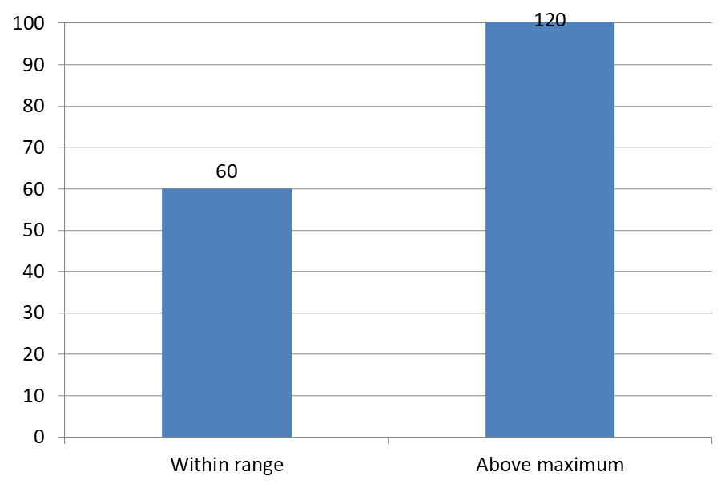

## **簡介**

資料標籤顯示有關圖表系列和單個資料點的資訊，協助讀者辨識數值並理解圖表。本篇文章說明如何格式化數值、顯示百分比、讀取標籤文字、在軸最大值之外控制標籤、調整類別軸標籤間距，以及設定圓形圖標籤的位置。

## **設定圖表資料標籤的資料精度**

使用 [setNumberFormatOfValues](https://reference.aspose.com/slides/zh-hant/php-java/aspose.slides/chartseries/#setNumberFormatOfValues) 來格式化系列數值。本範例建立一個具有預設資料的折線圖，顯示其資料表，並為第一個系列啟用數值標籤。格式 `#,##0.00` 會顯示千位分隔符號和兩位小數，而不會變更實際的數值。

```php
use aspose\slides\Presentation;
use aspose\slides\ChartType;
use aspose\slides\SaveFormat;

$presentation = new Presentation();
try {
    $slide = $presentation->getSlides()->get_Item(0);

    $chart = $slide->getShapes()->addChart(ChartType::Line, 50, 50, 450, 300);
    $chart->setDataTable(true);

    $series = $chart->getChartData()->getSeries()->get_Item(0);
    $series->setNumberFormatOfValues("#,##0.00");
    $series->getLabels()->getDefaultDataLabelFormat()->setShowValue(true);

    $presentation->save("PrecisionOfDatalabels_out.pptx", SaveFormat::Pptx);
} finally {
    $presentation->dispose();
}
```

## **顯示百分比作為標籤**

對於堆疊直條圖，將每個數值計算為其類別總和的百分比，並將文字指派給 [getTextFrameForOverriding](https://reference.aspose.com/slides/zh-hant/php-java/aspose.slides/datalabel/#getTextFrameForOverriding) 所回傳的文字框。本範例使用預設圖表資料，並以 8 點字型顯示兩位小數的百分比。總和為零的類別會被略過，以避免除以零。若圖表資料變更，需重新計算自訂標籤文字。

```php
use aspose\slides\Presentation;
use aspose\slides\ChartType;
use aspose\slides\Portion;
use aspose\slides\SaveFormat;

$presentation = new Presentation();
try {
    $slide = $presentation->getSlides()->get_Item(0);

    $chart = $slide->getShapes()->addChart(ChartType::StackedColumn, 20, 20, 400, 400);

    $categoryCount = java_values($chart->getChartData()->getCategories()->size());
    $categoryTotals = array_fill(0, $categoryCount, 0.0);
    for ($k = 0; $k < $categoryCount; $k++) {
        for ($i = 0; $i < java_values($chart->getChartData()->getSeries()->size()); $i++) {
            $series = $chart->getChartData()->getSeries()->get_Item($i);
            $pointValue = java_values($series->getDataPoints()->get_Item($k)->getValue()->getData());
            $categoryTotals[$k] += $pointValue;
        }
    }

    for ($x = 0; $x < java_values($chart->getChartData()->getSeries()->size()); $x++) {
        $series = $chart->getChartData()->getSeries()->get_Item($x);
        $series->getLabels()->getDefaultDataLabelFormat()->setShowLegendKey(false);

        for ($j = 0; $j < java_values($series->getDataPoints()->size()); $j++) {
            $label = $series->getDataPoints()->get_Item($j)->getLabel();
            if ($categoryTotals[$j] == 0) {
                continue;
            }

            $pointValue = java_values($series->getDataPoints()->get_Item($j)->getValue()->getData());
            $dataPointPercent = ($pointValue / $categoryTotals[$j]) * 100;

            $portion = new Portion();
            $portion->setText(sprintf("%.2F %%", $dataPointPercent));
            $portion->getPortionFormat()->setFontHeight(8);

            $label->getTextFrameForOverriding()->setText("");
            $paragraph = $label->getTextFrameForOverriding()->getParagraphs()->get_Item(0);
            $paragraph->getPortions()->add($portion);

            $label->getDataLabelFormat()->setShowValue(true);
            $label->getDataLabelFormat()->setShowSeriesName(false);
            $label->getDataLabelFormat()->setShowPercentage(false);
            $label->getDataLabelFormat()->setShowLegendKey(false);
            $label->getDataLabelFormat()->setShowCategoryName(false);
            $label->getDataLabelFormat()->setShowBubbleSize(false);
        }
    }

    $presentation->save("DisplayPercentageAsLabels_out.pptx", SaveFormat::Pptx);
} finally {
    $presentation->dispose();
}
```

## **設定圖表資料標籤的百分號**

當數值以分數形式儲存時，使用 [setNumberFormat](https://reference.aspose.com/slides/zh-hant/php-java/aspose.slides/datalabelformat/#setNumberFormat) 來顯示百分比。將 `false` 傳遞給 [setNumberFormatLinkedToSource](https://reference.aspose.com/slides/zh-hant/php-java/aspose.slides/datalabelformat/#setNumberFormatLinkedToSource) 可使標籤格式獨立於來源儲存格。

此範例建立一個 100% 堆疊直條圖，四個類別中包含紅色與藍色系列。每對數值之和為 1。標籤格式 `0.0%` 會將 0.30 顯示為 30.0%，而垂直軸則使用兩位小數。兩個系列皆使用白色、10 點的標籤文字。

```php
use aspose\slides\Presentation;
use aspose\slides\ChartType;
use aspose\slides\FillType;
use aspose\slides\SaveFormat;

$presentation = new Presentation();
try {
    $slide = $presentation->getSlides()->get_Item(0);

    $chart = $slide->getShapes()->addChart(ChartType::PercentsStackedColumn, 20, 20, 500, 400);

    $chart->getAxes()->getVerticalAxis()->setNumberFormatLinkedToSource(false);
    $chart->getAxes()->getVerticalAxis()->setNumberFormat("0.00%");

    $chart->getChartData()->getSeries()->clear();
    $chart->getChartData()->getCategories()->clear();

    $workbook = $chart->getChartData()->getChartDataWorkbook();
    $worksheetIndex = 0;
    for ($i = 0; $i < 4; $i++) {
        $categoryCell = $workbook->getCell($worksheetIndex, $i + 1, 0, "Category " . ($i + 1));
        $chart->getChartData()->getCategories()->add($categoryCell);
    }

    $colors = java("java.awt.Color");
    $seriesNames = [ "Reds", "Blues" ];
    $seriesColors = [ $colors->RED, $colors->BLUE ];
    $values = [ [ 0.30, 0.50, 0.80, 0.65 ], [ 0.70, 0.50, 0.20, 0.35 ] ];

    for ($i = 0; $i < count($seriesNames); $i++) {
        $seriesCell = $workbook->getCell($worksheetIndex, 0, $i + 1, $seriesNames[$i]);
        $series = $chart->getChartData()->getSeries()->add($seriesCell, $chart->getType());
        for ($j = 0; $j < 4; $j++) {
            $valueCell = $workbook->getCell($worksheetIndex, $j + 1, $i + 1, $values[$i][$j]);
            $series->getDataPoints()->addDataPointForBarSeries($valueCell);
        }

        $series->getFormat()->getFill()->setFillType(FillType::Solid);
        $series->getFormat()->getFill()->getSolidFillColor()->setColor($seriesColors[$i]);

        $labelFormat = $series->getLabels()->getDefaultDataLabelFormat();
        $labelFormat->setShowValue(true);
        $labelFormat->setNumberFormatLinkedToSource(false);
        $labelFormat->setNumberFormat("0.0%");
        $labelFormat->getTextFormat()->getPortionFormat()->setFontHeight(10);
        $labelFormat->getTextFormat()->getPortionFormat()->getFillFormat()->setFillType(FillType::Solid);
        $labelFormat->getTextFormat()->getPortionFormat()->getFillFormat()->getSolidFillColor()->setColor($colors->WHITE);
    }

    $presentation->save("SetDataLabelsPercentageSign_out.pptx", SaveFormat::Pptx);
} finally {
    $presentation->dispose();
}
```

## **讀取資料標籤的實際文字**

使用 [getActualLabelText](https://reference.aspose.com/slides/zh-hant/php-java/aspose.slides/datalabel/#getActualLabelText) 來取得資料標籤設定所產生的文字。這在擷取標籤以供報告、搜尋簡報內容或驗證產生的圖表時非常有用。以下範例中，預設的 [data label format](https://reference.aspose.com/slides/zh-hant/php-java/aspose.slides/datalabelformat/) 會結合每個類別名稱、系列名稱與數值。某個點將其數值格式化為百分比，另一個則使用來自 [getTextFrameForOverriding](https://reference.aspose.com/slides/zh-hant/php-java/aspose.slides/datalabel/#getTextFrameForOverriding) 的自訂文字。

```php
use aspose\slides\Presentation;
use aspose\slides\ChartType;

$presentation = new Presentation();
try {
    $slide = $presentation->getSlides()->get_Item(0);

    $chart = $slide->getShapes()->addChart(ChartType::ClusteredColumn, 20, 20, 500, 300);

    $chart->getChartData()->getSeries()->clear();
    $chart->getChartData()->getCategories()->clear();

    $workbook = $chart->getChartData()->getChartDataWorkbook();
    $firstCategoryCell = $workbook->getCell(0, 1, 0, "Q1");
    $chart->getChartData()->getCategories()->add($firstCategoryCell);
    $secondCategoryCell = $workbook->getCell(0, 2, 0, "Q2");
    $chart->getChartData()->getCategories()->add($secondCategoryCell);

    $northSeriesCell = $workbook->getCell(0, 0, 1, "North");
    $north = $chart->getChartData()->getSeries()->add($northSeriesCell, $chart->getType());
    $northFirstValueCell = $workbook->getCell(0, 1, 1, 0.25);
    $north->getDataPoints()->addDataPointForBarSeries($northFirstValueCell);
    $northSecondValueCell = $workbook->getCell(0, 2, 1, 0.75);
    $north->getDataPoints()->addDataPointForBarSeries($northSecondValueCell);

    $southSeriesCell = $workbook->getCell(0, 0, 2, "South");
    $south = $chart->getChartData()->getSeries()->add($southSeriesCell, $chart->getType());
    $southFirstValueCell = $workbook->getCell(0, 1, 2, 0.40);
    $south->getDataPoints()->addDataPointForBarSeries($southFirstValueCell);
    $southSecondValueCell = $workbook->getCell(0, 2, 2, 0.60);
    $south->getDataPoints()->addDataPointForBarSeries($southSecondValueCell);

    for ($i = 0; $i < java_values($chart->getChartData()->getSeries()->size()); $i++) {
        $series = $chart->getChartData()->getSeries()->get_Item($i);
        $format = $series->getLabels()->getDefaultDataLabelFormat();
        $format->setShowCategoryName(true);
        $format->setShowSeriesName(true);
        $format->setShowValue(true);
    }

    $north->getLabels()->get_Item(1)->getDataLabelFormat()->setNumberFormatLinkedToSource(false);
    $north->getLabels()->get_Item(1)->getDataLabelFormat()->setNumberFormat("0%");
    $south->getLabels()->get_Item(0)->getTextFrameForOverriding()->setText("Reviewed");

    for ($i = 0; $i < java_values($chart->getChartData()->getSeries()->size()); $i++) {
        $series = $chart->getChartData()->getSeries()->get_Item($i);
        for ($j = 0; $j < java_values($series->getDataPoints()->size()); $j++) {
            $point = $series->getDataPoints()->get_Item($j);
            $label = $point->getLabel();
            if (!java_values($label->isVisible())) {
                continue;
            }

            echo "Value: " . java_values($point->getValue()->getData()) . "; label: " . java_values($label->getActualLabelText()) . PHP_EOL;
        }
    }
} finally {
    $presentation->dispose();
}
```

資料點中儲存的數字仍為 `0.75`，即使其標籤顯示 `75%` 並附帶類別與系列名稱。自訂文字會取代產生的標籤文字。無論哪種情況，[getActualLabelText](https://reference.aspose.com/slides/zh-hant/php-java/aspose.slides/datalabel/#getActualLabelText) 都會回傳最終的標籤字串。若只想擷取可見標籤，請如上所示，另外檢查 [isVisible](https://reference.aspose.com/slides/zh-hant/php-java/aspose.slides/datalabel/#isVisible)。

## **在軸最大值之外控制資料標籤**

當手動限制軸範圍時，某些資料點可能會超過其最大值。使用 [setShowDataLabelsOverMaximum](https://reference.aspose.com/slides/zh-hant/php-java/aspose.slides/chart/#setShowDataLabelsOverMaximum) 來控制是否顯示其資料標籤。此設定僅會變更標籤的可見性；不會改變軸範圍或底層資料值。

以下範例建立一個 2D 群組直條圖，數值為 60 與 120。於垂直軸上將 `false` 傳遞給 [setAutomaticMaxValue](https://reference.aspose.com/slides/zh-hant/php-java/aspose.slides/axis/#setAutomaticMaxValue) 並使用 [setMaxValue](https://reference.aspose.com/slides/zh-hant/php-java/aspose.slides/axis/#setMaxValue) 設定最大值為 100。第一張投影片允許標籤超過最大值；其副本則停用此功能。兩張投影片皆儲存為 `DataLabelsOverMaximum.pptx`。

使用 [setShowValue](https://reference.aspose.com/slides/zh-hant/php-java/aspose.slides/datalabelformat/#setShowValue) 來啟用數值標籤。圖表層級的設定本身不會啟用數值顯示，也不會覆寫個別標籤已停用的數值顯示。此範例為整個系列啟用數值，並使用 [setPosition](https://reference.aspose.com/slides/zh-hant/php-java/aspose.slides/datalabelformat/#setPosition) 將標籤放置於每個柱狀的外側端點。

```php
use aspose\slides\Presentation;
use aspose\slides\ChartType;
use aspose\slides\LegendDataLabelPosition;
use aspose\slides\SaveFormat;

$presentation = new Presentation();
try {
    $slide = $presentation->getSlides()->get_Item(0);

    $chart = $slide->getShapes()->addChart(ChartType::ClusteredColumn, 50, 50, 600, 400);
    $chart->setLegend(false);

    $chart->getChartData()->getSeries()->clear();
    $chart->getChartData()->getCategories()->clear();

    $workbook = $chart->getChartData()->getChartDataWorkbook();

    $firstCategory = $workbook->getCell(0, 1, 0, "Within range");
    $secondCategory = $workbook->getCell(0, 2, 0, "Above maximum");

    $chart->getChartData()->getCategories()->add($firstCategory);
    $chart->getChartData()->getCategories()->add($secondCategory);

    $seriesName = $workbook->getCell(0, 0, 1, "Values");
    $series = $chart->getChartData()->getSeries()->add($seriesName, $chart->getType());

    $firstValue = $workbook->getCell(0, 1, 1, 60);
    $secondValue = $workbook->getCell(0, 2, 1, 120);

    $series->getDataPoints()->addDataPointForBarSeries($firstValue);
    $series->getDataPoints()->addDataPointForBarSeries($secondValue);

    $series->getLabels()->getDefaultDataLabelFormat()->setShowValue(true);
    $series->getLabels()->getDefaultDataLabelFormat()->setPosition(LegendDataLabelPosition::OutsideEnd);

    $chart->getAxes()->getVerticalAxis()->setAutomaticMaxValue(false);
    $chart->getAxes()->getVerticalAxis()->setMaxValue(100);
    $chart->setShowDataLabelsOverMaximum(true);

    $secondSlide = $presentation->getSlides()->addClone($slide);
    $secondChart = $secondSlide->getShapes()->get_Item(0);
    $secondChart->setShowDataLabelsOverMaximum(false);

    $presentation->save("DataLabelsOverMaximum.pptx", SaveFormat::Pptx);
} finally {
    $presentation->dispose();
}
```

以下影像顯示 Microsoft PowerPoint 呈現的已儲存投影片。設定為 `true` 時，標籤 **120** 會在上邊界可見；設定為 `false` 時，則隱藏。標籤 **60** 仍保持可見，軸最大值仍為 **100**，且第二個資料點在兩種情況下皆為 **120**。

| setShowDataLabelsOverMaximum(true) | setShowDataLabelsOverMaximum(false) |
| --- | --- |
|  |  |

{}
此範例使用具有數值軸的 2D 直條圖。沒有數值軸的圖表（例如圓形圖和環形圖）無法以此方式限制軸最大值。
{}

## **設定標籤與軸的距離**

使用 [setLabelOffset](https://reference.aspose.com/slides/zh-hant/php-java/aspose.slides/axis/#setLabelOffset) 來控制類別軸標籤與軸之間的距離。數值為軸標籤最大字型大小的百分比。本範例建立一個群組直條圖，並將水平軸標籤偏移設定為 500。此設定影響類別軸標籤，而非附加於單一資料點的標籤。

```php
use aspose\slides\Presentation;
use aspose\slides\ChartType;
use aspose\slides\SaveFormat;

$presentation = new Presentation();
try {
    $slide = $presentation->getSlides()->get_Item(0);

    $chart = $slide->getShapes()->addChart(ChartType::ClusteredColumn, 20, 20, 500, 300);
    $chart->getAxes()->getHorizontalAxis()->setLabelOffset(500);

    $presentation->save("SetCategoryAxisLabelDistance_out.pptx", SaveFormat::Pptx);
} finally {
    $presentation->dispose();
}
```

## **調整標籤位置**

在圓形圖上，調整資料標籤位置以改善間距並為引線留出空間。

此範例顯示第一個資料點的數值，將其標籤放置於切片外側，並使用 [setX](https://reference.aspose.com/slides/zh-hant/php-java/aspose.slides/datalabel/#setX) 與 [setY](https://reference.aspose.com/slides/zh-hant/php-java/aspose.slides/datalabel/#setY) 調整水平與垂直偏移。這些偏移分別以圖表寬度與高度為相對量。

```php
use aspose\slides\Presentation;
use aspose\slides\ChartType;
use aspose\slides\LegendDataLabelPosition;
use aspose\slides\SaveFormat;

$presentation = new Presentation();
try {
    $slide = $presentation->getSlides()->get_Item(0);
    
    $chart = $slide->getShapes()->addChart(ChartType::Pie, 50, 50, 200, 200);
    $series = $chart->getChartData()->getSeries();

    $label = $series->get_Item(0)->getLabels()->get_Item(0);
    $label->getDataLabelFormat()->setShowValue(true);
    $label->getDataLabelFormat()->setPosition(LegendDataLabelPosition::OutsideEnd);
    $label->setX(0.71);
    $label->setY(0.04);

    $presentation->save("presentation.pptx", SaveFormat::Pptx);
} finally {
    $presentation->dispose();
}
```


## **常見問題**

**如何防止資料標籤在密集圖表中重疊？**  
結合自動標籤放置、引線與縮小字型大小；必要時可隱藏某些欄位（例如類別），或僅對極端值或關鍵點顯示標籤。

**如何僅對零、負值或空值停用標籤？**  
在啟用標籤前先篩選資料點，並依據定義的規則對值為 0、負數或缺失的資料點關閉顯示。

**如何在匯出為 PDF/圖片時確保標籤樣式一致？**  
明確設定字體系列與大小，並確認渲染環境中已安裝該字體，以避免回退。