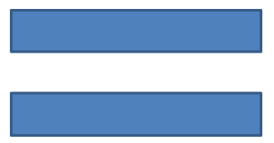

## **概覽**

本文說明如何透過編輯點與幾何路徑來編輯形狀幾何，進而客製化 Aspose.Slides 簡報中的形狀。示範如何使用 `GeometryPath` 修改既有形狀、執行基本路徑編輯操作、加入或移除點，以及將更新後的幾何套用回形狀。

此外，還展示如何建立自訂與複合形狀、建立具曲線角的形狀、判斷形狀幾何是否閉合，並在 `GeometryPath` 與 `java.awt.Shape` 之間互相轉換，以應對其他幾何客製化情境。

## **使用編輯點變更形狀**
以正方形為例。在 PowerPoint 中，使用 **編輯點**，您可以

* 移動正方形的角向內或向外
* 為角或點指定曲率
* 為正方形新增點
* 操作正方形上的點等

實質上，您可以對任何形狀執行上述操作。透過編輯點，您可以變更形狀或從既有形狀建構新形狀。

## **形狀編輯技巧**


在開始透過編輯點編輯 PowerPoint 形狀之前，您可能想要考慮以下有關形狀的要點：

* 形狀（或其路徑）可以是閉合的，也可以是開放的。
* 當形狀是閉合時，沒有起點或終點；當形狀是開放時，具有開始與結束。
* 所有形狀至少由 2 個錨點組成，這些錨點透過線條相連。
* 線條可以是直線或曲線。錨點決定線條的性質。
* 錨點存在於拐角點、直線點或平滑點：
  * 拐角點是兩條直線在角度處相交的點。
  * 平滑點是兩個控制柄位於同一直線上，且線段在此處平滑相接的點。此情況下，兩個控制柄與錨點的距離相等。
  * 直線點是兩個控制柄位於同一直線上，但控制柄與錨點的距離不必相等的點。
* 透過移動或編輯錨點（會改變線條的角度），即可改變形狀的外觀。

要透過編輯點編輯 PowerPoint 形狀，**Aspose.Slides** 提供了 [**GeometryPath**](https://reference.aspose.com/slides/zh-hant/php-java/aspose.slides/GeometryPath) 類別。

* 一個 [GeometryPath](https://reference.aspose.com/slides/zh-hant/php-java/aspose.slides/GeometryPath) 實例代表 [GeometryShape](https://reference.aspose.com/slides/zh-hant/php-java/aspose.slides/geometryshape/) 物件的幾何路徑。
* 若要從 `GeometryShape` 實例取得 `GeometryPath`，可使用 [GeometryShape::getGeometryPaths](https://reference.aspose.com/slides/zh-hant/php-java/aspose.slides/geometryshape/#getGeometryPaths) 方法。
* 若要為形狀設定 `GeometryPath`，可使用以下方法：對 *實心形狀* 使用 [GeometryShape::setGeometryPath](https://reference.aspose.com/slides/zh-hant/php-java/aspose.slides/geometryshape/#setGeometryPath)，對 *複合形狀* 使用 [GeometryShape::setGeometryPaths](https://reference.aspose.com/slides/zh-hant/php-java/aspose.slides/geometryshape/#setGeometryPaths)。
* 若要新增段落，可使用 [GeometryPath](https://reference.aspose.com/slides/zh-hant/php-java/aspose.slides/geometrypath/) 下的相關方法。
* 使用 [GeometryPath::setStroke](https://reference.aspose.com/slides/zh-hant/php-java/aspose.slides/geometrypath/setstroke/) 與 [GeometryPath::setFillMode](https://reference.aspose.com/slides/zh-hant/php-java/aspose.slides/geometrypath/setfillmode/) 方法，可設定幾何路徑的外觀。
* 透過 [GeometryPath::getPathData](https://reference.aspose.com/slides/zh-hant/php-java/aspose.slides/geometrypath/getpathdata/) 方法，可將 `GeometryShape` 的幾何路徑作為路徑段陣列取得。
* 若需存取其他形狀幾何客製化選項，可將 [GeometryPath](https://reference.aspose.com/slides/zh-hant/php-java/aspose.slides/geometrypath/) 轉換為 [java.awt.Shape](https://docs.oracle.com/javase/7/docs/api/php-java/awt/Shape.html)。
* 使用 [geometryPathToGraphicsPath](https://reference.aspose.com/slides/zh-hant/php-java/aspose.slides/shapeutil/geometrypathtographicspath/) 與 [graphicsPathToGeometryPath](https://reference.aspose.com/slides/zh-hant/php-java/aspose.slides/shapeutil/graphicspathtogeometrypath/) 方法（來自 [ShapeUtil](https://reference.aspose.com/slides/zh-hant/php-java/aspose.slides/ShapeUtil) 類別），即可在 [GeometryPath](https://reference.aspose.com/slides/zh-hant/php-java/aspose.slides/geometrypath/) 與 [java.awt.Shape](https://docs.oracle.com/javase/7/docs/api/php-java/awt/Shape.html) 之間往返轉換。

## **簡單編輯操作**

以下 PHP 程式碼示範如何

**新增直線** 到路徑的末端

```php

```
**在路徑的指定位置新增直線**：

```php

```
**在路徑的末端新增三次方貝塞爾曲線**：

```php

```
**在路徑的指定位置新增三次方貝塞爾曲線**：

```php

```
**在路徑的末端新增二次貝塞爾曲線**：

```php

```
**在路徑的指定位置新增二次貝塞爾曲線**：

```php

```
**將給定的弧段附加到路徑**：

```php

```
**關閉路徑的當前圖形**：

```php

```
**設定下一個點的位置**：

```php

```
**移除指定索引處的路徑段**：

```php

```

## **向形狀加入自訂點**

1. 建立 [GeometryShape](https://reference.aspose.com/slides/zh-hant/php-java/aspose.slides/GeometryShape) 類別的實例，並將其類型設定為 [ShapeType::Rectangle](https://reference.aspose.com/slides/zh-hant/php-java/aspose.slides/ShapeType)。
2. 從形狀取得 [GeometryPath](https://reference.aspose.com/slides/zh-hant/php-java/aspose.slides/GeometryPath) 類別的實例。
3. 在路徑的兩個上方點之間新增一個點。
4. 在路徑的兩個下方點之間新增一個點。
5. 將路徑套用至形狀。

以下 PHP 程式碼示範如何向形狀加入自訂點：

```php
  $pres = new Presentation();
  try {
    $shape = $pres->getSlides()->get_Item(0)->getShapes()->addAutoShape(ShapeType::Rectangle, 100, 100, 200, 100);
    $geometryPath = $shape->getGeometryPaths()[0];
    $geometryPath->lineTo(100, 50, 1);
    $geometryPath->lineTo(100, 50, 4);
    $shape->setGeometryPath($geometryPath);
  } finally {
    if (!java_is_null($pres)) {
      $pres->dispose();
    }
  }
```


## **從形狀移除點**

1. 建立 [GeometryShape](https://reference.aspose.com/slides/zh-hant/php-java/aspose.slides/GeometryShape) 類別的實例，並將其類型設定為 [ShapeType::Heart](https://reference.aspose.com/slides/zh-hant/php-java/aspose.slides/ShapeType)。
2. 從形狀取得 [GeometryPath](https://reference.aspose.com/slides/zh-hant/php-java/aspose.slides/GeometryPath) 類別的實例。
3. 移除路徑的段落。
4. 將路徑套用至形狀。

以下 PHP 程式碼示範如何從形狀移除點：

```php
  $pres = new Presentation();
  try {
    $shape = $pres->getSlides()->get_Item(0)->getShapes()->addAutoShape(ShapeType::Heart, 100, 100, 300, 300);
    $path = $shape->getGeometryPaths()[0];
    $path->removeAt(2);
    $shape->setGeometryPath($path);
  } finally {
    if (!java_is_null($pres)) {
      $pres->dispose();
    }
  }
```


## **建立自訂形狀**

1. 計算形狀的點座標。
2. 建立 [GeometryPath](https://reference.aspose.com/slides/zh-hant/php-java/aspose.slides/GeometryPath) 類別的實例。
3. 使用點填充路徑。
4. 建立 [GeometryShape](https://reference.aspose.com/slides/zh-hant/php-java/aspose.slides/GeometryShape) 類別的實例。
5. 將路徑套用至形狀。

以下 Java 程式碼示範如何建立自訂形狀：

```php
  $points = new Java("java.util.ArrayList");
  $R = 100;
  $r = 50;
  $step = 72;
  for($angle = -90; $angle < 270; $angle += $step) {
    $radians = $angle * java("java.lang.Math")->PI / 180.0;
    $x = $R * java("java.lang.Math")->cos($radians);
    $y = $R * java("java.lang.Math")->sin($radians);
    $points->add(new Point2DFloat($x + $R, $y + $R));
    $radians = java("java.lang.Math")->PI * $angle . $step / 2 / 180.0;
    $x = $r * java("java.lang.Math")->cos($radians);
    $y = $r * java("java.lang.Math")->sin($radians);
    $points->add(new Point2DFloat($x + $R, $y + $R));
  }
  $starPath = new GeometryPath();
  $starPath->moveTo($points->get(0));
  for($i = 1; $i < java_values($points->size()) ; $i++) {
    $starPath->lineTo($points->get($i));
  }
  $starPath->closeFigure();
  $pres = new Presentation();
  try {
    $shape = $pres->getSlides()->get_Item(0)->getShapes()->addAutoShape(ShapeType::Rectangle, 100, 100, $R * 2, $R * 2);
    $shape->setGeometryPath($starPath);
  } finally {
    if (!java_is_null($pres)) {
      $pres->dispose();
    }
  }
```


## **建立複合自訂形狀**

1. 建立 [GeometryShape](https://reference.aspose.com/slides/zh-hant/php-java/aspose.slides/GeometryShape) 類別的實例。
2. 建立第一個 [GeometryPath](https://reference.aspose.com/slides/zh-hant/php-java/aspose.slides/GeometryPath) 類別的實例。
3. 建立第二個 [GeometryPath](https://reference.aspose.com/slides/zh-hant/php-java/aspose.slides/GeometryPath) 類別的實例。
4. 將這兩條路徑套用至形狀。

以下 PHP 程式碼示範如何建立複合自訂形狀：

```php
  $pres = new Presentation();
  try {
    $shape = $pres->getSlides()->get_Item(0)->getShapes()->addAutoShape(ShapeType::Rectangle, 100, 100, 200, 100);
    $geometryPath0 = new GeometryPath();
    $geometryPath0->moveTo(0, 0);
    $geometryPath0->lineTo($shape->getWidth(), 0);
    $geometryPath0->lineTo($shape->getWidth(), $shape->getHeight() / 3);
    $geometryPath0->lineTo(0, $shape->getHeight() / 3);
    $geometryPath0->closeFigure();
    $geometryPath1 = new GeometryPath();
    $geometryPath1->moveTo(0, $shape->getHeight() / 3 * 2);
    $geometryPath1->lineTo($shape->getWidth(), $shape->getHeight() / 3 * 2);
    $geometryPath1->lineTo($shape->getWidth(), $shape->getHeight());
    $geometryPath1->lineTo(0, $shape->getHeight());
    $geometryPath1->closeFigure();
    $shape->setGeometryPaths(array($geometryPath0, $geometryPath1 ));
  } finally {
    if (!java_is_null($pres)) {
      $pres->dispose();
    }
  }
```


## **建立具曲線角的自訂形狀**

以下 PHP 程式碼示範如何建立具有內縮曲線角的自訂形狀：

```php
  $shapeX = 20.0;
  $shapeY = 20.0;
  $shapeWidth = 300.0;
  $shapeHeight = 200.0;
  $leftTopSize = 50.0;
  $rightTopSize = 20.0;
  $rightBottomSize = 40.0;
  $leftBottomSize = 10.0;
  $pres = new Presentation();
  try {
    $childShape = $pres->getSlides()->get_Item(0)->getShapes()->addAutoShape(ShapeType::Custom, $shapeX, $shapeY, $shapeWidth, $shapeHeight);
    $geometryPath = new GeometryPath();
    $point1 = new Point2DFloat($leftTopSize, 0);
    $point2 = new Point2DFloat($shapeWidth - $rightTopSize, 0);
    $point3 = new Point2DFloat($shapeWidth, $shapeHeight - $rightBottomSize);
    $point4 = new Point2DFloat($leftBottomSize, $shapeHeight);
    $point5 = new Point2DFloat(0, $leftTopSize);
    $geometryPath->moveTo($point1);
    $geometryPath->lineTo($point2);
    $geometryPath->arcTo($rightTopSize, $rightTopSize, 180, -90);
    $geometryPath->lineTo($point3);
    $geometryPath->arcTo($rightBottomSize, $rightBottomSize, -90, -90);
    $geometryPath->lineTo($point4);
    $geometryPath->arcTo($leftBottomSize, $leftBottomSize, 0, -90);
    $geometryPath->lineTo($point5);
    $geometryPath->arcTo($leftTopSize, $leftTopSize, 90, -90);
    $geometryPath->closeFigure();
    $childShape->setGeometryPath($geometryPath);
    $pres->save("output.pptx", SaveFormat::Pptx);
  } finally {
    if (!java_is_null($pres)) {
      $pres->dispose();
    }
  }
```

## **判斷形狀幾何是否閉合**

閉合形狀指的是其所有邊緣相連，形成無缺口的單一道界。此類形狀可以是簡單的幾何圖形，也可以是複雜的自訂輪廓。以下程式碼示例說明如何檢查形狀幾何是否為閉合：

```php
function isGeometryClosed($geometryShape)
{
    $isClosed = null;

    foreach ($geometryShape->getGeometryPaths() as $geometryPath) {
        $dataLength = count(java_values($geometryPath->getPathData()));
        if ($dataLength === 0) {
            continue;
        }

        $lastSegment = java_values($geometryPath->getPathData())[$dataLength - 1];
        $isClosed = $lastSegment->getPathCommand() === PathCommandType::Close;

        if ($isClosed === false) {
            return false;
        }
    }

    return $isClosed === true;
}
```

## **將 GeometryPath 轉換為 java.awt.Shape**

1. 建立 [GeometryShape](https://reference.aspose.com/slides/zh-hant/php-java/aspose.slides/GeometryShape) 類別的實例。
2. 建立 [java.awt.Shape](https://docs.oracle.com/javase/7/docs/api/php-java/awt/Shape.html) 類別的實例。
3. 使用 [ShapeUtil](https://reference.aspose.com/slides/zh-hant/php-java/aspose.slides/ShapeUtil) 將 [java.awt.Shape](https://docs.oracle.com/javase/7/docs/api/php-java/awt/Shape.html) 實例轉換為 [GeometryPath](https://reference.aspose.com/slides/zh-hant/php-java/aspose.slides/GeometryPath) 實例。
4. 將路徑套用至形狀。

以下 PHP 程式碼（上述步驟的實作）示範 **GeometryPath** 轉換為 **GraphicsPath** 的過程：

```php
  $pres = new Presentation();
  try {
    # 建立新形狀
    $shape = $pres->getSlides()->get_Item(0)->getShapes()->addAutoShape(ShapeType::Rectangle, 100, 100, 300, 100);
    # 取得形狀的幾何路徑
    $originalPath = $shape->getGeometryPaths()[0];
    $originalPath->setFillMode(PathFillModeType::None);
    # 建立帶有文字的圖形路徑
    $graphicsPath;
    $font = new Font("Arial", Font->PLAIN, 40);
    $text = "Text in shape";
    $img = new BufferedImage(100, 100, BufferedImage->TYPE_INT_ARGB);
    $g2 = $img->createGraphics();
    try {
      $glyphVector = $font->createGlyphVector($g2->getFontRenderContext(), $text);
      $graphicsPath = $glyphVector->getOutline(20.0, -$glyphVector->getVisualBounds()->getY() + 10);
    } finally {
      $g2->dispose();
    }
    # 將圖形路徑轉換為幾何路徑
    $textPath = ShapeUtil->graphicsPathToGeometryPath($graphicsPath);
    $textPath->setFillMode(PathFillModeType::Normal);
    # 設定新幾何路徑與原始幾何路徑的組合到形狀
    $shape->setGeometryPaths(array($originalPath, $textPath ));
  } finally {
    if (!java_is_null($pres)) {
      $pres->dispose();
    }
  }
```


## **常見問題**

**取代幾何後，填充與輪廓會發生什麼變化？**

樣式仍屬於形狀本身，僅輪廓會改變。填充與輪廓會自動套用至新的幾何。

**如何正確地連同幾何一起旋轉自訂形狀？**

使用形狀的 [setRotation](https://reference.aspose.com/slides/zh-hant/php-java/aspose.slides/shape/setrotation/) 方法；幾何會隨形狀一起旋轉，因為它繫結於形狀自身的座標系統。

**我可以將自訂形狀轉換為影像以「鎖定」結果嗎？**

可以。將所需的 [slide](/slides/zh-hant/php-java/convert-powerpoint-to-png/) 區域或 [shape](/slides/zh-hant/php-java/create-shape-thumbnails/) 本身匯出為點陣圖格式，這樣可簡化對複雜幾何的後續處理。