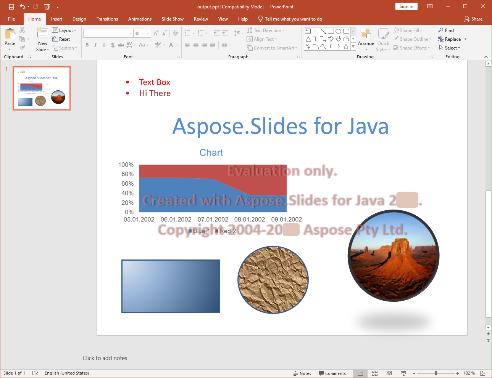

{} 
[PPT](https://en.wikipedia.org/wiki/Microsoft_PowerPoint) 是可由不同版本的 Microsoft PowerPoint 建立、讀取、操作與寫入的簡報文件格式。這是 Microsoft 開發的簡報文件二進位格式。
{} 

## **Aspose.Slides for PHP via Java 中的 PPT**
Aspose.Slides for PHP via Java 可以讀取以下軟體所建立的 PPT 檔案。

- Microsoft PowerPoint 97
- Microsoft PowerPoint 2000
- Microsoft PowerPoint XP
- Microsoft PowerPoint 2003

同樣地，由 Aspose.Slides for PHP via Java 建立的 PPT 檔案也可以被上述軟體讀取。

## **對 PPT 的全面支援**
Aspose.Slides for PHP via Java 為 PPT 文件格式提供了幾乎所有支援的功能。它不僅涵蓋了不同 Microsoft PowerPoint 版本對 PPT 文件操作所提供的基本與進階功能，甚至還包括 Microsoft PowerPoint 本身不支援的功能。使用 Aspose.Slides for PHP via Java API 函式庫的主要優勢在於處理這些功能時的使用簡便性。

除了建立、讀取與寫入 PPT 文件的基本工作之外，Aspose.Slides for PHP via Java 還提供了多項功能：

- 將其他 Microsoft Office 檔案格式匯入為 PPT 文件中的 [OLE 物件](/slides/zh-hant/php-java/manage-ole/)。
- [將 PPT 文件匯出為 PDF](/slides/zh-hant/php-java/convert-powerpoint-to-pdf/)。
- 將 PPT 文件中的投影片匯出為 SVG 格式。
- 將投影片渲染為 Java 框架支援的任何影像格式。
- 設定 PPT 文件中投影片的大小。
- 管理形狀的動畫。
- 管理投影片播放。
- [格式化投影片文字](/slides/zh-hant/php-java/text-formatting/)。
- 從 PPT 文件中擷取文字。
- [處理投影片表格](/slides/zh-hant/php-java/powerpoint-table/)。
- 使用 [複製功能](/slides/zh-hant/php-java/clone-slides/) 自動複製母片。

**由 Aspose.Slides for PHP via Java 產生且在 Microsoft PowerPoint 中開啟的 PPT 檔案**

