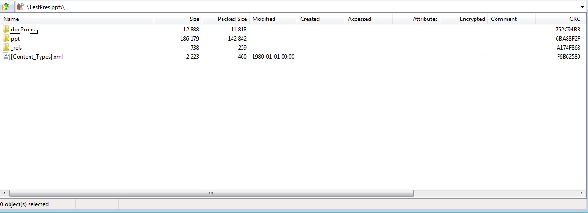

{} 

PresentationML 是一個用於演示文件的 XML 為基礎格式家族的名稱。Office OpenXML (OOXML) 是在 Microsoft Office 2007 應用程式中引入的基於 XML 的格式。Office OpenXML 是多種專門的 XML 為基礎標記語言的容器格式。PresentationML 是 Microsoft Office PowerPoint 2007 用來存儲文件的標記語言。

{} 

## **PresentationML 在 Aspose.Slides for PHP via Java 中**
OOXML PresentationML 文件以 PPTX 檔案的形式呈現，這些壓縮的 XML 套件遵循 [OOXML ECMA-376](https://www.ecma-international.org/publications-and-standards/standards/ecma-376/) 規範。Aspose.Slides for PHP via Java 廣泛支援建立、讀取、操作與寫入 PresentationML 文件。此外，Aspose.Slides for PHP via Java 能夠將 PresentationML 文件匯出為廣泛使用的文件格式，例如 PDF。之所以能夠如此，是因為 Aspose.Slides for PHP via Java 的設計目標是全面處理演示文件，而 PresentationML 基本上以壓縮的 XML 套件形式保存文件的內部結構。

**由 Aspose.Slides for PHP via Java 產生並在 Microsoft PowerPoint 中開啟的 PPTX 文件**


**在 ZIP 中檢視由 Aspose.Slides for PHP via Java 產生的相同 PPTX 文件**




## **PresentationML 是開放的，為何要使用 Aspose.Slides for PHP via Java？**
由於 PresentationML 基於 XML，完全可以僅使用 XML 類別就構建用於處理與產生 PresentationML 文件的應用程式，而不需要依賴諸如 Aspose.Slides for PHP via Java 之類的第三方類別庫。然而，在處理 PresentationML 文件時，使用 Aspose.Slides for PHP via Java 相較於純 XML 類別具有多項優勢。

OOXML 規範長達數千頁，因此若要正確處理 PresentationML 文件，必須投入大量時間與精力去理解其格式。相反地，使用 Aspose.Slides for PHP via Java 時，只需透過類別及其方法與屬性即可執行在 XML 類別下看似複雜的操作。

有些 Aspose.Slides 所提供的功能，即使透過 XML 類別處理 PresentationML 文件亦無法實現：

- 將 PPT 文件匯出為 PDF 格式。
- 將投影片渲染為 Java 框架支援的任何影像格式。
- 使用克隆功能自動從來源簡報複製母版。
- 對圖形套用保護。

以下是一個只有單一投影片且包含文字方塊，文字為「Hello World」的 PresentationML 文件範例。若使用 XML 類別讀取文字，需要編寫程式碼從以下片段解析此簡單文字。Aspose.Slides 會為您完成此工作。

**XML**

``` xml
<?xml version="1.0" encoding="UTF-8" standalone="yes"?>
<p:sld xmlns:a="http://schemas.openxmlformats.org/drawingml/2006/main" xmlns:r="http://schemas.openxmlformats.org/officeDocument/2006/relationships" xmlns:p="http://schemas.openxmlformats.org/presentationml/2006/main">
  <p:cSld>
    <p:spTree>
      <p:nvGrpSpPr>
        <p:cNvPr id="1" name=""/>
        <p:cNvGrpSpPr/>
        <p:nvPr/>
      </p:nvGrpSpPr>
      <p:grpSpPr>
        <a:xfrm>
          <a:off x="0" y="0"/>
          <a:ext cx="0" cy="0"/>
          <a:chOff x="0" y="0"/>
          <a:chExt cx="0" cy="0"/>
        </a:xfrm></p:grpSpPr><p:sp>
          <p:nvSpPr><p:cNvPr id="4" name="TextBox 3"/>
          <p:cNvSpPr txBox="1"/>
            <p:nvPr/>
          </p:nvSpPr>
          <p:spPr>
            <a:xfrm>
              <a:off x="2819400" y="2590800"/>
              <a:ext cx="1297086" cy="369332"/>
            </a:xfrm>
            <a:prstGeom prst="rect">
              <a:avLst/>
            </a:prstGeom>
            <a:noFill/>
          </p:spPr>
          <p:txBody>
            <a:bodyPr wrap="none" rtlCol="0">
              <a:spAutoFit/>
            </a:bodyPr>
            <a:lstStyle/>
            <a:p>
              <a:r>
                <a:rPr lang="en-US"/>
                <a:t>Hello World
                </a:t>
              </a:r>
              <a:endParaRPr lang="en-US"/>
            </a:p>
          </p:txBody>
        </p:sp>
    </p:spTree>
  </p:cSld>
  <p:clrMapOvr>
    <a:masterClrMapping/>
  </p:clrMapOvr>
</p:sld>
```php
