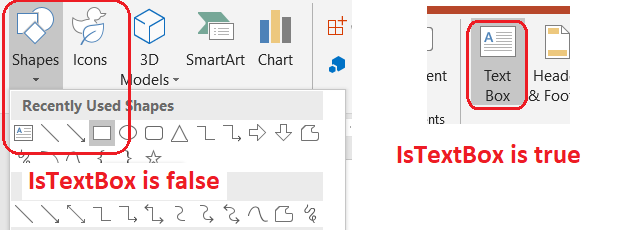

## **簡介**

在 Aspose.Slides for Python via Java 中，投影片文字儲存在屬於形狀的文字框中。 [AutoShape](https://reference.aspose.com/slides/zh-hant/python-java/aspose.slides/autoshape/) 類別代表最常見的帶文字形狀，並透過 [AutoShape.getTextFrame](https://reference.aspose.com/slides/zh-hant/python-java/aspose.slides/autoshape/#getTextFrame) 方法公開其文字。

{}
每個自動形狀皆繼承自 [Shape](https://reference.aspose.com/slides/zh-hant/python-java/aspose.slides/shape/)，但並非所有形狀都是自動形狀或支援文字框。在處理現有簡報時，請先檢查形狀是否為 [AutoShape](https://reference.aspose.com/slides/zh-hant/python-java/aspose.slides/autoshape/) 的實例，才能存取其文字。
{}

## **在投影片上建立文字方塊**

若要建立文字方塊，先在投影片上加入自動形狀，將文字寫入其文字框，然後儲存簡報。以下範例會建立一個矩形文字方塊：

```python
import jpype
import asposeslides

if not jpype.isJVMStarted():
    jpype.startJVM()

from asposeslides.api import Presentation, SaveFormat, ShapeType

presentation = Presentation()
try:
    slide = presentation.getSlides().get_Item(0)
    text_box = slide.getShapes().addAutoShape(ShapeType.Rectangle, 150, 75, 300, 50)
    text_box.addTextFrame("Aspose TextBox")

    presentation.save("TextBox.pptx", SaveFormat.Pptx)
finally:
    presentation.dispose()
```

傳遞給 [ShapeCollection.addAutoShape](https://reference.aspose.com/slides/zh-hant/python-java/aspose.slides/shapecollection/#addAutoShape) 的座標與尺寸以點為單位。[AutoShape.addTextFrame](https://reference.aspose.com/slides/zh-hant/python-java/aspose.slides/autoshape/#addTextFrame) 會使用提供的文字初始化文字框。

## **檢查文字方塊形狀**

使用 [AutoShape.isTextBox](https://reference.aspose.com/slides/zh-hant/python-java/aspose.slides/autoshape/#isTextBox) 方法可判斷自動形狀是否被視為文字方塊。當簡報同時包含帶文字的自動形狀與純圖形自動形狀時，這項檢查非常有用。



以下範例會檢查簡報中每一個自動形狀：

```python
import jpype
import asposeslides

if not jpype.isJVMStarted():
    jpype.startJVM()

from asposeslides.api import AutoShape, Presentation, ShapeType

presentation = Presentation()
try:
    slide = presentation.getSlides().get_Item(0)
    text_box = slide.getShapes().addAutoShape(ShapeType.Rectangle, 10, 10, 120, 40)
    text_box.addTextFrame("Text box")
    slide.getShapes().addAutoShape(ShapeType.Ellipse, 150, 10, 40, 40)

    for current_slide in presentation.getSlides():
        for shape in current_slide.getShapes():
            if isinstance(shape, AutoShape):
                print("The shape is a text box." if shape.isTextBox() else "The shape is not a text box.")
finally:
    presentation.dispose()
```

新加入的自動形狀在未包含非空文字之前，不會被視為文字方塊。您可以透過 [AutoShape.addTextFrame](https://reference.aspose.com/slides/zh-hant/python-java/aspose.slides/autoshape/#addTextFrame) 或 [TextFrame.setText](https://reference.aspose.com/slides/zh-hant/python-java/aspose.slides/textframe/#setText) 提供文字。將空字串加入或指派給文字框會使 [AutoShape.isTextBox](https://reference.aspose.com/slides/zh-hant/python-java/aspose.slides/autoshape/#isTextBox) 回傳 `False`：

```python
import jpype
import asposeslides

if not jpype.isJVMStarted():
    jpype.startJVM()

from asposeslides.api import Presentation, ShapeType

presentation = Presentation()
try:
    slide = presentation.getSlides().get_Item(0)

    added_text_shape = slide.getShapes().addAutoShape(ShapeType.Rectangle, 10, 10, 100, 40)
    added_text_shape.addTextFrame("Shape 1")
    print(added_text_shape.isTextBox())

    assigned_text_shape = slide.getShapes().addAutoShape(ShapeType.Rectangle, 10, 70, 100, 40)
    assigned_text_shape.getTextFrame().setText("Shape 2")
    print(assigned_text_shape.isTextBox())

    added_empty_text_shape = slide.getShapes().addAutoShape(ShapeType.Rectangle, 10, 130, 100, 40)
    added_empty_text_shape.addTextFrame("")
    print(added_empty_text_shape.isTextBox())

    assigned_empty_text_shape = slide.getShapes().addAutoShape(ShapeType.Rectangle, 10, 190, 100, 40)
    assigned_empty_text_shape.getTextFrame().setText("")
    print(assigned_empty_text_shape.isTextBox())
finally:
    presentation.dispose()
```

前兩次呼叫會印出 `True`；後兩次會印出 `False`。

## **查找擁有文字框的形狀**

通用的文字處理程式碼可能只取得一個 [TextFrame](https://reference.aspose.com/slides/zh-hant/python-java/aspose.slides/textframe/)，卻不知道是哪個簡報物件擁有它。使用唯讀的 [TextFrame.getParentShape](https://reference.aspose.com/slides/zh-hant/python-java/aspose.slides/textframe/#getParentShape) 方法即可回溯到其擁有者 [Shape](https://reference.aspose.com/slides/zh-hant/python-java/aspose.slides/shape/)。

對於由自動形狀或其他帶文字形狀擁有的文字框，[TextFrame.getParentShape](https://reference.aspose.com/slides/zh-hant/python-java/aspose.slides/textframe/#getParentShape) 會回傳擁有者，而 [TextFrame.getParentCell](https://reference.aspose.com/slides/zh-hant/python-java/aspose.slides/textframe/#getParentCell) 則回傳 `None`。在存取返回值前務必先檢查。若要同時辨識形狀與表格儲存格的擁有者（包括與 SmartArt 節點相關的形狀），請參閱 [Search and Replace Text](/slides/zh-hant/python-java/search-and-replace-text/)。

## **為文字方塊新增欄位**

[TextFrameFormat.setColumnCount](https://reference.aspose.com/slides/zh-hant/python-java/aspose.slides/textframeformat/#setColumnCount) 方法會將文字框分割成多個欄位，而 [TextFrameFormat.setColumnSpacing](https://reference.aspose.com/slides/zh-hant/python-java/aspose.slides/textframeformat/#setColumnSpacing) 則以點為單位設定欄位間的間距。這兩個設定皆屬於 [TextFrameFormat](https://reference.aspose.com/slides/zh-hant/python-java/aspose.slides/textframeformat/)，可透過現有文字方塊的文字框來變更。文字會在同一個形狀內於欄位之間重新排版，並不會繼續流入其他形狀。

以下範例會建立一個三欄文字方塊，欄位間距為 10 點，儲存簡報，然後從輸出檔案中讀回設定：

```python
import jpype
import asposeslides

if not jpype.isJVMStarted():
    jpype.startJVM()

from asposeslides.api import Presentation, SaveFormat, ShapeType

presentation = Presentation()
try:
    slide = presentation.getSlides().get_Item(0)
    text_box = slide.getShapes().addAutoShape(ShapeType.Rectangle, 100, 100, 300, 200)
    text_box.addTextFrame("This text is distributed automatically across all columns in the text box.")

    text_frame_format = text_box.getTextFrame().getTextFrameFormat()
    text_frame_format.setColumnCount(3)
    text_frame_format.setColumnSpacing(10)

    presentation.save("TextBoxColumns.pptx", SaveFormat.Pptx)

    saved_presentation = Presentation("TextBoxColumns.pptx")
    try:
        saved_text_box = saved_presentation.getSlides().get_Item(0).getShapes().get_Item(0)
        saved_format = saved_text_box.getTextFrame().getTextFrameFormat()
        print(f"Columns: {saved_format.getColumnCount()}; spacing: {saved_format.getColumnSpacing()} points")
    finally:
        saved_presentation.dispose()
finally:
    presentation.dispose()
```

## **從個別欄位擷取文字**

使用 [TextFrame.splitTextByColumns](https://reference.aspose.com/slides/zh-hant/python-java/aspose.slides/textframe/#splitTextByColumns) 可取得現有文字框中每個視覺欄位所分配的文字。此方法會依欄位的閱讀順序回傳每個欄位的一段字串。單欄文字框會產生僅含一個元素的陣列，空欄位則以空字串表示。回傳的字串僅包含純文字；不會保留段落層級的格式資訊。

此功能在以下情境下特別有用：

- 在保留欄位閱讀順序的同時擷取文字。
- 索引或比較多欄投影片的內容。
- 將每個欄位匯出至單獨的檔案、資料庫欄位或其他目的地。
- 檢查在使用 [TextFrameFormat.setColumnCount](https://reference.aspose.com/slides/zh-hant/python-java/aspose.slides/textframeformat/#setColumnCount) 更改欄位數量、使用 [TextFrameFormat.setColumnSpacing](https://reference.aspose.com/slides/zh-hant/python-java/aspose.slides/textframeformat/#setColumnSpacing) 調整欄位間距、變更字型或文字框大小後，文字如何重新分配。

此方法僅回報目前 [TextFrame](https://reference.aspose.com/slides/zh-hant/python-java/aspose.slides/textframe/) 中的文字分佈；不會自動在不同形狀或文字方塊之間流動文字。欄位分佈可能受可用字型與其他文字版面設定影響，若結果一致性重要，請確保所需字型已安裝。

以下範例會載入簡報，找到第一個具有文字框的多欄自動形狀，讀取其設定的欄位數，並將每個欄位的文字寫入個別檔案。未提供文字框的形狀會被跳過。

```python
import jpype
import asposeslides

if not jpype.isJVMStarted():
    jpype.startJVM()

from pathlib import Path
from asposeslides.api import AutoShape, Presentation

presentation = Presentation("MultiColumnText.pptx")
try:
    text_box = None
    for shape in presentation.getSlides().get_Item(0).getShapes():
        if isinstance(shape, AutoShape):
            if shape.getTextFrame() is not None:
                column_count = shape.getTextFrame().getTextFrameFormat().getColumnCount()
                if column_count > 1:
                    text_box = shape
                    break

    if text_box is None:
        print("No multi-column text frame was found.")
    else:
        text_frame = text_box.getTextFrame()
        configured_column_count = text_frame.getTextFrameFormat().getColumnCount()
        column_texts = text_frame.splitTextByColumns()

        print(f"Configured columns: {configured_column_count}")

        for column_number, column_text in enumerate(column_texts, start=1):
            print(f"Column {column_number}: {column_text}")
            output_path = Path(f"Column-{column_number}.txt")
            try:
                output_path.write_text(str(column_text), encoding="utf-8")
            except OSError as exception:
                print(f"Could not write column {column_number}: {exception}")
finally:
    presentation.dispose()
```

## **更新文字**

若要在整份簡報中更新文字，請遍歷投影片與形狀，選取自動形狀，然後編輯其文字段落。以段落層級操作可同時變更文字與字元格式。

以下範例會將所有自動形狀文字中的 `years` 替換為 `months`，並將受影響的段落設為粗體：

```python
import jpype
import asposeslides

if not jpype.isJVMStarted():
    jpype.startJVM()

from asposeslides.api import AutoShape, NullableBool, Presentation, SaveFormat

presentation = Presentation("Text.pptx")
try:
    for slide in presentation.getSlides():
        for shape in slide.getShapes():
            if not isinstance(shape, AutoShape):
                continue

            text_frame = shape.getTextFrame()
            if text_frame is None:
                continue

            for paragraph in text_frame.getParagraphs():
                for portion in paragraph.getPortions():
                    text = portion.getText()
                    if text is not None and "years" in str(text):
                        portion.setText(str(text).replace("years", "months"))
                        portion.getPortionFormat().setFontBold(NullableBool.True_)

    presentation.save("TextChanged.pptx", SaveFormat.Pptx)
finally:
    presentation.dispose()
```

此遍歷僅會更新自動形狀內的文字。儲存在表格、圖表、SmartArt 或群組形狀中的文字須另行遍歷這些物件的集合。

## **新增帶有超連結的文字方塊**

超連結可以指派給特定的文字段落，只有該段文字會變為可點擊的連結。使用 [HyperlinkManager.setExternalHyperlinkClick](https://reference.aspose.com/slides/zh-hant/python-java/aspose.slides/hyperlinkmanager/#setExternalHyperlinkClick) 即可將段落與外部 URL 相關聯。

以下範例會建立帶有連結的文字，並將其儲存至簡報：

```python
import jpype
import asposeslides

if not jpype.isJVMStarted():
    jpype.startJVM()

from asposeslides.api import Presentation, SaveFormat, ShapeType

presentation = Presentation()
try:
    slide = presentation.getSlides().get_Item(0)
    text_box = slide.getShapes().addAutoShape(ShapeType.Rectangle, 150, 150, 200, 50)
    text_box.addTextFrame("Aspose.Slides")

    text_portion = text_box.getTextFrame().getParagraphs().get_Item(0).getPortions().get_Item(0)
    text_portion.getPortionFormat().getHyperlinkManager().setExternalHyperlinkClick("https://www.aspose.com/")

    presentation.save("Hyperlink.pptx", SaveFormat.Pptx)
finally:
    presentation.dispose()
```

## **常見問題**

**文字方塊與母片或版面投影片上的文字佔位符有何差異？**

[placeholder](/slides/zh-hant/python-java/manage-placeholder/) 可以從 [master slide](https://reference.aspose.com/slides/zh-hant/python-java/aspose.slides/masterslide/) 或 [layout slide](https://reference.aspose.com/slides/zh-hant/python-java/aspose.slides/layoutslide/) 繼承其位置與格式。一般的文字方塊則是建立於當前投影片的獨立形狀，版面變更時不會自動取得佔位符行為。

**如何在不更動圖表、表格或 SmartArt 文字的情況下取代文字？**

如同「更新文字」範例所示，將遍歷限制在 [AutoShape](https://reference.aspose.com/slides/zh-hant/python-java/aspose.slides/autoshape/) 的實例上。圖表、表格與 SmartArt 皆在各自的物件模型中儲存文字，因而不會被此迴圈修改。