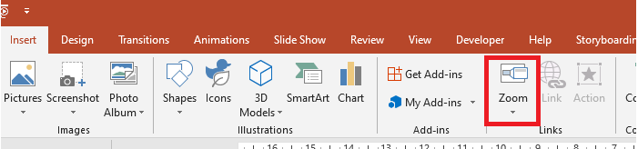

## **簡介**

PowerPoint 中的縮放功能讓您可以在簡報的特定投影片、節與區段之間來回跳轉。當您在演示時，快速在內容之間導覽的能力可能非常有用。



* 若要在單張投影片上彙總整個簡報，請使用[概覽縮放](#summary-zoom)。
* 若只想顯示選取的投影片，請使用[投影片縮放](#slide-zoom)。
* 若只想顯示單一節，請使用[節縮放](#section-zoom)。

## **投影片縮放**
投影片縮放可以讓您的簡報更具活力，讓您可以自由選擇任意順序在投影片之間導航，而不會中斷簡報的流程。投影片縮放非常適合沒有太多節的簡短簡報，但您仍可在不同的簡報情境中使用它們。

投影片縮放協助您深入多個資訊片段，同時感覺仍位於單一畫布上。


對於投影片縮放物件，Aspose.Slides 提供 [ZoomImageType](https://reference.aspose.com/slides/zh-hant/python-java/aspose.slides/zoomimagetype/) 列舉、[ZoomFrame](https://reference.aspose.com/slides/zh-hant/python-java/aspose.slides/zoomframe/) 類別，以及 [ShapeCollection](https://reference.aspose.com/slides/zh-hant/python-java/aspose.slides/shapecollection/) 類別中的一些方法。

### **建立縮放框格**

您可以使用以下方式在投影片上加入縮放框格：

1. 建立 [Presentation](https://reference.aspose.com/slides/zh-hant/python-java/aspose.slides/presentation/) 類別的實例。
2. 建立您打算連結縮放框格的新投影片。
3. 為建立的投影片加入辨識文字與背景。
4. 將縮放框格（含所建立投影片的參考）加入第一張投影片。
5. 將修改後的簡報寫入為 PPTX 檔案。

以下 Python 程式碼示範如何在投影片上建立縮放框格：

```python
import jpype
import asposeslides

if not jpype.isJVMStarted():
    jpype.startJVM()

from asposeslides.api import BackgroundType, FillType, Presentation, SaveFormat, ShapeType
from java.awt import Color

presentation = Presentation()
try:
    # 新增投影片至簡報
    second_slide = presentation.getSlides().addEmptySlide(presentation.getSlides().get_Item(0).getLayoutSlide())
    third_slide = presentation.getSlides().addEmptySlide(presentation.getSlides().get_Item(0).getLayoutSlide())

    #  為第二張投影片建立背景
    second_slide.getBackground().setType(BackgroundType.OwnBackground)
    second_slide.getBackground().getFillFormat().setFillType(FillType.Solid)
    second_slide.getBackground().getFillFormat().getSolidFillColor().setColor(Color.cyan)

    #  為第二張投影片建立文字方塊
    auto_shape = second_slide.getShapes().addAutoShape(ShapeType.Rectangle, 100, 200, 500, 200)
    auto_shape.getTextFrame().setText("Second Slide")

    #  為第三張投影片建立背景
    third_slide.getBackground().setType(BackgroundType.OwnBackground)
    third_slide.getBackground().getFillFormat().setFillType(FillType.Solid)
    third_slide.getBackground().getFillFormat().getSolidFillColor().setColor(Color.darkGray)

    #  為第三張投影片建立文字方塊
    auto_shape = third_slide.getShapes().addAutoShape(ShapeType.Rectangle, 100, 200, 500, 200)
    auto_shape.getTextFrame().setText("Third Slide")

    # 新增 ZoomFrame 物件
    presentation.getSlides().get_Item(0).getShapes().addZoomFrame(20, 20, 250, 200, second_slide)
    presentation.getSlides().get_Item(0).getShapes().addZoomFrame(200, 250, 250, 200, third_slide)

    #  儲存簡報
    presentation.save("presentation.pptx", SaveFormat.Pptx)
finally:
    presentation.dispose()
```
### **使用自訂影像建立縮放框格**
使用 Aspose.Slides for Python via Java，您可以透過以下方式建立使用不同投影片預覽影像的縮放框格：
1. 建立 [Presentation](https://reference.aspose.com/slides/zh-hant/python-java/aspose.slides/presentation/) 類別的實例。
2. 建立您打算連結縮放框格的新投影片。
3. 為該投影片加入辨識文字與背景。
4. 透過將影像加入與 [Presentation](https://reference.aspose.com/slides/zh-hant/python-java/aspose.slides/presentation/) 物件相關聯的影像集合，建立 [PPImage](https://reference.aspose.com/slides/zh-hant/python-java/aspose.slides/ppimage/) 物件，以填充框格。
5. 將縮放框格（含所建立投影片的參考）加入第一張投影片。
6. 將修改後的簡報寫入為 PPTX 檔案。

以下 Python 程式碼示範如何使用不同影像建立縮放框格：

```python
import jpype
import asposeslides

if not jpype.isJVMStarted():
    jpype.startJVM()

from asposeslides.api import BackgroundType, FillType, Images, Presentation, SaveFormat, ShapeType
from java.awt import Color

presentation = Presentation()
try:
    # 新增投影片至簡報
    slide = presentation.getSlides().addEmptySlide(presentation.getSlides().get_Item(0).getLayoutSlide())

    #  為第二張投影片建立背景
    slide.getBackground().setType(BackgroundType.OwnBackground)
    slide.getBackground().getFillFormat().setFillType(FillType.Solid)
    slide.getBackground().getFillFormat().getSolidFillColor().setColor(Color.cyan)

    #  為第二張投影片建立文字方塊
    auto_shape = slide.getShapes().addAutoShape(ShapeType.Rectangle, 100, 200, 500, 200)
    auto_shape.getTextFrame().setText("Second Slide")

    #  為縮放物件建立新影像
    image = Images.fromFile("image.png")
    try:
        picture = presentation.getImages().addImage(image)
    finally:
        image.dispose()

    # 新增 ZoomFrame 物件
    presentation.getSlides().get_Item(0).getShapes().addZoomFrame(20, 20, 300, 200, slide, picture)

    #  儲存簡報
    presentation.save("presentation.pptx", SaveFormat.Pptx)
finally:
    presentation.dispose()
```
### **格式化縮放框格**
在前面的章節中，我們示範了如何建立簡單的縮放框格。若要建立更複雜的縮放框格，您必須變更簡單框格的格式。您可以對縮放框格套用多種格式化選項。

您可以使用以下方式在投影片上控制縮放框格的格式：

1. 建立 [Presentation](https://reference.aspose.com/slides/zh-hant/python-java/aspose.slides/presentation/) 類別的實例。
2. 建立您打算連結縮放框格的新投影片。
3. 為建立的投影片加入辨識文字與背景。
4. 將縮放框格（含所建立投影片的參考）加入第一張投影片。
5. 透過將影像加入與 [Presentation](https://reference.aspose.com/slides/zh-hant/python-java/aspose.slides/presentation/) 物件相關聯的影像集合，建立 [PPImage](https://reference.aspose.com/slides/zh-hant/python-java/aspose.slides/ppimage/) 物件，以填充框格。
6. 為第一個縮放框格物件設定自訂影像。
7. 變更第二個縮放框格物件的線條格式。
8. 移除第二個縮放框格物件影像的背景。
9. 將修改後的簡報寫入為 PPTX 檔案。

以下 Python 程式碼示範如何在投影片上變更縮放框格的格式：

```python
import jpype
import asposeslides

if not jpype.isJVMStarted():
    jpype.startJVM()

from asposeslides.api import BackgroundType, FillType, Images, LineDashStyle, Presentation, SaveFormat, ShapeType
from java.awt import Color

presentation = Presentation()
try:
    # 新增投影片至簡報
    second_slide = presentation.getSlides().addEmptySlide(presentation.getSlides().get_Item(0).getLayoutSlide())
    third_slide = presentation.getSlides().addEmptySlide(presentation.getSlides().get_Item(0).getLayoutSlide())

    #  為第二張投影片建立背景
    second_slide.getBackground().setType(BackgroundType.OwnBackground)
    second_slide.getBackground().getFillFormat().setFillType(FillType.Solid)
    second_slide.getBackground().getFillFormat().getSolidFillColor().setColor(Color.cyan)

    #  為第二張投影片建立文字方塊
    auto_shape = second_slide.getShapes().addAutoShape(ShapeType.Rectangle, 100, 200, 500, 200)
    auto_shape.getTextFrame().setText("Second Slide")

    #  為第三張投影片建立背景
    third_slide.getBackground().setType(BackgroundType.OwnBackground)
    third_slide.getBackground().getFillFormat().setFillType(FillType.Solid)
    third_slide.getBackground().getFillFormat().getSolidFillColor().setColor(Color.darkGray)

    #  為第三張投影片建立文字方塊
    auto_shape = third_slide.getShapes().addAutoShape(ShapeType.Rectangle, 100, 200, 500, 200)
    auto_shape.getTextFrame().setText("Third Slide")

    # 新增 ZoomFrame 物件
    first_zoom_frame = presentation.getSlides().get_Item(0).getShapes().addZoomFrame(20, 20, 250, 200, second_slide)
    second_zoom_frame = presentation.getSlides().get_Item(0).getShapes().addZoomFrame(200, 250, 250, 200, third_slide)

    #  為縮放物件建立新影像
    image = Images.fromFile("image.png")
    try:
        picture = presentation.getImages().addImage(image)
    finally:
        image.dispose()

    #  為 first_zoom_frame 物件設定自訂影像
    first_zoom_frame.setZoomImage(picture)

    #  為 second_zoom_frame 物件設定縮放框格格式
    second_zoom_frame.getLineFormat().setWidth(5)
    second_zoom_frame.getLineFormat().getFillFormat().setFillType(FillType.Solid)
    second_zoom_frame.getLineFormat().getFillFormat().getSolidFillColor().setColor(Color.pink)
    second_zoom_frame.getLineFormat().setDashStyle(LineDashStyle.DashDot)

    #  設定不顯示 second_zoom_frame 物件的背景
    second_zoom_frame.setShowBackground(False)

    #  儲存簡報
    presentation.save("presentation.pptx", SaveFormat.Pptx)
finally:
    presentation.dispose()
```

## **節縮放**

節縮放是指向簡報中某個節的連結。您可以使用節縮放返回您想特別強調的節，或用來突顯簡報中各部分之間的關聯。


對於節縮放物件，Aspose.Slides 提供 [SectionZoomFrame](https://reference.aspose.com/slides/zh-hant/python-java/aspose.slides/sectionzoomframe/) 類別，以及 [ShapeCollection](https://reference.aspose.com/slides/zh-hant/python-java/aspose.slides/shapecollection/) 類別中的一些方法。

### **建立節縮放框格**

您可以使用以下方式在投影片上加入節縮放框格：

1. 建立 [Presentation](https://reference.aspose.com/slides/zh-hant/python-java/aspose.slides/presentation/) 類別的實例。
2. 建立新投影片。
3. 為建立的投影片加入顯眼的背景。
4. 建立您打算連結縮放框格的新節。
5. 將節縮放框格（含所建立節的參考）加入第一張投影片。
6. 將修改後的簡報寫入為 PPTX 檔案。

以下 Python 程式碼示範如何在投影片上建立節縮放框格：

```python
import jpype
import asposeslides

if not jpype.isJVMStarted():
    jpype.startJVM()

from asposeslides.api import BackgroundType, FillType, Presentation, SaveFormat
from java.awt import Color

presentation = Presentation()
try:
    # 新增投影片至簡報
    slide = presentation.getSlides().addEmptySlide(presentation.getSlides().get_Item(0).getLayoutSlide())
    slide.getBackground().getFillFormat().setFillType(FillType.Solid)
    slide.getBackground().getFillFormat().getSolidFillColor().setColor(Color.yellow)
    slide.getBackground().setType(BackgroundType.OwnBackground)

    #  新增節至簡報
    presentation.getSections().addSection("Section 1", slide)

    #  新增 SectionZoomFrame 物件
    section_zoom_frame = presentation.getSlides().get_Item(0).getShapes().addSectionZoomFrame(20, 20, 300, 200, presentation.getSections().get_Item(1))

    #  儲存簡報
    presentation.save("presentation.pptx", SaveFormat.Pptx)
finally:
    presentation.dispose()
```
### **使用自訂影像建立節縮放框格**

使用 Aspose.Slides for Python via Java，您可以透過以下方式建立使用不同投影片預覽影像的節縮放框格：

1. 建立 [Presentation](https://reference.aspose.com/slides/zh-hant/python-java/aspose.slides/presentation/) 類別的實例。
2. 建立新投影片。
3. 為建立的投影片加入顯眼的背景。
4. 建立您打算連結縮放框格的新節。
5. 透過將影像加入與 [Presentation](https://reference.aspose.com/slides/zh-hant/python-java/aspose.slides/presentation/) 物件相關聯的影像集合，建立 [PPImage](https://reference.aspose.com/slides/zh-hant/python-java/aspose.slides/ppimage/) 物件，以填充框格。
6. 將節縮放框格（含所建立節的參考）加入第一張投影片。
7. 將修改後的簡報寫入為 PPTX 檔案。

以下 Python 程式碼示範如何使用不同影像建立節縮放框格：

```python
import jpype
import asposeslides

if not jpype.isJVMStarted():
    jpype.startJVM()

from asposeslides.api import BackgroundType, FillType, Images, Presentation, SaveFormat
from java.awt import Color

presentation = Presentation()
try:
    # 新增投影片至簡報
    slide = presentation.getSlides().addEmptySlide(presentation.getSlides().get_Item(0).getLayoutSlide())
    slide.getBackground().getFillFormat().setFillType(FillType.Solid)
    slide.getBackground().getFillFormat().getSolidFillColor().setColor(Color.yellow)
    slide.getBackground().setType(BackgroundType.OwnBackground)

    #  新增節至簡報
    presentation.getSections().addSection("Section 1", slide)

    #  為縮放物件建立新影像
    image = Images.fromFile("image.png")
    try:
        picture = presentation.getImages().addImage(image)
    finally:
        image.dispose()

    #  新增 SectionZoomFrame 物件
    section_zoom_frame = presentation.getSlides().get_Item(0).getShapes().addSectionZoomFrame(20, 20, 300, 200, presentation.getSections().get_Item(1), picture)

    #  儲存簡報
    presentation.save("presentation.pptx", SaveFormat.Pptx)
finally:
    presentation.dispose()
```
### **格式化節縮放框格**

若要建立更複雜的節縮放框格，您必須變更簡單框格的格式。您可以對節縮放框格套用多種格式化選項。

您可以使用以下方式在投影片上控制節縮放框格的格式：

1. 建立 [Presentation](https://reference.aspose.com/slides/zh-hant/python-java/aspose.slides/presentation/) 類別的實例。
2. 建立新投影片。
3. 為建立的投影片加入顯眼的背景。
4. 建立您打算連結縮放框格的新節。
5. 將節縮放框格（含所建立節的參考）加入第一張投影片。
6. 變更已建立節縮放物件的大小與位置。
7. 透過將影像加入與 [Presentation](https://reference.aspose.com/slides/zh-hant/python-java/aspose.slides/presentation/) 物件相關聯的影像集合，建立 [PPImage](https://reference.aspose.com/slides/zh-hant/python-java/aspose.slides/ppimage/) 物件，以填充框格。
8. 為已建立的節縮放框格物件設定自訂影像。
9. 設定*從連結的節返回原始投影片*的功能。
10. 移除節縮放框格物件影像的背景。
11. 變更節縮放框格物件的線條格式。
12. 變更過渡持續時間。
13. 將修改後的簡報寫入為 PPTX 檔案。

以下 Python 程式碼示範如何變更節縮放框格的格式：

```python
import jpype
import asposeslides

if not jpype.isJVMStarted():
    jpype.startJVM()

from asposeslides.api import BackgroundType, FillType, Images, LineDashStyle, Presentation, SaveFormat
from java.awt import Color

presentation = Presentation()
try:
    # 新增投影片至簡報
    slide = presentation.getSlides().addEmptySlide(presentation.getSlides().get_Item(0).getLayoutSlide())
    slide.getBackground().getFillFormat().setFillType(FillType.Solid)
    slide.getBackground().getFillFormat().getSolidFillColor().setColor(Color.yellow)
    slide.getBackground().setType(BackgroundType.OwnBackground)

    #  新增節至簡報
    presentation.getSections().addSection("Section 1", slide)

    #  新增 SectionZoomFrame 物件
    section_zoom_frame = presentation.getSlides().get_Item(0).getShapes().addSectionZoomFrame(20, 20, 300, 200, presentation.getSections().get_Item(1))

    #  SectionZoomFrame 的格式設定
    section_zoom_frame.setX(100)
    section_zoom_frame.setY(300)
    section_zoom_frame.setWidth(100)
    section_zoom_frame.setHeight(75)

    image = Images.fromFile("image.png")
    try:
        picture = presentation.getImages().addImage(image)
    finally:
        image.dispose()
    section_zoom_frame.setZoomImage(picture)

    section_zoom_frame.setReturnToParent(True)
    section_zoom_frame.setShowBackground(False)

    section_zoom_frame.getLineFormat().getFillFormat().setFillType(FillType.Solid)
    section_zoom_frame.getLineFormat().getFillFormat().getSolidFillColor().setColor(Color.gray)
    section_zoom_frame.getLineFormat().setDashStyle(LineDashStyle.DashDot)
    section_zoom_frame.getLineFormat().setWidth(2.5)

    section_zoom_frame.setTransitionDuration(1.5)

    #  儲存簡報
    presentation.save("presentation.pptx", SaveFormat.Pptx)
finally:
    presentation.dispose()
```

## **概覽縮放**

概覽縮放就像一個著陸頁，會一次顯示簡報的所有部分。當您在演示時，可以使用縮放在簡報的任意位置之間跳轉，順序隨心所欲。您可以發揮創意，跳過或重新檢視投影片秀的某些片段，而不會中斷簡報的流程。


對於概覽縮放物件，Aspose.Slides 提供 [SummaryZoomFrame](https://reference.aspose.com/slides/zh-hant/python-java/aspose.slides/summaryzoomframe/)、[SummaryZoomSection](https://reference.aspose.com/slides/zh-hant/python-java/aspose.slides/summaryzoomsection/)、[SummaryZoomSectionCollection](https://reference.aspose.com/slides/zh-hant/python-java/aspose.slides/summaryzoomsectioncollection/) 類別，以及 [ShapeCollection](https://reference.aspose.com/slides/zh-hant/python-java/aspose.slides/shapecollection/) 類別中的一些方法。

### **建立概覽縮放**

您可以使用以下方式在投影片上加入概覽縮放框格：

1. 建立 [Presentation](https://reference.aspose.com/slides/zh-hant/python-java/aspose.slides/presentation/) 類別的實例。
2. 為建立的投影片建立顯眼的背景與新節。
3. 將概覽縮放框格加入第一張投影片。
4. 將修改後的簡報寫入為 PPTX 檔案。

以下 Python 程式碼示範如何在投影片上建立概覽縮放框格：

```python
import jpype
import asposeslides

if not jpype.isJVMStarted():
    jpype.startJVM()

from asposeslides.api import BackgroundType, FillType, Presentation, SaveFormat
from java.awt import Color

presentation = Presentation()
try:
    # 新增投影片至簡報
    slide = presentation.getSlides().addEmptySlide(presentation.getSlides().get_Item(0).getLayoutSlide())
    slide.getBackground().getFillFormat().setFillType(FillType.Solid)
    slide.getBackground().getFillFormat().getSolidFillColor().setColor(Color.gray)
    slide.getBackground().setType(BackgroundType.OwnBackground)

    #  新增節至簡報
    presentation.getSections().addSection("Section 1", slide)

    # 新增投影片至簡報
    slide = presentation.getSlides().addEmptySlide(presentation.getSlides().get_Item(0).getLayoutSlide())
    slide.getBackground().getFillFormat().setFillType(FillType.Solid)
    slide.getBackground().getFillFormat().getSolidFillColor().setColor(Color.cyan)
    slide.getBackground().setType(BackgroundType.OwnBackground)

    #  新增節至簡報
    presentation.getSections().addSection("Section 2", slide)

    # 新增投影片至簡報
    slide = presentation.getSlides().addEmptySlide(presentation.getSlides().get_Item(0).getLayoutSlide())
    slide.getBackground().getFillFormat().setFillType(FillType.Solid)
    slide.getBackground().getFillFormat().getSolidFillColor().setColor(Color.magenta)
    slide.getBackground().setType(BackgroundType.OwnBackground)

    #  新增節至簡報
    presentation.getSections().addSection("Section 3", slide)

    # 新增投影片至簡報
    slide = presentation.getSlides().addEmptySlide(presentation.getSlides().get_Item(0).getLayoutSlide())
    slide.getBackground().getFillFormat().setFillType(FillType.Solid)
    slide.getBackground().getFillFormat().getSolidFillColor().setColor(Color.green)
    slide.getBackground().setType(BackgroundType.OwnBackground)

    #  新增節至簡報
    presentation.getSections().addSection("Section 4", slide)

    #  新增 SummaryZoomFrame 物件
    summary_zoom_frame = presentation.getSlides().get_Item(0).getShapes().addSummaryZoomFrame(150, 50, 300, 200)

    #  儲存簡報
    presentation.save("presentation.pptx", SaveFormat.Pptx)
finally:
    presentation.dispose()
```

### **新增與移除概覽縮放節**

概覽縮放框格中的所有節皆以 [SummaryZoomSection](https://reference.aspose.com/slides/zh-hant/python-java/aspose.slides/summaryzoomsection/) 物件表示，這些物件儲存在 [SummaryZoomSectionCollection](https://reference.aspose.com/slides/zh-hant/python-java/aspose.slides/summaryzoomsectioncollection/) 物件中。您可以透過 [SummaryZoomSectionCollection](https://reference.aspose.com/slides/zh-hant/python-java/aspose.slides/summaryzoomsectioncollection/) 類別加入或移除概覽縮放節物件，方式如下：

1. 建立 [Presentation](https://reference.aspose.com/slides/zh-hant/python-java/aspose.slides/presentation/) 類別的實例。
2. 為建立的投影片建立顯眼的背景與新節。
3. 在第一張投影片加入概覽縮放框格。
4. 為簡報新增投影片與節。
5. 將新建立的節加入概覽縮放框格。
6. 從概覽縮放框格中移除第一個節。
7. 將修改後的簡報寫入為 PPTX 檔案。

以下 Python 程式碼示範如何在概覽縮放框格中新增與移除節：

```python
import jpype
import asposeslides

if not jpype.isJVMStarted():
    jpype.startJVM()

from asposeslides.api import BackgroundType, FillType, Presentation, SaveFormat
from java.awt import Color

presentation = Presentation()
try:
    # 新增投影片至簡報
    slide = presentation.getSlides().addEmptySlide(presentation.getSlides().get_Item(0).getLayoutSlide())
    slide.getBackground().getFillFormat().setFillType(FillType.Solid)
    slide.getBackground().getFillFormat().getSolidFillColor().setColor(Color.gray)
    slide.getBackground().setType(BackgroundType.OwnBackground)

    #  新增節至簡報
    presentation.getSections().addSection("Section 1", slide)

    # 新增投影片至簡報
    slide = presentation.getSlides().addEmptySlide(presentation.getSlides().get_Item(0).getLayoutSlide())
    slide.getBackground().getFillFormat().setFillType(FillType.Solid)
    slide.getBackground().getFillFormat().getSolidFillColor().setColor(Color.cyan)
    slide.getBackground().setType(BackgroundType.OwnBackground)

    #  新增節至簡報
    presentation.getSections().addSection("Section 2", slide)

    #  新增 SummaryZoomFrame 物件
    summary_zoom_frame = presentation.getSlides().get_Item(0).getShapes().addSummaryZoomFrame(150, 50, 300, 200)

    # 新增投影片至簡報
    slide = presentation.getSlides().addEmptySlide(presentation.getSlides().get_Item(0).getLayoutSlide())
    slide.getBackground().getFillFormat().setFillType(FillType.Solid)
    slide.getBackground().getFillFormat().getSolidFillColor().setColor(Color.magenta)
    slide.getBackground().setType(BackgroundType.OwnBackground)

    #  新增節至簡報
    third_section = presentation.getSections().addSection("Section 3", slide)

    #  為 Summary Zoom 新增節
    summary_zoom_frame.getSummaryZoomCollection().addSummaryZoomSection(third_section)

    #  從 Summary Zoom 移除節
    summary_zoom_frame.getSummaryZoomCollection().removeSummaryZoomSection(presentation.getSections().get_Item(1))

    #  儲存簡報
    presentation.save("presentation.pptx", SaveFormat.Pptx)
finally:
    presentation.dispose()
```

### **格式化概覽縮放節**

若要建立更複雜的概覽縮放節物件，您必須變更簡單框格的格式。您可以對概覽縮放節物件套用多種格式化選項。

您可以使用以下方式在概覽縮放框格中控制概覽縮放節物件的格式：

1. 建立 [Presentation](https://reference.aspose.com/slides/zh-hant/python-java/aspose.slides/presentation/) 類別的實例。
2. 為建立的投影片建立顯眼的背景與新節。
3. 將概覽縮放框格加入第一張投影片。
4. 從 [SummaryZoomSectionCollection](https://reference.aspose.com/slides/zh-hant/python-java/aspose.slides/summaryzoomsectioncollection/) 取得第一個概覽縮放節物件。
5. 透過將影像加入與 [Presentation](https://reference.aspose.com/slides/zh-hant/python-java/aspose.slides/presentation/) 物件相關聯的影像集合，建立 [PPImage](https://reference.aspose.com/slides/zh-hant/python-java/aspose.slides/ppimage/) 物件，以填充框格。
6. 為概覽縮放節物件設定自訂影像。
7. 設定*從連結的節返回原始投影片*的功能。
8. 變更概覽縮放節物件的線條格式。
9. 變更過渡持續時間。
10. 將修改後的簡報寫入為 PPTX 檔案。

以下 Python 程式碼示範如何變更概覽縮放節物件的格式：

```python
import jpype
import asposeslides

if not jpype.isJVMStarted():
    jpype.startJVM()

from asposeslides.api import BackgroundType, FillType, Images, LineDashStyle, Presentation, SaveFormat
from java.awt import Color

presentation = Presentation()
try:
    # 新增投影片至簡報
    slide = presentation.getSlides().addEmptySlide(presentation.getSlides().get_Item(0).getLayoutSlide())
    slide.getBackground().getFillFormat().setFillType(FillType.Solid)
    slide.getBackground().getFillFormat().getSolidFillColor().setColor(Color.gray)
    slide.getBackground().setType(BackgroundType.OwnBackground)

    #  新增節至簡報
    presentation.getSections().addSection("Section 1", slide)

    # 新增投影片至簡報
    slide = presentation.getSlides().addEmptySlide(presentation.getSlides().get_Item(0).getLayoutSlide())
    slide.getBackground().getFillFormat().setFillType(FillType.Solid)
    slide.getBackground().getFillFormat().getSolidFillColor().setColor(Color.cyan)
    slide.getBackground().setType(BackgroundType.OwnBackground)

    #  新增節至簡報
    presentation.getSections().addSection("Section 2", slide)

    #  新增 SummaryZoomFrame 物件
    summary_zoom_frame = presentation.getSlides().get_Item(0).getShapes().addSummaryZoomFrame(150, 50, 300, 200)

    #  取得第一個 SummaryZoomSection 物件
    summary_section = summary_zoom_frame.getSummaryZoomCollection().get_Item(0)

    #  SummaryZoomSection 物件的格式設定
    image = Images.fromFile("image.png")
    try:
        picture = presentation.getImages().addImage(image)
    finally:
        image.dispose()
    summary_section.setZoomImage(picture)

    summary_section.setReturnToParent(False)

    summary_section.getLineFormat().getFillFormat().setFillType(FillType.Solid)
    summary_section.getLineFormat().getFillFormat().getSolidFillColor().setColor(Color.black)
    summary_section.getLineFormat().setDashStyle(LineDashStyle.DashDot)
    summary_section.getLineFormat().setWidth(1.5)

    summary_section.setTransitionDuration(1.5)

    #  儲存簡報
    presentation.save("presentation.pptx", SaveFormat.Pptx)
finally:
    presentation.dispose()
```

## **常見問題**

**顯示目標後，我可以控制是否返回「父」投影片嗎？**

可以。[ZoomFrame](https://reference.aspose.com/slides/zh-hant/python-java/aspose.slides/zoomframe/) 或 [SectionZoomFrame](https://reference.aspose.com/slides/zh-hant/python-java/aspose.slides/sectionzoomframe/) 支援透過 [setReturnToParent](https://reference.aspose.com/slides/zh-hant/python-java/aspose.slides/zoomobject/#setReturnToParent) 讓觀眾在造訪目標內容後返回原始投影片。

**我可以調整縮放過渡的「速度」或持續時間嗎？**

可以。縮放支援使用 [setTransitionDuration](https://reference.aspose.com/slides/zh-hant/python-java/aspose.slides/zoomobject/#setTransitionDuration) 設定過渡持續時間，讓您控制跳轉動畫的長度。

**簡報中可以包含多少個縮放物件有限制嗎？**

目前文件未列出硬性 API 限制。實際限制取決於簡報的整體複雜度與觀眾的效能。您可以新增許多縮放框格，但仍需考量檔案大小與渲染時間。