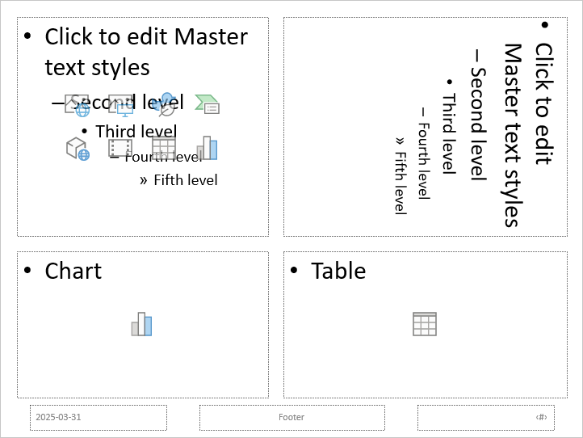

## **概覽**

投影片版面配置定義了佔位符（例如標題、文字、圖片、圖表和表格）的定位與格式。套用版面配置可為投影片提供一致的結構，同時允許每張投影片保有各自的內容。

最常見的版面配置包括：

- **Title Slide**：包含標題和副標題佔位符。
- **Title and Content**：包含標題佔位符和通用內容佔位符。
- **Blank**：不含內容佔位符，適用於所有形狀皆需手動定位的情況。

## **了解版面配置的繼承**

簡報包含三個相關層級：

1. 主投影片[master slide](https://reference.aspose.com/slides/zh-hant/python-java/aspose.slides/masterslide/) 定義主題、共用格式、背景以及共通物件。
2. 版面投影片[layout slide](https://reference.aspose.com/slides/zh-hant/python-java/aspose.slides/layoutslide/) 隸屬於主投影片，並定義特定的佔位符排列。
3. 普通投影片[normal slide](https://reference.aspose.com/slides/zh-hant/python-java/aspose.slides/slide/) 使用單一版面配置，並儲存該投影片輸入的內容。

普通投影片會從其版面配置繼承主題與格式，而版面配置則繼承自其主投影片。直接在普通投影片上設定的值會覆寫該層級的繼承值。建立普通投影片時，其佔位符形狀會依所選版面配置產生，而輸入於這些佔位符的內容屬於普通投影片。

在從版面配置建立投影片之前，先加入必要的佔位符。之後再向版面配置新增佔位符時，並不會自動為已存在的普通投影片加入相對應的佔位符形狀。

此關係有兩個重要的結果：

- 變更版面配置上繼承的格式或現有佔位符的幾何形狀會更新所有依賴其的投影片。在編輯已在使用中的版面配置前，請檢查其依賴的投影片並審閱最終簡報。
- 仍被投影片使用的版面配置無法被移除。必須先將其依賴的投影片重新指派至其他版面配置，或僅移除未使用的版面配置。

有關此層級最上層的更多資訊，請參閱 [Slide Master](/slides/zh-hant/python-java/slide-master/)。

## **選取與套用投影片版面配置**

當簡報遵循標準 PowerPoint 版面配置定義時，請使用版面類型。版面名稱可由使用者編輯且可本地化，因此除非您掌控來源範本，否則僅依名稱選取的可靠度較低。

以下範例在第一個主投影片中尋找 **Title and Content**。若找不到該版面，則會刻意退回使用 **Blank**。第二次檢查 `None` 為必要，因為簡報可能僅包含自訂版面。選取的版面接著透過 [Slide.setLayoutSlide](https://reference.aspose.com/slides/zh-hant/python-java/aspose.slides/slide/#setLayoutSlide) 方法套用至第一張普通投影片。

```python
import jpype
import asposeslides

if not jpype.isJVMStarted():
    jpype.startJVM()

from asposeslides.api import Presentation, SaveFormat, SlideLayoutType

presentation = Presentation("input.pptx")
try:
    layout_slides = presentation.getMasters().get_Item(0).getLayoutSlides()
    target_layout = layout_slides.getByType(SlideLayoutType.TitleAndObject)

    if target_layout is None:
        target_layout = layout_slides.getByType(SlideLayoutType.Blank)

    if target_layout is None:
        print("The first master does not contain a suitable layout slide.")
    else:
        presentation.getSlides().get_Item(0).setLayoutSlide(target_layout)
        presentation.save("output-with-new-layout.pptx", SaveFormat.Pptx)
finally:
    presentation.dispose()
```

變更投影片的版面配置不會移除直接加入投影片的普通圖形。然而，佔位符位置、繼承的格式以及現有佔位符與新版面之間的對應關係可能會變更，切換至差異較大的版面時請檢查輸出結果。

## **新增版面投影片**

選取與建立是分開的操作。前面的範例僅選取現有的版面，並未建立。若要建立版面，請在目標主投影片的版面集合上呼叫 [MasterLayoutSlideCollection.add](https://reference.aspose.com/slides/zh-hant/python-java/aspose.slides/masterlayoutslidecollection/#add) 方法。

以下範例始終新增一個名為 `Report Title and Content` 的 **Title and Content** 版面，然後依該版面新增普通投影片。版面名稱在集合中必須唯一。

```python
import jpype
import asposeslides

if not jpype.isJVMStarted():
    jpype.startJVM()

from asposeslides.api import Presentation, SaveFormat, SlideLayoutType

presentation = Presentation("input.pptx")
try:
    master_slide = presentation.getMasters().get_Item(0)
    report_layout = master_slide.getLayoutSlides().add(SlideLayoutType.TitleAndObject, "Report Title and Content")
    presentation.getSlides().addEmptySlide(report_layout)

    presentation.save("output-with-report-layout.pptx", SaveFormat.Pptx)
finally:
    presentation.dispose()
```

僅在範本確實需要另一個可重複使用的結構時才新增版面。若已有合適的版面，請選取並重複使用，而非建立重複的版面。

## **向版面投影片新增佔位符**

[LayoutSlide.getPlaceholderManager](https://reference.aspose.com/slides/zh-hant/python-java/aspose.slides/layoutslide/#getPlaceholderManager) 方法提供一個 [LayoutPlaceholderManager](https://reference.aspose.com/slides/zh-hant/python-java/aspose.slides/layoutplaceholdermanager/)，用於向版面新增佔位符形狀。

| PowerPoint 佔位符 | [LayoutPlaceholderManager](https://reference.aspose.com/slides/zh-hant/python-java/aspose.slides/layoutplaceholdermanager/) 方法 |
| --- | --- |
|  | [addContentPlaceholder](https://reference.aspose.com/slides/zh-hant/python-java/aspose.slides/layoutplaceholdermanager/#addContentPlaceholder) |
|  | [addVerticalContentPlaceholder](https://reference.aspose.com/slides/zh-hant/python-java/aspose.slides/layoutplaceholdermanager/#addVerticalContentPlaceholder) |
|  | [addTextPlaceholder](https://reference.aspose.com/slides/zh-hant/python-java/aspose.slides/layoutplaceholdermanager/#addTextPlaceholder) |
|  | [addVerticalTextPlaceholder](https://reference.aspose.com/slides/zh-hant/python-java/aspose.slides/layoutplaceholdermanager/#addVerticalTextPlaceholder) |
|  | [addPicturePlaceholder](https://reference.aspose.com/slides/zh-hant/python-java/aspose.slides/layoutplaceholdermanager/#addPicturePlaceholder) |
|  | [addChartPlaceholder](https://reference.aspose.com/slides/zh-hant/python-java/aspose.slides/layoutplaceholdermanager/#addChartPlaceholder) |
|  | [addTablePlaceholder](https://reference.aspose.com/slides/zh-hant/python-java/aspose.slides/layoutplaceholdermanager/#addTablePlaceholder) |
|  | [addSmartArtPlaceholder](https://reference.aspose.com/slides/zh-hant/python-java/aspose.slides/layoutplaceholdermanager/#addSmartArtPlaceholder) |
|  | [addMediaPlaceholder](https://reference.aspose.com/slides/zh-hant/python-java/aspose.slides/layoutplaceholdermanager/#addMediaPlaceholder) |
|  | [addOnlineImagePlaceholder](https://reference.aspose.com/slides/zh-hant/python-java/aspose.slides/layoutplaceholdermanager/#addOnlineImagePlaceholder) |

以下範例會先確認 **Blank** 版面是否存在，然後新增四個佔位符，接著建立使用已修改版面的普通投影片。此順序刻意安排：在建立普通投影片之前先新增佔位符，讓 Aspose.Slides 能在該投影片上產生相對應的佔位符形狀。

```python
import jpype
import asposeslides

if not jpype.isJVMStarted():
    jpype.startJVM()

from asposeslides.api import Presentation, SaveFormat, SlideLayoutType

presentation = Presentation()
try:
    blank_layout = presentation.getLayoutSlides().getByType(SlideLayoutType.Blank)

    if blank_layout is None:
        print("The presentation does not contain a Blank layout slide.")
    else:
        placeholder_manager = blank_layout.getPlaceholderManager()
        placeholder_manager.addContentPlaceholder(20, 20, 310, 270)
        placeholder_manager.addVerticalTextPlaceholder(350, 20, 350, 270)
        placeholder_manager.addChartPlaceholder(20, 310, 310, 180)
        placeholder_manager.addTablePlaceholder(350, 310, 350, 180)

        presentation.getSlides().addEmptySlide(blank_layout)
        presentation.save("output-with-placeholders.pptx", SaveFormat.Pptx)
finally:
    presentation.dispose()
```

結果：



{}
變更繼承的格式或現有版面佔位符的幾何形狀可能會影響依賴的投影片。新加入的版面佔位符不會自動填入已存在的普通投影片。請在簡報的副本上測試版面變更，並檢查每一個依賴的投影片。
{}

## **移除未使用的版面投影片**

使用 [Compress.removeUnusedLayoutSlides](https://reference.aspose.com/slides/zh-hant/python-java/aspose.slides/compress/#removeUnusedLayoutSlides) 方法移除未被任何普通投影片引用的版面。此方法會保留仍在使用中的版面。

```python
import jpype
import asposeslides

if not jpype.isJVMStarted():
    jpype.startJVM()

from asposeslides.api import Compress, Presentation, SaveFormat

presentation = Presentation("input.pptx")
try:
    Compress.removeUnusedLayoutSlides(presentation)
    presentation.save("output-without-unused-layouts.pptx", SaveFormat.Pptx)
finally:
    presentation.dispose()
```

若要移除特定版面，請先使用其 [hasDependingSlides](https://reference.aspose.com/slides/zh-hant/python-java/aspose.slides/layoutslide/#hasDependingSlides) 或 [getDependingSlides](https://reference.aspose.com/slides/zh-hant/python-java/aspose.slides/layoutslide/#getDependingSlides) 方法。於呼叫 [LayoutSlide.remove](https://reference.aspose.com/slides/zh-hant/python-java/aspose.slides/layoutslide/#remove) 前，先重新指派其依賴的投影片。嘗試移除仍在使用中的版面會拋出 [PptxEditException](https://reference.aspose.com/slides/zh-hant/python-java/aspose.slides/pptxeditexception/)。

## **控制版面投影片的頁腳可見性**

版面擁有自己的頁腳、投影片編號與日期時間佔位符。使用 [LayoutSlide.getHeaderFooterManager](https://reference.aspose.com/slides/zh-hant/python-java/aspose.slides/layoutslide/#getHeaderFooterManager) 方法可對單一版面控制這些佔位符。這在例如內容版面需要顯示頁腳，而標題版面則不需要時相當有用。

以下範例安全地選取版面並使其頁腳元素可見：

```python
import jpype
import asposeslides

if not jpype.isJVMStarted():
    jpype.startJVM()

from asposeslides.api import Presentation, SaveFormat, SlideLayoutType

presentation = Presentation("input.pptx")
try:
    layout_slide = presentation.getLayoutSlides().getByType(SlideLayoutType.TitleAndObject)

    if layout_slide is None:
        layout_slide = presentation.getLayoutSlides().getByType(SlideLayoutType.Blank)

    if layout_slide is None:
        print("The presentation does not contain a suitable layout slide.")
    else:
        header_footer_manager = layout_slide.getHeaderFooterManager()
        header_footer_manager.setFooterVisibility(True)
        header_footer_manager.setSlideNumberVisibility(True)
        header_footer_manager.setDateTimeVisibility(True)
        header_footer_manager.setFooterText("Footer text")
        header_footer_manager.setDateTimeText("Date and time text")

        presentation.save("output-with-layout-footers.pptx", SaveFormat.Pptx)
finally:
    presentation.dispose()
```

## **控制主投影片及其子版面的頁腳可見性**

若要在整個主投影片層級套用一致的頁腳設定，請使用 [MasterSlide.getHeaderFooterManager](https://reference.aspose.com/slides/zh-hant/python-java/aspose.slides/masterslide/#getHeaderFooterManager) 方法。[MasterSlideHeaderFooterManager](https://reference.aspose.com/slides/zh-hant/python-java/aspose.slides/masterslideheaderfootermanager/) 的傳播方法會作用於主投影片及其依賴的版面投影片與普通投影片；不會只針對單一普通投影片。

```python
import jpype
import asposeslides

if not jpype.isJVMStarted():
    jpype.startJVM()

from asposeslides.api import Presentation, SaveFormat

presentation = Presentation("input.pptx")
try:
    header_footer_manager = presentation.getMasters().get_Item(0).getHeaderFooterManager()
    header_footer_manager.setFooterAndChildFootersVisibility(True)
    header_footer_manager.setSlideNumberAndChildSlideNumbersVisibility(True)
    header_footer_manager.setDateTimeAndChildDateTimesVisibility(True)
    header_footer_manager.setFooterAndChildFootersText("Footer text")
    header_footer_manager.setDateTimeAndChildDateTimesText("Date and time text")

    presentation.save("output-with-master-footers.pptx", SaveFormat.Pptx)
finally:
    presentation.dispose()
```

## **常見問題**

**主投影片與版面投影片有何差異？**

主投影片定義簡報的主題與共用格式。版面投影片隸屬於主投影片，定義一種可重複使用的佔位符排列。普通投影片使用這些版面並儲存投影片特有的內容。

**我可以將版面投影片從一個簡報複製到另一個嗎？**

可以。使用 [addClone](https://reference.aspose.com/slides/zh-hant/python-java/aspose.slides/globallayoutslidecollection/#addClone) 方法將副本加入目標集合。於簡報之間複製時，亦需確認來源版面所使用的字型、主題、影像與其他資源。

**當我修改已在使用中的版面會發生什麼情況？**

依賴的投影片會繼承版面的變更，除非它們在本機覆寫了受影響的格式或物件。佔位符的幾何形狀與繼承的樣式因此可能一次在多張投影片上改變。編輯版面前，請使用 [getDependingSlides](https://reference.aspose.com/slides/zh-hant/python-java/aspose.slides/layoutslide/#getDependingSlides) 以辨識受影響的投影片。

**如果我移除仍在使用中的版面會發生什麼情況？**

Aspose.Slides 會拋出 [PptxEditException](https://reference.aspose.com/slides/zh-hant/python-java/aspose.slides/pptxeditexception/)。請先重新指派依賴的投影片，或使用 [removeUnusedLayoutSlides](https://reference.aspose.com/slides/zh-hant/python-java/aspose.slides/compress/#removeUnusedLayoutSlides) 僅移除未被參照的版面。