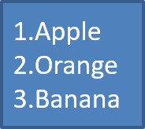

## **概述**

Aspose.Slides for Python via .NET 讓您能在 PowerPoint 與 OpenDocument 簡報中建立與格式化項目符號與編號清單。清單項目是一個段落，其項目符號設定透過段落格式進行控制。

使用 [Paragraph.paragraph_format](https://reference.aspose.com/slides/zh-hant/python-net/aspose.slides/paragraph/paragraph_format/) 屬性可存取段落層級的清單設定。主要入口點是 [ParagraphFormat.bullet](https://reference.aspose.com/slides/zh-hant/python-net/aspose.slides/paragraphformat/bullet/)，它會傳回一個 [BulletFormat](https://reference.aspose.com/slides/zh-hant/python-net/aspose.slides/bulletformat/) 物件。透過此物件，您可以設定項目符號類型、符號、圖片、顏色、大小、編號樣式以及起始編號。

本文說明如何：

- 建立使用自訂符號的項目符號清單
- 建立圖片項目符號
- 透過設定段落深度建立多層級清單
- 建立編號清單
- 檢查並變更現有簡報中的清單格式

## **建立項目符號清單**

若要建立項目符號清單，將 [Paragraph](https://reference.aspose.com/slides/zh-hant/python-net/aspose.slides/paragraph/) 物件新增至 [TextFrame](https://reference.aspose.com/slides/zh-hant/python-net/aspose.slides/textframe/) 並將 [BulletFormat.type](https://reference.aspose.com/slides/zh-hant/python-net/aspose.slides/bulletformat/type/) 設為 [BulletType.SYMBOL](https://reference.aspose.com/slides/zh-hant/python-net/aspose.slides/bullettype/)。之後您可以設定 [BulletFormat.char](https://reference.aspose.com/slides/zh-hant/python-net/aspose.slides/bulletformat/char/)、[BulletFormat.color](https://reference.aspose.com/slides/zh-hant/python-net/aspose.slides/bulletformat/color/) 與 [BulletFormat.height](https://reference.aspose.com/slides/zh-hant/python-net/aspose.slides/bulletformat/height/) 以控制項目符號的外觀。

以下 Python 程式碼示範如何在投影片中建立項目符號清單：

```py
import aspose.slides as slides
import aspose.pydrawing as draw

def create_paragraph(text):
    paragraph = slides.Paragraph()
    paragraph.paragraph_format.bullet.type = slides.BulletType.SYMBOL
    paragraph.paragraph_format.bullet.char = '*'
    paragraph.paragraph_format.indent = 15
    paragraph.paragraph_format.bullet.is_bullet_hard_color = slides.NullableBool.TRUE
    paragraph.paragraph_format.bullet.color.color = draw.Color.indian_red
    paragraph.paragraph_format.bullet.height = 100
    paragraph.text = text
    return paragraph


with slides.Presentation() as presentation:
    slide = presentation.slides[0]
    auto_shape = slide.shapes.add_auto_shape(slides.ShapeType.RECTANGLE, 20, 20, 200, 50)

    text_frame = auto_shape.text_frame
    text_frame.paragraphs.clear()

    paragraph1 = create_paragraph("The first paragraph")
    text_frame.paragraphs.add(paragraph1)

    paragraph2 = create_paragraph("The second paragraph")
    text_frame.paragraphs.add(paragraph2)

    presentation.save("symbol_bullets.pptx", slides.export.SaveFormat.PPTX)
```

結果：


## **建立編號清單**

當項目的順序很重要時，請使用編號清單。將 [BulletFormat.type](https://reference.aspose.com/slides/zh-hant/python-net/aspose.slides/bulletformat/type/) 設為 [BulletType.NUMBERED](https://reference.aspose.com/slides/zh-hant/python-net/aspose.slides/bullettype/)。您也可以使用 [BulletFormat.numbered_bullet_style](https://reference.aspose.com/slides/zh-hant/python-net/aspose.slides/bulletformat/numbered_bullet_style/) 選擇編號格式，或在清單需從非 1 的值開始時設定 [BulletFormat.numbered_bullet_start_with](https://reference.aspose.com/slides/zh-hant/python-net/aspose.slides/bulletformat/numbered_bullet_start_with/)。

以下 Python 程式碼顯示如何在投影片中建立編號清單：

```py
import aspose.slides as slides

with slides.Presentation() as presentation:
    slide = presentation.slides[0]
    auto_shape = slide.shapes.add_auto_shape(slides.ShapeType.RECTANGLE, 20, 20, 90, 80)

    text_frame = auto_shape.text_frame
    text_frame.paragraphs.clear()

    paragraph1 = slides.Paragraph()
    paragraph1.paragraph_format.bullet.type = slides.BulletType.NUMBERED
    paragraph1.text = "Apple"
    text_frame.paragraphs.add(paragraph1)

    paragraph2 = slides.Paragraph()
    paragraph2.paragraph_format.bullet.type = slides.BulletType.NUMBERED
    paragraph2.text = "Orange"
    text_frame.paragraphs.add(paragraph2)

    paragraph3 = slides.Paragraph()
    paragraph3.paragraph_format.bullet.type = slides.BulletType.NUMBERED
    paragraph3.text = "Banana"
    text_frame.paragraphs.add(paragraph3)

    presentation.save("numbered_bullets.pptx", slides.export.SaveFormat.PPTX)
```

結果：



## **建立圖片項目符號**

Aspose.Slides 允許您以影像取代一般的項目符號。圖片項目符號最適合使用簡單且在小尺寸下仍具可讀性的影像，例如圖示或小型透明 PNG 檔案。

{}
理想情況下，如果您打算以影像取代一般的項目符號，最好選擇具有透明背景的簡易圖形。此類影像非常適合作為自訂項目符號。

請記住，影像會被縮小至非常小的尺寸。因此，我們強烈建議選擇在作為清單項目符號時仍保持清晰且視覺有效的影像。
{}

若要建立圖片項目符號，請將影像加入 [Presentation.images](https://reference.aspose.com/slides/zh-hant/python-net/aspose.slides/presentation/images/)，並將返回的影像物件指派給 [BulletFormat.picture](https://reference.aspose.com/slides/zh-hant/python-net/aspose.slides/bulletformat/picture/)。在指派影像之前，將 [BulletFormat.type](https://reference.aspose.com/slides/zh-hant/python-net/aspose.slides/bulletformat/type/) 設為 [BulletType.PICTURE](https://reference.aspose.com/slides/zh-hant/python-net/aspose.slides/bullettype/)。

假設我們有一個 "image.png"：


以下 Python 程式碼顯示如何在投影片中建立圖片項目符號：

```py
import aspose.slides as slides

def create_paragraph(text, image):
    paragraph = slides.Paragraph()
    paragraph.paragraph_format.bullet.type = slides.BulletType.PICTURE
    paragraph.paragraph_format.bullet.picture.image = image
    paragraph.paragraph_format.indent = 15
    paragraph.paragraph_format.bullet.height = 100
    paragraph.text = text
    return paragraph


with slides.Presentation() as presentation:
    slide = presentation.slides[0]
    auto_shape = slide.shapes.add_auto_shape(slides.ShapeType.RECTANGLE, 20, 20, 200, 50)

    text_frame = auto_shape.text_frame
    text_frame.paragraphs.clear()

    with open("image.png", "rb") as image_stream:
        bullet_image = presentation.images.add_image(image_stream)

    paragraph1 = create_paragraph("The first paragraph", bullet_image)
    text_frame.paragraphs.add(paragraph1)

    paragraph2 = create_paragraph("The second paragraph", bullet_image)
    text_frame.paragraphs.add(paragraph2)

    presentation.save("picture_bullets.pptx", slides.export.SaveFormat.PPTX)
```

結果：


## **建立多層級清單**

使用 [ParagraphFormat.depth](https://reference.aspose.com/slides/zh-hant/python-net/aspose.slides/paragraphformat/depth/) 可將清單項目放置在不同層級。層級 0 為最上層，層級 1 為其下的子層，以此類推。

以下 Python 程式碼顯示如何建立多層級項目符號清單：

```py
import aspose.slides as slides

with slides.Presentation() as presentation:
    slide = presentation.slides[0]
    auto_shape = slide.shapes.add_auto_shape(slides.ShapeType.RECTANGLE, 20, 20, 260, 110)

    text_frame = auto_shape.text_frame
    text_frame.paragraphs.clear()

    paragraph1 = slides.Paragraph()
    paragraph1.paragraph_format.depth = 0
    paragraph1.text = "My text - Depth 0"
    text_frame.paragraphs.add(paragraph1)

    paragraph2 = slides.Paragraph()
    paragraph2.paragraph_format.depth = 1
    paragraph2.text = "My text - Depth 1"
    text_frame.paragraphs.add(paragraph2)

    paragraph3 = slides.Paragraph()
    paragraph3.paragraph_format.depth = 2
    paragraph3.text = "My text - Depth 2"
    text_frame.paragraphs.add(paragraph3)

    paragraph4 = slides.Paragraph()
    paragraph4.paragraph_format.depth = 3
    paragraph4.text = "My text - Depth 3"
    text_frame.paragraphs.add(paragraph4)

    presentation.save("multilevel_bullets.pptx", slides.export.SaveFormat.PPTX)
```

結果：


## **變更既有清單**

若要變更既有簡報中的清單格式，請存取目標段落並更新其 [ParagraphFormat.bullet](https://reference.aspose.com/slides/zh-hant/python-net/aspose.slides/paragraphformat/bullet/) 設定。建立清單時使用的相同屬性亦可用於檢查或修改從 PPT、PPTX 或 ODP 檔案載入的清單。

以下 Python 程式碼將文字框中的第一個段落變更為使用編號清單樣式：

```py
import aspose.slides as slides

with slides.Presentation("input.pptx") as presentation:
    slide = presentation.slides[0]
    auto_shape = slide.shapes[0]
    paragraph = auto_shape.text_frame.paragraphs[0]

    paragraph.paragraph_format.bullet.type = slides.BulletType.NUMBERED
    paragraph.paragraph_format.bullet.numbered_bullet_style = slides.NumberedBulletStyle.BULLET_ROMAN_UC_PERIOD
    paragraph.paragraph_format.bullet.numbered_bullet_start_with = 1
    paragraph.paragraph_format.margin_left = 30
    paragraph.paragraph_format.indent = -20

    presentation.save("updated_list.pptx", slides.export.SaveFormat.PPTX)
```

## **常見問題**

**項目符號與編號清單能匯出為 PDF 或影像嗎？**

是的。當目標格式支援相應的文字版面配置與項目符號功能時，Aspose.Slides 會保留清單格式。

**我可以編輯既有簡報中的清單嗎？**

是的。載入簡報，存取目標段落，檢查或更新其 [ParagraphFormat.bullet](https://reference.aspose.com/slides/zh-hant/python-net/aspose.slides/paragraphformat/bullet/) 設定，然後儲存簡報。

**清單可以包含非拉丁文字嗎？**

是的。清單項目的文字可以包含 Unicode 字元，您可以在多語言簡報中建立清單。請確保簡報中使用的字型支援您所需的字元。