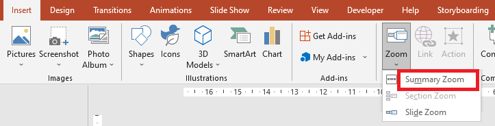

## **簡介**

PowerPoint 中的縮放功能允許您在簡報的特定投影片、節和部分之間跳轉。在簡報時，快速瀏覽內容的能力可能非常有用。


* 若要在單一投影片上概述整個簡報，請使用 [Summary Zoom](#Summary-Zoom)。
* 若只顯示選取的投影片，請使用 [Slide Zoom](#Slide-Zoom)。
* 若只顯示單一節，請使用 [Section Zoom](#Section-Zoom)。

## **投影片縮放**

投影片縮放可以讓您的簡報更具動態性，允許您以任意順序自由在投影片之間切換，而不會中斷簡報的流程。投影片縮放非常適合沒有太多節的短篇簡報，但您仍可在各種簡報情境中使用它們。

投影片縮放可協助您深入多筆資訊，同時彷彿置身於同一畫布之上。


對於投影片縮放物件，Aspose.Slides 提供了 [ZoomImageType](https://reference.aspose.com/slides/zh-hant/python-net/aspose.slides/zoomimagetype/) 列舉、[ZoomFrame](https://reference.aspose.com/slides/zh-hant/python-net/aspose.slides/zoomframe/) 類別，以及 [ShapeCollection](https://reference.aspose.com/slides/zh-hant/python-net/aspose.slides/shapecollection/) 類別中的一些方法。

### **建立縮放框格**
您可以透過以下方式在投影片上加入縮放框格：

1. 建立 [Presentation](https://reference.aspose.com/slides/zh-hant/python-net/aspose.slides/presentation/) 類別的實例。
2. 建立您打算連結的新投影片。
3. 為已建立的投影片加入識別文字與背景。
4. 將縮放框格（包含對已建立投影片的參考）加入第一張投影片。
5. 將修改後的簡報寫入為 PPTX 檔案。

以下範例程式碼示範如何在投影片中建立縮放框格：

```py 
import aspose.slides as slides
import aspose.pydrawing as draw

with slides.Presentation() as pres:
    #新增投影片至簡報
    slide2 = pres.slides.add_empty_slide(pres.slides[0].layout_slide)
    slide3 = pres.slides.add_empty_slide(pres.slides[0].layout_slide)

    # 為第二張投影片建立背景
    slide2.background.type = slides.BackgroundType.OWN_BACKGROUND
    slide2.background.fill_format.fill_type = slides.FillType.SOLID
    slide2.background.fill_format.solid_fill_color.color = draw.Color.cyan

    # 為第二張投影片建立文字方塊
    autoshape = slide2.shapes.add_auto_shape(slides.ShapeType.RECTANGLE, 100, 200, 500, 200)
    autoshape.text_frame.text = "Second Slide"

    # 為第三張投影片建立背景
    slide3.background.type = slides.BackgroundType.OWN_BACKGROUND
    slide3.background.fill_format.fill_type = slides.FillType.SOLID
    slide3.background.fill_format.solid_fill_color.color = draw.Color.dark_khaki

    # 為第三張投影片建立文字方塊
    autoshape = slide3.shapes.add_auto_shape(slides.ShapeType.RECTANGLE, 100, 200, 500, 200)
    autoshape.text_frame.text = "Trird Slide"

    #新增 ZoomFrame 物件
    pres.slides[0].shapes.add_zoom_frame(20, 20, 250, 200, slide2)
    pres.slides[0].shapes.add_zoom_frame(200, 250, 250, 200, slide3)

    # 儲存簡報
    pres.save("presentation-zoom.pptx", slides.export.SaveFormat.PPTX)
```

### **使用自訂影像建立縮放框格**
使用 Aspose.Slides for Python via .NET，您可以透過以下方式使用非投影片縮圖的影像建立縮放框格：

1. 建立 `Presentation` 類別的實例。
2. 建立您打算連結的新投影片。
3. 為已建立的投影片加入識別文字與背景。
4. 透過將影像加入屬於 Presentation 物件的 Images 集合，建立 [PPImage](https://reference.aspose.com/slides/zh-hant/python-net/aspose.slides/ppimage/) 物件，以作為填充框格的圖像。
5. 將縮放框格（包含對已建立投影片的參考）加入第一張投影片。
6. 將修改後的簡報寫入為 PPTX 檔案。

以下 Python 程式碼示範如何使用不同影像建立縮放框格：

```py 
import aspose.slides as slides
import aspose.pydrawing as draw

with slides.Presentation() as pres:
    #新增投影片至簡報
    slide = pres.slides.add_empty_slide(pres.slides[0].layout_slide)

    # 為第二張投影片建立背景
    slide.background.type = slides.BackgroundType.OWN_BACKGROUND
    slide.background.fill_format.fill_type = slides.FillType.SOLID
    slide.background.fill_format.solid_fill_color.color = draw.Color.cyan

    # 為第三張投影片建立文字方塊
    autoshape = slide.shapes.add_auto_shape(slides.ShapeType.RECTANGLE, 100, 200, 500, 200)
    autoshape.text_frame.text = "Second Slide"

    # 為縮放物件建立新影像
    image = pres.images.add_image(slides.Images.from_file("img.jpeg"))

    #新增 ZoomFrame 物件
    pres.slides[0].shapes.add_zoom_frame(20, 20, 300, 200, slide, image)

    # 儲存簡報
    pres.save("presentation.pptx", slides.export.SaveFormat.PPTX)
```

### **格式化縮放框格**
在前面的章節（如上）中，我們示範了如何建立簡易的縮放框格。若要建立較複雜的縮放框格，您必須調整框格的格式設定。縮放框格有多種可套用的格式設定。

您可以透過以下方式控制投影片中縮放框格的格式：

1. 建立 `Presentation` 類別的實例。
2. 建立要連結的新投影片。
3. 為已建立的投影片加入識別文字與背景。
4. 將縮放框格（包含對已建立投影片的參考）加入第一張投影片。
5. 透過將影像加入屬於 Presentation 物件的 Images 集合，建立 [PPImage](https://reference.aspose.com/slides/zh-hant/python-net/aspose.slides/ppimage/) 物件，以作為填充框格的圖像。
6. 為第一個縮放框格物件設定自訂影像。
7. 變更第二個縮放框格物件的線條格式。
8. 移除第二個縮放框格物件影像的背景。
9. 將修改後的簡報寫入為 PPTX 檔案。

以下 Python 範例程式碼示範如何變更縮放框格的格式：

```py 
import aspose.slides as slides
import aspose.pydrawing as draw

with slides.Presentation() as pres:
    #新增投影片至簡報
    slide2 = pres.slides.add_empty_slide(pres.slides[0].layout_slide)
    slide3 = pres.slides.add_empty_slide(pres.slides[0].layout_slide)

    # 為第二張投影片建立背景
    slide2.background.type = slides.BackgroundType.OWN_BACKGROUND
    slide2.background.fill_format.fill_type = slides.FillType.SOLID
    slide2.background.fill_format.solid_fill_color.color = draw.Color.cyan

    # 為第二張投影片建立文字方塊
    autoshape = slide2.shapes.add_auto_shape(slides.ShapeType.RECTANGLE, 100, 200, 500, 200)
    autoshape.text_frame.text = "Second Slide"

    # 為第三張投影片建立背景
    slide3.background.type = slides.BackgroundType.OWN_BACKGROUND
    slide3.background.fill_format.fill_type = slides.FillType.SOLID
    slide3.background.fill_format.solid_fill_color.color = draw.Color.dark_khaki

    # 為第三張投影片建立文字方塊
    autoshape = slide3.shapes.add_auto_shape(slides.ShapeType.RECTANGLE, 100, 200, 500, 200)
    autoshape.text_frame.text = "Trird Slide"

    #新增 ZoomFrame 物件
    zoomFrame1 = pres.slides[0].shapes.add_zoom_frame(20, 20, 250, 200, slide2)
    zoomFrame2 = pres.slides[0].shapes.add_zoom_frame(200, 250, 250, 200, slide3)

    # 為縮放物件建立新影像
    image = pres.images.add_image(slides.Images.from_file("img.jpeg"))
    # 為 zoomFrame1 物件設定自訂影像
    zoomFrame1.image = image

    # 為 zoomFrame2 物件設定縮放框格格式
    zoomFrame2.line_format.width = 5
    zoomFrame2.line_format.fill_format.fill_type = slides.FillType.SOLID
    zoomFrame2.line_format.fill_format.solid_fill_color.color = draw.Color.hot_pink
    zoomFrame2.line_format.dash_style = slides.LineDashStyle.DASH_DOT

    # 不顯示 zoomFrame2 物件的背景
    zoomFrame2.show_background = False

    # 儲存簡報
    pres.save("presentation-zoom2.pptx", slides.export.SaveFormat.PPTX)
```

## **節縮放**

節縮放是指向簡報中某個節的連結。您可以使用節縮放返回想特別強調的節，或用來凸顯簡報中各部分之間的關聯。


對於節縮放物件，Aspose.Slides 提供了 [SectionZoomFrame](https://reference.aspose.com/slides/zh-hant/python-net/aspose.slides/sectionzoomframe/) 類別，以及在 [ShapeCollection](https://reference.aspose.com/slides/zh-hant/python-net/aspose.slides/shapecollection/) 類別下的某些方法。

### **建立節縮放框格**

您可以透過以下方式在投影片上加入節縮放框格：

1. 建立 [Presentation](https://reference.aspose.com/slides/zh-hant/python-net/aspose.slides/presentation/) 類別的實例。
2. 建立新投影片。
3. 為已建立的投影片加入識別背景。
4. 建立您打算連結縮放框格的新節。
5. 將節縮放框格（包含對已建立節的參考）加入第一張投影片。
6. 将修改后的简报写入为 PPTX 文件。

以下 Python 代码展示如何在投影片上创建节缩放框格：

```py
import aspose.slides as slides
import aspose.pydrawing as draw

with slides.Presentation() as pres:
    #新增投影片至簡報
    slide = pres.slides.add_empty_slide(pres.slides[0].layout_slide)

    slide.background.type = slides.BackgroundType.OWN_BACKGROUND
    slide.background.fill_format.fill_type = slides.FillType.SOLID
    slide.background.fill_format.solid_fill_color.color = draw.Color.yellow_green


    # 在簡報中新增節
    pres.sections.add_section("Section 1", slide)

    # 新增 SectionZoomFrame 物件
    sectionZoomFrame = pres.slides[0].shapes.add_section_zoom_frame(20, 20, 300, 200, pres.sections[1])

    # 儲存簡報
    pres.save("presentation.pptx", slides.export.SaveFormat.PPTX)
```

### **使用自訂影像建立節縮放框格**

使用 Aspose.Slides for Python，您可以透過以下方式使用不同的投影片縮圖建立節縮放框格：

1. 建立 [Presentation](https://reference.aspose.com/slides/zh-hant/python-net/aspose.slides/presentation/) 類別的實例。
2. 建立新投影片。
3. 為已建立的投影片加入識別背景。
4. 建立您打算連結縮放框格的新節。
5. 透過將影像加入屬於 [Presentation](https://reference.aspose.com/slides/zh-hant/python-net/aspose.slides/presentation/) 物件的 Images 集合，建立 [PPImage](https://reference.aspose.com/slides/zh-hant/python-net/aspose.slides/ppimage/) 物件，以作為填充框格的圖像。
6. 將節縮放框格（包含對已建立節的參考）加入第一張投影片。
7. 将修改后的简报写入为 PPTX 文件。

以下 Python 代码展示如何使用不同影像建立節縮放框格：

```py
import aspose.slides as slides
import aspose.pydrawing as draw

with slides.Presentation() as pres:
    #新增投影片至簡報
    slide = pres.slides.add_empty_slide(pres.slides[0].layout_slide)

    slide.background.type = slides.BackgroundType.OWN_BACKGROUND
    slide.background.fill_format.fill_type = slides.FillType.SOLID
    slide.background.fill_format.solid_fill_color.color = draw.Color.yellow_green


    # 在簡報中新增節
    pres.sections.add_section("Section 1", slide)

    # 為縮放物件建立新影像
    image = pres.images.add_image(slides.Images.from_file("img.jpeg"))

    # 新增 SectionZoomFrame 物件
    sectionZoomFrame = pres.slides[0].shapes.add_section_zoom_frame(20, 20, 300, 200, pres.sections[1], image)

    # 儲存簡報
    pres.save("presentation.pptx", slides.export.SaveFormat.PPTX)
```

### **格式化節縮放框格**

若要建立較複雜的節縮放框格，必須變更簡易框格的格式。節縮放框格有多種格式選項可套用。

您可以透過以下方式在投影片上控制節縮放框格的格式：

1. 建立 [Presentation](https://reference.aspose.com/slides/zh-hant/python-net/aspose.slides/presentation/) 類別的實例。
2. 建立新投影片。
3. 為已建立的投影片加入識別背景。
4. 建立您打算連結縮放框格的新節。
5. 將節縮放框格（包含對已建立節的參考）加入第一張投影片。
6. 變更已建立節縮放物件的大小與位置。
7. 透過將影像加入屬於 [Presentation](https://reference.aspose.com/slides/zh-hant/python-net/aspose.slides/presentation/) 物件的 Images 集合，建立 [PPImage](https://reference.aspose.com/slides/zh-hant/python-net/aspose.slides/ppimage/) 物件，以作為填充框格的圖像。
8. 為已建立的節縮放框格物件設定自訂影像。
9. 設定 *從連結節返回原始投影片* 的功能。
10. 移除節縮放框格物件影像的背景。
11. 變更第二個縮放框格物件的線條格式。
12. 變更轉場持續時間。
13. 将修改后的简报写入为 PPTX 文件。

以下 Python 代码展示如何變更節縮放框格的格式：

```py
import aspose.slides as slides
import aspose.pydrawing as draw


with slides.Presentation() as pres:
    #新增投影片至簡報
    slide = pres.slides.add_empty_slide(pres.slides[0].layout_slide)
    slide.background.fill_format.fill_type = slides.FillType.SOLID
    slide.background.fill_format.solid_fill_color.color = draw.Color.yellow_green
    slide.background.type = slides.BackgroundType.OWN_BACKGROUND

    # 在簡報中新增節
    pres.sections.add_section("Section 1", slide)

    # 新增 SectionZoomFrame 物件
    sectionZoomFrame = pres.slides[0].shapes.add_section_zoom_frame(20, 20, 300, 200, pres.sections[1])

    # SectionZoomFrame 的格式設定
    sectionZoomFrame.x = 100
    sectionZoomFrame.y = 300
    sectionZoomFrame.width = 100
    sectionZoomFrame.height = 75

    image = pres.images.add_image(slides.Images.from_file("img.jpeg"))
    sectionZoomFrame.image = image

    sectionZoomFrame.return_to_parent = True
    sectionZoomFrame.show_background = False

    sectionZoomFrame.line_format.fill_format.fill_type = slides.FillType.SOLID
    sectionZoomFrame.line_format.fill_format.solid_fill_color.color = draw.Color.brown
    sectionZoomFrame.line_format.dash_style = slides.LineDashStyle.DASH_DOT
    sectionZoomFrame.line_format.width = 2.5

    sectionZoomFrame.transition_duration = 1.5

    # 儲存簡報
    pres.save("presentation.pptx", slides.export.SaveFormat.PPTX)
```

## **摘要縮放**

摘要縮放就像一個登陸頁面，將簡報的所有部份一次性展示。簡報時，您可以使用縮放任意順序在簡報的不同位置之間跳轉。您可以發揮創意、提前跳過或回顧簡報的各個部分，而不打斷簡報的流程。



對於摘要縮放物件，Aspose.Slides 提供了 [SummaryZoomFrame](https://reference.aspose.com/slides/zh-hant/python-net/aspose.slides/summaryzoomframe/)、[SummaryZoomSection](https://reference.aspose.com/slides/zh-hant/python-net/aspose.slides/summaryzoomsection/)、[SummaryZoomSectionCollection](https://reference.aspose.com/slides/zh-hant/python-net/aspose.slides/summaryzoomsectioncollection/) 類別，以及在 [ShapeCollection](https://reference.aspose.com/slides/zh-hant/python-net/aspose.slides/shapecollection/) 類別下的某些方法。

### **建立摘要縮放**

您可以透過以下方式在投影片上加入摘要縮放框格：

1. 建立 [Presentation](https://reference.aspose.com/slides/zh-hant/python-net/aspose.slides/presentation/) 類別的實例。
2. 為已建立的投影片建立帶有識別背景和新節的新投影片。
3. 將摘要縮放框格加入第一張投影片。
4. 将修改后的简报写入为 PPTX 文件。

以下 Python 代码展示如何在投影片上建立摘要縮放框格：

```py 
import aspose.slides as slides
import aspose.pydrawing as draw

with slides.Presentation() as pres:
    # 建立投影片陣列
    for slideNumber in range(5):
        #新增投影片至簡報
        slide = pres.slides.add_empty_slide(pres.slides[0].layout_slide)

        # 為投影片建立背景
        slide.background.type = slides.BackgroundType.OWN_BACKGROUND
        slide.background.fill_format.fill_type = slides.FillType.SOLID
        slide.background.fill_format.solid_fill_color.color = draw.Color.dark_khaki

        # 為投影片建立文字方塊
        autoshape = slide.shapes.add_auto_shape(slides.ShapeType.RECTANGLE, 100, 200, 500, 200)
        autoshape.text_frame.text = "Slide - {num}".format(num = (slideNumber + 2))

    # 為第一張投影片建立所有投影片的縮放物件
    for slideNumber in range(1, len(pres.slides)):
        x = (slideNumber - 1) * 100
        y = (slideNumber - 1) * 100
        zoomFrame = pres.slides[0].shapes.add_zoom_frame(x, y, 150, 120, pres.slides[slideNumber])

        # 設定 ReturnToParent 屬性以返回第一張投影片
        zoomFrame.return_to_parent = True

    # 儲存簡報
    pres.save("presentation-zoom3.pptx", slides.export.SaveFormat.PPTX)
```

### **新增與移除摘要縮放節**

所有摘要縮放框格中的節皆以 [SummaryZoomSection](https://reference.aspose.com/slides/zh-hant/python-net/aspose.slides/summaryzoomsection/) 物件表示，並存於 [SummaryZoomSectionCollection](https://reference.aspose.com/slides/zh-hant/python-net/aspose.slides/summaryzoomsectioncollection/) 物件中。您可以透過以下方式使用 [SummaryZoomSectionCollection](https://reference.aspose.com/slides/zh-hant/python-net/aspose.slides/summaryzoomsectioncollection/) 類別新增或移除摘要縮放節物件：

1. 建立 [Presentation](https://reference.aspose.com/slides/zh-hant/python-net/aspose.slides/presentation/) 類別的實例。
2. 為已建立的投影片建立帶有識別背景和新節的新投影片。
3. 將摘要縮放框格加入第一張投影片。
4. 為簡報新增一張投影片與一個節。
5. 將建立的節加入摘要縮放框格。
6. 從摘要縮放框格中移除第一個節。
7. 将修改后的简报写入为 PPTX 文件。

以下 Python 代码展示如何在摘要縮放框格中新增與移除節：

``` python
import aspose.slides as slides
import aspose.pydrawing as draw


with slides.Presentation() as pres:
    #新增投影片至簡報
    slide = pres.slides.add_empty_slide(pres.slides[0].layout_slide)
    slide.background.fill_format.fill_type = slides.FillType.SOLID
    slide.background.fill_format.solid_fill_color.color = draw.Color.yellow_green
    slide.background.type = slides.BackgroundType.OWN_BACKGROUND

    # 在簡報中新增節
    pres.sections.add_section("Section 1", slide)

    #新增投影片至簡報
    slide = pres.slides.add_empty_slide(pres.slides[0].layout_slide)
    slide.background.fill_format.fill_type = slides.FillType.SOLID
    slide.background.fill_format.solid_fill_color.color = draw.Color.aqua
    slide.background.type = slides.BackgroundType.OWN_BACKGROUND

    # 在簡報中新增節
    pres.sections.add_section("Section 2", slide)

    # 新增 SummaryZoomFrame 物件
    summaryZoomFrame = pres.slides[0].shapes.add_summary_zoom_frame(150, 50, 300, 200)

    #新增投影片至簡報
    slide = pres.slides.add_empty_slide(pres.slides[0].layout_slide)
    slide.background.fill_format.fill_type = slides.FillType.SOLID
    slide.background.fill_format.solid_fill_color.color = draw.Color.chartreuse
    slide.background.type = slides.BackgroundType.OWN_BACKGROUND

    # 在簡報中新增節
    section3 = pres.sections.add_section("Section 3", slide)

    # 將節加入摘要縮放
    summaryZoomFrame.summary_zoom_collection.add_summary_zoom_section(section3)

    # 從摘要縮放中移除節
    summaryZoomFrame.summary_zoom_collection.remove_summary_zoom_section(pres.sections[1])

    # 儲存簡報
    pres.save("presentation.pptx", slides.export.SaveFormat.PPTX)
```

### **格式化摘要縮放節**

若要建立較複雜的摘要縮放節物件，必須變更簡易框格的格式。摘要縮放節物件有多種格式選項可套用。

您可以透過以下方式在摘要縮放框格中控制摘要縮放節物件的格式：

1. 建立 [Presentation](https://reference.aspose.com/slides/zh-hant/python-net/aspose.slides/presentation/) 類別的實例。
2. 為已建立的投影片建立帶有識別背景和新節的新投影片。
3. 將摘要縮放框格加入第一張投影片。
4. 從 `SummaryZoomSectionCollection` 取得第一個物件的摘要縮放節物件。
5. 透過將影像加入屬於 [Presentation](https://reference.aspose.com/slides/zh-hant/python-net/aspose.slides/presentation/) 物件的 images 集合，建立 `PPImage` 物件，以作為填充框格的圖像。
6. 為已建立的節縮放框格物件設定自訂影像。
7. 設定 *從連結節返回原始投影片* 的功能。
8. 變更第二個縮放框格物件的線條格式。
9. 變更轉場持續時間。
10. 将修改后的简报写入为 PPTX 文件。

以下 Python 代码展示如何變更摘要縮放節物件的格式：

```py
import aspose.slides as slides
import aspose.pydrawing as draw

with slides.Presentation() as pres:
    #新增投影片至簡報
    slide = pres.slides.add_empty_slide(pres.slides[0].layout_slide)
    slide.background.fill_format.fill_type = slides.FillType.SOLID
    slide.background.fill_format.solid_fill_color.color = draw.Color.brown
    slide.background.type = slides.BackgroundType.OWN_BACKGROUND

    # 在簡報中新增節
    pres.sections.add_section("Section 1", slide)

    #新增投影片至簡報
    slide = pres.slides.add_empty_slide(pres.slides[0].layout_slide)
    slide.background.fill_format.fill_type = slides.FillType.SOLID
    slide.background.fill_format.solid_fill_color.color = draw.Color.aqua
    slide.background.type = slides.BackgroundType.OWN_BACKGROUND

    # 在簡報中新增節
    pres.sections.add_section("Section 2", slide)

    # 新增 SummaryZoomFrame 物件
    summaryZoomFrame = pres.slides[0].shapes.add_summary_zoom_frame(150, 50, 300, 200)

    # 取得第一個 SummaryZoomSection 物件
    summarySection = summaryZoomFrame.summary_zoom_collection[0]

    # SummaryZoomSection 物件的格式設定
    image = pres.images.add_image(slides.Images.from_file("img.jpeg"))
    summarySection.image = image

    summarySection.return_to_parent = False

    summarySection.line_format.fill_format.fill_type = slides.FillType.SOLID
    summarySection.line_format.fill_format.solid_fill_color.color = draw.Color.black
    summarySection.line_format.dash_style = slides.LineDashStyle.DASH_DOT
    summarySection.line_format.width = 1.5

    summarySection.transition_duration = 1.5

    # 儲存簡報
    pres.save("presentation.pptx", slides.export.SaveFormat.PPTX)
```

## **常見問題**

**顯示目標後，我可以控制返回「父」投影片嗎？**

是的。[Zoom frame](https://reference.aspose.com/slides/zh-hant/python-net/aspose.slides/zoomframe/) 或 [section](https://reference.aspose.com/slides/zh-hant/python-net/aspose.slides/sectionzoomframe/) 具有 `return_to_parent` 行為，啟用後會在觀看者瀏覽完目標內容後返回原始投影片。

**我可以調整縮放轉場的「速度」或持續時間嗎？**

是的。縮放支援設定 `transition_duration`，讓您控制跳轉動畫的持續時間。

**簡報能包含多少個縮放物件有上限嗎？**

文件中未列出硬性 API 限制。實際限制取決於簡報的整體複雜度與觀看者的效能。您可以加入許多縮放框格，但需考慮檔案大小與渲染時間。