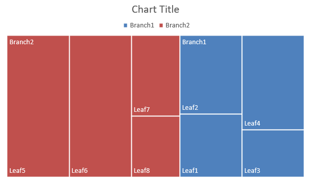

## **概述**

本文說明如何使用 Aspose.Slides for Python via .NET 建立和自訂圖表。您將學習如何將圖表加入投影片、填入資料，並依設計需求調整格式。程式碼範例涵蓋建立簡報與圖表、設定系列、座標軸與圖例，以及將圖表產生整合至您的應用程式中。

## **建立圖表**

圖表可協助使用者快速視覺化資料，並從中獲得在表格或試算表中不易立即看出的洞見。

**為什麼要建立圖表？**

使用圖表，您可以：

* 在單一投影片上彙總、濃縮或概括大量資料；
* 顯示資料中的模式與趨勢；
* 推斷資料隨時間或特定測量單位的走向與動能；
* 發現異常值、偏差、錯誤與不合理的資料；
* 傳達或展示複雜資料。

在 PowerPoint 中，您可以透過 *Insert* 功能建立圖表，該功能提供多種圖表樣板供設計使用。使用 Aspose.Slides，您可以建立一般圖表（基於常見圖表類型）以及自訂圖表。

{}

使用位於 [Aspose.Slides.Charts](https://reference.aspose.com/slides/zh-hant/python-net/aspose.slides.charts/) 命名空間下的 [ChartType](https://reference.aspose.com/slides/zh-hant/python-net/aspose.slides.charts/charttype/) 列舉。此列舉中的值對應不同的圖表類型。

{}

### **建立叢集直條圖**

本節說明如何使用 Aspose.Slides for Python via .NET 建立叢集直條圖。您將學會初始化簡報、加入圖表，並自訂標題、資料、系列、類別與樣式。請依以下步驟觀察標準叢集直條圖的產生方式：

1. 建立 [Presentation](https://reference.aspose.com/slides/zh-hant/python-net/aspose.slides/presentation/) 類別的實例。  
1. 依索引取得投影片參考。  
1. 加入圖表並指定 `ChartType.CLUSTERED_COLUMN` 類型，同時提供一些資料。  
1. 為圖表加入標題。  
1. 取得圖表的資料工作表。  
1. 清除所有預設的系列與類別。  
1. 新增系列與類別。  
1. 為圖表系列加入新資料。  
1. 為圖表系列套用填色。  
1. 為圖表系列加入標籤。  
1. 將修改後的簡報另存為 PPTX 檔案。

以下 Python 程式碼示範如何建立叢集直條圖：

```py
import aspose.slides.charts as charts
import aspose.slides as slides
import aspose.pydrawing as draw

# 建立代表 PPTX 檔案的 Presentation 類別實例。
with slides.Presentation() as presentation:

    # 取得第一張投影片。
    slide = presentation.slides[0]

    # 新增一個使用預設資料的叢集直條圖。
    chart = slide.shapes.add_chart(charts.ChartType.CLUSTERED_COLUMN, 20, 20, 500, 300)

    # 設定圖表標題。
    chart.chart_title.add_text_frame_for_overriding("Sample Title")
    chart.chart_title.text_frame_for_overriding.text_frame_format.center_text = slides.NullableBool.TRUE
    chart.chart_title.height = 20
    chart.has_title = True

    # 設定圖表資料工作表的索引。
    worksheet_index = 0

    # 取得圖表資料活頁簿。
    workbook = chart.chart_data.chart_data_workbook

    # 刪除預設產生的系列與類別。
    chart.chart_data.series.clear()
    chart.chart_data.categories.clear()

    # 新增系列。
    chart.chart_data.series.add(workbook.get_cell(worksheet_index, 0, 1, "Series 1"), chart.type)
    chart.chart_data.series.add(workbook.get_cell(worksheet_index, 0, 2, "Series 2"), chart.type)

    # 新增類別。
    chart.chart_data.categories.add(workbook.get_cell(worksheet_index, 1, 0, "Category 1"))
    chart.chart_data.categories.add(workbook.get_cell(worksheet_index, 2, 0, "Category 2"))
    chart.chart_data.categories.add(workbook.get_cell(worksheet_index, 3, 0, "Category 3"))

    # 取得第一個圖表系列。
    series = chart.chart_data.series[0]

    # 填入系列資料。
    series.data_points.add_data_point_for_bar_series(workbook.get_cell(worksheet_index, 1, 1, 20))
    series.data_points.add_data_point_for_bar_series(workbook.get_cell(worksheet_index, 2, 1, 50))
    series.data_points.add_data_point_for_bar_series(workbook.get_cell(worksheet_index, 3, 1, 30))

    # 設定系列的填色。
    series.format.fill.fill_type = slides.FillType.SOLID
    series.format.fill.solid_fill_color.color = draw.Color.red

    # 取得第二個圖表系列。
    series = chart.chart_data.series[1]

    # 填入系列資料。
    series.data_points.add_data_point_for_bar_series(workbook.get_cell(worksheet_index, 1, 2, 30))
    series.data_points.add_data_point_for_bar_series(workbook.get_cell(worksheet_index, 2, 2, 10))
    series.data_points.add_data_point_for_bar_series(workbook.get_cell(worksheet_index, 3, 2, 60))

    # 設定系列的填色。
    series.format.fill.fill_type = slides.FillType.SOLID
    series.format.fill.solid_fill_color.color = draw.Color.green

    # 設定第一個標籤顯示類別名稱。
    label = series.data_points[0].label
    label.data_label_format.show_category_name = True

    label = series.data_points[1].label
    label.data_label_format.show_series_name = True

    # 設定系列在第三個標籤顯示數值。
    label = series.data_points[2].label
    label.data_label_format.show_value = True
    label.data_label_format.show_series_name = True
    label.data_label_format.separator = "/"
                
    # 將簡報儲存為 PPTX 檔案。
    presentation.save("ClusteredColumnChart.pptx", slides.export.SaveFormat.PPTX)
```

結果：


### **建立散點圖**

散點圖（亦稱散佈圖或 x‑y 圖）常用於檢查模式或顯示兩個變數之間的相關性。

在以下情況使用散點圖：

* 您有配對的數值資料。  
* 您有兩個彼此關聯的變數。  
* 您想判斷兩個變數是否相關。  
* 您有一個獨立變數，其對應多個依賴變數的值。

以下 Python 程式碼示範如何為每個系列設定不同標記，建立散點圖：

```py
import aspose.slides.charts as charts
import aspose.slides as slides
import aspose.pydrawing as draw

# 建立 Presentation 類別的實例。
with slides.Presentation() as presentation:

    # 取得第一張投影片。
    slide = presentation.slides[0]

    # 建立預設的散點圖表。
    chart = slide.shapes.add_chart(charts.ChartType.SCATTER_WITH_SMOOTH_LINES, 20, 20, 500, 300)

    # 設定圖表資料工作表的索引。
    worksheet_index = 0

    # 取得圖表資料活頁簿。
    workbook = chart.chart_data.chart_data_workbook

    # 刪除預設系列。
    chart.chart_data.series.clear()

    # 新增系列。
    chart.chart_data.series.add(workbook.get_cell(worksheet_index, 1, 1, "Series 1"), chart.type)
    chart.chart_data.series.add(workbook.get_cell(worksheet_index, 1, 3, "Series 2"), chart.type)

    # 取得第一個圖表系列。
    series = chart.chart_data.series[0]

    # 為系列新增一個點 (1:3)。
    series.data_points.add_data_point_for_scatter_series(workbook.get_cell(worksheet_index, 2, 1, 1), workbook.get_cell(worksheet_index, 2, 2, 3))

    # 新增一個點 (2:10)。
    series.data_points.add_data_point_for_scatter_series(workbook.get_cell(worksheet_index, 3, 1, 2), workbook.get_cell(worksheet_index, 3, 2, 10))

    # 變更系列類型。
    series.type = charts.ChartType.SCATTER_WITH_STRAIGHT_LINES_AND_MARKERS

    # 變更圖表系列的標記。
    series.marker.size = 10
    series.marker.symbol = charts.MarkerStyleType.STAR

    # 取得第二個圖表系列。
    series = chart.chart_data.series[1]

    # 為圖表系列新增一個點 (5:2)。
    series.data_points.add_data_point_for_scatter_series(workbook.get_cell(worksheet_index, 2, 3, 5), workbook.get_cell(worksheet_index, 2, 4, 2))

    # 新增一個點 (3:1)。
    series.data_points.add_data_point_for_scatter_series(workbook.get_cell(worksheet_index, 3, 3, 3), workbook.get_cell(worksheet_index, 3, 4, 1))

    # 新增一個點 (2:2)。
    series.data_points.add_data_point_for_scatter_series(workbook.get_cell(worksheet_index, 4, 3, 2), workbook.get_cell(worksheet_index, 4, 4, 2))

    # 新增一個點 (5:1)。
    series.data_points.add_data_point_for_scatter_series(workbook.get_cell(worksheet_index, 5, 3, 5), workbook.get_cell(worksheet_index, 5, 4, 1))

    # 變更圖表系列的標記。
    series.marker.size = 10
    series.marker.symbol = charts.MarkerStyleType.CIRCLE

    presentation.save("ScatterChart.pptx", slides.export.SaveFormat.PPTX)
```

結果：


### **建立圓餅圖**

圓餅圖最適合用於顯示資料中部分與整體的關係，特別是當資料包含帶有數值的類別標籤時。但若資料有太多部份或標籤，建議改用長條圖。

1. 建立 [Presentation](https://reference.aspose.com/slides/zh-hant/python-net/aspose.slides/presentation/) 類別的實例。  
1. 依索引取得投影片參考。  
1. 加入圖表並指定 `ChartType.PIE` 類型，使用預設資料。  
1. 取得圖表的資料活頁簿（[ChartDataWorkbook](https://reference.aspose.com/slides/zh-hant/python-net/aspose.slides.charts/chartdataworkbook/)）。  
1. 清除預設的系列與類別。  
1. 新增系列與類別。  
1. 為圖表系列加入新資料。  
1. 為圓餅圖的各區塊加入新點並套用自訂顏色。  
1. 為系列設定標籤。  
1. 為系列標籤啟用指引線。  
1. 設定圓餅圖的旋轉角度。  
1. 將修改後的簡報另存為 PPTX 檔案。

以下 Python 程式碼示範如何建立圓餅圖：

```py
import aspose.slides.charts as charts
import aspose.slides as slides
import aspose.pydrawing as draw

# 建立代表 PPTX 檔案的 Presentation 類別實例。
with slides.Presentation() as presentation:

    # 取得第一張投影片。
    slide = presentation.slides[0]

    # 新增一個使用預設資料的圖表。
    chart = slide.shapes.add_chart(charts.ChartType.PIE, 20, 20, 500, 300)

    # 設定圖表標題。
    chart.chart_title.add_text_frame_for_overriding("Sample Title")
    chart.chart_title.text_frame_for_overriding.text_frame_format.center_text = slides.NullableBool.TRUE
    chart.chart_title.height = 20
    chart.has_title = True

    # 設定圖表資料工作表的索引。
    worksheet_index = 0

    # 取得圖表資料活頁簿。
    workbook = chart.chart_data.chart_data_workbook

    # 刪除預設產生的系列與類別。
    chart.chart_data.series.clear()
    chart.chart_data.categories.clear()

    # 新增類別。
    chart.chart_data.categories.add(workbook.get_cell(0, 1, 0, "First Qtr"))
    chart.chart_data.categories.add(workbook.get_cell(0, 2, 0, "2nd Qtr"))
    chart.chart_data.categories.add(workbook.get_cell(0, 3, 0, "3rd Qtr"))

    # 新增系列。
    series = chart.chart_data.series.add(workbook.get_cell(0, 0, 1, "Series 1"), chart.type)

    # 填入系列資料。
    series.data_points.add_data_point_for_pie_series(workbook.get_cell(worksheet_index, 1, 1, 20))
    series.data_points.add_data_point_for_pie_series(workbook.get_cell(worksheet_index, 2, 1, 50))
    series.data_points.add_data_point_for_pie_series(workbook.get_cell(worksheet_index, 3, 1, 30))

    # 設定區塊顏色。
    chart.chart_data.series_groups[0].is_color_varied = True

    point = series.data_points[0]
    point.format.fill.fill_type = slides.FillType.SOLID
    point.format.fill.solid_fill_color.color = draw.Color.cyan

    # 設定區塊邊框。
    point.format.line.fill_format.fill_type = slides.FillType.SOLID
    point.format.line.fill_format.solid_fill_color.color = draw.Color.gray
    point.format.line.width = 3.0
    point.format.line.style = slides.LineStyle.THIN_THICK
    point.format.line.dash_style = slides.LineDashStyle.DASH_DOT

    point1 = series.data_points[1]
    point1.format.fill.fill_type = slides.FillType.SOLID
    point1.format.fill.solid_fill_color.color = draw.Color.brown

    # 設定區塊邊框。
    point1.format.line.fill_format.fill_type = slides.FillType.SOLID
    point1.format.line.fill_format.solid_fill_color.color = draw.Color.blue
    point1.format.line.width = 3.0
    point1.format.line.style = slides.LineStyle.SINGLE
    point1.format.line.dash_style = slides.LineDashStyle.LARGE_DASH_DOT

    point2 = series.data_points[2]
    point2.format.fill.fill_type = slides.FillType.SOLID
    point2.format.fill.solid_fill_color.color = draw.Color.coral

    # 設定區塊邊框。
    point2.format.line.fill_format.fill_type = slides.FillType.SOLID
    point2.format.line.fill_format.solid_fill_color.color = draw.Color.red
    point2.format.line.width = 2.0
    point2.format.line.style = slides.LineStyle.THIN_THIN
    point2.format.line.dash_style = slides.LineDashStyle.LARGE_DASH_DOT_DOT

    # 為新系列中的每個類別建立自訂標籤。
    label1 = series.data_points[0].label

    label1.data_label_format.show_value = True

    label2 = series.data_points[1].label
    label2.data_label_format.show_value = True
    label2.data_label_format.show_legend_key = True
    label2.data_label_format.show_percentage = True

    label3 = series.data_points[2].label
    label3.data_label_format.show_series_name = True
    label3.data_label_format.show_percentage = True

    # 設定系列在圖表中顯示引線。
    series.labels.default_data_label_format.show_leader_lines = True

    # 設定圓餅圖區塊的旋轉角度。
    chart.chart_data.series_groups[0].first_slice_angle = 180

    # 將簡報儲存為 PPTX 檔案。
    presentation.save("PieChart.pptx", slides.export.SaveFormat.PPTX)
```

結果：


### **建立折線圖**

折線圖（亦稱折線圖）最適合用於說明隨時間變化的數值。使用折線圖，您可以一次比較大量資料、追蹤隨時間的變化與趨勢、突出資料系列中的異常等。

1. 建立 [Presentation](https://reference.aspose.com/slides/zh-hant/python-net/aspose.slides/presentation/) 類別的實例。  
1. 依索引取得投影片參考。  
1. 加入圖表並指定 `ChartType.LINE` 類型，使用預設資料。  
1. 將修改後的簡報另存為 PPTX 檔案。

以下 Python 程式碼示範如何建立折線圖：

```python
import aspose.slides as slides

with slides.Presentation() as presentation:
    line_chart = presentation.slides[0].shapes.add_chart(slides.charts.ChartType.LINE, 20, 20, 500, 300)
    
    presentation.save("LineChart.pptx", slides.export.SaveFormat.PPTX)
```

預設情況下，折線圖的點會以直線連接。若希望以虛線連接點，可如下指定虛線類型：

```python
import aspose.slides as slides

with slides.Presentation() as presentation:
    line_chart = presentation.slides[0].shapes.add_chart(slides.charts.ChartType.LINE, 10, 50, 600, 350)

    for series in line_chart.chart_data.series:
        series.format.line.dash_style = slides.LineDashStyle.DASH

    presentation.save("LineChart.pptx", slides.export.SaveFormat.PPTX)
```

結果：


### **建立樹狀圖（Tree Map）**

樹狀圖最適合用於銷售資料，當您想顯示資料類別的相對大小，並快速凸顯每個類別中貢獻較大的項目時。

1. 建立 [Presentation](https://reference.aspose.com/slides/zh-hant/python-net/aspose.slides/presentation/) 類別的實例。  
1. 依索引取得投影片參考。  
1. 加入圖表並指定 `ChartType.TREEMAP` 類型，使用預設資料。  
1. 取得圖表的資料活頁簿（[ChartDataWorkbook](https://reference.aspose.com/slides/zh-hant/python-net/aspose.slides.charts/chartdataworkbook/)）。  
1. 清除預設的系列與類別。  
1. 新增系列與類別。  
1. 為圖表系列加入新資料。  
1. 將修改後的簡報另存為 PPTX 檔案。

以下 Python 程式碼示範如何建立樹狀圖：

```py
import aspose.slides.charts as charts
import aspose.slides as slides
import aspose.pydrawing as draw

with slides.Presentation() as presentation:
    chart = presentation.slides[0].shapes.add_chart(charts.ChartType.TREEMAP, 20, 20, 500, 300)
    chart.chart_data.categories.clear()
    chart.chart_data.series.clear()

    workbook = chart.chart_data.chart_data_workbook
    workbook.clear(0)

    # 分支 1
    leaf = chart.chart_data.categories.add(workbook.get_cell(0, "C1", "Leaf1"))
    leaf.grouping_levels.set_grouping_item(1, "Stem1")
    leaf.grouping_levels.set_grouping_item(2, "Branch1")

    chart.chart_data.categories.add(workbook.get_cell(0, "C2", "Leaf2"))

    leaf = chart.chart_data.categories.add(workbook.get_cell(0, "C3", "Leaf3"))
    leaf.grouping_levels.set_grouping_item(1, "Stem2")

    chart.chart_data.categories.add(workbook.get_cell(0, "C4", "Leaf4"))

    # 分支 2
    leaf = chart.chart_data.categories.add(workbook.get_cell(0, "C5", "Leaf5"))
    leaf.grouping_levels.set_grouping_item(1, "Stem3")
    leaf.grouping_levels.set_grouping_item(2, "Branch2")

    chart.chart_data.categories.add(workbook.get_cell(0, "C6", "Leaf6"))

    leaf = chart.chart_data.categories.add(workbook.get_cell(0, "C7", "Leaf7"))
    leaf.grouping_levels.set_grouping_item(1, "Stem4")

    chart.chart_data.categories.add(workbook.get_cell(0, "C8", "Leaf8"))

    series = chart.chart_data.series.add(charts.ChartType.TREEMAP)
    series.labels.default_data_label_format.show_category_name = True
    series.data_points.add_data_point_for_treemap_series(workbook.get_cell(0, "D1", 4))
    series.data_points.add_data_point_for_treemap_series(workbook.get_cell(0, "D2", 5))
    series.data_points.add_data_point_for_treemap_series(workbook.get_cell(0, "D3", 3))
    series.data_points.add_data_point_for_treemap_series(workbook.get_cell(0, "D4", 6))
    series.data_points.add_data_point_for_treemap_series(workbook.get_cell(0, "D5", 9))
    series.data_points.add_data_point_for_treemap_series(workbook.get_cell(0, "D6", 9))
    series.data_points.add_data_point_for_treemap_series(workbook.get_cell(0, "D7", 4))
    series.data_points.add_data_point_for_treemap_series(workbook.get_cell(0, "D8", 3))

    series.parent_label_layout = charts.ParentLabelLayoutType.OVERLAPPING

    presentation.save("TreeMap.pptx", slides.export.SaveFormat.PPTX)
```

結果：



### **建立股票圖表**

股票圖表用於顯示開盤價、最高價、最低價與收盤價等金融資料，協助分析市場走勢與波動性，為投資者與分析師提供重要見解。

1. 建立 [Presentation](https://reference.aspose.com/slides/zh-hant/python-net/aspose.slides/presentation/) 類別的實例。  
1. 依索引取得投影片參考。  
1. 加入圖表並指定 `ChartType.OPEN_HIGH_LOW_CLOSE` 類型，使用預設資料。  
1. 取得圖表的資料活頁簿（[ChartDataWorkbook](https://reference.aspose.com/slides/zh-hant/python-net/aspose.slides.charts/chartdataworkbook/)）。  
1. 清除預設的系列與類別。  
1. 新增系列與類別。  
1. 為圖表系列加入新資料。  
1. 指定高低線格式。  
1. 將修改後的簡報另存為 PPTX 檔案。

以下 Python 程式碼示範如何建立股票圖表：

```py
import aspose.slides.charts as charts
import aspose.slides as slides
import aspose.pydrawing as draw

with slides.Presentation() as presentation:
    chart = presentation.slides[0].shapes.add_chart(charts.ChartType.OPEN_HIGH_LOW_CLOSE, 20, 20, 500, 300, False)

    chart.chart_data.series.clear()
    chart.chart_data.categories.clear()

    workbook = chart.chart_data.chart_data_workbook

    chart.chart_data.categories.add(workbook.get_cell(0, 1, 0, "A"))
    chart.chart_data.categories.add(workbook.get_cell(0, 2, 0, "B"))
    chart.chart_data.categories.add(workbook.get_cell(0, 3, 0, "C"))

    chart.chart_data.series.add(workbook.get_cell(0, 0, 1, "Open"), chart.type)
    chart.chart_data.series.add(workbook.get_cell(0, 0, 2, "High"), chart.type)
    chart.chart_data.series.add(workbook.get_cell(0, 0, 3, "Low"), chart.type)
    chart.chart_data.series.add(workbook.get_cell(0, 0, 4, "Close"), chart.type)

    series = chart.chart_data.series[0]

    series.data_points.add_data_point_for_stock_series(workbook.get_cell(0, 1, 1, 72))
    series.data_points.add_data_point_for_stock_series(workbook.get_cell(0, 2, 1, 25))
    series.data_points.add_data_point_for_stock_series(workbook.get_cell(0, 3, 1, 38))

    series = chart.chart_data.series[1]
    series.data_points.add_data_point_for_stock_series(workbook.get_cell(0, 1, 2, 172))
    series.data_points.add_data_point_for_stock_series(workbook.get_cell(0, 2, 2, 57))
    series.data_points.add_data_point_for_stock_series(workbook.get_cell(0, 3, 2, 57))

    series = chart.chart_data.series[2]
    series.data_points.add_data_point_for_stock_series(workbook.get_cell(0, 1, 3, 12))
    series.data_points.add_data_point_for_stock_series(workbook.get_cell(0, 2, 3, 12))
    series.data_points.add_data_point_for_stock_series(workbook.get_cell(0, 3, 3, 13))

    series = chart.chart_data.series[3]
    series.data_points.add_data_point_for_stock_series(workbook.get_cell(0, 1, 4, 25))
    series.data_points.add_data_point_for_stock_series(workbook.get_cell(0, 2, 4, 38))
    series.data_points.add_data_point_for_stock_series(workbook.get_cell(0, 3, 4, 50))

    chart.chart_data.series_groups[0].up_down_bars.has_up_down_bars = True
    chart.chart_data.series_groups[0].hi_low_lines_format.line.fill_format.fill_type = slides.FillType.SOLID

    for ser in chart.chart_data.series:
        ser.format.line.fill_format.fill_type = slides.FillType.NO_FILL

    presentation.save("StockChart.pptx", slides.export.SaveFormat.PPTX)
```

結果：


### **建立箱形圖（Box and Whisker）**

箱形圖用於顯示資料的分佈情形，彙總中位數、四分位數與可能的離群值等統計資訊，適合在探索性資料分析與統計研究中快速了解資料變異性與異常情況。

1. 建立 [Presentation](https://reference.aspose.com/slides/zh-hant/python-net/aspose.slides/presentation/) 類別的實例。  
1. 依索引取得投影片參考。  
1. 加入圖表並指定 `ChartType.BOX_AND_WHISKER` 類型，使用預設資料。  
1. 取得圖表的資料活頁簿（[ChartDataWorkbook](https://reference.aspose.com/slides/zh-hant/python-net/aspose.slides.charts/chartdataworkbook/)）。  
1. 清除預設的系列與類別。  
1. 新增系列與類別。  
1. 為圖表系列加入新資料。  
1. 將修改後的簡報另存為 PPTX 檔案。

以下 Python 程式碼示範如何建立箱形圖：

```py
import aspose.slides.charts as charts
import aspose.slides as slides
import aspose.pydrawing as draw

with slides.Presentation() as presentation:
    chart = presentation.slides[0].shapes.add_chart(charts.ChartType.BOX_AND_WHISKER, 20, 20, 500, 300)
    chart.chart_data.categories.clear()
    chart.chart_data.series.clear()

    workbook = chart.chart_data.chart_data_workbook
    workbook.clear(0)

    chart.chart_data.categories.add(workbook.get_cell(0, "A1", "Category 1"))
    chart.chart_data.categories.add(workbook.get_cell(0, "A2", "Category 1"))
    chart.chart_data.categories.add(workbook.get_cell(0, "A3", "Category 1"))
    chart.chart_data.categories.add(workbook.get_cell(0, "A4", "Category 1"))
    chart.chart_data.categories.add(workbook.get_cell(0, "A5", "Category 1"))
    chart.chart_data.categories.add(workbook.get_cell(0, "A6", "Category 1"))

    series = chart.chart_data.series.add(charts.ChartType.BOX_AND_WHISKER)

    series.quartile_method = charts.QuartileMethodType.EXCLUSIVE
    series.show_mean_line = True
    series.show_mean_markers = True
    series.show_inner_points = True
    series.show_outlier_points = True

    series.data_points.add_data_point_for_box_and_whisker_series(workbook.get_cell(0, "B1", 15))
    series.data_points.add_data_point_for_box_and_whisker_series(workbook.get_cell(0, "B2", 41))
    series.data_points.add_data_point_for_box_and_whisker_series(workbook.get_cell(0, "B3", 16))
    series.data_points.add_data_point_for_box_and_whisker_series(workbook.get_cell(0, "B4", 10))
    series.data_points.add_data_point_for_box_and_whisker_series(workbook.get_cell(0, "B5", 23))
    series.data_points.add_data_point_for_box_and_whisker_series(workbook.get_cell(0, "B6", 16))

    presentation.save("BoxAndWhiskerChart.pptx", slides.export.SaveFormat.PPTX)
```

### **建立漏斗圖**

漏斗圖用於視覺化具有連續階段的流程，資料量會隨每一步驟遞減。此圖表特別有助於分析轉換率、找出瓶頸，並追蹤銷售或行銷流程的效率。

1. 建立 [Presentation](https://reference.aspose.com/slides/zh-hant/python-net/aspose.slides/presentation/) 類別的實例。  
1. 依索引取得投影片參考。  
1. 加入圖表並指定 `ChartType.FUNNEL` 類型，使用預設資料。  
1. 將修改後的簡報另存為 PPTX 檔案。

以下 Python 程式碼示範如何建立漏斗圖：

```py
import aspose.slides.charts as charts
import aspose.slides as slides
import aspose.pydrawing as draw

with slides.Presentation() as presentation:
    chart = presentation.slides[0].shapes.add_chart(charts.ChartType.FUNNEL, 50, 50, 500, 400)
    chart.chart_data.categories.clear()
    chart.chart_data.series.clear()

    workbook = chart.chart_data.chart_data_workbook
    workbook.clear(0)

    chart.chart_data.categories.add(workbook.get_cell(0, "A1", "Category 1"))
    chart.chart_data.categories.add(workbook.get_cell(0, "A2", "Category 2"))
    chart.chart_data.categories.add(workbook.get_cell(0, "A3", "Category 3"))
    chart.chart_data.categories.add(workbook.get_cell(0, "A4", "Category 4"))
    chart.chart_data.categories.add(workbook.get_cell(0, "A5", "Category 5"))
    chart.chart_data.categories.add(workbook.get_cell(0, "A6", "Category 6"))

    series = chart.chart_data.series.add(charts.ChartType.FUNNEL)

    series.data_points.add_data_point_for_funnel_series(workbook.get_cell(0, "B1", 50))
    series.data_points.add_data_point_for_funnel_series(workbook.get_cell(0, "B2", 100))
    series.data_points.add_data_point_for_funnel_series(workbook.get_cell(0, "B3", 200))
    series.data_points.add_data_point_for_funnel_series(workbook.get_cell(0, "B4", 300))
    series.data_points.add_data_point_for_funnel_series(workbook.get_cell(0, "B5", 400))
    series.data_points.add_data_point_for_funnel_series(workbook.get_cell(0, "B6", 500))

    presentation.save("FunnelChart.pptx", slides.export.SaveFormat.PPTX)
```

結果：


### **建立日曆圖（Sunburst）**

日曆圖用於視覺化階層資料，將層級以同心環的方式呈現，可說明部分與整體的關係，適合以緊湊的方式呈現巢狀類別與子類別。

1. 建立 [Presentation](https://reference.aspose.com/slides/zh-hant/python-net/aspose.slides/presentation/) 類別的實例。  
1. 依索引取得投影片參考。  
1. 加入圖表並指定 `ChartType.SUNBURST` 類型，使用預設資料。  
1. 將修改後的簡報另存為 PPTX 檔案。

以下 Python 程式碼示範如何建立日曆圖：

```py
import aspose.slides.charts as charts
import aspose.slides as slides
import aspose.pydrawing as draw

with slides.Presentation() as presentation:
    chart = presentation.slides[0].shapes.add_chart(charts.ChartType.SUNBURST, 20, 20, 500, 300)
    chart.chart_data.categories.clear()
    chart.chart_data.series.clear()

    workbook = chart.chart_data.chart_data_workbook
    workbook.clear(0)

    # 分支 1
    leaf = chart.chart_data.categories.add(workbook.get_cell(0, "C1", "Leaf1"))
    leaf.grouping_levels.set_grouping_item(1, "Stem1")
    leaf.grouping_levels.set_grouping_item(2, "Branch1")

    chart.chart_data.categories.add(workbook.get_cell(0, "C2", "Leaf2"))

    leaf = chart.chart_data.categories.add(workbook.get_cell(0, "C3", "Leaf3"))
    leaf.grouping_levels.set_grouping_item(1, "Stem2")

    chart.chart_data.categories.add(workbook.get_cell(0, "C4", "Leaf4"))

    # 分支 2
    leaf = chart.chart_data.categories.add(workbook.get_cell(0, "C5", "Leaf5"))
    leaf.grouping_levels.set_grouping_item(1, "Stem3")
    leaf.grouping_levels.set_grouping_item(2, "Branch2")

    chart.chart_data.categories.add(workbook.get_cell(0, "C6", "Leaf6"))

    leaf = chart.chart_data.categories.add(workbook.get_cell(0, "C7", "Leaf7"))
    leaf.grouping_levels.set_grouping_item(1, "Stem4")

    chart.chart_data.categories.add(workbook.get_cell(0, "C8", "Leaf8"))

    series = chart.chart_data.series.add(charts.ChartType.SUNBURST)
    series.labels.default_data_label_format.show_category_name = True
    series.data_points.add_data_point_for_sunburst_series(workbook.get_cell(0, "D1", 4))
    series.data_points.add_data_point_for_sunburst_series(workbook.get_cell(0, "D2", 5))
    series.data_points.add_data_point_for_sunburst_series(workbook.get_cell(0, "D3", 3))
    series.data_points.add_data_point_for_sunburst_series(workbook.get_cell(0, "D4", 6))
    series.data_points.add_data_point_for_sunburst_series(workbook.get_cell(0, "D5", 9))
    series.data_points.add_data_point_for_sunburst_series(workbook.get_cell(0, "D6", 9))
    series.data_points.add_data_point_for_sunburst_series(workbook.get_cell(0, "D7", 4))
    series.data_points.add_data_point_for_sunburst_series(workbook.get_cell(0, "D8", 3))

    presentation.save("SunburstChart.pptx", slides.export.SaveFormat.PPTX)
```

結果：


### **建立直方圖**

直方圖用於以區間（bins）呈現數值資料的分佈，可協助辨識頻率、偏斜與離散程度，並偵測資料集中的異常值。

1. 建立 [Presentation](https://reference.aspose.com/slides/zh-hant/python-net/aspose.slides/presentation/) 類別的實例。  
1. 依索引取得投影片參考。  
1. 加入圖表並指定 `ChartType.HISTOGRAM` 類型，提供一些資料。  
1. 取得圖表資料活頁簿（[ChartDataWorkbook](https://reference.aspose.com/slides/zh-hant/python-net/aspose.slides.charts/chartdataworkbook/)）。  
1. 清除預設的系列與類別。  
1. 新增系列並以資料點填入。直方圖沒有類別，區間根據數值自動計算。  
1. 將修改後的簡報另存為 PPTX 檔案。

以下 Python 程式碼示範如何建立直方圖：

```py
import aspose.slides.charts as charts
import aspose.slides as slides
import aspose.pydrawing as draw

with slides.Presentation() as presentation:
    chart = presentation.slides[0].shapes.add_chart(charts.ChartType.HISTOGRAM, 20, 20, 500, 300)
    chart.chart_data.categories.clear()
    chart.chart_data.series.clear()

    workbook = chart.chart_data.chart_data_workbook
    workbook.clear(0)

    series = chart.chart_data.series.add(charts.ChartType.HISTOGRAM)
    series.data_points.add_data_point_for_histogram_series(workbook.get_cell(0, "A1", 15))
    series.data_points.add_data_point_for_histogram_series(workbook.get_cell(0, "A2", -41))
    series.data_points.add_data_point_for_histogram_series(workbook.get_cell(0, "A3", 16))
    series.data_points.add_data_point_for_histogram_series(workbook.get_cell(0, "A4", 10))
    series.data_points.add_data_point_for_histogram_series(workbook.get_cell(0, "A5", -23))
    series.data_points.add_data_point_for_histogram_series(workbook.get_cell(0, "A6", 16))

    chart.axes.horizontal_axis.aggregation_type = charts.AxisAggregationType.AUTOMATIC

    presentation.save("HistogramChart.pptx", slides.export.SaveFormat.PPTX)
```

結果：


### **建立雷達圖**

雷達圖以二維方式顯示多變數資料，方便同時比較多個變數。此圖表特別適用於辨識多項績效指標或屬性之間的模式、強項與弱項。

1. 建立 [Presentation](https://reference.aspose.com/slides/zh-hant/python-net/aspose.slides/presentation/) 類別的實例。  
1. 依索引取得投影片參考。  
1. 加入圖表並指定 `ChartType.RADAR` 類型，提供一些資料。  
1. 將修改後的簡報另存為 PPTX 檔案。

以下 Python 程式碼示範如何建立雷達圖：

```python
import aspose.slides as slides

with slides.Presentation() as presentation:
    presentation.slides[0].shapes.add_chart(slides.charts.ChartType.RADAR, 20, 20, 500, 300)
    presentation.save("RadarChart.pptx", slides.export.SaveFormat.PPTX)
```

結果：


### **建立多類別圖表**

多類別圖表用於呈現包含多個類別分組的資料，讓您同時在多個維度上比較值。當需要在複雜、多層次的資料集內分析趨勢與關係時，這類圖表特別有幫助。

1. 建立 [Presentation](https://reference.aspose.com/slides/zh-hant/python-net/aspose.slides/presentation/) 類別的實例。  
1. 依索引取得投影片參考。  
1. 加入圖表並指定 `ChartType.CLUSTERED_COLUMN` 類型，使用預設資料。  
1. 取得圖表的資料活頁簿（[ChartDataWorkbook](https://reference.aspose.com/slides/zh-hant/python-net/aspose.slides.charts/chartdataworkbook/)）。  
1. 清除預設的系列與類別。  
1. 新增系列與類別。  
1. 為圖表系列加入新資料。  
1. 將修改後的簡報另存為 PPTX 檔案。

以下 Python 程式碼示範如何建立多類別圖表：

```py
import aspose.slides.charts as charts
import aspose.slides as slides
import aspose.pydrawing as draw

with slides.Presentation() as presentation:
    slide = presentation.slides[0]

    chart = presentation.slides[0].shapes.add_chart(charts.ChartType.CLUSTERED_COLUMN, 20, 20, 500, 300)
    chart.chart_data.series.clear()
    chart.chart_data.categories.clear()

    workbook = chart.chart_data.chart_data_workbook
    workbook.clear(0)

    worksheet_index = 0

    category = chart.chart_data.categories.add(workbook.get_cell(0, "c2", "A"))
    category.grouping_levels.set_grouping_item(1, "Group1")
    category = chart.chart_data.categories.add(workbook.get_cell(0, "c3", "B"))

    category = chart.chart_data.categories.add(workbook.get_cell(0, "c4", "C"))
    category.grouping_levels.set_grouping_item(1, "Group2")
    category = chart.chart_data.categories.add(workbook.get_cell(0, "c5", "D"))

    category = chart.chart_data.categories.add(workbook.get_cell(0, "c6", "E"))
    category.grouping_levels.set_grouping_item(1, "Group3")
    category = chart.chart_data.categories.add(workbook.get_cell(0, "c7", "F"))

    category = chart.chart_data.categories.add(workbook.get_cell(0, "c8", "G"))
    category.grouping_levels.set_grouping_item(1, "Group4")
    category = chart.chart_data.categories.add(workbook.get_cell(0, "c9", "H"))

    # 新增系列。
    series = chart.chart_data.series.add(workbook.get_cell(0, "D1", "Series 1"), charts.ChartType.CLUSTERED_COLUMN)

    series.data_points.add_data_point_for_bar_series(workbook.get_cell(worksheet_index, "D2", 10))
    series.data_points.add_data_point_for_bar_series(workbook.get_cell(worksheet_index, "D3", 20))
    series.data_points.add_data_point_for_bar_series(workbook.get_cell(worksheet_index, "D4", 30))
    series.data_points.add_data_point_for_bar_series(workbook.get_cell(worksheet_index, "D5", 40))
    series.data_points.add_data_point_for_bar_series(workbook.get_cell(worksheet_index, "D6", 50))
    series.data_points.add_data_point_for_bar_series(workbook.get_cell(worksheet_index, "D7", 60))
    series.data_points.add_data_point_for_bar_series(workbook.get_cell(worksheet_index, "D8", 70))
    series.data_points.add_data_point_for_bar_series(workbook.get_cell(worksheet_index, "D9", 80))

    # 儲存包含圖表的簡報。
    presentation.save("MultiCategoryChart.pptx", slides.export.SaveFormat.PPTX)
```

結果：


### **建立地圖圖表**

地圖圖表將資訊映射至特定地理位置（如國家、州或城市），有助於分析區域趨勢、人口統計資料與空間分佈，以直觀且具視覺吸引力的方式呈現。

以下 Python 程式碼示範如何建立地圖圖表：

```python
import aspose.slides as slides

with slides.Presentation() as presentation:
    chart = presentation.slides[0].shapes.add_chart(slides.charts.ChartType.MAP, 20, 20, 500, 300)
    presentation.save("mapChart.pptx", slides.export.SaveFormat.PPTX)
```

結果：


### **建立組合圖表**

組合圖（或稱 combo chart）在同一圖表中結合兩種或以上的圖表類型。此圖表可讓您突出、比較或檢視多個資料集之間的差異，協助辨識彼此之間的關聯性。


以下 Python 程式碼示範如何在 PowerPoint 簡報中建立上述組合圖表：

```python
import aspose.slides.charts as charts
import aspose.pydrawing as draw
import aspose.slides as slides

def create_combo_chart():
    with slides.Presentation() as presentation:
        chart = create_chart_with_first_series(presentation.slides[0])

        add_second_series_to_chart(chart)
        add_third_series_to_chart(chart)

        set_primary_axes_format(chart)
        set_secondary_axes_format(chart)

        presentation.save("combo-chart.pptx", slides.export.SaveFormat.PPTX)


def create_chart_with_first_series(slide):
    chart = slide.shapes.add_chart(charts.ChartType.CLUSTERED_COLUMN, 50, 50, 600, 400)

    # 設定圖表標題。
    chart.has_title = True
    chart.chart_title.add_text_frame_for_overriding("Chart Title")
    chart.chart_title.overlay = False
    title_paragraph = chart.chart_title.text_frame_for_overriding.paragraphs[0]
    title_format = title_paragraph.paragraph_format.default_portion_format

    title_format.font_bold = slides.NullableBool.FALSE
    title_format.font_height = 18

    # 設定圖表圖例。
    chart.legend.position = charts.LegendPositionType.BOTTOM
    chart.legend.text_format.portion_format.font_height = 12

    # 刪除預設產生的系列與類別。
    chart.chart_data.series.clear()
    chart.chart_data.categories.clear()

    worksheet_index = 0
    workbook = chart.chart_data.chart_data_workbook

    # 新增類別。
    chart.chart_data.categories.add(workbook.get_cell(worksheet_index, 1, 0, "Category 1"))
    chart.chart_data.categories.add(workbook.get_cell(worksheet_index, 2, 0, "Category 2"))
    chart.chart_data.categories.add(workbook.get_cell(worksheet_index, 3, 0, "Category 3"))
    chart.chart_data.categories.add(workbook.get_cell(worksheet_index, 4, 0, "Category 4"))

    # 新增第一個系列。
    series_name_cell = workbook.get_cell(worksheet_index, 0, 1, "Series 1")
    series = chart.chart_data.series.add(series_name_cell, chart.type)

    series.parent_series_group.overlap = -25
    series.parent_series_group.gap_width = 220

    series.data_points.add_data_point_for_bar_series(workbook.get_cell(worksheet_index, 1, 1, 4.3))
    series.data_points.add_data_point_for_bar_series(workbook.get_cell(worksheet_index, 2, 1, 2.5))
    series.data_points.add_data_point_for_bar_series(workbook.get_cell(worksheet_index, 3, 1, 3.5))
    series.data_points.add_data_point_for_bar_series(workbook.get_cell(worksheet_index, 4, 1, 4.5))

    return chart


def add_second_series_to_chart(chart):
    workbook = chart.chart_data.chart_data_workbook
    worksheet_index = 0

    series_name_cell = workbook.get_cell(worksheet_index, 0, 2, "Series 2")
    series = chart.chart_data.series.add(series_name_cell, charts.ChartType.CLUSTERED_COLUMN)

    series.parent_series_group.overlap = -25
    series.parent_series_group.gap_width = 220

    series.data_points.add_data_point_for_bar_series(workbook.get_cell(worksheet_index, 1, 2, 2.4))
    series.data_points.add_data_point_for_bar_series(workbook.get_cell(worksheet_index, 2, 2, 4.4))
    series.data_points.add_data_point_for_bar_series(workbook.get_cell(worksheet_index, 3, 2, 1.8))
    series.data_points.add_data_point_for_bar_series(workbook.get_cell(worksheet_index, 4, 2, 2.8))


def add_third_series_to_chart(chart):
    workbook = chart.chart_data.chart_data_workbook
    worksheet_index = 0

    series_name_cell = workbook.get_cell(worksheet_index, 0, 3, "Series 3")
    series = chart.chart_data.series.add(series_name_cell, charts.ChartType.LINE)

    series.data_points.add_data_point_for_line_series(workbook.get_cell(worksheet_index, 1, 3, 2.0))
    series.data_points.add_data_point_for_line_series(workbook.get_cell(worksheet_index, 2, 3, 2.0))
    series.data_points.add_data_point_for_line_series(workbook.get_cell(worksheet_index, 3, 3, 3.0))
    series.data_points.add_data_point_for_line_series(workbook.get_cell(worksheet_index, 4, 3, 5.0))

    series.plot_on_second_axis = True


def set_primary_axes_format(chart):
    # 設定水平軸。
    horizontal_axis = chart.axes.horizontal_axis
    horizontal_axis.text_format.portion_format.font_height = 12.0
    horizontal_axis.format.line.fill_format.fill_type = slides.FillType.NO_FILL

    set_axis_title(horizontal_axis, "X Axis")

    # 設定垂直軸。
    vertical_axis = chart.axes.vertical_axis
    vertical_axis.text_format.portion_format.font_height = 12.0
    vertical_axis.format.line.fill_format.fill_type = slides.FillType.NO_FILL

    set_axis_title(vertical_axis, "Y Axis 1")

    # 設定垂直主要格線顏色。
    major_grid_lines_format = vertical_axis.major_grid_lines_format.line.fill_format
    major_grid_lines_format.fill_type = slides.FillType.SOLID
    major_grid_lines_format.solid_fill_color.color = draw.Color.from_argb(217, 217, 217)


def set_secondary_axes_format(chart):
    # 設定次要水平軸。
    secondary_horizontal_axis = chart.axes.secondary_horizontal_axis
    secondary_horizontal_axis.position = charts.AxisPositionType.BOTTOM
    secondary_horizontal_axis.cross_type = charts.CrossesType.MAXIMUM
    secondary_horizontal_axis.is_visible = False
    secondary_horizontal_axis.major_grid_lines_format.line.fill_format.fill_type = slides.FillType.NO_FILL
    secondary_horizontal_axis.minor_grid_lines_format.line.fill_format.fill_type = slides.FillType.NO_FILL

    # 設定次要垂直軸。
    secondary_vertical_axis = chart.axes.secondary_vertical_axis
    secondary_vertical_axis.position = charts.AxisPositionType.RIGHT
    secondary_vertical_axis.text_format.portion_format.font_height = 12.0
    secondary_vertical_axis.format.line.fill_format.fill_type = slides.FillType.NO_FILL
    secondary_vertical_axis.major_grid_lines_format.line.fill_format.fill_type = slides.FillType.NO_FILL
    secondary_vertical_axis.minor_grid_lines_format.line.fill_format.fill_type = slides.FillType.NO_FILL

    set_axis_title(secondary_vertical_axis, "Y Axis 2")


def set_axis_title(axis, axis_title):
    axis.has_title = True
    axis.title.overlay = False
    title_portion_format = axis.title.add_text_frame_for_overriding(axis_title).paragraphs[0].paragraph_format.default_portion_format
    title_portion_format.font_bold = slides.NullableBool.FALSE
    title_portion_format.font_height = 12.0
```

## **更新圖表**

Aspose.Slides for Python via .NET 讓您更新圖表資料、格式與樣式，以保持 PowerPoint 簡報的即時性。

1. 建立 [Presentation](https://reference.aspose.com/slides/zh-hant/python-net/aspose.slides/presentation/) 類別的實例，以開啟包含圖表的簡報。  
1. 依索引取得投影片參考。  
1. 遍歷所有圖形以尋找圖表。  
1. 取得圖表的資料工作表。  
1. 透過變更系列值來修改圖表資料系列。  
1. 新增系列並填入資料。  
1. 將修改後的簡報另存為 PPTX 檔案。

以下 Python 程式碼示範如何更新圖表：

```py
import aspose.slides.charts as charts
import aspose.slides as slides
import aspose.pydrawing as draw

chart_name = "My chart"

# 建立代表 PPTX 檔案的 Presentation 類別實例。
with slides.Presentation("ExistingChart.pptx") as presentation:

    # 取得第一張投影片。
    slide = presentation.slides[0]

    for shape in slide.shapes:
        if isinstance(shape, charts.Chart) and shape.name == chart_name:
            chart = shape

            # 設定圖表資料工作表的索引。
            worksheet_index = 0

            # 取得圖表資料活頁簿。
            workbook = chart.chart_data.chart_data_workbook

            # 變更圖表類別名稱。
            workbook.get_cell(worksheet_index, 1, 0, "Modified Category 1")
            workbook.get_cell(worksheet_index, 2, 0, "Modified Category 2")

            # 取得第一個圖表系列。
            series = chart.chart_data.series[0]

            # 更新系列資料。
            workbook.get_cell(worksheet_index, 0, 1, "New_Series1")  # 修改系列名稱。
            series.data_points[0].value.data = 90
            series.data_points[1].value.data = 123
            series.data_points[2].value.data = 44

            # 取得第二個圖表系列。
            series = chart.chart_data.series[1]

            # 更新系列資料。
            workbook.get_cell(worksheet_index, 0, 2, "New_Series2")  # 修改系列名稱。
            series.data_points[0].value.data = 23
            series.data_points[1].value.data = 67
            series.data_points[2].value.data = 99

            # 新增系列。
            series = chart.chart_data.series.add(workbook.get_cell(worksheet_index, 0, 3, "Series 3"), chart.type)

            # 填入系列資料。
            series.data_points.add_data_point_for_bar_series(workbook.get_cell(worksheet_index, 1, 3, 20))
            series.data_points.add_data_point_for_bar_series(workbook.get_cell(worksheet_index, 2, 3, 50))
            series.data_points.add_data_point_for_bar_series(workbook.get_cell(worksheet_index, 3, 3, 30))

            chart.type = charts.ChartType.CLUSTERED_CYLINDER

            # 儲存包含圖表的簡報。
            presentation.save("ModifiedChart.pptx", slides.export.SaveFormat.PPTX)
```

## **設定圖表的資料範圍**

Aspose.Slides for Python via .NET 允許您使用特定工作表範圍作為圖表的資料來源。這可控制哪些儲存格提供系列與類別，並在工作表變更時同步更新圖表。

1. 建立 [Presentation](https://reference.aspose.com/slides/zh-hant/python-net/aspose.slides/presentation/) 類別的實例，以開啟包含圖表的簡報。  
1. 依索引取得投影片參考。  
1. 遍歷所有圖形以尋找圖表。  
1. 取得圖表資料並設定範圍。  
1. 將修改後的簡報另存為 PPTX 檔案。

以下 Python 程式碼示範如何為圖表設定資料範圍：

```py
import aspose.slides.charts as charts
import aspose.slides as slides
import aspose.pydrawing as draw

chart_name = "My chart"

# 建立代表 PPTX 檔案的 Presentation 類別實例。
with slides.Presentation("ExistingChart.pptx") as presentation:

    # 取得第一張投影片。
    slide = presentation.slides[0]

    for shape in slide.shapes:
        if isinstance(shape, charts.Chart) and shape.name == chart_name:
            chart = shape
            chart.chart_data.set_range("Sheet1!A1:B4")

    presentation.save("DataRange.pptx", slides.export.SaveFormat.PPTX)
```

## **在圖表中使用預設標記**

使用預設標記時，每個圖表系列會自動取得不同的標記符號。

以下 Python 程式碼示範如何自動設定圖表系列的標記：

```py
import aspose.slides.charts as charts
import aspose.slides as slides
import aspose.pydrawing as draw

with slides.Presentation() as presentation:
    slide = presentation.slides[0]
    chart = slide.shapes.add_chart(charts.ChartType.LINE_WITH_MARKERS, 10, 10, 400, 400)

    chart.chart_data.series.clear()
    chart.chart_data.categories.clear()

    workbook = chart.chart_data.chart_data_workbook

    series = chart.chart_data.series.add(workbook.get_cell(0, 0, 1, "Series 1"), chart.type)

    chart.chart_data.categories.add(workbook.get_cell(0, 1, 0, "C1"))
    series.data_points.add_data_point_for_line_series(workbook.get_cell(0, 1, 1, 24))

    chart.chart_data.categories.add(workbook.get_cell(0, 2, 0, "C2"))
    series.data_points.add_data_point_for_line_series(workbook.get_cell(0, 2, 1, 23))

    chart.chart_data.categories.add(workbook.get_cell(0, 3, 0, "C3"))
    series.data_points.add_data_point_for_line_series(workbook.get_cell(0, 3, 1, -10))

    chart.chart_data.categories.add(workbook.get_cell(0, 4, 0, "C4"))
    series.data_points.add_data_point_for_line_series(workbook.get_cell(0, 4, 1, None))

    series2 = chart.chart_data.series.add(workbook.get_cell(0, 0, 2, "Series 2"), chart.type)

    # 填入系列資料。
    series2.data_points.add_data_point_for_line_series(workbook.get_cell(0, 1, 2, 30))
    series2.data_points.add_data_point_for_line_series(workbook.get_cell(0, 2, 2, 10))
    series2.data_points.add_data_point_for_line_series(workbook.get_cell(0, 3, 2, 60))
    series2.data_points.add_data_point_for_line_series(workbook.get_cell(0, 4, 2, 40))

    chart.has_legend = True
    chart.legend.overlay = False

    presentation.save("DefaultMarkersInChart.pptx", slides.export.SaveFormat.PPTX)
```

## **常見問題集**

**Aspose.Slides for Python via .NET 支援哪些圖表類型？**

Aspose.Slides for Python via .NET 支援多種圖表類型，包括長條圖、折線圖、圓餅圖、區域圖、散點圖、直方圖、雷達圖等。此彈性讓您能根據資料視覺化需求選擇最合適的圖表類型。

**如何在投影片中加入新圖表？**

先建立 [Presentation](https://reference.aspose.com/slides/zh-hant/python-net/aspose.slides/presentation/) 類別的實例，依索引取得目標投影片，然後呼叫加入圖表的方法，指定圖表類型與初始資料，即可將圖表直接嵌入簡報。

**如何更新圖表中顯示的資料？**

您可以透過取得圖表的資料活頁簿（[ChartDataWorkbook](https://reference.aspose.com/slides/zh-hant/python-net/aspose.slides.charts/chartdataworkbook/)），清除預設的系列與類別，接著加入自訂資料，從而以程式方式刷新圖表以反映最新資料。

**能否自訂圖表的外觀？**

可以，Aspose.Slides for Python via .NET 提供完整的自訂選項。您可以更改顏色、字型、標籤、圖例以及其他格式設定，以符合特定的設計需求。