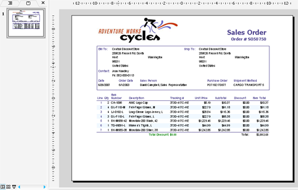

## **授權支援**

Aspose.Slides for Reporting Services 的評估版與購買版使用相同的套件，下載自[其下載頁面](https://releases.aspose.com/slides/reportingservices/)，並提供相同的功能。未授權時，它會以評估模式運作，並在匯出的簡報中插入評估浮水印。

當您將授權檔案複製到報表伺服器時，評估版即會變為已授權。此過程不涉及任何程式碼。

當您對評估結果滿意時，您可以[購買授權](https://purchase.aspose.com/pricing/slides/reporting-services/)。建議您瀏覽不同的訂閱類型。如有任何問題，請聯繫 Aspose 銷售團隊。

## **Aspose.Slides for Reporting Services 的授權**

* 授權是一個純文字 XML 檔案，內含產品名稱、授權開發人員數量、訂閱到期日等資訊。
* 授權檔案已數位簽章，切勿修改。即使不小心在檔案內容中加入額外的換行，也會使其失效。

套用授權:

1. 將授權檔案複製到每個報表伺服器實例的 *ReportServer\bin* 資料夾內，該資料夾也是 *Aspose.Slides.ReportingServices.dll* 所在位置，例如 *C:\Program Files\Microsoft SQL Server Reporting Services\SSRS\ReportServer\bin*。[手動安裝](/slides/zh-hant/reportingservices/install-manually/#find-the-report-server-folder)列出了預設資料夾。
2. 確認檔案名稱符合擴充功能所搜尋的任一名稱：*Aspose.Slides.ReportingServices.lic*、*Aspose.Slides.Reporting.Services.lic*、*Aspose.Slides.Product.Family.lic*、*Aspose.Total.ReportingServices.lic*、*Aspose.Total.Reporting.Services.lic*、*Aspose.Total.Product.Family.lic*或*Aspose.Total.lic*。
3. 將任意報表匯出為簡報。若未出現浮水印，即表示授權已生效。

此擴充功能亦會在 *%ProgramData%\Aspose\Slides*（通常為 *C:\ProgramData\Aspose\Slides*）中搜尋授權檔案，因而只需在該位置放置一份即可供機器上的所有實例使用。

**已授權模式**

當找到有效的授權檔案時，匯出的簡報不會帶有評估浮水印。

**評估模式**

未授權時，Aspose.Slides for Reporting Services 會在匯出的簡報中插入評估浮水印。

{}
若要在不受限制的情況下測試 Aspose.Slides for Reporting Services，您可以申請**30 天臨時授權**。更多資訊請參閱[如何取得臨時授權](https://purchase.aspose.com/temporary-license)頁面。
{}