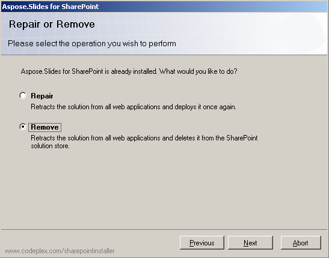

要解除安裝 Aspose.Slides for SharePoint：

1. 執行您當初用來安裝的設定程式，例如 SharePoint Server 2019 上的 *Setup2019.exe*。  
   當偵測到相同版本已安裝時，設定程式會提供修復或移除的選項。當偵測到不同版本時，則會提供升級或移除的選項。
2. 選取 **Remove**，然後點擊 **Next** 以解除安裝 Aspose.Slides for SharePoint。

**解除安裝 Aspose.Slides for SharePoint**

