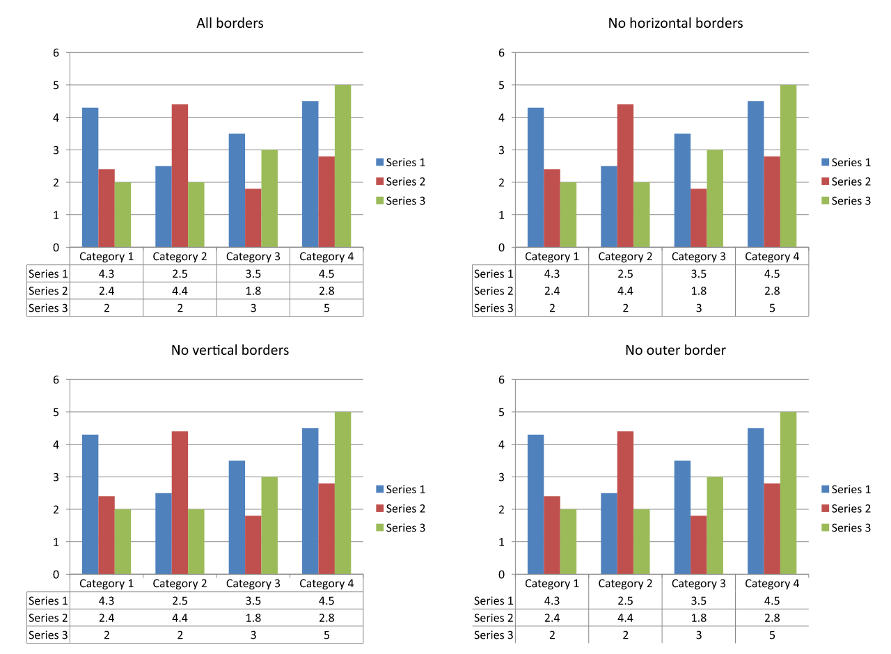

## **概览**

Aspose.Slides for .NET 允许显示图表的数据表并自定义其文本格式、边框和图例键。本文说明如何启用表格、格式化文本、控制每种边框以及显示或隐藏图例键。示例会将配置好的图表保存为 PPTX 文件。

## **设置字体属性**

要显示图表的数据表，请将 [HasDataTable](https://reference.aspose.com/slides/zh/net/aspose.slides.charts/chart/hasdatatable/) 设置为 `true`。使用 [ChartDataTable](https://reference.aspose.com/slides/zh/net/aspose.slides.charts/chart/chartdatatable/) 访问表格并配置其文本格式。

1. 使用 [Presentation](https://reference.aspose.com/slides/zh/net/aspose.slides/presentation/) 类加载演示文稿。  
1. 在第一张幻灯片上添加一个簇状柱形图。  
1. 启用图表的数据表。  
1. 使用 [FontBold](https://reference.aspose.com/slides/zh/net/aspose.slides/baseportionformat/fontbold/) 启用粗体文本，并将 [FontHeight](https://reference.aspose.com/slides/zh/net/aspose.slides/baseportionformat/fontheight/) 设置为 `20` 以使用 20 磅字号。  
1. 保存修改后的演示文稿。

下面的示例需要工作目录中存在包含至少一张幻灯片的 `test.pptx`。它在位置 (50, 50) 添加一个默认数据的图表，宽度为 600 点，高度为 400 点。保存的 `output.pptx` 包含已启用数据表并应用指定字体设置的图表。

```cs
using Aspose.Slides;
using Aspose.Slides.Charts;
using Aspose.Slides.Export;

using var presentation = new Presentation("test.pptx");
var slide = presentation.Slides[0];

var chart = slide.Shapes.AddChart(ChartType.ClusteredColumn, 50, 50, 600, 400);
chart.HasDataTable = true;

var portionFormat = chart.ChartDataTable.TextFormat.PortionFormat;
portionFormat.FontBold = NullableBool.True;
portionFormat.FontHeight = 20;

presentation.Save("output.pptx", SaveFormat.Pptx);
```

## **自定义数据表边框**

通过 [IChart.HasDataTable](https://reference.aspose.com/slides/zh/net/aspose.slides.charts/ichart/hasdatatable/) 启用表格，并通过 [IChart.ChartDataTable](https://reference.aspose.com/slides/zh/net/aspose.slides.charts/ichart/chartdatatable/) 访问它。可以独立控制三种边框：

- [HasBorderHorizontal](https://reference.aspose.com/slides/zh/net/aspose.slides.charts/idatatable/hasborderhorizontal/) 控制水平单元格边框。  
- [HasBorderVertical](https://reference.aspose.com/slides/zh/net/aspose.slides.charts/idatatable/hasbordervertical/) 控制垂直单元格边框。  
- [HasBorderOutline](https://reference.aspose.com/slides/zh/net/aspose.slides.charts/idatatable/hasborderoutline/) 控制表格的外部边框。

将每个属性设置为 `true` 以显示对应边框，或设置为 `false` 以隐藏。下面的示例创建一个默认数据的簇状柱形图，显示水平边框和外部边框，隐藏垂直边框。无需输入文件。图表的位置和大小以点为单位指定。

```cs
using Aspose.Slides;
using Aspose.Slides.Charts;
using Aspose.Slides.Export;

using var presentation = new Presentation();
var slide = presentation.Slides[0];

var chart = slide.Shapes.AddChart(ChartType.ClusteredColumn, 50, 50, 600, 400);
chart.HasDataTable = true;

var dataTable = chart.ChartDataTable;
dataTable.HasBorderHorizontal = true;
dataTable.HasBorderVertical = false;
dataTable.HasBorderOutline = true;

presentation.Save("data-table-borders.pptx", SaveFormat.Pptx);
```

下面的比较使用相同的图表数据和图例键设置，展示四种情况。首先启用所有边框，然后每种变体只关闭一个边框属性。左下角的变体对应示例中的边框设置。



## **显示或隐藏图例键**

图例键是数据表中系列名称旁边的小彩色标记。它们帮助读者将每行数据对应到图表系列。将 [ShowLegendKey](https://reference.aspose.com/slides/zh/net/aspose.slides.charts/idatatable/showlegendkey/) 设置为 `true` 可显示这些标记，设置为 `false` 可隐藏。

单独的图例由 [IChart.HasLegend](https://reference.aspose.com/slides/zh/net/aspose.slides.charts/ichart/haslegend/) 控制。这些设置相互独立：隐藏单独的图例不会隐藏数据表内的键，隐藏表格键也不会隐藏单独的图例。

下面的示例创建一个默认数据的图表，启用其数据表，并在隐藏单独图例的同时显示数据表内的图例键。所有表格边框均已显式启用。无需输入演示文稿。若只想隐藏表格的键，请将 `dataTable.ShowLegendKey` 改为 `false`。

```cs
using Aspose.Slides;
using Aspose.Slides.Charts;
using Aspose.Slides.Export;

using var presentation = new Presentation();
var slide = presentation.Slides[0];

var chart = slide.Shapes.AddChart(ChartType.ClusteredColumn, 50, 50, 600, 400);
chart.HasDataTable = true;
chart.HasLegend = false;

var dataTable = chart.ChartDataTable;
dataTable.HasBorderHorizontal = true;
dataTable.HasBorderVertical = true;
dataTable.HasBorderOutline = true;
dataTable.ShowLegendKey = true;

presentation.Save("data-table-legend-keys.pptx", SaveFormat.Pptx);
```

下面的比较展示了同一表格在图例键开启和关闭时的效果。所有边框保持启用，单独的图表图例在两种情况下均被隐藏。


## **常见问题**

**我可以在图表的数据表中显示图例键吗？**

可以。将 [ShowLegendKey](https://reference.aspose.com/slides/zh/net/aspose.slides.charts/datatable/showlegendkey/) 设置为 `true` 以显示图例键，设置为 `false` 以隐藏。

**导出演示文稿为 PDF、HTML 或图像时，数据表会被保留吗？**

会。Aspose.Slides 在导出为 [PDF](/slides/zh/net/convert-powerpoint-to-pdf/)、[HTML](/slides/zh/net/convert-powerpoint-to-html/) 或 [images](/slides/zh/net/convert-powerpoint-to-png/) 时，会将图表及其显示的数据表作为幻灯片的一部分进行渲染。

**我可以在从模板加载的图表中使用数据表吗？**

可以。对于从现有演示文稿或模板加载的图表，使用 [HasDataTable](https://reference.aspose.com/slides/zh/net/aspose.slides.charts/chart/hasdatatable/) 检查或更改其数据表是否显示。

**如何查找已启用数据表的图表？**

遍历每张幻灯片上的形状，识别图表并检查其 [HasDataTable](https://reference.aspose.com/slides/zh/net/aspose.slides.charts/chart/hasdatatable/) 属性。属性值为 `true` 表示该数据表已启用。