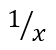

## **概述**

PowerPoint 将公式存储为 Office Math Markup Language (OMML)。使用 Aspose.Slides for Python via Java，您可以以编程方式创建相同类型的数学内容：分数、根式、函数、极限、N 元运算符、矩阵、数组和格式化的数学块。

在 PowerPoint 中，用户通常通过 **Insert > Equation** 添加公式：


结果是在幻灯片上出现可编辑的数学文本：


Aspose.Slides 通过以下三个主要对象构建数学文本：

- 使用 [addMathShape](https://reference.aspose.com/slides/zh/python-java/aspose.slides/shapecollection/#addMathShape) 创建的数学形状，是包含公式的形状。
- [MathPortion](https://reference.aspose.com/slides/zh/python-java/aspose.slides/mathportion/) 在形状的文本框中存储数学内容。
- [MathParagraph](https://reference.aspose.com/slides/zh/python-java/aspose.slides/mathparagraph/) 包含一个或多个 [MathBlock](https://reference.aspose.com/slides/zh/python-java/aspose.slides/mathblock/) 对象。

下面的大多数示例使用 [MathematicalText](https://reference.aspose.com/slides/zh/python-java/aspose.slides/mathematicaltext/) 和来自 [MathElementBase](https://reference.aspose.com/slides/zh/python-java/aspose.slides/mathelementbase/) 的流式方法，以保持代码简洁易读。

有关 MathML 导出场景，请参阅 [Export Math Equations from Presentations in Python](/slides/zh/python-java/exporting-math-equations/)。

## **创建方程**

此示例创建一个数学形状并添加勾股定理：


```python
import jpype
import asposeslides

if not jpype.isJVMStarted():
    jpype.startJVM()

from asposeslides.api import MathematicalText, Presentation, SaveFormat

presentation = Presentation()
try:
    slide = presentation.getSlides().get_Item(0)

    math_shape = slide.getShapes().addMathShape(20, 20, 700, 120)
    math_paragraph = math_shape.getTextFrame().getParagraphs().get_Item(0).getPortions().get_Item(0).getMathParagraph()

    a_squared = MathematicalText("a").setSuperscript("2")
    b_squared = MathematicalText("b").setSuperscript("2")
    equation = MathematicalText("c").setSuperscript("2").join("=").join(a_squared).join("+").join(b_squared)

    math_paragraph.add(equation)

    presentation.save("pythagorean-theorem.pptx", SaveFormat.Pptx)
finally:
    presentation.dispose()
```

{}

[addMathShape](https://reference.aspose.com/slides/zh/python-java/aspose.slides/shapecollection/#addMathShape) 会创建一个已包含数学段落的形状。访问第一个 [MathPortion](https://reference.aspose.com/slides/zh/python-java/aspose.slides/mathportion/)，获取其 [MathParagraph](https://reference.aspose.com/slides/zh/python-java/aspose.slides/mathparagraph/)，然后向其中添加数学块或数学元素。

{}

## **添加分数**

使用 [divide](https://reference.aspose.com/slides/zh/python-java/aspose.slides/mathelementbase/#divide) 创建分数。您可以使用 [MathFractionTypes](https://reference.aspose.com/slides/zh/python-java/aspose.slides/mathfractiontypes/) 选择分数样式。



```python
import jpype
import asposeslides

if not jpype.isJVMStarted():
    jpype.startJVM()

from asposeslides.api import MathBlock, MathFractionTypes, MathematicalText, Presentation, SaveFormat

presentation = Presentation()
try:
    slide = presentation.getSlides().get_Item(0)

    math_shape = slide.getShapes().addMathShape(20, 20, 700, 100)
    math_paragraph = math_shape.getTextFrame().getParagraphs().get_Item(0).getPortions().get_Item(0).getMathParagraph()

    fraction = MathematicalText("1").divide("x", MathFractionTypes.Skewed)

    math_block = MathBlock(fraction)
    math_paragraph.add(math_block)

    presentation.save("fraction.pptx", SaveFormat.Pptx)
finally:
    presentation.dispose()
```

对于堆叠式分数，使用 [MathFractionTypes.Bar](https://reference.aspose.com/slides/zh/python-java/aspose.slides/mathfractiontypes/#Bar)：

```python
import jpype
import asposeslides

if not jpype.isJVMStarted():
    jpype.startJVM()

from asposeslides.api import MathFractionTypes, MathematicalText

stacked_fraction = MathematicalText("x + 1").divide("y - 1", MathFractionTypes.Bar)
```

## **添加根式**

使用 [radical](https://reference.aspose.com/slides/zh/python-java/aspose.slides/mathelementbase/#radical) 创建平方根、立方根或其他根式。当前元素成为根式的底数，参数成为指数。


```python
import jpype
import asposeslides

if not jpype.isJVMStarted():
    jpype.startJVM()

from asposeslides.api import MathBlock, MathematicalText, Presentation, SaveFormat

presentation = Presentation()
try:
    slide = presentation.getSlides().get_Item(0)

    math_shape = slide.getShapes().addMathShape(20, 20, 700, 100)
    math_paragraph = math_shape.getTextFrame().getParagraphs().get_Item(0).getPortions().get_Item(0).getMathParagraph()

    radical = MathematicalText("x").radical("n")

    math_block = MathBlock(radical)
    math_paragraph.add(math_block)

    presentation.save("radical.pptx", SaveFormat.Pptx)
finally:
    presentation.dispose()
```

## **添加函数和极限**

使用 [asArgumentOfFunction](https://reference.aspose.com/slides/zh/python-java/aspose.slides/mathelementbase/#asArgumentOfFunction) 或 [function](https://reference.aspose.com/slides/zh/python-java/aspose.slides/mathelementbase/#function) 来表示 `sin(x)`、`log(x)` 等函数或自定义函数名。对于极限，将 `lim` 放在 [MathLimit](https://reference.aspose.com/slides/zh/python-java/aspose.slides/mathlimit/) 中或使用 [setLowerLimit](https://reference.aspose.com/slides/zh/python-java/aspose.slides/mathelementbase/#setLowerLimit)。


```python
import jpype
import asposeslides

if not jpype.isJVMStarted():
    jpype.startJVM()

from asposeslides.api import MathBlock, MathematicalText, Presentation, SaveFormat

presentation = Presentation()
try:
    slide = presentation.getSlides().get_Item(0)

    math_shape = slide.getShapes().addMathShape(20, 20, 700, 100)
    math_paragraph = math_shape.getTextFrame().getParagraphs().get_Item(0).getPortions().get_Item(0).getMathParagraph()

    limit = MathematicalText("lim").setLowerLimit("x\u2192\u221E").function("x")

    math_block = MathBlock(limit)
    math_paragraph.add(math_block)

    presentation.save("functions-and-limits.pptx", SaveFormat.Pptx)
finally:
    presentation.dispose()
```

对于自定义函数名，请将函数名设为当前元素：

```python
import jpype
import asposeslides

if not jpype.isJVMStarted():
    jpype.startJVM()

from asposeslides.api import MathematicalText

custom_function = MathematicalText("f").function("x + 1")
```

## **添加 N 元运算符和积分**

使用 [nary](https://reference.aspose.com/slides/zh/python-java/aspose.slides/mathelementbase/#nary) 处理求和、并集、交集等大型运算符。使用 [integral](https://reference.aspose.com/slides/zh/python-java/aspose.slides/mathelementbase/#integral) 添加积分。这两种方法均可设置上下限。


```python
import jpype
import asposeslides

if not jpype.isJVMStarted():
    jpype.startJVM()

from asposeslides.api import MathBlock, MathNaryOperatorTypes, MathematicalText, Presentation, SaveFormat

presentation = Presentation()
try:
    slide = presentation.getSlides().get_Item(0)

    math_shape = slide.getShapes().addMathShape(20, 20, 700, 120)
    math_paragraph = math_shape.getTextFrame().getParagraphs().get_Item(0).getPortions().get_Item(0).getMathParagraph()

    a_power = MathematicalText("a").setSuperscript("n-k")
    summation_base = MathematicalText("x").setSuperscript("k").join(a_power)

    summation = summation_base.nary(MathNaryOperatorTypes.Summation, "k=0", "n")

    math_block = MathBlock(summation)
    math_paragraph.add(math_block)

    presentation.save("nary-operators.pptx", SaveFormat.Pptx)
finally:
    presentation.dispose()
```

N 元运算符用于带可选上下限的大型运算符。像 `+`、`-`、`=` 这样的普通运算符通常使用 [MathematicalText](https://reference.aspose.com/slides/zh/python-java/aspose.slides/mathematicaltext/) 添加并拼接到表达式中。

对于积分，使用 [integral](https://reference.aspose.com/slides/zh/python-java/aspose.slides/mathelementbase/#integral)：

```python
import jpype
import asposeslides

if not jpype.isJVMStarted():
    jpype.startJVM()

from asposeslides.api import MathIntegralTypes, MathematicalText

differential = MathematicalText("dx").toBox()
integral_base = MathematicalText("x").join(differential)
integral = integral_base.integral(MathIntegralTypes.Simple, "0", "1")
```

## **添加矩阵**

使用 [MathMatrix](https://reference.aspose.com/slides/zh/python-java/aspose.slides/mathmatrix/) 定义行和列。矩阵默认不包含括号，如需括号、方括号或大括号，请在外部自行添加。


```python
import jpype
import asposeslides

if not jpype.isJVMStarted():
    jpype.startJVM()

from asposeslides.api import MathBlock, MathMatrix, MathematicalText, Presentation, SaveFormat

presentation = Presentation()
try:
    slide = presentation.getSlides().get_Item(0)

    math_shape = slide.getShapes().addMathShape(20, 20, 700, 120)
    math_paragraph = math_shape.getTextFrame().getParagraphs().get_Item(0).getPortions().get_Item(0).getMathParagraph()

    matrix = MathMatrix(2, 3)
    cell_0_0 = MathematicalText("1")
    matrix.set_Item(0, 0, cell_0_0)
    cell_0_1 = MathematicalText("x")
    matrix.set_Item(0, 1, cell_0_1)
    cell_1_0 = MathematicalText("x")
    matrix.set_Item(1, 0, cell_1_0)
    cell_1_1 = MathematicalText("2")
    matrix.set_Item(1, 1, cell_1_1)
    cell_1_2 = MathematicalText("y")
    matrix.set_Item(1, 2, cell_1_2)

    math_block = MathBlock(matrix)
    math_paragraph.add(math_block)

    presentation.save("matrix.pptx", SaveFormat.Pptx)
finally:
    presentation.dispose()
```

## **添加方程数组**

当需要对齐的方程或垂直堆叠的表达式时，使用 [toMathArray](https://reference.aspose.com/slides/zh/python-java/aspose.slides/mathelementbase/#toMathArray)。


```python
import jpype
import asposeslides

if not jpype.isJVMStarted():
    jpype.startJVM()

from asposeslides.api import MathBlock, MathematicalText, Presentation, SaveFormat

presentation = Presentation()
try:
    slide = presentation.getSlides().get_Item(0)

    math_shape = slide.getShapes().addMathShape(20, 20, 700, 140)
    math_paragraph = math_shape.getTextFrame().getParagraphs().get_Item(0).getPortions().get_Item(0).getMathParagraph()

    equation_array = MathematicalText("x").join("y").toMathArray()

    math_block = MathBlock(equation_array)
    math_paragraph.add(math_block)

    presentation.save("equation-array.pptx", SaveFormat.Pptx)
finally:
    presentation.dispose()
```

## **添加三角函数**

当参数是当前元素且函数名已知时，使用 [asArgumentOfFunction](https://reference.aspose.com/slides/zh/python-java/aspose.slides/mathelementbase/#asArgumentOfFunction)。


```python
import jpype
import asposeslides

if not jpype.isJVMStarted():
    jpype.startJVM()

from asposeslides.api import MathBlock, MathFunctionsOfOneArgument, MathematicalText, Presentation, SaveFormat

presentation = Presentation()
try:
    slide = presentation.getSlides().get_Item(0)

    math_shape = slide.getShapes().addMathShape(20, 20, 700, 100)
    math_paragraph = math_shape.getTextFrame().getParagraphs().get_Item(0).getPortions().get_Item(0).getMathParagraph()

    cosine = MathematicalText("2x").asArgumentOfFunction(MathFunctionsOfOneArgument.Cos)

    math_block = MathBlock(cosine)
    math_paragraph.add(math_block)

    presentation.save("trigonometric-function.pptx", SaveFormat.Pptx)
finally:
    presentation.dispose()
```

## **添加下标和上标**

使用下标和上标辅助方法处理索引和幂。当索引需要出现在基底的左侧时，使用 [setSubSuperscriptOnTheLeft](https://reference.aspose.com/slides/zh/python-java/aspose.slides/mathelementbase/#setSubSuperscriptOnTheLeft)。


```python
import jpype
import asposeslides

if not jpype.isJVMStarted():
    jpype.startJVM()

from asposeslides.api import MathBlock, MathematicalText, Presentation, SaveFormat

presentation = Presentation()
try:
    slide = presentation.getSlides().get_Item(0)

    math_shape = slide.getShapes().addMathShape(20, 20, 700, 100)
    math_paragraph = math_shape.getTextFrame().getParagraphs().get_Item(0).getPortions().get_Item(0).getMathParagraph()

    scripts = MathematicalText("Y").setSubSuperscriptOnTheLeft("1", "n")

    math_block = MathBlock(scripts)
    math_paragraph.add(math_block)

    presentation.save("subscript-superscript.pptx", SaveFormat.Pptx)
finally:
    presentation.dispose()
```

## **添加分隔符**

使用 [enclose](https://reference.aspose.com/slides/zh/python-java/aspose.slides/mathelementbase/#enclose) 将表达式放入分隔符中。对包含多个元素的分隔符表达式，还可以设置分隔字符。


```python
import jpype
import asposeslides

if not jpype.isJVMStarted():
    jpype.startJVM()

from asposeslides.api import MathBlock, MathematicalText, Presentation, SaveFormat

presentation = Presentation()
try:
    slide = presentation.getSlides().get_Item(0)

    math_shape = slide.getShapes().addMathShape(20, 20, 700, 100)
    math_paragraph = math_shape.getTextFrame().getParagraphs().get_Item(0).getPortions().get_Item(0).getMathParagraph()

    delimiter = MathematicalText("x").join("y").join("z").enclose('<', '>')
    delimiter.setSeparatorCharacter('|')

    math_block = MathBlock(delimiter)
    math_paragraph.add(math_block)

    presentation.save("delimiters.pptx", SaveFormat.Pptx)
finally:
    presentation.dispose()
```

## **添加边框盒**

当需要为整个公式添加框线时，使用 [toBorderBox](https://reference.aspose.com/slides/zh/python-java/aspose.slides/mathelementbase/#toBorderBox)。


```python
import jpype
import asposeslides

if not jpype.isJVMStarted():
    jpype.startJVM()

from asposeslides.api import MathBlock, MathematicalText, Presentation, SaveFormat

presentation = Presentation()
try:
    slide = presentation.getSlides().get_Item(0)

    math_shape = slide.getShapes().addMathShape(20, 20, 700, 100)
    math_paragraph = math_shape.getTextFrame().getParagraphs().get_Item(0).getPortions().get_Item(0).getMathParagraph()

    b_squared = MathematicalText("b").setSuperscript("2")
    c_squared = MathematicalText("c").setSuperscript("2")
    boxed_equation = MathematicalText("a").setSuperscript("2").join("=").join(b_squared).join("+").join(c_squared).toBorderBox()

    math_block = MathBlock(boxed_equation)
    math_paragraph.add(math_block)

    presentation.save("border-box.pptx", SaveFormat.Pptx)
finally:
    presentation.dispose()
```

## **对项分组**

使用 [group](https://reference.aspose.com/slides/zh/python-java/aspose.slides/mathelementbase/#group) 在表达式上方或下方放置分组符号。添加限度以标记分组的项。


```python
import jpype
import asposeslides

if not jpype.isJVMStarted():
    jpype.startJVM()

from asposeslides.api import MathBlock, MathTopBotPositions, MathematicalText, Presentation, SaveFormat

presentation = Presentation()
try:
    slide = presentation.getSlides().get_Item(0)

    math_shape = slide.getShapes().addMathShape(20, 20, 700, 120)
    math_paragraph = math_shape.getTextFrame().getParagraphs().get_Item(0).getPortions().get_Item(0).getMathParagraph()

    grouped = MathematicalText("x + y").group('\u23DF', MathTopBotPositions.Bottom, MathTopBotPositions.Top).setLowerLimit("any text")

    math_block = MathBlock(grouped)
    math_paragraph.add(math_block)

    presentation.save("grouped-terms.pptx", SaveFormat.Pptx)
finally:
    presentation.dispose()
```

## **格式化数学元素**

仅在能够提升公式可读性时使用格式化辅助方法。例如，[overbar](https://reference.aspose.com/slides/zh/python-java/aspose.slides/mathelementbase/#overbar) 会在数学元素上方添加横线。


```python
import jpype
import asposeslides

if not jpype.isJVMStarted():
    jpype.startJVM()

from asposeslides.api import MathBlock, MathematicalText, Presentation, SaveFormat

presentation = Presentation()
try:
    slide = presentation.getSlides().get_Item(0)

    math_shape = slide.getShapes().addMathShape(20, 20, 700, 100)
    math_paragraph = math_shape.getTextFrame().getParagraphs().get_Item(0).getPortions().get_Item(0).getMathParagraph()

    overbar = MathematicalText("ABC").overbar()

    math_block = MathBlock(overbar)
    math_paragraph.add(math_block)

    presentation.save("overbar.pptx", SaveFormat.Pptx)
finally:
    presentation.dispose()
```

## **快速参考**

| 任务 | 主要 API |
| --- | --- |
| 创建数学文本 | [MathematicalText](https://reference.aspose.com/slides/zh/python-java/aspose.slides/mathematicaltext/) |
| 合并元素 | [MathElementBase.join](https://reference.aspose.com/slides/zh/python-java/aspose.slides/mathelementbase/#join) |
| 创建分数 | [MathElementBase.divide](https://reference.aspose.com/slides/zh/python-java/aspose.slides/mathelementbase/#divide) |
| 添加上标或下标 | [setSuperscript](https://reference.aspose.com/slides/zh/python-java/aspose.slides/mathelementbase/#setSuperscript), [setSubscript](https://reference.aspose.com/slides/zh/python-java/aspose.slides/mathelementbase/#setSubscript) |
| 添加函数 | [function](https://reference.aspose.com/slides/zh/python-java/aspose.slides/mathelementbase/#function), [asArgumentOfFunction](https://reference.aspose.com/slides/zh/python-java/aspose.slides/mathelementbase/#asArgumentOfFunction) |
| 添加根式 | [MathElementBase.radical](https://reference.aspose.com/slides/zh/python-java/aspose.slides/mathelementbase/#radical) |
| 添加极限 | [setLowerLimit](https://reference.aspose.com/slides/zh/python-java/aspose.slides/mathelementbase/#setLowerLimit), [setUpperLimit](https://reference.aspose.com/slides/zh/python-java/aspose.slides/mathelementbase/#setUpperLimit) |
| 添加左侧脚本 | [setSubSuperscriptOnTheLeft](https://reference.aspose.com/slides/zh/python-java/aspose.slides/mathelementbase/#setSubSuperscriptOnTheLeft) |
| 添加求和和积分 | [nary](https://reference.aspose.com/slides/zh/python-java/aspose.slides/mathelementbase/#nary), [integral](https://reference.aspose.com/slides/zh/python-java/aspose.slides/mathelementbase/#integral) |
| 添加矩阵 | [MathMatrix](https://reference.aspose.com/slides/zh/python-java/aspose.slides/mathmatrix/) |
| 添加方程数组 | [toMathArray](https://reference.aspose.com/slides/zh/python-java/aspose.slides/mathelementbase/#toMathArray) |
| 添加分隔符 | [enclose](https://reference.aspose.com/slides/zh/python-java/aspose.slides/mathelementbase/#enclose) |
| 添加横线和边框 | [overbar](https://reference.aspose.com/slides/zh/python-java/aspose.slides/mathelementbase/#overbar), [toBorderBox](https://reference.aspose.com/slides/zh/python-java/aspose.slides/mathelementbase/#toBorderBox) |
| 对项分组 | [group](https://reference.aspose.com/slides/zh/python-java/aspose.slides/mathelementbase/#group) |

## **常见问题**

**我可以编辑已有的 PowerPoint 公式吗？**

可以。打开演示文稿，找到包含 [MathPortion](https://reference.aspose.com/slides/zh/python-java/aspose.slides/mathportion/) 的形状，获取其 [MathParagraph](https://reference.aspose.com/slides/zh/python-java/aspose.slides/mathparagraph/)，并更新该段落中的数学块。

**公式是否会保存为可编辑的 PowerPoint 数学对象？**

会。保存为 PPTX 时，Aspose.Slides 会将公式写入为可编辑的 Office 数学内容。

**我可以将公式导出为 LaTeX 吗？**

可以。从其 [MathPortion](https://reference.aspose.com/slides/zh/python-java/aspose.slides/mathportion/) 获取公式的 [MathParagraph](https://reference.aspose.com/slides/zh/python-java/aspose.slides/mathparagraph/)，然后调用 [MathParagraph.toLatex](https://reference.aspose.com/slides/zh/python-java/aspose.slides/mathparagraph/#toLatex) 直接导出。完整示例请参阅 [Export Math Equations from Presentations in Python](/slides/zh/python-java/exporting-math-equations/#export-math-equations-to-latex)。