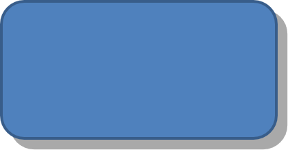

## **介绍**

虽然 PowerPoint 中的效果可用于突出形状，但它们不同于 [填充](/slides/zh/python-java/shape-formatting/#gradient-fill) 或轮廓。使用 PowerPoint 效果，您可以在形状上创建逼真的反射、扩散形状的辉光等。


PowerPoint 提供了六种可应用于形状的效果。您可以对一个形状应用一个或多个效果。

某些效果组合比其他组合更佳。基于此，PowerPoint 在 **Preset** 下提供了选项。Preset 选项是已知效果良好的两个或多个效果的组合。这样，通过选择预设，您无需浪费时间测试或组合不同的效果来寻找满意的组合。

Aspose.Slides 在 [EffectFormat](https://reference.aspose.com/slides/python-java/aspose.slides/effectformat/) 类下提供属性和方法，允许您在 PowerPoint 演示文稿中对形状应用相同的效果。

## **应用阴影效果**

Aspose.Slides for Python via Java 支持形状的外部和内部阴影。您可以自定义其颜色、方向、距离和模糊半径，以匹配演示文稿的设计。

### **应用外部阴影**

使用外部阴影使卡片或面板在幻灯片背景上突出。阴影延伸到形状边缘之外，营造出形状在幻灯片上方升起的感觉。调整其颜色、方向、距离和模糊半径，以匹配模板的光照和样式。

这段 Python 代码展示了如何对矩形应用 [外部阴影效果](https://reference.aspose.com/slides/python-java/aspose.slides/effectformat/#getOuterShadowEffect)：

```python
import jpype
import asposeslides

if not jpype.isJVMStarted():
    jpype.startJVM()

from asposeslides.api import Presentation, SaveFormat, ShapeType
from java.awt import Color

presentation = Presentation()
try:
    slide = presentation.getSlides().get_Item(0)

    shape = slide.getShapes().addAutoShape(ShapeType.RoundCornerRectangle, 20, 20, 200, 100)
    shape.getEffectFormat().enableOuterShadowEffect()
    shape.getEffectFormat().getOuterShadowEffect().getShadowColor().setColor(Color(169, 169, 169))
    shape.getEffectFormat().getOuterShadowEffect().setDistance(10)
    shape.getEffectFormat().getOuterShadowEffect().setDirection(45)

    presentation.save("shadow_effect.pptx", SaveFormat.Pptx)
finally:
    presentation.dispose()
```



### **应用内部阴影**

在复现模板的视觉样式时，使用内部阴影为卡片或面板赋予凹陷外观。外部阴影延伸至形状之外，使其看起来突出，而内部阴影则在其边缘内部着色。

调用 [enableInnerShadowEffect](https://reference.aspose.com/slides/python-java/aspose.slides/effectformat/#enableInnerShadowEffect)，然后配置由 [getInnerShadowEffect](https://reference.aspose.com/slides/python-java/aspose.slides/effectformat/#getInnerShadowEffect) 返回的阴影。较大的模糊半径值会产生更柔和的边缘。

此 Python 示例创建了一个浅蓝色卡片，并带有深灰色内部阴影，然后将其保存为 PPTX 文件。阴影方向为 225 度，距离为 7 磅，模糊半径为 6 磅：

```python
import jpype
import asposeslides

if not jpype.isJVMStarted():
    jpype.startJVM()

from asposeslides.api import FillType, Presentation, SaveFormat, ShapeType
from java.awt import Color

presentation = Presentation()
try:
    slide = presentation.getSlides().get_Item(0)

    shape = slide.getShapes().addAutoShape(ShapeType.Rectangle, 20, 20, 200, 100)
    shape.getFillFormat().setFillType(FillType.Solid)
    shape.getFillFormat().getSolidFillColor().setColor(Color(173, 216, 230))
    shape.getLineFormat().getFillFormat().setFillType(FillType.NoFill)

    shape.getEffectFormat().enableInnerShadowEffect()
    shadow = shape.getEffectFormat().getInnerShadowEffect()
    shadow.getShadowColor().setColor(Color(105, 105, 105))
    shadow.setDirection(225)
    shadow.setDistance(7)
    shadow.setBlurRadius(6)

    presentation.save("inner_shadow_effect.pptx", SaveFormat.Pptx)
finally:
    presentation.dispose()
```


要移除内部阴影，请在形状的 effect format 上调用 [disableInnerShadowEffect](https://reference.aspose.com/slides/python-java/aspose.slides/effectformat/#disableInnerShadowEffect)。

## **应用反射效果**

要在 Aspose.Slides for Python via Java 中应用反射效果，您可以为形状添加类似镜面的反射，并调整距离、透明度和大小等参数。此效果通过赋予形状更精致、成熟的外观来提升演示文稿的美感。使用简洁的代码即可轻松实现，并能够快速在多个元素之间应用，实现一致的设计。

此 Python 代码展示了如何对形状应用 [反射效果](https://reference.aspose.com/slides/python-java/aspose.slides/effectformat/#getReflectionEffect)：

```python
import jpype
import asposeslides

if not jpype.isJVMStarted():
    jpype.startJVM()

from asposeslides.api import Presentation, RectangleAlignment, SaveFormat, ShapeType

presentation = Presentation()
try:
    slide = presentation.getSlides().get_Item(0)

    shape = slide.getShapes().addAutoShape(ShapeType.RoundCornerRectangle, 20, 20, 200, 100)
    shape.getEffectFormat().enableReflectionEffect()
    shape.getEffectFormat().getReflectionEffect().setRectangleAlign(RectangleAlignment.Bottom)
    shape.getEffectFormat().getReflectionEffect().setDirection(90)
    shape.getEffectFormat().getReflectionEffect().setDistance(40)
    shape.getEffectFormat().getReflectionEffect().setBlurRadius(2)

    presentation.save("reflection_effect.pptx", SaveFormat.Pptx)
finally:
    presentation.dispose()
```


## **应用辉光效果**

要在 Aspose.Slides for Python via Java 中对形状应用辉光效果，您可以在形状周围添加柔和、发光的光环，并可调整颜色和大小等属性。此效果有助于突出形状，并为演示文稿增添吸引人、引人注目的视觉元素。只需少量代码即可轻松实现，提升幻灯片的整体外观。

此 Python 代码展示了如何对形状应用 [辉光效果](https://reference.aspose.com/slides/python-java/aspose.slides/effectformat/#getGlowEffect)：

```python
import jpype
import asposeslides

if not jpype.isJVMStarted():
    jpype.startJVM()

from asposeslides.api import Presentation, SaveFormat, ShapeType
from java.awt import Color

presentation = Presentation()
try:
    slide = presentation.getSlides().get_Item(0)

    shape = slide.getShapes().addAutoShape(ShapeType.RoundCornerRectangle, 20, 20, 200, 100)
    shape.getEffectFormat().enableGlowEffect()
    shape.getEffectFormat().getGlowEffect().getColor().setColor(Color.MAGENTA)
    shape.getEffectFormat().getGlowEffect().setRadius(15)

    presentation.save("glow_effect.pptx", SaveFormat.Pptx)
finally:
    presentation.dispose()
```


## **应用柔和边缘效果**

要在 Aspose.Slides for Python via Java 中应用柔和边缘效果，您可以在形状的边缘创建平滑、模糊的过渡。此效果增添更细腻、精致的外观，适用于需要柔和外观的设计。您可以轻松调整半径等参数，以在演示文稿中的各种形状上实现所需效果。

此 Python 代码展示了如何对形状应用 [柔和边缘效果](https://reference.aspose.com/slides/python-java/aspose.slides/effectformat/#getSoftEdgeEffect)：

```python
import jpype
import asposeslides

if not jpype.isJVMStarted():
    jpype.startJVM()

from asposeslides.api import Presentation, SaveFormat, ShapeType

presentation = Presentation()
try:
    slide = presentation.getSlides().get_Item(0)

    shape = slide.getShapes().addAutoShape(ShapeType.RoundCornerRectangle, 20, 20, 200, 150)
    shape.getEffectFormat().enableSoftEdgeEffect()
    shape.getEffectFormat().getSoftEdgeEffect().setRadius(8)

    presentation.save("soft_edges_effect.pptx", SaveFormat.Pptx)
finally:
    presentation.dispose()
```


## **常见问题**

**我可以对同一形状应用多个效果吗？**

是的，您可以在单个形状上组合不同的效果，如阴影、反射和辉光，以创建更具活力的外观。

**我可以对哪些形状应用效果？**

您可以对各种形状应用效果，包括自动形状、图表、表格、图片、SmartArt 对象、OLE 对象等。

**我可以对组合形状应用效果吗？**

是的，您可以对组合形状应用效果。该效果将作用于整个组合。