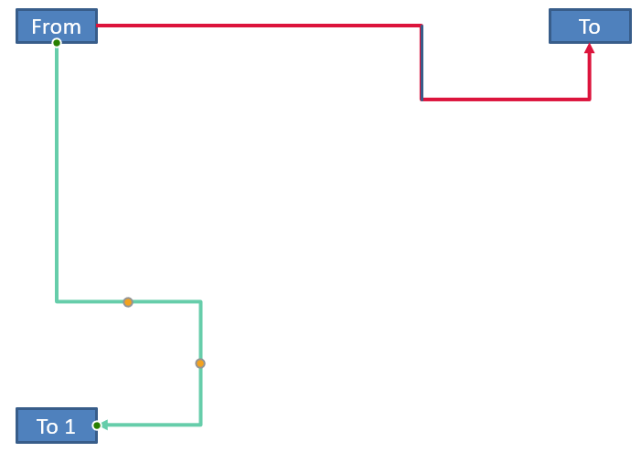

## **概述**

连接器是一条线，当任一形状移动时仍然可以保持附着在两个形状上。它的两端连接到连接点，在 PowerPoint 中表现为绿色点。一些弯曲和曲线连接器还会显示调整点，表现为橙色点，用于控制各个连接器段的位置。

Aspose.Slides 通过 [Connector](https://reference.aspose.com/slides/zh/python-java/aspose.slides/connector/) 类来表示连接器。您可以创建它们、将两端附着到形状、选择连接点、重新路由，以及修改具有调整点的连接器的几何形状。

## **连接器类型**

[ShapeType](https://reference.aspose.com/slides/zh/python-java/aspose.slides/shapetype/) 类包含直线、弯曲和曲线连接器预设。下表显示了可用的连接器几何形状以及每个预设定义的调整点数量。

| 连接器 | 图像 | 调整点数 |
|---|---|---|
| [ShapeType.Line](https://reference.aspose.com/slides/zh/python-java/aspose.slides/shapetype/#Line) |  | 0 |
| [ShapeType.StraightConnector1](https://reference.aspose.com/slides/zh/python-java/aspose.slides/shapetype/#StraightConnector1) |  | 0 |
| [ShapeType.BentConnector2](https://reference.aspose.com/slides/zh/python-java/aspose.slides/shapetype/#BentConnector2) |  | 0 |
| [ShapeType.BentConnector3](https://reference.aspose.com/slides/zh/python-java/aspose.slides/shapetype/#BentConnector3) |  | 1 |
| [ShapeType.BentConnector4](https://reference.aspose.com/slides/zh/python-java/aspose.slides/shapetype/#BentConnector4) |  | 2 |
| [ShapeType.BentConnector5](https://reference.aspose.com/slides/zh/python-java/aspose.slides/shapetype/#BentConnector5) |  | 3 |
| [ShapeType.CurvedConnector2](https://reference.aspose.com/slides/zh/python-java/aspose.slides/shapetype/#CurvedConnector2) |  | 0 |
| [ShapeType.CurvedConnector3](https://reference.aspose.com/slides/zh/python-java/aspose.slides/shapetype/#CurvedConnector3) |  | 1 |
| [ShapeType.CurvedConnector4](https://reference.aspose.com/slides/zh/python-java/aspose.slides/shapetype/#CurvedConnector4) |  | 2 |
| [ShapeType.CurvedConnector5](https://reference.aspose.com/slides/zh/python-java/aspose.slides/shapetype/#CurvedConnector5) |  | 3 |

调整点的数量和含义是所选连接器预设的一部分。不要假设不同的连接器类型会暴露相同的集合布局。

## **连接两个形状**

使用 [ShapeCollection.addConnector](https://reference.aspose.com/slides/zh/python-java/aspose.slides/shapecollection/#addConnector) 添加连接器，并使用 [Connector.setStartShapeConnectedTo](https://reference.aspose.com/slides/zh/python-java/aspose.slides/connector/#setStartShapeConnectedTo) 与 [Connector.setEndShapeConnectedTo](https://reference.aspose.com/slides/zh/python-java/aspose.slides/connector/#setEndShapeConnectedTo) 将其两端附着。两端都附着后，使用 [Connector.reroute](https://reference.aspose.com/slides/zh/python-java/aspose.slides/connector/#reroute) 在形状之间选择一条短路径。

以下示例使用弯曲连接器将椭圆和矩形连接起来：

```python
import jpype
import asposeslides

if not jpype.isJVMStarted():
    jpype.startJVM()

from asposeslides.api import Presentation, ShapeType, SaveFormat

presentation = Presentation()
try:
    slide = presentation.getSlides().get_Item(0)

    ellipse = slide.getShapes().addAutoShape(ShapeType.Ellipse, 40, 80, 120, 80)
    rectangle = slide.getShapes().addAutoShape(ShapeType.Rectangle, 320, 240, 140, 80)
    connector = slide.getShapes().addConnector(ShapeType.BentConnector2, 0, 0, 10, 10)

    connector.setStartShapeConnectedTo(ellipse)
    connector.setEndShapeConnectedTo(rectangle)
    connector.reroute()

    presentation.save("connected-shapes.pptx", SaveFormat.Pptx)
finally:
    presentation.dispose()
```

{}
调用 [reroute](https://reference.aspose.com/slides/zh/python-java/aspose.slides/connector/#reroute) 可能会更改 [setStartShapeConnectionSiteIndex](https://reference.aspose.com/slides/zh/python-java/aspose.slides/connector/#setStartShapeConnectionSiteIndex) 和 [setEndShapeConnectionSiteIndex](https://reference.aspose.com/slides/zh/python-java/aspose.slides/connector/#setEndShapeConnectionSiteIndex) 的值。如果这些站点必须保持固定，请在重新路由后分配特定的连接点。
{}

## **选择连接点**

每个可连接的形状通过 [Shape.getConnectionSiteCount](https://reference.aspose.com/slides/zh/python-java/aspose.slides/shape/#getConnectionSiteCount) 报告其站点数量。在将首选的零基站点索引分配给连接器端之前，请先验证该索引；站点数量随形状几何形状而异。

下面的示例在椭圆上存在该站点时，将连接器附着到该特定站点：

```python
import jpype
import asposeslides

if not jpype.isJVMStarted():
    jpype.startJVM()

from asposeslides.api import Presentation, ShapeType, SaveFormat

presentation = Presentation()
try:
    slide = presentation.getSlides().get_Item(0)

    ellipse = slide.getShapes().addAutoShape(ShapeType.Ellipse, 40, 80, 120, 80)
    rectangle = slide.getShapes().addAutoShape(ShapeType.Rectangle, 320, 240, 140, 80)
    connector = slide.getShapes().addConnector(ShapeType.BentConnector3, 0, 0, 10, 10)

    connector.setStartShapeConnectedTo(ellipse)
    connector.setEndShapeConnectedTo(rectangle)

    preferred_site_index = 2
    if preferred_site_index < ellipse.getConnectionSiteCount():
        connector.setStartShapeConnectionSiteIndex(preferred_site_index)
    else:
        print(f"The ellipse has only {ellipse.getConnectionSiteCount()} connection sites.")

    presentation.save("specific-connection-site.pptx", SaveFormat.Pptx)
finally:
    presentation.dispose()
```

## **调整连接器点**

具有调整点的连接器通过 [GeometryShape.getAdjustments](https://reference.aspose.com/slides/zh/python-java/aspose.slides/geometryshape/#getAdjustments) 暴露这些点。检查每个 [AdjustValue](https://reference.aspose.com/slides/zh/python-java/aspose.slides/adjustvalue/) 并在使用 [setRawValue](https://reference.aspose.com/slides/zh/python-java/aspose.slides/adjustvalue/#setRawValue) 更改之前查看其 [getType](https://reference.aspose.com/slides/zh/python-java/aspose.slides/adjustvalue/#getType) 值。有关识别预设形状调整的通用规则，请参阅 [Shape Manipulation](/slides/zh/python-java/shape-manipulations/)。

调整点的数量、顺序、含义以及有效值范围取决于连接器预设。调整类型为只读，调整值可写。只读的 [getName](https://reference.aspose.com/slides/zh/python-java/aspose.slides/adjustvalue/#getName) 方法在同一语义类型出现多次时提供额外标识。

### **绕过障碍物**

在下面的布局中，一个 [BentConnector5](https://reference.aspose.com/slides/zh/python-java/aspose.slides/shapetype/#BentConnector5) 连接器在两个形状之间穿过第三个形状：


以下代码创建了受阻的连接器：

```python
import jpype
import asposeslides

if not jpype.isJVMStarted():
    jpype.startJVM()

from asposeslides.api import Presentation, ShapeType, SaveFormat, LineArrowheadStyle, FillType

Color = jpype.JClass("java.awt.Color")

presentation = Presentation()
try:
    slide = presentation.getSlides().get_Item(0)

    slide.getShapes().addAutoShape(ShapeType.Rectangle, 300, 150, 150, 75)
    source_shape = slide.getShapes().addAutoShape(ShapeType.Rectangle, 500, 400, 100, 50)
    target_shape = slide.getShapes().addAutoShape(ShapeType.Rectangle, 100, 100, 70, 30)
    connector = slide.getShapes().addConnector(ShapeType.BentConnector5, 20, 20, 400, 300)

    connector.getLineFormat().setEndArrowheadStyle(LineArrowheadStyle.Triangle)
    connector.getLineFormat().getFillFormat().setFillType(FillType.Solid)
    connector.getLineFormat().getFillFormat().getSolidFillColor().setColor(Color.BLACK)
    connector.setStartShapeConnectedTo(source_shape)
    connector.setEndShapeConnectedTo(target_shape)
    connector.setStartShapeConnectionSiteIndex(2)

    presentation.save("connector-obstruction.pptx", SaveFormat.Pptx)
finally:
    presentation.dispose()
```

移动垂直弯曲会改变路径，使连接器绕过障碍物：


本示例不假设集合索引 `1` 永远代表垂直弯曲，而是搜索 [ConnectorBendPositionY](https://reference.aspose.com/slides/zh/python-java/aspose.slides/shapeadjustmenttype/#ConnectorBendPositionY)，仅在出现期望的语义类型时进行更改：

```python
import jpype
import asposeslides

if not jpype.isJVMStarted():
    jpype.startJVM()

from asposeslides.api import Presentation, ShapeType, SaveFormat, LineArrowheadStyle, FillType, ShapeAdjustmentType

Color = jpype.JClass("java.awt.Color")

presentation = Presentation()
try:
    slide = presentation.getSlides().get_Item(0)

    slide.getShapes().addAutoShape(ShapeType.Rectangle, 300, 150, 150, 75)
    source_shape = slide.getShapes().addAutoShape(ShapeType.Rectangle, 500, 400, 100, 50)
    target_shape = slide.getShapes().addAutoShape(ShapeType.Rectangle, 100, 100, 70, 30)
    connector = slide.getShapes().addConnector(ShapeType.BentConnector5, 20, 20, 400, 300)

    connector.getLineFormat().setEndArrowheadStyle(LineArrowheadStyle.Triangle)
    connector.getLineFormat().getFillFormat().setFillType(FillType.Solid)
    connector.getLineFormat().getFillFormat().getSolidFillColor().setColor(Color.BLACK)
    connector.setStartShapeConnectedTo(source_shape)
    connector.setEndShapeConnectedTo(target_shape)
    connector.setStartShapeConnectionSiteIndex(2)

    vertical_bend = None
    for adjustment_index in range(connector.getAdjustments().size()):
        adjustment = connector.getAdjustments().get_Item(adjustment_index)
        print(f"{adjustment.getName()}: {adjustment.getType()}, raw value = {adjustment.getRawValue()}")
        if adjustment.getType() == ShapeAdjustmentType.ConnectorBendPositionY:
            vertical_bend = adjustment
            break

    if vertical_bend is None:
        print("The connector does not expose a vertical bend adjustment.")
    else:
        vertical_bend.setRawValue(60000)
        presentation.save("connector-obstruction-fixed.pptx", SaveFormat.Pptx)
finally:
    presentation.dispose()
```

一个 [BentConnector5](https://reference.aspose.com/slides/zh/python-java/aspose.slides/shapetype/#BentConnector5) 包含两个 [ConnectorBendPositionX](https://reference.aspose.com/slides/zh/python-java/aspose.slides/shapeadjustmenttype/#ConnectorBendPositionX) 调整和一个 [ConnectorBendPositionY](https://reference.aspose.com/slides/zh/python-java/aspose.slides/shapeadjustmenttype/#ConnectorBendPositionY) 调整。如果所需类型出现多次，请在选择前检查 [getName](https://reference.aspose.com/slides/zh/python-java/aspose.slides/adjustvalue/#getName) 并结合该预设的已知几何形状。如果一个调整报告为 [ShapeAdjustmentType.Custom](https://reference.aspose.com/slides/zh/python-java/aspose.slides/shapeadjustmenttype/#Custom)，则视其含义和范围为特定预设专有，且在了解该约定前不要更改。

## **将调整值关联到连接器几何**

对于弯曲连接器，调整值可用于估算各段的位置。这些计算特定于连接器预设：

- [BentConnector4](https://reference.aspose.com/slides/zh/python-java/aspose.slides/shapetype/#BentConnector4) 通常暴露一个 [ConnectorBendPositionX](https://reference.aspose.com/slides/zh/python-java/aspose.slides/shapeadjustmenttype/#ConnectorBendPositionX) 和一个 [ConnectorBendPositionY](https://reference.aspose.com/slides/zh/python-java/aspose.slides/shapeadjustmenttype/#ConnectorBendPositionY) 调整。
- 对于这些弯曲位置，将 [getRawValue](https://reference.aspose.com/slides/zh/python-java/aspose.slides/adjustvalue/#getRawValue) 返回的值除以 `100000.0`，即可得到下例中使用的连接器框宽度或高度的比例。
- 连接器框可以旋转或翻转，因此在与幻灯片坐标比较之前必须先对框坐标进行变换。

以下示例首先使用 [getType](https://reference.aspose.com/slides/zh/python-java/aspose.slides/adjustvalue/#getType) 识别调整，再进行处理。它们不将集合索引视为可移植标识符。

### **未旋转的连接器**

初始布局包含两个文本形状，由一个 [BentConnector4](https://reference.aspose.com/slides/zh/python-java/aspose.slides/shapetype/#BentConnector4) 连接：


本示例检查连接器并获取其水平和垂直弯曲调整：

```python
import jpype
import asposeslides

if not jpype.isJVMStarted():
    jpype.startJVM()

from asposeslides.api import Presentation, ShapeType, LineArrowheadStyle, FillType

Color = jpype.JClass("java.awt.Color")

presentation = Presentation()
try:
    slide = presentation.getSlides().get_Item(0)

    source_shape = slide.getShapes().addAutoShape(ShapeType.Rectangle, 100, 100, 60, 25)
    source_shape.getTextFrame().setText("From")
    target_shape = slide.getShapes().addAutoShape(ShapeType.Rectangle, 500, 100, 60, 25)
    target_shape.getTextFrame().setText("To")
    connector = slide.getShapes().addConnector(ShapeType.BentConnector4, 20, 20, 400, 300)

    connector.getLineFormat().setEndArrowheadStyle(LineArrowheadStyle.Triangle)
    connector.getLineFormat().getFillFormat().setFillType(FillType.Solid)
    connector.getLineFormat().getFillFormat().getSolidFillColor().setColor(Color.RED)
    connector.getLineFormat().setWidth(3)
    connector.setStartShapeConnectedTo(source_shape)
    connector.setStartShapeConnectionSiteIndex(3)
    connector.setEndShapeConnectedTo(target_shape)
    connector.setEndShapeConnectionSiteIndex(2)

    for adjustment_index in range(connector.getAdjustments().size()):
        adjustment = connector.getAdjustments().get_Item(adjustment_index)
        print(f"{adjustment.getName()}: {adjustment.getType()}, raw value = {adjustment.getRawValue()}")
finally:
    presentation.dispose()
```

要更改两个弯曲，先定位每种预期类型，只有在两者都找到后才修改其值：

```python
import jpype
import asposeslides

if not jpype.isJVMStarted():
    jpype.startJVM()

from asposeslides.api import Presentation, ShapeType, SaveFormat, ShapeAdjustmentType

presentation = Presentation()
try:
    slide = presentation.getSlides().get_Item(0)

    source_shape = slide.getShapes().addAutoShape(ShapeType.Rectangle, 100, 100, 60, 25)
    target_shape = slide.getShapes().addAutoShape(ShapeType.Rectangle, 500, 100, 60, 25)
    connector = slide.getShapes().addConnector(ShapeType.BentConnector4, 20, 20, 400, 300)
    connector.setStartShapeConnectedTo(source_shape)
    connector.setStartShapeConnectionSiteIndex(3)
    connector.setEndShapeConnectedTo(target_shape)
    connector.setEndShapeConnectionSiteIndex(2)

    horizontal_bend = None
    vertical_bend = None
    for adjustment_index in range(connector.getAdjustments().size()):
        adjustment = connector.getAdjustments().get_Item(adjustment_index)
        if adjustment.getType() == ShapeAdjustmentType.ConnectorBendPositionX:
            horizontal_bend = adjustment
        elif adjustment.getType() == ShapeAdjustmentType.ConnectorBendPositionY:
            vertical_bend = adjustment

    if horizontal_bend is None or vertical_bend is None:
        print("The connector does not expose the expected bend adjustments.")
    else:
        horizontal_bend.setRawValue(horizontal_bend.getRawValue() + 20000)
        vertical_bend.setRawValue(vertical_bend.getRawValue() + 200000)
        presentation.save("connector-adjusted.pptx", SaveFormat.Pptx)
finally:
    presentation.dispose()
```

结果是水平和垂直段都已移动的连接器：


一旦确定了语义类型，可将其值转换为连接器框坐标。本示例在由两个弯曲调整控制的垂直段上绘制一个细矩形：

```python
import jpype
import asposeslides

if not jpype.isJVMStarted():
    jpype.startJVM()

from asposeslides.api import Presentation, ShapeType, SaveFormat, ShapeAdjustmentType

presentation = Presentation()
try:
    slide = presentation.getSlides().get_Item(0)

    source_shape = slide.getShapes().addAutoShape(ShapeType.Rectangle, 100, 100, 60, 25)
    target_shape = slide.getShapes().addAutoShape(ShapeType.Rectangle, 500, 100, 60, 25)
    connector = slide.getShapes().addConnector(ShapeType.BentConnector4, 20, 20, 400, 300)
    connector.setStartShapeConnectedTo(source_shape)
    connector.setStartShapeConnectionSiteIndex(3)
    connector.setEndShapeConnectedTo(target_shape)
    connector.setEndShapeConnectionSiteIndex(2)

    horizontal_bend = None
    vertical_bend = None
    for adjustment_index in range(connector.getAdjustments().size()):
        adjustment = connector.getAdjustments().get_Item(adjustment_index)
        if adjustment.getType() == ShapeAdjustmentType.ConnectorBendPositionX:
            horizontal_bend = adjustment
        elif adjustment.getType() == ShapeAdjustmentType.ConnectorBendPositionY:
            vertical_bend = adjustment

    if horizontal_bend is None or vertical_bend is None:
        print("The connector does not expose the expected bend adjustments.")
    else:
        x = connector.getX() + connector.getWidth() * horizontal_bend.getRawValue() / 100000.0
        y = connector.getY()
        height = connector.getHeight() * vertical_bend.getRawValue() / 100000.0
        slide.getShapes().addAutoShape(ShapeType.Rectangle, x, y, 1, height)
        presentation.save("connector-segment-guide.pptx", SaveFormat.Pptx)
finally:
    presentation.dispose()
```

引导形状标记了计算得到的段：


### **旋转或翻转的连接器**

当相同的连接器几何垂直放置时，其 [Shape.getFrame](https://reference.aspose.com/slides/zh/python-java/aspose.slides/shape/#getFrame)、[ShapeFrame.getFlipH](https://reference.aspose.com/slides/zh/python-java/aspose.slides/shapeframe/#getFlipH) 和 [ShapeFrame.getFlipV](https://reference.aspose.com/slides/zh/python-java/aspose.slides/shapeframe/#getFlipV) 值会影响从连接器框坐标到幻灯片坐标的转换。

本示例创建并调整了垂直方向的连接器：

```python
import jpype
import asposeslides

if not jpype.isJVMStarted():
    jpype.startJVM()

from asposeslides.api import Presentation, ShapeType, SaveFormat, LineArrowheadStyle, FillType, ShapeAdjustmentType

Color = jpype.JClass("java.awt.Color")

presentation = Presentation()
try:
    slide = presentation.getSlides().get_Item(0)

    source_shape = slide.getShapes().addAutoShape(ShapeType.Rectangle, 100, 100, 60, 25)
    source_shape.getTextFrame().setText("From")
    target_shape = slide.getShapes().addAutoShape(ShapeType.Rectangle, 100, 400, 60, 25)
    target_shape.getTextFrame().setText("To 1")
    connector = slide.getShapes().addConnector(ShapeType.BentConnector4, 20, 20, 400, 300)

    connector.getLineFormat().setEndArrowheadStyle(LineArrowheadStyle.Triangle)
    connector.getLineFormat().getFillFormat().setFillType(FillType.Solid)
    connector_color = Color(102, 205, 170)
    connector.getLineFormat().getFillFormat().getSolidFillColor().setColor(connector_color)
    connector.getLineFormat().setWidth(3)
    connector.setStartShapeConnectedTo(source_shape)
    connector.setStartShapeConnectionSiteIndex(2)
    connector.setEndShapeConnectedTo(target_shape)
    connector.setEndShapeConnectionSiteIndex(3)

    for adjustment_index in range(connector.getAdjustments().size()):
        adjustment = connector.getAdjustments().get_Item(adjustment_index)
        if adjustment.getType() == ShapeAdjustmentType.ConnectorBendPositionX:
            adjustment.setRawValue(adjustment.getRawValue() + 20000)
        elif adjustment.getType() == ShapeAdjustmentType.ConnectorBendPositionY:
            adjustment.setRawValue(adjustment.getRawValue() + 200000)

    presentation.save("vertical-connector-adjusted.pptx", SaveFormat.Pptx)
finally:
    presentation.dispose()
```

调整后的连接器在形状之间垂直显示：



对于任意旋转角度 `alpha`，将连接器框点 `(x, y)` 绕框中心 `(x0, y0)` 旋转：

`X = (x - x0) * cos(alpha) - (y - y0) * sin(alpha) + x0`

`Y = (x - x0) * sin(alpha) + (y - y0) * cos(alpha) + y0`

下面的代码处理本例中使用的 90 度方向，并在相应的连接器段上绘制红色引导：

```python
import jpype
import asposeslides

if not jpype.isJVMStarted():
    jpype.startJVM()

from asposeslides.api import Presentation, ShapeType, SaveFormat, FillType, ShapeAdjustmentType, NullableBool

Color = jpype.JClass("java.awt.Color")

presentation = Presentation()
try:
    slide = presentation.getSlides().get_Item(0)

    source_shape = slide.getShapes().addAutoShape(ShapeType.Rectangle, 100, 100, 60, 25)
    target_shape = slide.getShapes().addAutoShape(ShapeType.Rectangle, 100, 400, 60, 25)
    connector = slide.getShapes().addConnector(ShapeType.BentConnector4, 20, 20, 400, 300)
    connector.setStartShapeConnectedTo(source_shape)
    connector.setStartShapeConnectionSiteIndex(2)
    connector.setEndShapeConnectedTo(target_shape)
    connector.setEndShapeConnectionSiteIndex(3)

    horizontal_bend = None
    vertical_bend = None
    for adjustment_index in range(connector.getAdjustments().size()):
        adjustment = connector.getAdjustments().get_Item(adjustment_index)
        if adjustment.getType() == ShapeAdjustmentType.ConnectorBendPositionX:
            horizontal_bend = adjustment
        elif adjustment.getType() == ShapeAdjustmentType.ConnectorBendPositionY:
            vertical_bend = adjustment

    if horizontal_bend is None or vertical_bend is None:
        print("The connector does not expose the expected bend adjustments.")
    else:
        horizontal_bend.setRawValue(horizontal_bend.getRawValue() + 20000)
        vertical_bend.setRawValue(vertical_bend.getRawValue() + 200000)

        x = connector.getX()
        y = connector.getY()
        if connector.getFrame().getFlipH() == NullableBool.True_:
            x += connector.getWidth()
        if connector.getFrame().getFlipV() == NullableBool.True_:
            y += connector.getHeight()

        x += connector.getWidth() * horizontal_bend.getRawValue() / 100000.0
        rotated_x = connector.getFrame().getCenterX() - y + connector.getFrame().getCenterY()
        rotated_y = x - connector.getFrame().getCenterX() + connector.getFrame().getCenterY()
        segment_width = connector.getHeight() * vertical_bend.getRawValue() / 100000.0
        guide = slide.getShapes().addAutoShape(ShapeType.Rectangle, rotated_x, rotated_y, segment_width, 1)
        guide.getLineFormat().getFillFormat().setFillType(FillType.Solid)
        guide.getLineFormat().getFillFormat().getSolidFillColor().setColor(Color.RED)

        presentation.save("rotated-connector-segment-guide.pptx", SaveFormat.Pptx)
finally:
    presentation.dispose()
```

红色引导标记了坐标变换后的计算段：


这些公式描述了示例中使用的预设，而非通用的连接器模型。在将相同计算应用到其他预设之前，请验证调整类型、框方向以及数值范围。

## **查找连接器方向角度**

直线连接器的方向可以从其宽高以及水平、垂直翻转中计算得到。以下示例报告了相对于幻灯片坐标系正水平轴的顺时针角度：

```python
import jpype
import asposeslides
import math

if not jpype.isJVMStarted():
    jpype.startJVM()

from asposeslides.api import Presentation, ShapeType, NullableBool

presentation = Presentation()
try:
    slide = presentation.getSlides().get_Item(0)
    connector = slide.getShapes().addConnector(ShapeType.StraightConnector1, 100, 100, 200, 100)

    flip_h = connector.getFrame().getFlipH() == NullableBool.True_
    flip_v = connector.getFrame().getFlipV() == NullableBool.True_
    delta_x = connector.getWidth() * (-1 if flip_h else 1)
    delta_y = connector.getHeight() * (-1 if flip_v else 1)
    angle = math.atan2(delta_y, delta_x) * 180.0 / math.pi

    if angle < 0:
        angle += 360

    print(f"Connector direction: {angle:.2f} degrees")
finally:
    presentation.dispose()
```

## **常见问题**

**如何判断连接器是否可以附着到形状？**

检查形状的 [getConnectionSiteCount](https://reference.aspose.com/slides/zh/python-java/aspose.slides/shape/#getConnectionSiteCount) 值。正数表示该形状公开连接点。将站点索引分配给任一连接器端之前，请先验证所选索引。

**我能否仅凭集合索引识别连接器调整？**

索引仅在已知的连接器预设和集合布局下才有意义。修改值之前，请先检查 [AdjustValue.getType](https://reference.aspose.com/slides/zh/python-java/aspose.slides/adjustvalue/#getType)，并在同一语义类型出现多次时使用 [AdjustValue.getName](https://reference.aspose.com/slides/zh/python-java/aspose.slides/adjustvalue/#getName) 获取额外信息。

**删除已连接的形状会发生什么？**

相应的连接器端会变为未附着状态。连接器仍保留在幻灯片上，可删除、作为自由线定位，或重新附着到其他形状。

**复制幻灯片时，连接器绑定会被保留吗？**

当与幻灯片一起复制已连接的形状时，绑定通常会被保留。如果仅复制了连接器而未复制其目标形状，则需要再次附着受影响的一端。